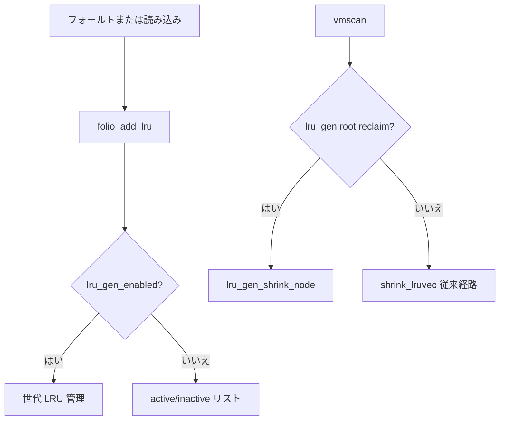

# 第23章 LRU、MGLRU、workingset refault

> **本章で読むソース**
>
> - [`mm/swap.c` L500-L512](https://github.com/gregkh/linux/blob/v6.18.38/mm/swap.c#L500-L512)
> - [`mm/swap.c` L523-L531](https://github.com/gregkh/linux/blob/v6.18.38/mm/swap.c#L523-L531)
> - [`mm/vmscan.c` L2942-L2967](https://github.com/gregkh/linux/blob/v6.18.38/mm/vmscan.c#L2942-L2967)
> - [`mm/vmscan.c` L6088-L6093](https://github.com/gregkh/linux/blob/v6.18.38/mm/vmscan.c#L6088-L6093)
> - [`mm/swap.c` L495-L499](https://github.com/gregkh/linux/blob/v6.18.38/mm/swap.c#L495-L499)
> - [`mm/vmscan.c` L2969-L2976](https://github.com/gregkh/linux/blob/v6.18.38/mm/vmscan.c#L2969-L2976)
> - [`include/linux/mm_inline.h` L220-L252](https://github.com/gregkh/linux/blob/v6.18.38/include/linux/mm_inline.h#L220-L252)

## この章の狙い

回収対象 folio を **LRU** リストへ載せる経路と、**MGLRU**（Multi-Gen LRU）が有効なときの `lru_gen` 分岐を読む。

## 前提

- [rmap と逆引き](22-rmap.md)
- [folio とページ管理単位](../part00-foundation/02-folio-page-unit.md)

## folio_add_lru

folio は即座に LRU 種別を決めず、バッチ drain まで遅延できる。

[`mm/swap.c` L500-L513](https://github.com/gregkh/linux/blob/v6.18.38/mm/swap.c#L500-L513)

```c
void folio_add_lru(struct folio *folio)
{
	VM_BUG_ON_FOLIO(folio_test_active(folio) &&
			folio_test_unevictable(folio), folio);
	VM_BUG_ON_FOLIO(folio_test_lru(folio), folio);

	/* see the comment in lru_gen_folio_seq() */
	if (lru_gen_enabled() && !folio_test_unevictable(folio) &&
	    lru_gen_in_fault() && !(current->flags & PF_MEMALLOC))
		folio_set_active(folio);

	folio_batch_add_and_move(folio, lru_add);
}
EXPORT_SYMBOL(folio_add_lru);
```

MGLRU 有効時はフォールト文脈で active を先に付けうる。

## folio_add_lru_vma

mlock された VMA は unevictable リストへ直行する。

[`mm/swap.c` L523-L531](https://github.com/gregkh/linux/blob/v6.18.38/mm/swap.c#L523-L531)

```c
void folio_add_lru_vma(struct folio *folio, struct vm_area_struct *vma)
{
	VM_BUG_ON_FOLIO(folio_test_lru(folio), folio);

	if (unlikely((vma->vm_flags & (VM_LOCKED | VM_SPECIAL)) == VM_LOCKED))
		mlock_new_folio(folio);
	else
		folio_add_lru(folio);
}
```

## lru_gen_add_mm

MGLRU は mm 単位の世代リストにプロセスを登録する。

[`mm/vmscan.c` L2942-L2967](https://github.com/gregkh/linux/blob/v6.18.38/mm/vmscan.c#L2942-L2967)

```c
void lru_gen_add_mm(struct mm_struct *mm)
{
	int nid;
	struct mem_cgroup *memcg = get_mem_cgroup_from_mm(mm);
	struct lru_gen_mm_list *mm_list = get_mm_list(memcg);

	VM_WARN_ON_ONCE(!list_empty(&mm->lru_gen.list));
#ifdef CONFIG_MEMCG
	VM_WARN_ON_ONCE(mm->lru_gen.memcg);
	mm->lru_gen.memcg = memcg;
#endif
	spin_lock(&mm_list->lock);

	for_each_node_state(nid, N_MEMORY) {
		struct lruvec *lruvec = get_lruvec(memcg, nid);
		struct lru_gen_mm_state *mm_state = get_mm_state(lruvec);

		/* the first addition since the last iteration */
		if (mm_state->tail == &mm_list->fifo)
			mm_state->tail = &mm->lru_gen.list;
	}

	list_add_tail(&mm->lru_gen.list, &mm_list->fifo);

	spin_unlock(&mm_list->lock);
}
```

## shrink_node の MGLRU 分岐

ルート回収では従来 LRU の代わりに `lru_gen_shrink_node` が呼ばれる。

[`mm/vmscan.c` L6088-L6093](https://github.com/gregkh/linux/blob/v6.18.38/mm/vmscan.c#L6088-L6093)

```c
	if (lru_gen_enabled() && root_reclaim(sc)) {
		memset(&sc->nr, 0, sizeof(sc->nr));
		lru_gen_shrink_node(pgdat, sc);
		return;
	}
```

memcg 階層回収は別経路で `shrink_node_memcgs` が続く。

## lru_gen_folio_seq：世代番号の算出

MGLRU は folio の `PG_active`、`PG_workingset`、`PG_referenced` から世代を導き、`max_seq` と `min_seq` の差で LRU 位置を決める。

[`include/linux/mm_inline.h` L220-L252](https://github.com/gregkh/linux/blob/v6.18.38/include/linux/mm_inline.h#L220-L252)

```c
static inline unsigned long lru_gen_folio_seq(const struct lruvec *lruvec,
					      const struct folio *folio,
					      bool reclaiming)
{
	int gen;
	int type = folio_is_file_lru(folio);
	const struct lru_gen_folio *lrugen = &lruvec->lrugen;

	/*
	 * +-----------------------------------+-----------------------------------+
	 * | Accessed through page tables and  | Accessed through file descriptors |
	 * | promoted by folio_update_gen()    | and protected by folio_inc_gen()  |
	 * +-----------------------------------+-----------------------------------+
	 * | PG_active (set while isolated)    |                                   |
	 * +-----------------+-----------------+-----------------+-----------------+
	 * |  PG_workingset  |  PG_referenced  |  PG_workingset  |  LRU_REFS_FLAGS |
	 * +-----------------------------------+-----------------------------------+
	 * |<---------- MIN_NR_GENS ---------->|                                   |
	 * |<---------------------------- MAX_NR_GENS ---------------------------->|
	 */
	if (folio_test_active(folio))
		gen = MIN_NR_GENS - folio_test_workingset(folio);
	else if (reclaiming)
		gen = MAX_NR_GENS;
	else if ((!folio_is_file_lru(folio) && !folio_test_swapcache(folio)) ||
		 (folio_test_reclaim(folio) &&
		  (folio_test_dirty(folio) || folio_test_writeback(folio))))
		gen = MIN_NR_GENS;
	else
		gen = MAX_NR_GENS - folio_test_workingset(folio);

	return max(READ_ONCE(lrugen->max_seq) - gen + 1, READ_ONCE(lrugen->min_seq[type]));
}
```

`lru_gen_add_folio` はこの `seq` から `gen` を求め、世代リストへ挿入する。

## lru_gen_del_mm

[`mm/vmscan.c` L2969-L2976](https://github.com/gregkh/linux/blob/v6.18.38/mm/vmscan.c#L2969-L2976)

```c
void lru_gen_del_mm(struct mm_struct *mm)
{
	int nid;
	struct lru_gen_mm_list *mm_list;
	struct mem_cgroup *memcg = NULL;

	if (list_empty(&mm->lru_gen.list))
		return;
```

プロセス終了時に世代リストから外す。

## 処理の流れ



## workingset_refault

退避した folio が再フォールトしたとき、refault distance で working set かを判定する。

[`mm/workingset.c` L526-L564](https://github.com/gregkh/linux/blob/v6.18.38/mm/workingset.c#L526-L564)

```c
 * workingset_refault - Evaluate the refault of a previously evicted folio.
 * @folio: The freshly allocated replacement folio.
 * @shadow: Shadow entry of the evicted folio.
 *
 * Calculates and evaluates the refault distance of the previously
 * evicted folio in the context of the node and the memcg whose memory
 * pressure caused the eviction.
 */
void workingset_refault(struct folio *folio, void *shadow)
{
	bool file = folio_is_file_lru(folio);
	struct pglist_data *pgdat;
	struct mem_cgroup *memcg;
	struct lruvec *lruvec;
	bool workingset;
	long nr;

	VM_BUG_ON_FOLIO(!folio_test_locked(folio), folio);

	if (lru_gen_enabled()) {
		lru_gen_refault(folio, shadow);
		return;
	}

	/*
	 * The activation decision for this folio is made at the level
	 * where the eviction occurred, as that is where the LRU order
	 * during folio reclaim is being determined.
	 *
	 * However, the cgroup that will own the folio is the one that
	 * is actually experiencing the refault event. Make sure the folio is
	 * locked to guarantee folio_memcg() stability throughout.
	 */
	nr = folio_nr_pages(folio);
	memcg = folio_memcg(folio);
	pgdat = folio_pgdat(folio);
	lruvec = mem_cgroup_lruvec(memcg, pgdat);

	mod_lruvec_state(lruvec, WORKINGSET_REFAULT_BASE + file, nr);
```

MGLRU 有効時は `lru_gen_refault` へ委譲する。

## 高速化と最適化の工夫

**folio_batch** で LRU 追加をバッチ化し、ロック取得回数を減らす。
MGLRU は複数世代で参照履歴を近似し、単純な active/inactive 二択より回収精度を上げる。
フォールト時 active 付与は、一度触った folio の即回収を避ける。

> **7.x 系での変化**
> v7.1.3 では参照判定が `lru_gen_enabled() && !lru_gen_switching()` 条件付きになる（[`mm/vmscan.c` L888-L892](https://github.com/gregkh/linux/blob/v7.1.3/mm/vmscan.c#L888-L892)）。
> [`lru_gen_look_around`](https://github.com/gregkh/linux/blob/v7.1.3/mm/vmscan.c#L4183-L4183) は第2引数 `unsigned int nr` を追加し、v6.18.38 の [`L4239`](https://github.com/gregkh/linux/blob/v6.18.38/mm/vmscan.c#L4239-L4239) からシグネチャが変わる。
> memcg 階層移動時に世代リストを親へ付け替える [`lru_gen_reparent_memcg`](https://github.com/gregkh/linux/blob/v7.1.3/mm/vmscan.c#L4547-L4559) が v7.1.3 で追加される（v6.18.38 の `mm/vmscan.c` には同名シンボルなし）。

## まとめ

LRU は回収候補 folio のキューであり、anon と file でリストが分かれる。
MGLRU 有効時は mm 単位の世代管理と `lru_gen_shrink_node` が主経路になる。
`folio_add_lru` は挿入を遅延し、参照ビットと組み合わせて active 判定する。

## 関連する章

- [folio reclaim decision と dirty/writeback folio](24-folio-reclaim-decision.md)
- [reclaim orchestration と direct/kswapd](25-reclaim-orchestration.md)
