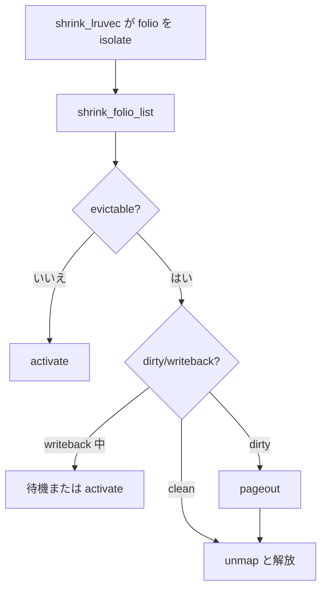

# 第24章 folio reclaim decision と dirty/writeback folio

> **本章で読むソース**
>
> - [`mm/vmscan.c` L1109-L1125](https://github.com/gregkh/linux/blob/v6.18.38/mm/vmscan.c#L1109-L1125)
> - [`mm/vmscan.c` L1176-L1190](https://github.com/gregkh/linux/blob/v6.18.38/mm/vmscan.c#L1176-L1190)
> - [`mm/vmscan.c` L1238-L1244](https://github.com/gregkh/linux/blob/v6.18.38/mm/vmscan.c#L1238-L1244)
> - [`mm/vmscan.c` L685-L703](https://github.com/gregkh/linux/blob/v6.18.38/mm/vmscan.c#L685-L703)
> - [`mm/shrinker.c` L371-L393](https://github.com/gregkh/linux/blob/v6.18.38/mm/shrinker.c#L371-L393)
> - [`mm/vmscan.c` L1165-L1169](https://github.com/gregkh/linux/blob/v6.18.38/mm/vmscan.c#L1165-L1169)

## この章の狙い

**shrink_folio_list** が isolate 済み folio ごとに解放、swap、activate、writeback 待ちをどう選ぶかを読む。
VFS 一般の dirty throttling は [VFS 分冊](../../vfs/part04-page-cache/16-write-dirty.md) が扱い、本章は vmscan 側の folio 状態判断に限定する。

## 前提

- [LRU、MGLRU、workingset refault](23-lru-mglru-workingset.md)
- [rmap と逆引き](22-rmap.md)

## shrink_folio_list のループ

isolate リストから folio を取り出し、参照と dirty 状態を調べる。

[`mm/vmscan.c` L1109-L1125](https://github.com/gregkh/linux/blob/v6.18.38/mm/vmscan.c#L1109-L1125)

```c
static unsigned int shrink_folio_list(struct list_head *folio_list,
		struct pglist_data *pgdat, struct scan_control *sc,
		struct reclaim_stat *stat, bool ignore_references,
		struct mem_cgroup *memcg)
{
	struct folio_batch free_folios;
	LIST_HEAD(ret_folios);
	LIST_HEAD(demote_folios);
	unsigned int nr_reclaimed = 0, nr_demoted = 0;
	unsigned int pgactivate = 0;
	bool do_demote_pass;
	struct swap_iocb *plug = NULL;

	folio_batch_init(&free_folios);
	memset(stat, 0, sizeof(*stat));
	cond_resched();
	do_demote_pass = can_demote(pgdat->node_id, sc, memcg);
```

## dirty と writeback の検出

`folio_check_dirty_writeback` の結果で reclaim 統計を更新する。

[`mm/vmscan.c` L1176-L1190](https://github.com/gregkh/linux/blob/v6.18.38/mm/vmscan.c#L1176-L1190)

```c
		folio_check_dirty_writeback(folio, &dirty, &writeback);
		if (dirty || writeback)
			stat->nr_dirty += nr_pages;

		if (dirty && !writeback)
			stat->nr_unqueued_dirty += nr_pages;

		/*
		 * Treat this folio as congested if folios are cycling
		 * through the LRU so quickly that the folios marked
		 * for immediate reclaim are making it to the end of
		 * the LRU a second time.
		 */
		if (writeback && folio_test_reclaim(folio))
			stat->nr_congested += nr_pages;
```

## writeback 中 folio の扱い

kswapd が writeback と reclaim フラグを同時に見た場合、スキャン速度が速すぎると判断する。

[`mm/vmscan.c` L1238-L1244](https://github.com/gregkh/linux/blob/v6.18.38/mm/vmscan.c#L1238-L1244)

```c
		if (folio_test_writeback(folio)) {
			mapping = folio_mapping(folio);

			/* Case 1 above */
			if (current_is_kswapd() &&
			    folio_test_reclaim(folio) &&
			    test_bit(PGDAT_WRITEBACK, &pgdat->flags)) {
```

コメントブロック（L1192-L1237）は dirty folio が LRU 末尾で循環するときの3分岐を説明する。

## pageout と dirty 書き戻し

dirty folio は `pageout` 経由でライトバックを起動してから解放候補にする。

[`mm/vmscan.c` L685-L703](https://github.com/gregkh/linux/blob/v6.18.38/mm/vmscan.c#L685-L703)

```c
static pageout_t pageout(struct folio *folio, struct address_space *mapping,
			 struct swap_iocb **plug, struct list_head *folio_list)
{
	/*
	 * We no longer attempt to writeback filesystem folios here, other
	 * than tmpfs/shmem.  That's taken care of in page-writeback.
	 * If we find a dirty filesystem folio at the end of the LRU list,
	 * typically that means the filesystem is saturating the storage
	 * with contiguous writes and telling it to write a folio here
	 * would only make the situation worse by injecting an element
	 * of random access.
	 *
	 * If the folio is swapcache, write it back even if that would
	 * block, for some throttling. This happens by accident, because
	 * swap_backing_dev_info is bust: it doesn't reflect the
	 * congestion state of the swapdevs.  Easy to fix, if needed.
	 */
	if (!is_page_cache_freeable(folio))
		return PAGE_KEEP;
```

## shrinker との接続

slab などの shrinker は vmscan と別経路だが、メモリ圧迫時に呼ばれる。

[`mm/shrinker.c` L371-L393](https://github.com/gregkh/linux/blob/v6.18.38/mm/shrinker.c#L371-L393)

```c
static unsigned long do_shrink_slab(struct shrink_control *shrinkctl,
				    struct shrinker *shrinker, int priority)
{
	unsigned long freed = 0;
	unsigned long long delta;
	long total_scan;
	long freeable;
	long nr;
	long new_nr;
	long batch_size = shrinker->batch ? shrinker->batch
					  : SHRINK_BATCH;
	long scanned = 0, next_deferred;

	freeable = shrinker->count_objects(shrinker, shrinkctl);
	if (freeable == 0 || freeable == SHRINK_EMPTY)
		return freeable;

	/*
	 * copy the current shrinker scan count into a local variable
	 * and zero it so that other concurrent shrinker invocations
	 * don't also do this scanning work.
	 */
	nr = xchg_nr_deferred(shrinker, shrinkctl);
```

## 回収不能 folio の温存

unmap 禁止や mapped folio は keep へ分岐する。

[`mm/vmscan.c` L1165-L1169](https://github.com/gregkh/linux/blob/v6.18.38/mm/vmscan.c#L1165-L1169)

```c
		if (unlikely(!folio_evictable(folio)))
			goto activate_locked;

		if (!sc->may_unmap && folio_mapped(folio))
			goto keep_locked;
```

## 処理の流れ



## 高速化と最適化の工夫

`folio_batch` で解放 folio をまとめ、`swap_iocb` plug で swap I/O をバッチする。
writeback 中 folio を無限待ちしないことで、I/O エラー時の reclaim デッドロックを避ける。
dirty 一般論の `balance_dirty_pages` は VFS/mm writeback 境界の外側である。

## まとめ

shrink_folio_list は folio 単位の回収判断の中核である。
dirty と writeback 状態は reclaim 統計と kswapd のスロットルに効く。
slab shrinker は別 API だが、システム全体の回収圧と連動する。

## 関連する章

- [reclaim orchestration と direct/kswapd](25-reclaim-orchestration.md)
- [swap-out と swap-in データパス](../part05-advanced/32-swap-data-path.md)
- [VFS：writeback と dirty](../../vfs/part04-page-cache/16-write-dirty.md)
