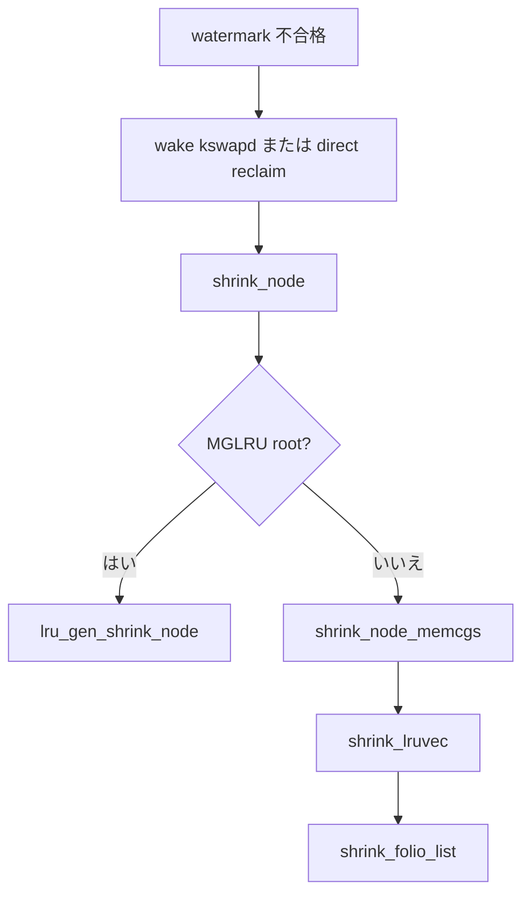

# 第25章 reclaim orchestration と direct/kswapd

> **本章で読むソース**
>
> - [`mm/vmscan.c` L6083-L6117](https://github.com/gregkh/linux/blob/v6.18.38/mm/vmscan.c#L6083-L6117)
> - [`mm/vmscan.c` L5816-L5832](https://github.com/gregkh/linux/blob/v6.18.38/mm/vmscan.c#L5816-L5832)
> - [`mm/vmscan.c` L6004-L6016](https://github.com/gregkh/linux/blob/v6.18.38/mm/vmscan.c#L6004-L6016)
> - [`mm/page_alloc.c` L4749-L4750](https://github.com/gregkh/linux/blob/v6.18.38/mm/page_alloc.c#L4749-L4750)
> - [`mm/vmscan.c` L6119-L6129](https://github.com/gregkh/linux/blob/v6.18.38/mm/vmscan.c#L6119-L6129)
> - [`include/linux/mmzone.h` L1427-L1428](https://github.com/gregkh/linux/blob/v6.18.38/include/linux/mmzone.h#L1427-L1428)

## この章の狙い

**vmscan** の上位ループが `shrink_node` と `shrink_lruvec` で回収を編成し、**kswapd** と **direct reclaim** がどう起動するかを読む。
folio 単位の判断は [folio reclaim decision](24-folio-reclaim-decision.md) が扱う。

## 前提

- [folio reclaim decision と dirty/writeback folio](24-folio-reclaim-decision.md)
- [watermark とゾーン fallback](../part01-physical/05-watermark-zone-fallback.md)

## shrink_node

ノード単位の回収ループは lruvec と memcg 階層を走査する。

[`mm/vmscan.c` L6083-L6117](https://github.com/gregkh/linux/blob/v6.18.38/mm/vmscan.c#L6083-L6117)

```c
static void shrink_node(pg_data_t *pgdat, struct scan_control *sc)
{
	unsigned long nr_reclaimed, nr_scanned, nr_node_reclaimed;
	struct lruvec *target_lruvec;
	bool reclaimable = false;

	if (lru_gen_enabled() && root_reclaim(sc)) {
		memset(&sc->nr, 0, sizeof(sc->nr));
		lru_gen_shrink_node(pgdat, sc);
		return;
	}

	target_lruvec = mem_cgroup_lruvec(sc->target_mem_cgroup, pgdat);

again:
	memset(&sc->nr, 0, sizeof(sc->nr));

	nr_reclaimed = sc->nr_reclaimed;
	nr_scanned = sc->nr_scanned;

	prepare_scan_control(pgdat, sc);

	shrink_node_memcgs(pgdat, sc);

	flush_reclaim_state(sc);

	nr_node_reclaimed = sc->nr_reclaimed - nr_reclaimed;

	/* Record the subtree's reclaim efficiency */
	if (!sc->proactive)
		vmpressure(sc->gfp_mask, sc->target_mem_cgroup, true,
			   sc->nr_scanned - nr_scanned, nr_node_reclaimed);

	if (nr_node_reclaimed)
		reclaimable = true;
```

## shrink_lruvec

各 LRU リストにスキャン配分を振り、`shrink_folio_list` へ渡す。

[`mm/vmscan.c` L5816-L5832](https://github.com/gregkh/linux/blob/v6.18.38/mm/vmscan.c#L5816-L5832)

```c
static void shrink_lruvec(struct lruvec *lruvec, struct scan_control *sc)
{
	unsigned long nr[NR_LRU_LISTS];
	unsigned long targets[NR_LRU_LISTS];
	unsigned long nr_to_scan;
	enum lru_list lru;
	unsigned long nr_reclaimed = 0;
	unsigned long nr_to_reclaim = sc->nr_to_reclaim;
	bool proportional_reclaim;
	struct blk_plug plug;

	if (lru_gen_enabled() && !root_reclaim(sc)) {
		lru_gen_shrink_lruvec(lruvec, sc);
		return;
	}

	get_scan_count(lruvec, sc, nr);
```

## shrink_node_memcgs

memcg 階層を走査し、子 cgroup へ回収を配分する。

[`mm/vmscan.c` L6004-L6016](https://github.com/gregkh/linux/blob/v6.18.38/mm/vmscan.c#L6004-L6016)

```c
static void shrink_node_memcgs(pg_data_t *pgdat, struct scan_control *sc)
{
	struct mem_cgroup *target_memcg = sc->target_mem_cgroup;
	struct mem_cgroup_reclaim_cookie reclaim = {
		.pgdat = pgdat,
	};
	struct mem_cgroup_reclaim_cookie *partial = &reclaim;
	struct mem_cgroup *memcg;

	/*
	 * In most cases, direct reclaimers can do partial walks
	 * through the cgroup tree, using an iterator state that
	 * persists across invocations. This strikes a balance between
```

## kswapd 起床

alloc slow path は watermark 不合格時に kswapd を起こす。

[`mm/page_alloc.c` L4749-L4750](https://github.com/gregkh/linux/blob/v6.18.38/mm/page_alloc.c#L4749-L4750)

```c
	if (alloc_flags & ALLOC_KSWAPD)
		wake_all_kswapds(order, gfp_mask, ac);
```

## kswapd と dirty 書き戻し

kswapd 文脈では dirty isolate 時に追加制御が入る。

[`mm/vmscan.c` L6119-L6129](https://github.com/gregkh/linux/blob/v6.18.38/mm/vmscan.c#L6119-L6129)

```c
	if (current_is_kswapd()) {
		/*
		 * If reclaim is isolating dirty pages under writeback,
		 * it implies that the long-lived page allocation rate
		 * is exceeding the page laundering rate. Either the
		 * global limits are not being effective at throttling
		 * processes due to the page distribution throughout
		 * zones or there is heavy usage of a slow backing
		 * device. The only option is to throttle from reclaim
		 * context which is not ideal as there is no guarantee
		 * the dirtying process is throttled in the same way
```

## kswapd_wait

kswapd はノードごとに待機し、watermark 低下で起床する。

[`include/linux/mmzone.h` L1427-L1428](https://github.com/gregkh/linux/blob/v6.18.38/include/linux/mmzone.h#L1427-L1428)

```c
	wait_queue_head_t kswapd_wait;
	wait_queue_head_t pfmemalloc_wait;
```

## 処理の流れ



## 高速化と最適化の工夫

回収は anon と file のスキャン配分で I/O 増幅を抑える。
`blk_plug` で swap や writeback I/O をまとめる。
kswapd はバックグラウンド、direct reclaim は呼び出し元をブロックする点が対照的である。

## まとめ

vmscan の編成層は shrink_node が中心で、MGLRU と memcg が分岐を増やす。
kswapd は watermark 連動の非同期回収、direct reclaim は同期回収である。

## 関連する章

- [folio reclaim decision と dirty/writeback folio](24-folio-reclaim-decision.md)
- [OOM killer](26-oom-killer.md)
- [swap-out と swap-in データパス](../part05-advanced/32-swap-data-path.md)
