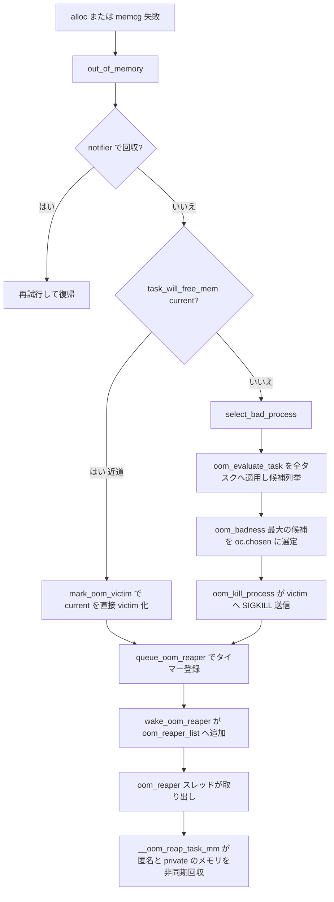

# 第26章 OOM killer

> **本章で読むソース**
>
> - [`mm/oom_kill.c` L1118-L1141](https://github.com/gregkh/linux/blob/v6.18.38/mm/oom_kill.c#L1118-L1141)
> - [`mm/oom_kill.c` L202-L239](https://github.com/gregkh/linux/blob/v6.18.38/mm/oom_kill.c#L202-L239)
> - [`mm/oom_kill.c` L1160-L1186](https://github.com/gregkh/linux/blob/v6.18.38/mm/oom_kill.c#L1160-L1186)
> - [`mm/oom_kill.c` L1195-L1208](https://github.com/gregkh/linux/blob/v6.18.38/mm/oom_kill.c#L1195-L1208)
> - [`mm/oom_kill.c` L309-L359](https://github.com/gregkh/linux/blob/v6.18.38/mm/oom_kill.c#L309-L359)
> - [`mm/oom_kill.c` L365-L379](https://github.com/gregkh/linux/blob/v6.18.38/mm/oom_kill.c#L365-L379)
> - [`mm/oom_kill.c` L701-L711](https://github.com/gregkh/linux/blob/v6.18.38/mm/oom_kill.c#L701-L711)
> - [`mm/oom_kill.c` L671-L690](https://github.com/gregkh/linux/blob/v6.18.38/mm/oom_kill.c#L671-L690)
> - [`mm/oom_kill.c` L649-L669](https://github.com/gregkh/linux/blob/v6.18.38/mm/oom_kill.c#L649-L669)
> - [`mm/oom_kill.c` L515-L568](https://github.com/gregkh/linux/blob/v6.18.38/mm/oom_kill.c#L515-L568)

## この章の狙い

割り当て slow path と memcg 制限の終端で **OOM killer** が `out_of_memory` から犠牲タスクを選び、メモリを回収する流れを読む。
cgroup 一般論は cgroup 分冊へ委ね、本章は `oom_badness` と victim 選択に限定する。

## 前提

- [reclaim orchestration と direct/kswapd](25-reclaim-orchestration.md)
- [memcg とメモリ cgroup](../part05-advanced/31-memcg.md)

## out_of_memory の入口

OOM が無効、または notifier がメモリを返した場合は kill しない。
`task_will_free_mem(current)` は候補探索ではない。
これは current が既に解放へ向かっている場合の近道分岐である。
`current` に未処理の SIGKILL がある、または `PF_EXITING` で終了中であり、mm を近く手放すと見込めるときに真を返す。
その場合は `select_bad_process` による全タスク走査を行わず、`mark_oom_victim(current)` で current を直接 victim として印付けし、`queue_oom_reaper(current)` で reaper へ登録して返る。

[`mm/oom_kill.c` L1118-L1141](https://github.com/gregkh/linux/blob/v6.18.38/mm/oom_kill.c#L1118-L1141)

```c
bool out_of_memory(struct oom_control *oc)
{
	unsigned long freed = 0;

	if (oom_killer_disabled)
		return false;

	if (!is_memcg_oom(oc)) {
		blocking_notifier_call_chain(&oom_notify_list, 0, &freed);
		if (freed > 0 && !is_sysrq_oom(oc))
			/* Got some memory back in the last second. */
			return true;
	}

	/*
	 * If current has a pending SIGKILL or is exiting, then automatically
	 * select it.  The goal is to allow it to allocate so that it may
	 * quickly exit and free its memory.
	 */
	if (task_will_free_mem(current)) {
		mark_oom_victim(current);
		queue_oom_reaper(current);
		return true;
	}
```

## oom_badness

RSS、スワップ、ページテーブルサイズと `oom_score_adj` からスコアを計算する。

[`mm/oom_kill.c` L202-L239](https://github.com/gregkh/linux/blob/v6.18.38/mm/oom_kill.c#L202-L239)

```c
long oom_badness(struct task_struct *p, unsigned long totalpages)
{
	long points;
	long adj;

	if (oom_unkillable_task(p))
		return LONG_MIN;

	p = find_lock_task_mm(p);
	if (!p)
		return LONG_MIN;

	/*
	 * Do not even consider tasks which are explicitly marked oom
	 * unkillable or have been already oom reaped or the are in
	 * the middle of vfork
	 */
	adj = (long)p->signal->oom_score_adj;
	if (adj == OOM_SCORE_ADJ_MIN ||
			mm_flags_test(MMF_OOM_SKIP, p->mm) ||
			in_vfork(p)) {
		task_unlock(p);
		return LONG_MIN;
	}

	/*
	 * The baseline for the badness score is the proportion of RAM that each
	 * task's rss, pagetable and swap space use.
	 */
	points = get_mm_rss(p->mm) + get_mm_counter(p->mm, MM_SWAPENTS) +
		mm_pgtables_bytes(p->mm) / PAGE_SIZE;
	task_unlock(p);

	/* Normalize to oom_score_adj units */
	adj *= totalpages / 1000;
	points += adj;

	return points;
}
```

## oom_evaluate_task：候補列挙と最大スコア

この関数を全タスクへ適用し、`oom_badness` が最大のタスクを候補として残す。
`oc->chosen_points` は `LONG_MIN` から始まり、より大きい `points` を持つタスクが現れるたびに `oc->chosen` を差し替える。
`oc->chosen` には最大スコアの候補だけでなく、探索を早期に確定または中止させる番兵値も入る。

第一の番兵は `oom_task_origin(task)` が真のときの `points = LONG_MAX` である。
これは大量割り当ての起点として先に殺すよう印付けされたタスクで、他候補を上回る値で即選出される。

第二の番兵は abort 経路で `oc->chosen` に代入される `(void *)-1UL` である。
既に別タスクが victim として印付け済みで、その mm がまだ `MMF_OOM_SKIP` でない場合に到達する。
処理中の victim がメモリを解放する見込みが残るため、新たな kill を打たずに走査自体を打ち切る。
呼び出し側の `out_of_memory` は `oc->chosen != (void *)-1UL` を確かめてから `oom_kill_process` を呼ぶため、この番兵は kill を抑止する。

`oom_evaluate_task` は 6.18.38 では上記 2 種類の番兵だけを使う。
`INFLIGHT_VICTIM` や `MAX_OOM_ADJ` といった名前付き定数はこのバージョンには存在しない。

[`mm/oom_kill.c` L309-L359](https://github.com/gregkh/linux/blob/v6.18.38/mm/oom_kill.c#L309-L359)

```c
static int oom_evaluate_task(struct task_struct *task, void *arg)
{
	struct oom_control *oc = arg;
	long points;

	if (oom_unkillable_task(task))
		goto next;

	/* p may not have freeable memory in nodemask */
	if (!is_memcg_oom(oc) && !oom_cpuset_eligible(task, oc))
		goto next;

	/*
	 * This task already has access to memory reserves and is being killed.
	 * Don't allow any other task to have access to the reserves unless
	 * the task has MMF_OOM_SKIP because chances that it would release
	 * any memory is quite low.
	 */
	if (!is_sysrq_oom(oc) && tsk_is_oom_victim(task)) {
		if (mm_flags_test(MMF_OOM_SKIP, task->signal->oom_mm))
			goto next;
		goto abort;
	}

	/*
	 * If task is allocating a lot of memory and has been marked to be
	 * killed first if it triggers an oom, then select it.
	 */
	if (oom_task_origin(task)) {
		points = LONG_MAX;
		goto select;
	}

	points = oom_badness(task, oc->totalpages);
	if (points == LONG_MIN || points < oc->chosen_points)
		goto next;

select:
	if (oc->chosen)
		put_task_struct(oc->chosen);
	get_task_struct(task);
	oc->chosen = task;
	oc->chosen_points = points;
next:
	return 0;
abort:
	if (oc->chosen)
		put_task_struct(oc->chosen);
	oc->chosen = (void *)-1UL;
	return 1;
}
```

## select_bad_process

memcg OOM は `mem_cgroup_scan_tasks`、global OOM は `for_each_process` で `oom_evaluate_task` を呼ぶ。

[`mm/oom_kill.c` L365-L379](https://github.com/gregkh/linux/blob/v6.18.38/mm/oom_kill.c#L365-L379)

```c
static void select_bad_process(struct oom_control *oc)
{
	oc->chosen_points = LONG_MIN;

	if (is_memcg_oom(oc))
		mem_cgroup_scan_tasks(oc->memcg, oom_evaluate_task, oc);
	else {
		struct task_struct *p;

		rcu_read_lock();
		for_each_process(p)
			if (oom_evaluate_task(p, oc))
				break;
		rcu_read_unlock();
	}
}
```

## victim 選択と kill

`select_bad_process` のあと `oom_kill_process` が SIGKILL を送る。

[`mm/oom_kill.c` L1160-L1186](https://github.com/gregkh/linux/blob/v6.18.38/mm/oom_kill.c#L1160-L1186)

```c
	if (!is_memcg_oom(oc) && sysctl_oom_kill_allocating_task &&
	    current->mm && !oom_unkillable_task(current) &&
	    oom_cpuset_eligible(current, oc) &&
	    current->signal->oom_score_adj != OOM_SCORE_ADJ_MIN) {
		get_task_struct(current);
		oc->chosen = current;
		oom_kill_process(oc, "Out of memory (oom_kill_allocating_task)");
		return true;
	}

	select_bad_process(oc);
	/* Found nothing?!?! */
	if (!oc->chosen) {
		dump_header(oc);
		pr_warn("Out of memory and no killable processes...\n");
		/*
		 * If we got here due to an actual allocation at the
		 * system level, we cannot survive this and will enter
		 * an endless loop in the allocator. Bail out now.
		 */
		if (!is_sysrq_oom(oc) && !is_memcg_oom(oc))
			panic("System is deadlocked on memory\n");
	}
	if (oc->chosen && oc->chosen != (void *)-1UL)
		oom_kill_process(oc, !is_memcg_oom(oc) ? "Out of memory" :
				 "Memory cgroup out of memory");
	return !!oc->chosen;
}
```

## pagefault 文脈の OOM

ページフォールトからは memcg OOM を安全に処理する。

[`mm/oom_kill.c` L1195-L1208](https://github.com/gregkh/linux/blob/v6.18.38/mm/oom_kill.c#L1195-L1208)

```c
void pagefault_out_of_memory(void)
{
	static DEFINE_RATELIMIT_STATE(pfoom_rs, DEFAULT_RATELIMIT_INTERVAL,
				      DEFAULT_RATELIMIT_BURST);

	if (mem_cgroup_oom_synchronize(true))
		return;

	if (fatal_signal_pending(current))
		return;

	if (__ratelimit(&pfoom_rs))
		pr_warn("Huh VM_FAULT_OOM leaked out to the #PF handler. Retrying PF\n");
}
```

## oom_reaper への登録

SIGKILL を送っても、victim が uninterruptible sleep 等で自身の exit 経路をすぐ走れないことがある。
その間 victim の mm が解放されず、OOM が前進しない。
これを避けるため、kill した victim を非同期回収スレッド `oom_reaper` へ登録する。

登録は `queue_oom_reaper` が行う。
`MMF_OOM_REAP_QUEUED` を test_and_set し、二重登録を弾く。
即座にはキューへ入れず、`OOM_REAPER_DELAY`（2 秒）後に発火するタイマーを仕掛ける。
これは victim が自力で正常終了する時間を与えるためで、futex robust list のように exit 経路が触る anonymous メモリを先に剥がして exit を壊さないよう配慮している。

[`mm/oom_kill.c` L701-L711](https://github.com/gregkh/linux/blob/v6.18.38/mm/oom_kill.c#L701-L711)

```c
static void queue_oom_reaper(struct task_struct *tsk)
{
	/* mm is already queued? */
	if (mm_flags_test_and_set(MMF_OOM_REAP_QUEUED, tsk->signal->oom_mm))
		return;

	get_task_struct(tsk);
	timer_setup(&tsk->oom_reaper_timer, wake_oom_reaper, 0);
	tsk->oom_reaper_timer.expires = jiffies + OOM_REAPER_DELAY;
	add_timer(&tsk->oom_reaper_timer);
}
```

タイマーが発火すると `wake_oom_reaper` が victim を `oom_reaper_list` の先頭へ繋ぎ、`oom_reaper_wait` を起こす。
その前に victim が自力で終了して `MMF_OOM_SKIP` が立っていれば、参照を落として何もしない。

[`mm/oom_kill.c` L671-L690](https://github.com/gregkh/linux/blob/v6.18.38/mm/oom_kill.c#L671-L690)

```c
static void wake_oom_reaper(struct timer_list *timer)
{
	struct task_struct *tsk = container_of(timer, struct task_struct,
			oom_reaper_timer);
	struct mm_struct *mm = tsk->signal->oom_mm;
	unsigned long flags;

	/* The victim managed to terminate on its own - see exit_mmap */
	if (mm_flags_test(MMF_OOM_SKIP, mm)) {
		put_task_struct(tsk);
		return;
	}

	spin_lock_irqsave(&oom_reaper_lock, flags);
	tsk->oom_reaper_list = oom_reaper_list;
	oom_reaper_list = tsk;
	spin_unlock_irqrestore(&oom_reaper_lock, flags);
	trace_wake_reaper(tsk->pid);
	wake_up(&oom_reaper_wait);
}
```

## oom_reaper 本体とメモリ回収

`oom_reaper` カーネルスレッドは `oom_reaper_list` から victim を 1 つ取り出し、`oom_reap_task` を呼ぶ。

[`mm/oom_kill.c` L649-L669](https://github.com/gregkh/linux/blob/v6.18.38/mm/oom_kill.c#L649-L669)

```c
static int oom_reaper(void *unused)
{
	set_freezable();

	while (true) {
		struct task_struct *tsk = NULL;

		wait_event_freezable(oom_reaper_wait, oom_reaper_list != NULL);
		spin_lock_irq(&oom_reaper_lock);
		if (oom_reaper_list != NULL) {
			tsk = oom_reaper_list;
			oom_reaper_list = tsk->oom_reaper_list;
		}
		spin_unlock_irq(&oom_reaper_lock);

		if (tsk)
			oom_reap_task(tsk);
	}

	return 0;
}
```

実際の回収は `oom_reap_task` から `oom_reap_task_mm` を経て `__oom_reap_task_mm` が担う。
`oom_reap_task` は `mmap_read_trylock` に失敗しても最大 `MAX_OOM_REAP_RETRIES`（10 回）まで再試行し、最後に `MMF_OOM_SKIP` を立てて mm を OOM killer と reaper の対象から外す。

`__oom_reap_task_mm` は victim の VMA を逆順に走査し、条件 `vma_is_anonymous(vma) || !(vma->vm_flags & VM_SHARED)` を満たす VMA を剥がす。
まず `MMF_UNSTABLE` を立て、`copy_from_user` 等の利用者へ内容が不安定になったと伝える。
`VM_HUGETLB` や `VM_PFNMAP` の VMA は飛ばす。
剥がす対象は匿名 VMA に加えて private（非 shared）file-backed VMA も含み、shared file-backed VMA は除外する。
これは追加コストなしに落とせるページに限定するためで、OOM 下で余計な処理を避ける意図と考えられる。
対象 VMA には `unmap_page_range` を呼び、ページを解放する。

[`mm/oom_kill.c` L515-L568](https://github.com/gregkh/linux/blob/v6.18.38/mm/oom_kill.c#L515-L568)

```c
static bool __oom_reap_task_mm(struct mm_struct *mm)
{
	struct vm_area_struct *vma;
	bool ret = true;
	MA_STATE(mas, &mm->mm_mt, ULONG_MAX, ULONG_MAX);

	mm_flags_set(MMF_UNSTABLE, mm);

	// ... (中略) ...

	mas_for_each_rev(&mas, vma, 0) {
		if (vma->vm_flags & (VM_HUGETLB|VM_PFNMAP))
			continue;

		// ... (中略) ...

		if (vma_is_anonymous(vma) || !(vma->vm_flags & VM_SHARED)) {
			struct mmu_notifier_range range;
			struct mmu_gather tlb;

			mmu_notifier_range_init(&range, MMU_NOTIFY_UNMAP, 0,
						mm, vma->vm_start,
						vma->vm_end);
			tlb_gather_mmu(&tlb, mm);
			if (mmu_notifier_invalidate_range_start_nonblock(&range)) {
				tlb_finish_mmu(&tlb);
				ret = false;
				continue;
			}
			unmap_page_range(&tlb, vma, range.start, range.end, NULL);
			mmu_notifier_invalidate_range_end(&range);
			tlb_finish_mmu(&tlb);
		}
	}

	return ret;
}
```

回収が終わると `MMF_OOM_SKIP` が立ち、同じ mm が再選出も再回収もされなくなる。
victim が exit 経路を走れなくても reaper が匿名と private のページを先に返すため、OOM の前進を促す。
ただし前進は保証されない。
`oom_reap_task_mm` は `mmap_read_trylock` に失敗すると reap をスキップし、blocking な mmu notifier があると `mmu_notifier_invalidate_range_start_nonblock` の失敗で当該 VMA を飛ばす。
`oom_reap_task` はこれらを最大 `MAX_OOM_REAP_RETRIES`（10 回）まで再試行し、上限に達すると `MMF_OOM_SKIP` を立てて reap を諦める。

## 処理の流れ



## 高速化と最適化の工夫

`oom_reaper` は victim の mm を別コンテキストで解放し、kill 後の解放遅延を短くする。
`oom_kill_allocating_task` は探索コストを省き、割り当て失敗タスクを直接殺す。
memcg OOM は global OOM と分離し、階層内だけで victim を探す。

## まとめ

OOM killer は回収でも解放できない圧力の最終手段である。
`oom_badness` と `oom_score_adj` が victim を決め、memcg 境界は constraint で表現される。

## 関連する章

- [memcg とメモリ cgroup](../part05-advanced/31-memcg.md)
- [`__alloc_pages` の fast path と slow path](../part01-physical/04-alloc-pages-path.md)
- [page-table walk と missing fault](../part03-virtual/16-page-table-walk-missing-fault.md)
