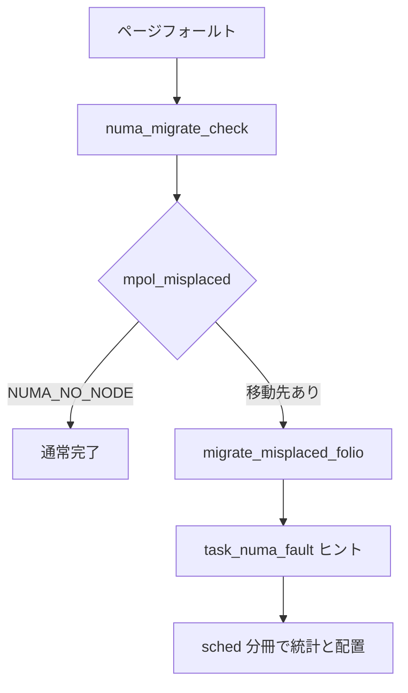

# 第20章 NUMA バランシングの fault 側

> **本章で読むソース**
>
> - [`mm/memory.c` L5879-L5923](https://github.com/gregkh/linux/blob/v6.18.38/mm/memory.c#L5879-L5923)
> - [`mm/memory.c` L6023-L6041](https://github.com/gregkh/linux/blob/v6.18.38/mm/memory.c#L6023-L6041)
> - [`mm/mempolicy.c` L2999-L3005](https://github.com/gregkh/linux/blob/v6.18.38/mm/mempolicy.c#L2999-L3005)
> - [`mm/huge_memory.c` L2055-L2071](https://github.com/gregkh/linux/blob/v6.18.38/mm/huge_memory.c#L2055-L2071)
> - [`mm/internal.h` L1382-L1384](https://github.com/gregkh/linux/blob/v6.18.38/mm/internal.h#L1382-L1384)
> - [`mm/memory.c` L5918-L5923](https://github.com/gregkh/linux/blob/v6.18.38/mm/memory.c#L5918-L5923)

## この章の狙い

**NUMA バランシング**のうち、ページフォールト時にミス配置を検出し移動を検討する fault 側を読む。
`task_numa_fault` 等のスケジューラ統計は [sched 分冊](../../sched/part05-smp-obs/21-load-balance-numa.md) が主説明であり、本章は mm 側の判定に留める。

## 前提

- [ページフォールトと handle_mm_fault](../part03-virtual/11-page-fault.md)
- [ゾーン、ノード、PFN](../part00-foundation/03-zones-nodes-pfn.md)

## numa_migrate_check

読み取り専用ページは task grouping 統計から外すが、移動判定そのものは `mpol_misplaced` が続けて行う。

[`mm/memory.c` L5879-L5923](https://github.com/gregkh/linux/blob/v6.18.38/mm/memory.c#L5879-L5923)

```c
int numa_migrate_check(struct folio *folio, struct vm_fault *vmf,
		      unsigned long addr, int *flags,
		      bool writable, int *last_cpupid)
{
	struct vm_area_struct *vma = vmf->vma;

	/*
	 * Avoid grouping on RO pages in general. RO pages shouldn't hurt as
	 * much anyway since they can be in shared cache state. This misses
	 * the case where a mapping is writable but the process never writes
	 * to it but pte_write gets cleared during protection updates and
	 * pte_dirty has unpredictable behaviour between PTE scan updates,
	 * background writeback, dirty balancing and application behaviour.
	 */
	if (!writable)
		*flags |= TNF_NO_GROUP;

	/*
	 * Flag if the folio is shared between multiple address spaces. This
	 * is later used when determining whether to group tasks together
	 */
	if (folio_maybe_mapped_shared(folio) && (vma->vm_flags & VM_SHARED))
		*flags |= TNF_SHARED;
	/*
	 * For memory tiering mode, cpupid of slow memory page is used
	 * to record page access time.  So use default value.
	 */
	if (folio_use_access_time(folio))
		*last_cpupid = (-1 & LAST_CPUPID_MASK);
	else
		*last_cpupid = folio_last_cpupid(folio);

	/* Record the current PID acceesing VMA */
	vma_set_access_pid_bit(vma);

	count_vm_numa_event(NUMA_HINT_FAULTS);
#ifdef CONFIG_NUMA_BALANCING
	count_memcg_folio_events(folio, NUMA_HINT_FAULTS, 1);
#endif
	if (folio_nid(folio) == numa_node_id()) {
		count_vm_numa_event(NUMA_HINT_FAULTS_LOCAL);
		*flags |= TNF_FAULT_LOCAL;
	}

	return mpol_misplaced(folio, vmf, addr);
}
```

`mpol_misplaced` が mempolicy と照合し、移動先ノード候補を返す。

## フォールト後の移動と task_numa_fault（境界）

匿名フォールト経路では移動判定後にスケジューラへヒントを渡す。
統計更新の本体は sched 側である。

[`mm/memory.c` L6023-L6041](https://github.com/gregkh/linux/blob/v6.18.38/mm/memory.c#L6023-L6041)

```c
	target_nid = numa_migrate_check(folio, vmf, vmf->address, &flags,
					writable, &last_cpupid);
	if (target_nid == NUMA_NO_NODE)
		goto out_map;
	if (migrate_misplaced_folio_prepare(folio, vma, target_nid)) {
		flags |= TNF_MIGRATE_FAIL;
		goto out_map;
	}
	/* The folio is isolated and isolation code holds a folio reference. */
	pte_unmap_unlock(vmf->pte, vmf->ptl);
	writable = false;
	ignore_writable = true;

	/* Migrate to the requested node */
	if (!migrate_misplaced_folio(folio, target_nid)) {
		nid = target_nid;
		flags |= TNF_MIGRATED;
		task_numa_fault(last_cpupid, nid, nr_pages, flags);
		return 0;
	}
```

`task_numa_fault` の詳細は sched 分冊を参照する。

## mpol と NUMA ヒント

[`mm/mempolicy.c` L2999-L3005](https://github.com/gregkh/linux/blob/v6.18.38/mm/mempolicy.c#L2999-L3005)

```c
		if (!should_numa_migrate_memory(current, folio, curnid,
						thiscpu))
			goto out;
	}

	if (curnid != polnid)
		ret = polnid;
```

## THP フォールトでの NUMA

[`mm/huge_memory.c` L2055-L2071](https://github.com/gregkh/linux/blob/v6.18.38/mm/huge_memory.c#L2055-L2071)

```c
	target_nid = numa_migrate_check(folio, vmf, haddr, &flags, writable,
					&last_cpupid);
	if (target_nid == NUMA_NO_NODE)
		goto out_map;
	if (migrate_misplaced_folio_prepare(folio, vma, target_nid)) {
		flags |= TNF_MIGRATE_FAIL;
		goto out_map;
	}
	/* The folio is isolated and isolation code holds a folio reference. */
	spin_unlock(vmf->ptl);
	writable = false;

	if (!migrate_misplaced_folio(folio, target_nid)) {
		flags |= TNF_MIGRATED;
		nid = target_nid;
		task_numa_fault(last_cpupid, nid, HPAGE_PMD_NR, flags);
		return 0;
	}
```

## internal.h の宣言

[`mm/internal.h` L1382-L1384](https://github.com/gregkh/linux/blob/v6.18.38/mm/internal.h#L1382-L1384)

```c
int numa_migrate_check(struct folio *folio, struct vm_fault *vmf,
		      unsigned long addr, int *flags, bool writable,
		      int *last_cpupid);
```

## mpol_misplaced 返却

[`mm/memory.c` L5918-L5923](https://github.com/gregkh/linux/blob/v6.18.38/mm/memory.c#L5918-L5923)

```c
	if (folio_nid(folio) == numa_node_id()) {
		count_vm_numa_event(NUMA_HINT_FAULTS_LOCAL);
		*flags |= TNF_FAULT_LOCAL;
	}

	return mpol_misplaced(folio, vmf, addr);
```

## 処理の流れ



## 高速化と最適化の工夫

移動判定は sched が用意した hinting fault 時に `numa_migrate_check` が走り、各通常アクセスで毎回判定するわけではない。
`TNF_NO_GROUP` は読み取り専用ページを task grouping 統計から外すフラグであり、移動自体を止めるものではない。
THP は `HPAGE_PMD_NR` 単位でヒントし、通常ページより移動粒度が大きい。

## まとめ

NUMA バランシングの fault 側は `numa_migrate_check` と `mpol_misplaced` が中心である。
hinting fault 時だけ移動を検討し、sched 側の走査で用意された PTE 文脈の上で mm が判定する。
移動実行後は `task_numa_fault` で sched にヒントするが、タスク配置の本体は sched 分冊の範囲である。
mempolicy と tiering は同一チェックに組み込まれる。

## 関連する章

- [プロセスとスケジューラ：load balance と NUMA](../../sched/part05-smp-obs/21-load-balance-numa.md)
- [watermark とゾーン fallback](../part01-physical/05-watermark-zone-fallback.md)
