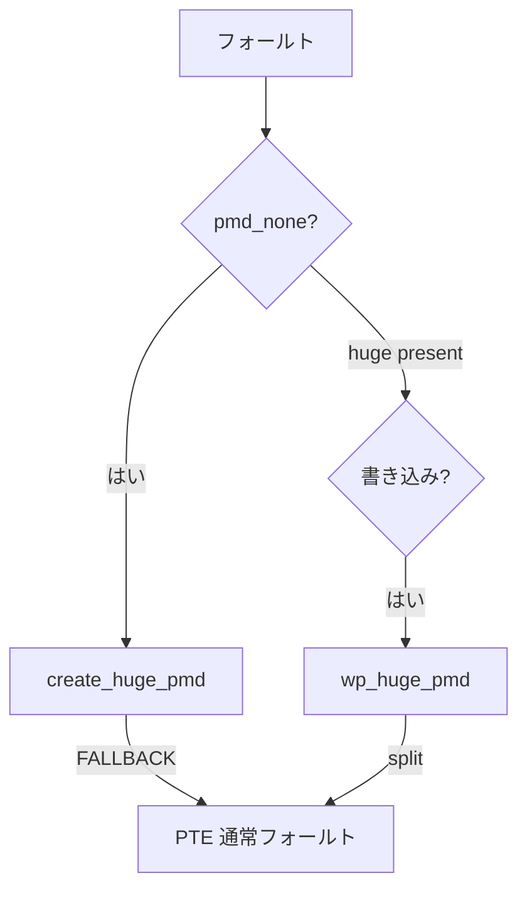

# 第27章 THP と fault 時の huge page

> **本章で読むソース**
>
> - [`mm/memory.c` L6071-L6078](https://github.com/gregkh/linux/blob/v6.18.38/mm/memory.c#L6071-L6078)
> - [`mm/memory.c` L6320-L6324](https://github.com/gregkh/linux/blob/v6.18.38/mm/memory.c#L6320-L6324)
> - [`mm/memory.c` L6082-L6110](https://github.com/gregkh/linux/blob/v6.18.38/mm/memory.c#L6082-L6110)
> - [`mm/memory.c` L6286-L6290](https://github.com/gregkh/linux/blob/v6.18.38/mm/memory.c#L6286-L6290)
> - [`mm/huge_memory.c` L1848-L1859](https://github.com/gregkh/linux/blob/v6.18.38/mm/huge_memory.c#L1848-L1859)
> - [`mm/huge_memory.c` L1242-L1283](https://github.com/gregkh/linux/blob/v6.18.38/mm/huge_memory.c#L1242-L1283)

## この章の狙い

**Transparent Huge Pages**（THP）がページフォールト時に PMD サイズのマッピングを張る経路を読む。
匿名と file-backed の分岐、書き込み時の split までを追う。

## 前提

- [page-table walk と missing fault](../part03-virtual/16-page-table-walk-missing-fault.md)
- [`__alloc_pages` の fast path と slow path](../part01-physical/04-alloc-pages-path.md)

## create_huge_pmd

[`mm/memory.c` L6071-L6079](https://github.com/gregkh/linux/blob/v6.18.38/mm/memory.c#L6071-L6079)

```c
static inline vm_fault_t create_huge_pmd(struct vm_fault *vmf)
{
	struct vm_area_struct *vma = vmf->vma;
	if (vma_is_anonymous(vma))
		return do_huge_pmd_anonymous_page(vmf);
	if (vma->vm_ops->huge_fault)
		return vma->vm_ops->huge_fault(vmf, PMD_ORDER);
	return VM_FAULT_FALLBACK;
}
```

## フォールト時の THP 試行

[`mm/memory.c` L6320-L6324](https://github.com/gregkh/linux/blob/v6.18.38/mm/memory.c#L6320-L6324)

```c
	if (pmd_none(*vmf.pmd) &&
	    thp_vma_allowable_order(vma, vm_flags, TVA_PAGEFAULT, PMD_ORDER)) {
		ret = create_huge_pmd(&vmf);
		if (!(ret & VM_FAULT_FALLBACK))
			return ret;
```

`thp_vma_allowable_order` は VMA フラグと sysctl で可否を決める。

## __do_huge_pmd_anonymous_page：匿名 THP の割り当て

読み取り専用フォールトで zero page を使わない場合、`do_huge_pmd_anonymous_page` はここへ進む。
`vma_alloc_anon_folio_pmd` で huge folio を確保し、`map_anon_folio_pmd` で PMD を張る。

[`mm/huge_memory.c` L1242-L1283](https://github.com/gregkh/linux/blob/v6.18.38/mm/huge_memory.c#L1242-L1283)

```c
static vm_fault_t __do_huge_pmd_anonymous_page(struct vm_fault *vmf)
{
	unsigned long haddr = vmf->address & HPAGE_PMD_MASK;
	struct vm_area_struct *vma = vmf->vma;
	struct folio *folio;
	pgtable_t pgtable;
	vm_fault_t ret = 0;

	folio = vma_alloc_anon_folio_pmd(vma, vmf->address);
	if (unlikely(!folio))
		return VM_FAULT_FALLBACK;

	pgtable = pte_alloc_one(vma->vm_mm);
	if (unlikely(!pgtable)) {
		ret = VM_FAULT_OOM;
		goto release;
	}

	vmf->ptl = pmd_lock(vma->vm_mm, vmf->pmd);
	if (unlikely(!pmd_none(*vmf->pmd))) {
		goto unlock_release;
	} else {
		ret = check_stable_address_space(vma->vm_mm);
		if (ret)
			goto unlock_release;

		/* Deliver the page fault to userland */
		if (userfaultfd_missing(vma)) {
			spin_unlock(vmf->ptl);
			folio_put(folio);
			pte_free(vma->vm_mm, pgtable);
			ret = handle_userfault(vmf, VM_UFFD_MISSING);
			VM_BUG_ON(ret & VM_FAULT_FALLBACK);
			return ret;
		}
		pgtable_trans_huge_deposit(vma->vm_mm, vmf->pmd, pgtable);
		map_anon_folio_pmd(folio, vmf->pmd, vma, haddr);
		mm_inc_nr_ptes(vma->vm_mm);
		spin_unlock(vmf->ptl);
	}

	return 0;
```

確保失敗時は `VM_FAULT_FALLBACK` で通常 PTE フォールトへ降格する。

## 書き込み保護と split

共有マップや COW で THP を維持できないときは PTE レベルへ分割する。

[`mm/memory.c` L6082-L6110](https://github.com/gregkh/linux/blob/v6.18.38/mm/memory.c#L6082-L6110)

```c
static inline vm_fault_t wp_huge_pmd(struct vm_fault *vmf)
{
	struct vm_area_struct *vma = vmf->vma;
	const bool unshare = vmf->flags & FAULT_FLAG_UNSHARE;
	vm_fault_t ret;

	if (vma_is_anonymous(vma)) {
		if (likely(!unshare) &&
		    userfaultfd_huge_pmd_wp(vma, vmf->orig_pmd)) {
			if (userfaultfd_wp_async(vmf->vma))
				goto split;
			return handle_userfault(vmf, VM_UFFD_WP);
		}
		return do_huge_pmd_wp_page(vmf);
	}

	if (vma->vm_flags & (VM_SHARED | VM_MAYSHARE)) {
		if (vma->vm_ops->huge_fault) {
			ret = vma->vm_ops->huge_fault(vmf, PMD_ORDER);
			if (!(ret & VM_FAULT_FALLBACK))
				return ret;
		}
	}

split:
	/* COW or write-notify handled on pte level: split pmd. */
	__split_huge_pmd(vma, vmf->pmd, vmf->address, false);

	return VM_FAULT_FALLBACK;
}
```

## PUD 階 THP

[`mm/memory.c` L6286-L6290](https://github.com/gregkh/linux/blob/v6.18.38/mm/memory.c#L6286-L6290)

```c
	if (pud_none(*vmf.pud) &&
	    thp_vma_allowable_order(vma, vm_flags, TVA_PAGEFAULT, PUD_ORDER)) {
		ret = create_huge_pud(&vmf);
		if (!(ret & VM_FAULT_FALLBACK))
			return ret;
```

## huge_pmd_set_accessed

[`mm/huge_memory.c` L1848-L1860](https://github.com/gregkh/linux/blob/v6.18.38/mm/huge_memory.c#L1848-L1860)

```c
void huge_pmd_set_accessed(struct vm_fault *vmf)
{
	bool write = vmf->flags & FAULT_FLAG_WRITE;

	vmf->ptl = pmd_lock(vmf->vma->vm_mm, vmf->pmd);
	if (unlikely(!pmd_same(*vmf->pmd, vmf->orig_pmd)))
		goto unlock;

	touch_pmd(vmf->vma, vmf->address, vmf->pmd, write);

unlock:
	spin_unlock(vmf->ptl);
}
```

## 処理の流れ



## 高速化と最適化の工夫

THP は **TLB エントリとページテーブル階層を減らす** ため、連続匿名領域に効く。
代価は huge ページ確保の compaction コストと、split の TLB フラッシュである。
`VM_FAULT_FALLBACK` で無理に THP を維持せず、通常 PTE へ降格できる。

## まとめ

THP はフォールト時に透明に huge マッピングを作る。
匿名は `do_huge_pmd_anonymous_page`、ファイルは `vm_ops->huge_fault` である。
書き込み競合時は `__split_huge_pmd` で通常ページへ戻る。
`huge_pmd_set_accessed` は既存 huge PMD へのタッチ経路である。

## 関連する章

- [compaction と kcompactd](../part01-physical/08-compaction.md)
- [khugepaged collapse と deferred split](28-khugepaged-collapse.md)
