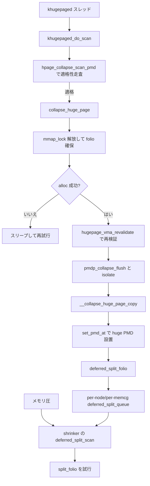

# 第28章 khugepaged collapse と deferred split

> **本章で読むソース**
>
> - [`mm/khugepaged.c` L2624-L2642](https://github.com/gregkh/linux/blob/v6.18.38/mm/khugepaged.c#L2624-L2642)
> - [`mm/khugepaged.c` L2556-L2580](https://github.com/gregkh/linux/blob/v6.18.38/mm/khugepaged.c#L2556-L2580)
> - [`mm/khugepaged.c` L1089-L1115](https://github.com/gregkh/linux/blob/v6.18.38/mm/khugepaged.c#L1089-L1115)
> - [`mm/khugepaged.c` L1281-L1301](https://github.com/gregkh/linux/blob/v6.18.38/mm/khugepaged.c#L1281-L1301)
> - [`mm/khugepaged.c` L1117-L1161](https://github.com/gregkh/linux/blob/v6.18.38/mm/khugepaged.c#L1117-L1161)
> - [`mm/khugepaged.c` L74](https://github.com/gregkh/linux/blob/v6.18.38/mm/khugepaged.c#L74)
> - [`mm/huge_memory.c` L4048-L4076](https://github.com/gregkh/linux/blob/v6.18.38/mm/huge_memory.c#L4048-L4076)
> - [`mm/khugepaged.c` L1176-L1238](https://github.com/gregkh/linux/blob/v6.18.38/mm/khugepaged.c#L1176-L1238)
> - [`mm/huge_memory.c` L4090-L4099](https://github.com/gregkh/linux/blob/v6.18.38/mm/huge_memory.c#L4090-L4099)
> - [`mm/huge_memory.c` L4102-L4113](https://github.com/gregkh/linux/blob/v6.18.38/mm/huge_memory.c#L4102-L4113)
> - [`mm/huge_memory.c` L4142-L4202](https://github.com/gregkh/linux/blob/v6.18.38/mm/huge_memory.c#L4142-L4202)

## この章の狙い

**khugepaged** がバックグラウンドで PTE を走査し **collapse** で THP を作る流れと、deferred split の扱いを読む。
フォールト時 THP は [THP と fault 時の huge page](27-thp-fault.md) が扱う。

## 前提

- [THP と fault 時の huge page](27-thp-fault.md)
- [compaction と kcompactd](../part01-physical/08-compaction.md)

## khugepaged カーネルスレッド

`khugepaged_do_scan` を繰り返し、停止時に mm_slot を回収する。

[`mm/khugepaged.c` L2624-L2642](https://github.com/gregkh/linux/blob/v6.18.38/mm/khugepaged.c#L2624-L2642)

```c
static int khugepaged(void *none)
{
	struct mm_slot *slot;

	set_freezable();
	set_user_nice(current, MAX_NICE);

	while (!kthread_should_stop()) {
		khugepaged_do_scan(&khugepaged_collapse_control);
		khugepaged_wait_work();
	}

	spin_lock(&khugepaged_mm_lock);
	slot = khugepaged_scan.mm_slot;
	khugepaged_scan.mm_slot = NULL;
	if (slot)
		collect_mm_slot(slot);
	spin_unlock(&khugepaged_mm_lock);
	return 0;
}
```

走査の合間に入るスリープ間隔は sysctl で調整できる。

[`mm/khugepaged.c` L74](https://github.com/gregkh/linux/blob/v6.18.38/mm/khugepaged.c#L74)

```c
static unsigned int khugepaged_scan_sleep_millisecs __read_mostly = 10000;
```

## khugepaged_do_scan

登録済み mm を走査し、ページ数上限まで collapse を試す。

[`mm/khugepaged.c` L2556-L2580](https://github.com/gregkh/linux/blob/v6.18.38/mm/khugepaged.c#L2556-L2580)

```c
static void khugepaged_do_scan(struct collapse_control *cc)
{
	unsigned int progress = 0, pass_through_head = 0;
	unsigned int pages = READ_ONCE(khugepaged_pages_to_scan);
	bool wait = true;
	int result = SCAN_SUCCEED;

	lru_add_drain_all();

	while (true) {
		cond_resched();

		if (unlikely(kthread_should_stop()))
			break;

		spin_lock(&khugepaged_mm_lock);
		if (!khugepaged_scan.mm_slot)
			pass_through_head++;
		if (khugepaged_has_work() &&
		    pass_through_head < 2)
			progress += khugepaged_scan_mm_slot(pages - progress,
							    &result, cc);
		else
			progress = pages;
		spin_unlock(&khugepaged_mm_lock);
```

## collapse_huge_page

huge folio を確保する前に mmap_lock を手放し、compaction 待ちを許容する。

[`mm/khugepaged.c` L1089-L1115](https://github.com/gregkh/linux/blob/v6.18.38/mm/khugepaged.c#L1089-L1115)

```c
static int collapse_huge_page(struct mm_struct *mm, unsigned long address,
			      int referenced, int unmapped,
			      struct collapse_control *cc)
{
	LIST_HEAD(compound_pagelist);
	pmd_t *pmd, _pmd;
	pte_t *pte;
	pgtable_t pgtable;
	struct folio *folio;
	spinlock_t *pmd_ptl, *pte_ptl;
	int result = SCAN_FAIL;
	struct vm_area_struct *vma;
	struct mmu_notifier_range range;

	VM_BUG_ON(address & ~HPAGE_PMD_MASK);

	/*
	 * Before allocating the hugepage, release the mmap_lock read lock.
	 * The allocation can take potentially a long time if it involves
	 * sync compaction, and we do not need to hold the mmap_lock during
	 * that. We will recheck the vma after taking it again in write mode.
	 */
	mmap_read_unlock(mm);

	result = alloc_charge_folio(&folio, mm, cc);
	if (result != SCAN_SUCCEED)
		goto out_nolock;
```

## 適格性の走査と再検証

collapse は候補 PMD を無条件に huge 化するわけではない。
走査段階の `hpage_collapse_scan_pmd` が PMD 配下の PTE 群を一つずつ調べ、swap 中の PTE や空きの PTE が上限を超えていないか、参照済みページが十分にあるかといった条件を数える。
たとえば swap 中の PTE 数 `unmapped` が `khugepaged_max_ptes_swap` を超えると `SCAN_EXCEED_SWAP_PTE` で打ち切る。

[`mm/khugepaged.c` L1281-L1301](https://github.com/gregkh/linux/blob/v6.18.38/mm/khugepaged.c#L1281-L1301)

```c
	for (addr = start_addr, _pte = pte; _pte < pte + HPAGE_PMD_NR;
	     _pte++, addr += PAGE_SIZE) {
		pte_t pteval = ptep_get(_pte);
		if (is_swap_pte(pteval)) {
			++unmapped;
			if (!cc->is_khugepaged ||
			    unmapped <= khugepaged_max_ptes_swap) {
				/*
				 * Always be strict with uffd-wp
				 * enabled swap entries.  Please see
				 * comment below for pte_uffd_wp().
				 */
				if (pte_swp_uffd_wp_any(pteval)) {
					result = SCAN_PTE_UFFD_WP;
					goto out_unmap;
				}
				continue;
			} else {
				result = SCAN_EXCEED_SWAP_PTE;
				count_vm_event(THP_SCAN_EXCEED_SWAP_PTE);
				goto out_unmap;
```

走査を通過しても、`collapse_huge_page` は folio 確保のあいだ手放していた mmap_lock を取り直したところで `hugepage_vma_revalidate` を呼び、VMA が依然として THP 適格かを再検証する。
さらに write ロックの下で再度 `hugepage_vma_revalidate` と `check_pmd_still_valid` を通し、PMD が確保中に変化していないことを確かめる。
そのうえで `vma_start_write` と `anon_vma_lock_write` により rmap の並行走査を止めてから隔離へ進む。

[`mm/khugepaged.c` L1117-L1161](https://github.com/gregkh/linux/blob/v6.18.38/mm/khugepaged.c#L1117-L1161)

```c
	mmap_read_lock(mm);
	result = hugepage_vma_revalidate(mm, address, true, &vma, cc);
	if (result != SCAN_SUCCEED) {
		mmap_read_unlock(mm);
		goto out_nolock;
	}
	// ... (中略) ...
	mmap_write_lock(mm);
	result = hugepage_vma_revalidate(mm, address, true, &vma, cc);
	if (result != SCAN_SUCCEED)
		goto out_up_write;
	/* check if the pmd is still valid */
	vma_start_write(vma);
	result = check_pmd_still_valid(mm, address, pmd);
	if (result != SCAN_SUCCEED)
		goto out_up_write;

	anon_vma_lock_write(vma->anon_vma);
```

## collapse：隔離、コピー、PMD 設置

`pmdp_collapse_flush` のあと `__collapse_huge_page_isolate` で PTE 群を隔離し、`__collapse_huge_page_copy` で huge folio へコピーする。
最後に `set_pmd_at` で PMD を設置する。

[`mm/khugepaged.c` L1176-L1238](https://github.com/gregkh/linux/blob/v6.18.38/mm/khugepaged.c#L1176-L1238)

```c
	_pmd = pmdp_collapse_flush(vma, address, pmd);
	spin_unlock(pmd_ptl);
	mmu_notifier_invalidate_range_end(&range);
	tlb_remove_table_sync_one();

	pte = pte_offset_map_lock(mm, &_pmd, address, &pte_ptl);
	if (pte) {
		result = __collapse_huge_page_isolate(vma, address, pte, cc,
						      &compound_pagelist);
		spin_unlock(pte_ptl);
	} else {
		result = SCAN_PMD_NULL;
	}

	if (unlikely(result != SCAN_SUCCEED)) {
		if (pte)
			pte_unmap(pte);
		spin_lock(pmd_ptl);
		BUG_ON(!pmd_none(*pmd));
		/*
		 * We can only use set_pmd_at when establishing
		 * hugepmds and never for establishing regular pmds that
		 * points to regular pagetables. Use pmd_populate for that
		 */
		pmd_populate(mm, pmd, pmd_pgtable(_pmd));
		spin_unlock(pmd_ptl);
		anon_vma_unlock_write(vma->anon_vma);
		goto out_up_write;
	}

	/*
	 * All pages are isolated and locked so anon_vma rmap
	 * can't run anymore.
	 */
	anon_vma_unlock_write(vma->anon_vma);

	result = __collapse_huge_page_copy(pte, folio, pmd, _pmd,
					   vma, address, pte_ptl,
					   &compound_pagelist);
	pte_unmap(pte);
	if (unlikely(result != SCAN_SUCCEED))
		goto out_up_write;

	/*
	 * The smp_wmb() inside __folio_mark_uptodate() ensures the
	 * copy_huge_page writes become visible before the set_pmd_at()
	 * write.
	 */
	__folio_mark_uptodate(folio);
	pgtable = pmd_pgtable(_pmd);

	_pmd = folio_mk_pmd(folio, vma->vm_page_prot);
	_pmd = maybe_pmd_mkwrite(pmd_mkdirty(_pmd), vma);

	spin_lock(pmd_ptl);
	BUG_ON(!pmd_none(*pmd));
	folio_add_new_anon_rmap(folio, vma, address, RMAP_EXCLUSIVE);
	folio_add_lru_vma(folio, vma);
	pgtable_trans_huge_deposit(mm, pmd, pgtable);
	set_pmd_at(mm, address, pmd, _pmd);
	update_mmu_cache_pmd(vma, address, pmd);
	deferred_split_folio(folio, false);
	spin_unlock(pmd_ptl);
```

## deferred split：per-node/per-memcg キューと shrinker

部分的にしかマップされていない、あるいは未使用ページを多く含む THP を即座に分割すると、再結合の機会を失いコストもかさむ。
そこで `deferred_split_folio` は folio を即分割せず、per-node または per-memcg の `deferred_split_queue`（`split_queue`）の末尾へ載せ、`split_queue_len` を増やすだけに留める。
memcg 配下なら `set_shrinker_bit` で対象ノードの shrinker を有効化する。
ここにワークキューへの投入は無い。
分割を実際に駆動するのはメモリ回収経路から呼ばれる shrinker である。

[`mm/huge_memory.c` L4090-L4099](https://github.com/gregkh/linux/blob/v6.18.38/mm/huge_memory.c#L4090-L4099)

```c
	if (list_empty(&folio->_deferred_list)) {
		list_add_tail(&folio->_deferred_list, &ds_queue->split_queue);
		ds_queue->split_queue_len++;
#ifdef CONFIG_MEMCG
		if (memcg)
			set_shrinker_bit(memcg, folio_nid(folio),
					 deferred_split_shrinker->id);
#endif
	}
	spin_unlock_irqrestore(&ds_queue->split_queue_lock, flags);
```

shrinker は `deferred_split_count` と `deferred_split_scan` の対で登録される。
`count` はキュー長 `split_queue_len` を返し、回収候補オブジェクト数の見積りとして使われる。

[`mm/huge_memory.c` L4102-L4113](https://github.com/gregkh/linux/blob/v6.18.38/mm/huge_memory.c#L4102-L4113)

```c
static unsigned long deferred_split_count(struct shrinker *shrink,
		struct shrink_control *sc)
{
	struct pglist_data *pgdata = NODE_DATA(sc->nid);
	struct deferred_split *ds_queue = &pgdata->deferred_split_queue;

#ifdef CONFIG_MEMCG
	if (sc->memcg)
		ds_queue = &sc->memcg->deferred_split_queue;
#endif
	return READ_ONCE(ds_queue->split_queue_len);
}
```

メモリ圧が高まると回収経路が `deferred_split_scan` を起動する。
scan はキュー上の folio を安全に pin して取り出し、部分マップでない folio は `thp_underused` で未使用ページ量を確かめたうえで、対象に対し `split_folio` による分割を試みる。

[`mm/huge_memory.c` L4142-L4202](https://github.com/gregkh/linux/blob/v6.18.38/mm/huge_memory.c#L4142-L4202)

```c
static unsigned long deferred_split_scan(struct shrinker *shrink,
		struct shrink_control *sc)
{
	struct pglist_data *pgdata = NODE_DATA(sc->nid);
	struct deferred_split *ds_queue = &pgdata->deferred_split_queue;
	unsigned long flags;
	LIST_HEAD(list);
	struct folio *folio, *next, *prev = NULL;
	int split = 0, removed = 0;

#ifdef CONFIG_MEMCG
	if (sc->memcg)
		ds_queue = &sc->memcg->deferred_split_queue;
#endif

	spin_lock_irqsave(&ds_queue->split_queue_lock, flags);
	/* Take pin on all head pages to avoid freeing them under us */
	list_for_each_entry_safe(folio, next, &ds_queue->split_queue,
							_deferred_list) {
		if (folio_try_get(folio)) {
			list_move(&folio->_deferred_list, &list);
		} else {
			/* We lost race with folio_put() */
			if (folio_test_partially_mapped(folio)) {
				folio_clear_partially_mapped(folio);
				mod_mthp_stat(folio_order(folio),
					      MTHP_STAT_NR_ANON_PARTIALLY_MAPPED, -1);
			}
			list_del_init(&folio->_deferred_list);
			ds_queue->split_queue_len--;
		}
		if (!--sc->nr_to_scan)
			break;
	}
	spin_unlock_irqrestore(&ds_queue->split_queue_lock, flags);

	list_for_each_entry_safe(folio, next, &list, _deferred_list) {
		bool did_split = false;
		bool underused = false;

		if (!folio_test_partially_mapped(folio)) {
			/*
			 * See try_to_map_unused_to_zeropage(): we cannot
			 * optimize zero-filled pages after splitting an
			 * mlocked folio.
			 */
			if (folio_test_mlocked(folio))
				goto next;
			underused = thp_underused(folio);
			if (!underused)
				goto next;
		}
		if (!folio_trylock(folio))
			goto next;
		if (!split_folio(folio)) {
			did_split = true;
			if (underused)
				count_vm_event(THP_UNDERUSED_SPLIT_PAGE);
			split++;
		}
		folio_unlock(folio);
```

## 割り当て失敗時のスリープ

[`mm/khugepaged.c` L2585-L2594](https://github.com/gregkh/linux/blob/v6.18.38/mm/khugepaged.c#L2585-L2594)

```c
		if (result == SCAN_ALLOC_HUGE_PAGE_FAIL) {
			/*
			 * If fail to allocate the first time, try to sleep for
			 * a while.  When hit again, cancel the scan.
			 */
			if (!wait)
				break;
			wait = false;
			khugepaged_alloc_sleep();
		}
```

## 処理の流れ



## 高速化と最適化の工夫

バックグラウンド collapse はフォールト経路の latency を避けつつ、利用パターンが安定した領域を huge 化する。
mmap_lock を手放して huge 確保することで、compaction 中のデッドロックを避ける。
その代償として確保後に `hugepage_vma_revalidate` と `check_pmd_still_valid` で状態変化を再検証し、競合時は安全に諦める。
deferred split は per-node または memcg キューへ載せるだけに留め、実際の分割はメモリ圧に応じて shrinker が担う。
これにより分割コストを回収が本当に必要になった時点まで遅延できる。

> **7.x 系での変化**
>
> v7.1.3 では [`collapse_huge_page`](https://github.com/gregkh/linux/blob/v7.1.3/mm/khugepaged.c) および `__collapse_huge_page_isolate` / `__collapse_huge_page_copy` の戻り値が `int` から [`enum scan_result`](https://github.com/gregkh/linux/blob/v7.1.3/mm/khugepaged.c#L46-L63) へ変わる。
> 走査失敗理由に [`SCAN_PAGE_DIRTY_OR_WRITEBACK`](https://github.com/gregkh/linux/blob/v7.1.3/mm/khugepaged.c#L63) や [`SCAN_PAGE_LAZYFREE`](https://github.com/gregkh/linux/blob/v7.1.3/mm/khugepaged.c#L49) が追加される。

## まとめ

khugepaged は登録 mm を周期的に走査し、条件を満たす PTE 群を THP にまとめる。
フォールト時 THP と併用され、deferred split が分割タイミングを調整する。

## 関連する章

- [THP と fault 時の huge page](27-thp-fault.md)
- [HugeTLB 予約と fault](29-hugetlb-reservation-fault.md)
