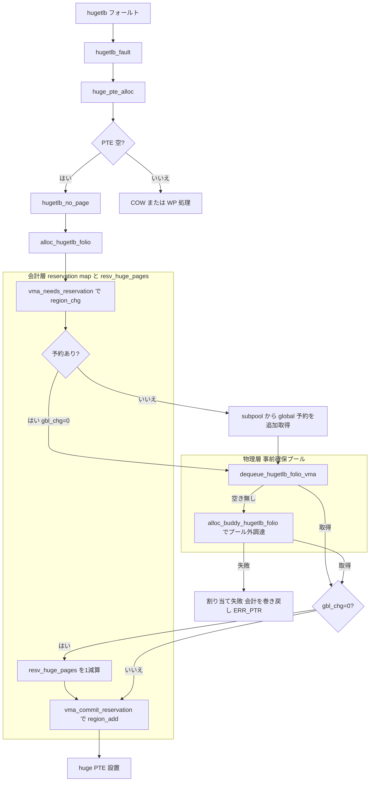

# 第29章 HugeTLB 予約と fault

> **本章で読むソース**
>
> - [`mm/hugetlb.c` L6659-L6703](https://github.com/gregkh/linux/blob/v6.18.38/mm/hugetlb.c#L6659-L6703)
> - [`mm/hugetlb.c` L6705-L6707](https://github.com/gregkh/linux/blob/v6.18.38/mm/hugetlb.c#L6705-L6707)
> - [`mm/hugetlb.c` L2567-L2598](https://github.com/gregkh/linux/blob/v6.18.38/mm/hugetlb.c#L2567-L2598)
> - [`mm/hugetlb.c` L2640-L2644](https://github.com/gregkh/linux/blob/v6.18.38/mm/hugetlb.c#L2640-L2644)
> - [`mm/hugetlb.c` L2647-L2663](https://github.com/gregkh/linux/blob/v6.18.38/mm/hugetlb.c#L2647-L2663)
> - [`mm/hugetlb.c` L806-L827](https://github.com/gregkh/linux/blob/v6.18.38/mm/hugetlb.c#L806-L827)
> - [`mm/hugetlb.c` L739-L784](https://github.com/gregkh/linux/blob/v6.18.38/mm/hugetlb.c#L739-L784)
> - [`mm/hugetlb.c` L2975-L3037](https://github.com/gregkh/linux/blob/v6.18.38/mm/hugetlb.c#L2975-L3037)
> - [`mm/hugetlb.c` L3039-L3046](https://github.com/gregkh/linux/blob/v6.18.38/mm/hugetlb.c#L3039-L3046)
> - [`mm/hugetlb.c` L3061-L3063](https://github.com/gregkh/linux/blob/v6.18.38/mm/hugetlb.c#L3061-L3063)
> - [`mm/hugetlb.c` L3104-L3125](https://github.com/gregkh/linux/blob/v6.18.38/mm/hugetlb.c#L3104-L3125)
> - [`mm/hugetlb.c` L6479-L6479](https://github.com/gregkh/linux/blob/v6.18.38/mm/hugetlb.c#L6479-L6479)
> - [`mm/hugetlb.c` L6556-L6563](https://github.com/gregkh/linux/blob/v6.18.38/mm/hugetlb.c#L6556-L6563)
> - [`include/linux/hugetlb.h` L51-L69](https://github.com/gregkh/linux/blob/v6.18.38/include/linux/hugetlb.h#L51-L69)
> - [`include/linux/hugetlb.h` L655-L669](https://github.com/gregkh/linux/blob/v6.18.38/include/linux/hugetlb.h#L655-L669)

## この章の狙い

**HugeTLB** が **reservation map**（VMA 単位の予約台帳）と **hstate** の事前確保プールを使い分け、THP とは別 ABI で huge ページを提供する流れを読む。
`hugetlb_fault` がフォールト時に huge PTE を張る経路を追う。

## 前提

- [THP と fault 時の huge page](27-thp-fault.md)
- [mmap と munmap](../part03-virtual/12-mmap-munmap.md)

## hugetlb_fault の入口

ファイル backed huge マッピングでは fault mutex で同時インスタンス化を直列化する。

[`mm/hugetlb.c` L6659-L6703](https://github.com/gregkh/linux/blob/v6.18.38/mm/hugetlb.c#L6659-L6703)

```c
vm_fault_t hugetlb_fault(struct mm_struct *mm, struct vm_area_struct *vma,
			unsigned long address, unsigned int flags)
{
	vm_fault_t ret;
	u32 hash;
	struct folio *folio = NULL;
	struct hstate *h = hstate_vma(vma);
	struct address_space *mapping;
	bool need_wait_lock = false;
	struct vm_fault vmf = {
		.vma = vma,
		.address = address & huge_page_mask(h),
		.real_address = address,
		.flags = flags,
		.pgoff = vma_hugecache_offset(h, vma,
				address & huge_page_mask(h)),
		/* TODO: Track hugetlb faults using vm_fault */

		/*
		 * Some fields may not be initialized, be careful as it may
		 * be hard to debug if called functions make assumptions
		 */
	};

	/*
	 * Serialize hugepage allocation and instantiation, so that we don't
	 * get spurious allocation failures if two CPUs race to instantiate
	 * the same page in the page cache.
	 */
	mapping = vma->vm_file->f_mapping;
	hash = hugetlb_fault_mutex_hash(mapping, vmf.pgoff);
	mutex_lock(&hugetlb_fault_mutex_table[hash]);

	/*
	 * Acquire vma lock before calling huge_pte_alloc and hold
	 * until finished with vmf.pte.  This prevents huge_pmd_unshare from
	 * being called elsewhere and making the vmf.pte no longer valid.
	 */
	hugetlb_vma_lock_read(vma);
	vmf.pte = huge_pte_alloc(mm, vma, vmf.address, huge_page_size(h));
	if (!vmf.pte) {
		hugetlb_vma_unlock_read(vma);
		mutex_unlock(&hugetlb_fault_mutex_table[hash]);
		return VM_FAULT_OOM;
	}
```

## reservation map と事前確保プールの区別

HugeTLB は 2 つの独立した資源を扱う。
これらを混同すると予約消費の経路を読み違えるため、先に切り分けておく。

第一が**事前確保プール**である。
`hstate` は起動時や sysctl（`nr_hugepages`）で buddy から確保した物理 huge ページを保持する。
`nr_huge_pages` が総数、`free_huge_pages` が空きリストの枚数、`resv_huge_pages` が予約済みとして引き当て済みの枚数である。
このプールは実際の物理ページそのものであり、`hugepage_activelist` や node 別 free list に連なる。

[`include/linux/hugetlb.h` L655-L669](https://github.com/gregkh/linux/blob/v6.18.38/include/linux/hugetlb.h#L655-L669)

```c
struct hstate {
	struct mutex resize_lock;
	struct lock_class_key resize_key;
	int next_nid_to_alloc;
	int next_nid_to_free;
	unsigned int order;
	unsigned int demote_order;
	unsigned long mask;
	unsigned long max_huge_pages;
	unsigned long nr_huge_pages;
	unsigned long free_huge_pages;
	unsigned long resv_huge_pages;
	unsigned long surplus_huge_pages;
	unsigned long nr_overcommit_huge_pages;
	struct list_head hugepage_activelist;
```

第二が**reservation map**（`resv_map`）である。
これは物理ページではなく、「この仮想範囲は将来プールから 1 枚引ける」という権利を記録する会計台帳である。
`regions` が予約済み範囲を並べた `file_region` のリストで、`region_cache` は範囲を分割する際に使う descriptor の予備プールである。

[`include/linux/hugetlb.h` L51-L69](https://github.com/gregkh/linux/blob/v6.18.38/include/linux/hugetlb.h#L51-L69)

```c
struct resv_map {
	struct kref refs;
	spinlock_t lock;
	struct list_head regions;
	long adds_in_progress;
	struct list_head region_cache;
	long region_cache_count;
	struct rw_semaphore rw_sema;
#ifdef CONFIG_CGROUP_HUGETLB
	/*
	 * On private mappings, the counter to uncharge reservations is stored
	 * here. If these fields are 0, then either the mapping is shared, or
	 * cgroup accounting is disabled for this resv_map.
	 */
	struct page_counter *reservation_counter;
	unsigned long pages_per_hpage;
	struct cgroup_subsys_state *css;
#endif
};
```

要点は次の対比である。
予約（reservation map と `resv_huge_pages`）は「プールから引ける権利の会計」にすぎず、物理ページの確保そのものではない。
`mmap` は予約だけを立て、物理ページを触らない。
フォールトが起きて初めてプールから 1 枚 dequeue して folio を得る。
予約は会計上プールから 1 枚引く権利を確保し、二重割り当てやプール超過を防ぐ会計を与える。
ただし予約は、フォールト時の物理ページ取得が無条件に成功することまでを保証するわけではない。
予約がなければ subpool 経由で global の空きを追加要求する。

## vma_needs_reservation と vma_commit_reservation

予約消費は 3 相のプロトコルで進む。
フォールト直前に `vma_needs_reservation` で予約の要否を調べ、確保が成功したら `vma_commit_reservation` で map を確定し、確保に失敗したら `vma_end_reservation` で仮の予約を取り消す。
いずれも薄いラッパーで、モードを変えて `__vma_reservation_common` を呼ぶだけである。

[`mm/hugetlb.c` L2647-L2663](https://github.com/gregkh/linux/blob/v6.18.38/mm/hugetlb.c#L2647-L2663)

```c
static long vma_needs_reservation(struct hstate *h,
			struct vm_area_struct *vma, unsigned long addr)
{
	return __vma_reservation_common(h, vma, addr, VMA_NEEDS_RESV);
}

static long vma_commit_reservation(struct hstate *h,
			struct vm_area_struct *vma, unsigned long addr)
{
	return __vma_reservation_common(h, vma, addr, VMA_COMMIT_RESV);
}

static void vma_end_reservation(struct hstate *h,
			struct vm_area_struct *vma, unsigned long addr)
{
	(void)__vma_reservation_common(h, vma, addr, VMA_END_RESV);
}
```

## __vma_reservation_common：モードで region 操作へ振り分ける

`__vma_reservation_common` は VMA の `resv_map` を取り出し、モードに応じて region 操作を呼び分ける。
`VMA_NEEDS_RESV` は `region_chg` で不足分を数えるだけ（実際には追加しない）、`VMA_COMMIT_RESV` は `region_add` で範囲を確定、`VMA_END_RESV` は `region_abort` で仮確保を戻す。
error 経路では `VMA_ADD_RESV`/`VMA_DEL_RESV` が `region_add`/`region_del` を使って map を復元または削除する。

[`mm/hugetlb.c` L2567-L2598](https://github.com/gregkh/linux/blob/v6.18.38/mm/hugetlb.c#L2567-L2598)

```c
static long __vma_reservation_common(struct hstate *h,
				struct vm_area_struct *vma, unsigned long addr,
				enum vma_resv_mode mode)
{
	struct resv_map *resv;
	pgoff_t idx;
	long ret;
	long dummy_out_regions_needed;

	resv = vma_resv_map(vma);
	if (!resv)
		return 1;

	idx = vma_hugecache_offset(h, vma, addr);
	switch (mode) {
	case VMA_NEEDS_RESV:
		ret = region_chg(resv, idx, idx + 1, &dummy_out_regions_needed);
		/* We assume that vma_reservation_* routines always operate on
		 * 1 page, and that adding to resv map a 1 page entry can only
		 * ever require 1 region.
		 */
		VM_BUG_ON(dummy_out_regions_needed != 1);
		break;
	case VMA_COMMIT_RESV:
		ret = region_add(resv, idx, idx + 1, 1, NULL, NULL);
		/* region_add calls of range 1 should never fail. */
		VM_BUG_ON(ret < 0);
		break;
	case VMA_END_RESV:
		region_abort(resv, idx, idx + 1, 1);
		ret = 0;
		break;
```

private マッピングと shared マッピングでは map の意味が逆転する点に注意する。
shared では「エントリがある＝予約あり」だが、private では「エントリが無い＝予約あり」で、エントリがあれば予約は消費済みを意味する。
このため最後で戻り値を反転させる。

[`mm/hugetlb.c` L2640-L2644](https://github.com/gregkh/linux/blob/v6.18.38/mm/hugetlb.c#L2640-L2644)

```c
	if (ret > 0)
		return 0;
	if (ret == 0)
		return 1;
	return ret;
```

## region_chg と region_add

map 更新は `region_chg` で不足分を数え、プレースホルダを確保したあと `region_add` で範囲を反映する。

[`mm/hugetlb.c` L806-L827](https://github.com/gregkh/linux/blob/v6.18.38/mm/hugetlb.c#L806-L827)

```c
static long region_chg(struct resv_map *resv, long f, long t,
		       long *out_regions_needed)
{
	long chg = 0;

	spin_lock(&resv->lock);

	/* Count how many hugepages in this range are NOT represented. */
	chg = add_reservation_in_range(resv, f, t, NULL, NULL,
				       out_regions_needed);

	if (*out_regions_needed == 0)
		*out_regions_needed = 1;

	if (allocate_file_region_entries(resv, *out_regions_needed))
		return -ENOMEM;

	resv->adds_in_progress += *out_regions_needed;

	spin_unlock(&resv->lock);
	return chg;
}
```

[`mm/hugetlb.c` L739-L784](https://github.com/gregkh/linux/blob/v6.18.38/mm/hugetlb.c#L739-L784)

```c
static long region_add(struct resv_map *resv, long f, long t,
		       long in_regions_needed, struct hstate *h,
		       struct hugetlb_cgroup *h_cg)
{
	long add = 0, actual_regions_needed = 0;

	spin_lock(&resv->lock);
retry:

	/* Count how many regions are actually needed to execute this add. */
	add_reservation_in_range(resv, f, t, NULL, NULL,
				 &actual_regions_needed);

	/*
	 * Check for sufficient descriptors in the cache to accommodate
	 * this add operation. Note that actual_regions_needed may be greater
	 * than in_regions_needed, as the resv_map may have been modified since
	 * the region_chg call. In this case, we need to make sure that we
	 * allocate extra entries, such that we have enough for all the
	 * existing adds_in_progress, plus the excess needed for this
	 * operation.
	 */
	if (actual_regions_needed > in_regions_needed &&
	    resv->region_cache_count <
		    resv->adds_in_progress +
			    (actual_regions_needed - in_regions_needed)) {
		/* region_add operation of range 1 should never need to
		 * allocate file_region entries.
		 */
		VM_BUG_ON(t - f <= 1);

		if (allocate_file_region_entries(
			    resv, actual_regions_needed - in_regions_needed)) {
			return -ENOMEM;
		}

		goto retry;
	}

	add = add_reservation_in_range(resv, f, t, h_cg, h, NULL);

	resv->adds_in_progress -= in_regions_needed;

	spin_unlock(&resv->lock);
	return add;
}
```

## alloc_hugetlb_folio：予約消費とプール確保

`alloc_hugetlb_folio` は `vma_needs_reservation` の結果で per-VMA 予約を消費するか決め、必要なら subpool と buddy から folio を取る。

[`mm/hugetlb.c` L2975-L3037](https://github.com/gregkh/linux/blob/v6.18.38/mm/hugetlb.c#L2975-L3037)

```c
		/*
		 * Examine the region/reserve map to determine if the process
		 * has a reservation for the page to be allocated.  A return
		 * code of zero indicates a reservation exists (no change).
		 */
		retval = vma_needs_reservation(h, vma, addr);
		if (retval < 0)
			return ERR_PTR(-ENOMEM);
		map_chg = retval ? MAP_CHG_NEEDED : MAP_CHG_REUSE;
	}

	/*
	 * Whether we need a separate global reservation?
	 *
	 * Processes that did not create the mapping will have no
	 * reserves as indicated by the region/reserve map. Check
	 * that the allocation will not exceed the subpool limit.
	 * Or if it can get one from the pool reservation directly.
	 */
	if (map_chg) {
		gbl_chg = hugepage_subpool_get_pages(spool, 1);
		if (gbl_chg < 0)
			goto out_end_reservation;
	} else {
		/*
		 * If we have the vma reservation ready, no need for extra
		 * global reservation.
		 */
		gbl_chg = 0;
	}

	// ... (中略) ...

	spin_lock_irq(&hugetlb_lock);
	/*
	 * glb_chg is passed to indicate whether or not a page must be taken
	 * from the global free pool (global change).  gbl_chg == 0 indicates
	 * a reservation exists for the allocation.
	 */
	folio = dequeue_hugetlb_folio_vma(h, vma, addr, gbl_chg);
	if (!folio) {
		spin_unlock_irq(&hugetlb_lock);
		folio = alloc_buddy_hugetlb_folio_with_mpol(h, vma, addr);
		if (!folio)
			goto out_uncharge_cgroup;
		spin_lock_irq(&hugetlb_lock);
		list_add(&folio->lru, &h->hugepage_activelist);
		folio_ref_unfreeze(folio, 1);
		/* Fall through */
	}
```

ここが「プールから物理ページを引く」瞬間である。
`dequeue_hugetlb_folio_vma` に渡す `gbl_chg` が 0 なら会計上は予約枠が存在し、通常はプールの空きリストから 1 枚を取り出す。
ただしこの dequeue は物理取得を無条件に保証しない。
`dequeue_hugetlb_folio_vma` が folio を返さなかった場合は `hugetlb_lock` を落として `alloc_buddy_hugetlb_folio_with_mpol` へ回り、buddy から huge ページを起こす fallback を持つ。
つまり予約枠は「プールから引く権利」を会計上確保するが、その 1 枚を空きリストから物理的に取れるかは別問題であり、取れなければ buddy 経由の調達へ切り替わる。
その buddy 確保も失敗すれば `out_uncharge_cgroup` へ飛び、cgroup と subpool の会計を巻き戻して `alloc_hugetlb_folio` 自体が `ERR_PTR` を返す。

[`mm/hugetlb.c` L3104-L3125](https://github.com/gregkh/linux/blob/v6.18.38/mm/hugetlb.c#L3104-L3125)

```c
out_uncharge_cgroup:
	hugetlb_cgroup_uncharge_cgroup(idx, pages_per_huge_page(h), h_cg);
out_uncharge_cgroup_reservation:
	if (map_chg)
		hugetlb_cgroup_uncharge_cgroup_rsvd(idx, pages_per_huge_page(h),
						    h_cg);
out_subpool_put:
	/*
	 * put page to subpool iff the quota of subpool's rsv_hpages is used
	 * during hugepage_subpool_get_pages.
	 */
	if (map_chg && !gbl_chg) {
		gbl_reserve = hugepage_subpool_put_pages(spool, 1);
		hugetlb_acct_memory(h, -gbl_reserve);
	}


out_end_reservation:
	if (map_chg != MAP_CHG_ENFORCED)
		vma_end_reservation(h, vma, addr);
	return ERR_PTR(-ENOSPC);
}
```

`gbl_chg` が 0、すなわち予約を消費した割り当てでは、dequeue と buddy のどちらで folio を得た場合でも `resv_huge_pages` を 1 減らして予約枠を実消費に振り替え、folio に復元マークを付ける。

[`mm/hugetlb.c` L3039-L3046](https://github.com/gregkh/linux/blob/v6.18.38/mm/hugetlb.c#L3039-L3046)

```c
	/*
	 * Either dequeued or buddy-allocated folio needs to add special
	 * mark to the folio when it consumes a global reservation.
	 */
	if (!gbl_chg) {
		folio_set_hugetlb_restore_reserve(folio);
		h->resv_huge_pages--;
	}
```

物理ページを得たあと、`vma_commit_reservation` で reservation map を確定する。
これで会計（map の確定）と物理消費（`resv_huge_pages` の減算）が対になる。

[`mm/hugetlb.c` L3061-L3063](https://github.com/gregkh/linux/blob/v6.18.38/mm/hugetlb.c#L3061-L3063)

```c
	if (map_chg != MAP_CHG_ENFORCED) {
		/* commit() is only needed if the map_chg is not enforced */
		retval = vma_commit_reservation(h, vma, addr);
```

## hugetlb_no_page での確保

PTE が空のとき `hugetlb_no_page` が `alloc_hugetlb_folio` を呼ぶ。
この 1 行の内側で前述の `vma_needs_reservation`→`dequeue`／`alloc`→`vma_commit_reservation` が回り、予約を消費して folio を得る。

[`mm/hugetlb.c` L6479-L6479](https://github.com/gregkh/linux/blob/v6.18.38/mm/hugetlb.c#L6479-L6479)

```c
		folio = alloc_hugetlb_folio(vma, vmf->address, false);
```

private マッピングへの書き込みフォールトでは、ページを PTE に張る直前にもう一度予約を確認する。
ここでは `vma_needs_reservation` で会計上の予約枠を先に確保しておき、実際の追加は行わないため即座に `vma_end_reservation` で戻す。
これは spinlock を握る前に必要な descriptor 確保を済ませ、ロック区間での割り当てを避けるための先出しである。

[`mm/hugetlb.c` L6556-L6563](https://github.com/gregkh/linux/blob/v6.18.38/mm/hugetlb.c#L6556-L6563)

```c
	if ((vmf->flags & FAULT_FLAG_WRITE) && !(vma->vm_flags & VM_SHARED)) {
		if (vma_needs_reservation(h, vma, vmf->address) < 0) {
			ret = VM_FAULT_OOM;
			goto backout_unlocked;
		}
		/* Just decrements count, does not deallocate */
		vma_end_reservation(h, vma, vmf->address);
	}
```

## PTE 未設定時の分岐

[`mm/hugetlb.c` L6705-L6707](https://github.com/gregkh/linux/blob/v6.18.38/mm/hugetlb.c#L6705-L6707)

```c
	vmf.orig_pte = huge_ptep_get(mm, vmf.address, vmf.pte);
	if (huge_pte_none_mostly(vmf.orig_pte)) {
		if (is_pte_marker(vmf.orig_pte)) {
```

## 処理の流れ

会計層（reservation map と `resv_huge_pages`）と物理層（事前確保プール）を分けて描く。
上段が「権利の会計」、下段が「物理ページの確保」であり、フォールト時に両者が結び付く。



## 高速化と最適化の工夫

予約プールは実行時の buddy 断片化を避け、あらかじめ確保した物理 huge ページを空きリストから即座に引けるようにする。
reservation map は mmap 時の予約とフォールト時の消費を結び、会計上の権利としてプール枯渇を早期に検出する。
ただし予約はあくまで会計上の保証であり、dequeue が空きを取れなければ buddy へ回り、それも失敗すれば割り当ては失敗し得る。
fault mutex はページキャッシュ同時インスタンス化の競合だけを直列化し、全体ロックを避ける。

> **7.x 系での変化**
>
> v7.1.3 では新規に [`mm/hugetlb_internal.h`](https://github.com/gregkh/linux/blob/v7.1.3/mm/hugetlb_internal.h) が追加され、HugeTLB 内部の inline ヘルパーがそこへ集約された。
> これに伴い [`hugetlb.c`](https://github.com/gregkh/linux/blob/v7.1.3/mm/hugetlb.c) 側の `__vma_reservation_common` や `alloc_hugetlb_folio` の実装位置が v6.18.38 から数十から百行ほど前へずれる（例として `__vma_reservation_common` は v6.18.38 の L2567 に対し v7.1.3 では L2430 付近）。
> 予約消費の 3 相プロトコル（`vma_needs_reservation`→`vma_commit_reservation`／`vma_end_reservation`）と、`region_chg`／`region_add` の 2 段階更新そのものは v7.1.3 でも同型である。

## まとめ

HugeTLB は THP と別機構で、reservation map と hstate プールで huge ページを提供する。
`alloc_hugetlb_folio` が予約消費と物理確保の中心である。

## 関連する章

- [THP と fault 時の huge page](27-thp-fault.md)
- [fork と copy_page_range](../part03-virtual/15-fork-copy-page-range.md)
