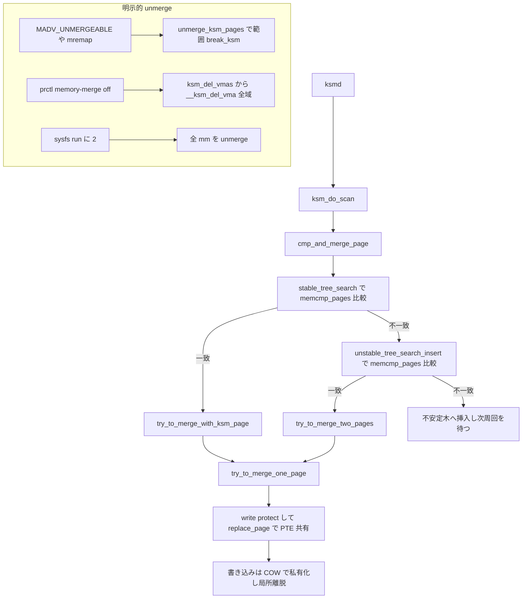

# 第30章 KSM と匿名 page dedup

> **本章で読むソース**
>
> - [`mm/ksm.c` L2774-L2799](https://github.com/gregkh/linux/blob/v6.18.38/mm/ksm.c#L2774-L2799)
> - [`mm/ksm.c` L2753-L2766](https://github.com/gregkh/linux/blob/v6.18.38/mm/ksm.c#L2753-L2766)
> - [`mm/ksm.c` L159-L185](https://github.com/gregkh/linux/blob/v6.18.38/mm/ksm.c#L159-L185)
> - [`mm/ksm.c` L2221-L2270](https://github.com/gregkh/linux/blob/v6.18.38/mm/ksm.c#L2221-L2270)
> - [`mm/ksm.c` L2276-L2341](https://github.com/gregkh/linux/blob/v6.18.38/mm/ksm.c#L2276-L2341)
> - [`mm/ksm.c` L2815-L2820](https://github.com/gregkh/linux/blob/v6.18.38/mm/ksm.c#L2815-L2820)
> - [`mm/ksm.c` L1798-L1843](https://github.com/gregkh/linux/blob/v6.18.38/mm/ksm.c#L1798-L1843)
> - [`mm/ksm.c` L2107-L2160](https://github.com/gregkh/linux/blob/v6.18.38/mm/ksm.c#L2107-L2160)
> - [`mm/util.c` L1035-L1046](https://github.com/gregkh/linux/blob/v6.18.38/mm/util.c#L1035-L1046)
> - [`mm/ksm.c` L1482-L1506](https://github.com/gregkh/linux/blob/v6.18.38/mm/ksm.c#L1482-L1506)
> - [`mm/ksm.c` L1345-L1424](https://github.com/gregkh/linux/blob/v6.18.38/mm/ksm.c#L1345-L1424)
> - [`mm/ksm.c` L623-L651](https://github.com/gregkh/linux/blob/v6.18.38/mm/ksm.c#L623-L651)
> - [`mm/ksm.c` L1041-L1056](https://github.com/gregkh/linux/blob/v6.18.38/mm/ksm.c#L1041-L1056)
> - [`mm/ksm.c` L2948-L2981](https://github.com/gregkh/linux/blob/v6.18.38/mm/ksm.c#L2948-L2981)

## この章の狙い

**KSM**（Kernel Samepage Merging）が匿名ページを走査し、同一内容を **stable tree** にまとめて COW で共有する流れを読む。
`ksmd` スレッドと VMA の `VM_MERGEABLE` 登録を追う。

## 前提

- [write fault と COW](../part03-virtual/17-write-fault-cow.md)
- [rmap と逆引き](../part04-reclaim/22-rmap.md)

## ksmd スキャンスレッド

`ksm_do_scan` を周期的に実行し、スリープ間隔は sysctl で変わる。

[`mm/ksm.c` L2774-L2799](https://github.com/gregkh/linux/blob/v6.18.38/mm/ksm.c#L2774-L2799)

```c
static int ksm_scan_thread(void *nothing)
{
	unsigned int sleep_ms;

	set_freezable();
	set_user_nice(current, 5);

	while (!kthread_should_stop()) {
		mutex_lock(&ksm_thread_mutex);
		wait_while_offlining();
		if (ksmd_should_run())
			ksm_do_scan(ksm_thread_pages_to_scan);
		mutex_unlock(&ksm_thread_mutex);

		if (ksmd_should_run()) {
			sleep_ms = READ_ONCE(ksm_thread_sleep_millisecs);
			wait_event_freezable_timeout(ksm_iter_wait,
				sleep_ms != READ_ONCE(ksm_thread_sleep_millisecs),
				msecs_to_jiffies(sleep_ms));
		} else {
			wait_event_freezable(ksm_thread_wait,
				ksmd_should_run() || kthread_should_stop());
		}
	}
	return 0;
}
```

## ksm_do_scan

[`mm/ksm.c` L2753-L2766](https://github.com/gregkh/linux/blob/v6.18.38/mm/ksm.c#L2753-L2766)

```c
static void ksm_do_scan(unsigned int scan_npages)
{
	struct ksm_rmap_item *rmap_item;
	struct page *page;

	while (scan_npages-- && likely(!freezing(current))) {
		cond_resched();
		rmap_item = scan_get_next_rmap_item(&page);
		if (!rmap_item)
			return;
		cmp_and_merge_page(page, rmap_item);
		put_page(page);
		ksm_pages_scanned++;
	}
}
```

## cmp_and_merge_page：stable/unstable tree 検索

`cmp_and_merge_page` は1ページを重複排除へ通す中心関数である。
入口では対象ページが既に KSM 済み（`folio_stable_node` が非 NULL）かを見る。
既に KSM 済みなら NUMA ノード不一致時に migrate ノードへ載せ替え、そうでなければ `remove_rmap_item_from_tree` で不安定木から外し、`calc_checksum` で内容変化を確認する。
チェックサムが前回と変われば頻繁に書き換わるページと判断してこの回は挿入せずに戻る。
安定した内容なら `stable_tree_search` を呼んで安定木を検索する。

[`mm/ksm.c` L2221-L2270](https://github.com/gregkh/linux/blob/v6.18.38/mm/ksm.c#L2221-L2270)

```c
static void cmp_and_merge_page(struct page *page, struct ksm_rmap_item *rmap_item)
{
	struct folio *folio = page_folio(page);
	struct ksm_rmap_item *tree_rmap_item;
	struct page *tree_page = NULL;
	struct ksm_stable_node *stable_node;
	struct folio *kfolio;
	unsigned int checksum;
	int err;
	bool max_page_sharing_bypass = false;

	stable_node = folio_stable_node(folio);
	if (stable_node) {
		if (stable_node->head != &migrate_nodes &&
		    get_kpfn_nid(READ_ONCE(stable_node->kpfn)) !=
		    NUMA(stable_node->nid)) {
			stable_node_dup_del(stable_node);
			stable_node->head = &migrate_nodes;
			list_add(&stable_node->list, stable_node->head);
		}
		if (stable_node->head != &migrate_nodes &&
		    rmap_item->head == stable_node)
			return;
		/*
		 * If it's a KSM fork, allow it to go over the sharing limit
		 * without warnings.
		 */
		if (!is_page_sharing_candidate(stable_node))
			max_page_sharing_bypass = true;
	} else {
		remove_rmap_item_from_tree(rmap_item);

		/*
		 * If the hash value of the page has changed from the last time
		 * we calculated it, this page is changing frequently: therefore we
		 * don't want to insert it in the unstable tree, and we don't want
		 * to waste our time searching for something identical to it there.
		 */
		checksum = calc_checksum(page);
		if (rmap_item->oldchecksum != checksum) {
			rmap_item->oldchecksum = checksum;
			return;
		}

		if (!try_to_merge_with_zero_page(rmap_item, page))
			return;
	}

	/* Start by searching for the folio in the stable tree */
	kfolio = stable_tree_search(page);
```

`stable_tree_search` の結果で処理が2手に分岐する。
安定木で同一内容の KSM ページが見つかった場合は `try_to_merge_with_ksm_page` でそのページへ寄せ、成功したら `stable_tree_append` で `rmap_item` を既存ノードのマッピング一覧へ足す。
見つからなければ `unstable_tree_search_insert` で不安定木を探す。
不安定木に同一内容の候補があれば `try_to_merge_two_pages` で両ページを新しい KSM ページへ昇格させ、`stable_tree_insert` で安定木へ登録して両方の `rmap_item` を繋ぐ。
挿入に失敗した場合は宙に浮いた KSM マッピングを `break_cow` で解消する。

[`mm/ksm.c` L2276-L2341](https://github.com/gregkh/linux/blob/v6.18.38/mm/ksm.c#L2276-L2341)

```c
	remove_rmap_item_from_tree(rmap_item);

	if (kfolio) {
		if (kfolio == ERR_PTR(-EBUSY))
			return;

		err = try_to_merge_with_ksm_page(rmap_item, page, &kfolio->page);
		if (!err) {
			/*
			 * The page was successfully merged:
			 * add its rmap_item to the stable tree.
			 */
			folio_lock(kfolio);
			stable_tree_append(rmap_item, folio_stable_node(kfolio),
					   max_page_sharing_bypass);
			folio_unlock(kfolio);
		}
		folio_put(kfolio);
		return;
	}

	tree_rmap_item =
		unstable_tree_search_insert(rmap_item, page, &tree_page);
	if (tree_rmap_item) {
		bool split;

		kfolio = try_to_merge_two_pages(rmap_item, page,
						tree_rmap_item, tree_page);
		// ... (中略) ...
		if (kfolio) {
			/*
			 * The pages were successfully merged: insert new
			 * node in the stable tree and add both rmap_items.
			 */
			folio_lock(kfolio);
			stable_node = stable_tree_insert(kfolio);
			if (stable_node) {
				stable_tree_append(tree_rmap_item, stable_node,
						   false);
				stable_tree_append(rmap_item, stable_node,
						   false);
			}
			folio_unlock(kfolio);

			/*
			 * If we fail to insert the page into the stable tree,
			 * we will have 2 virtual addresses that are pointing
			 * to a ksm page left outside the stable tree,
			 * in which case we need to break_cow on both.
			 */
			if (!stable_node) {
				break_cow(tree_rmap_item);
				break_cow(rmap_item);
			}
		}
```

## stable_tree_search：内容比較

rbtree を辿り `memcmp_pages` で同一内容を探す。

[`mm/ksm.c` L1798-L1843](https://github.com/gregkh/linux/blob/v6.18.38/mm/ksm.c#L1798-L1843)

```c
static struct folio *stable_tree_search(struct page *page)
{
	int nid;
	struct rb_root *root;
	struct rb_node **new;
	struct rb_node *parent;
	struct ksm_stable_node *stable_node, *stable_node_dup;
	struct ksm_stable_node *page_node;
	struct folio *folio;

	folio = page_folio(page);
	page_node = folio_stable_node(folio);
	if (page_node && page_node->head != &migrate_nodes) {
		/* ksm page forked */
		folio_get(folio);
		return folio;
	}

	nid = get_kpfn_nid(folio_pfn(folio));
	root = root_stable_tree + nid;
again:
	new = &root->rb_node;
	parent = NULL;

	while (*new) {
		struct folio *tree_folio;
		int ret;

		cond_resched();
		stable_node = rb_entry(*new, struct ksm_stable_node, node);
		tree_folio = chain_prune(&stable_node_dup, &stable_node, root);
		if (!tree_folio) {
			/*
			 * If we walked over a stale stable_node,
			 * ksm_get_folio() will call rb_erase() and it
			 * may rebalance the tree from under us. So
			 * restart the search from scratch. Returning
			 * NULL would be safe too, but we'd generate
			 * false negative insertions just because some
			 * stable_node was stale.
			 */
			goto again;
		}

		ret = memcmp_pages(page, &tree_folio->page);
		folio_put(tree_folio);
```

`memcmp_pages` は両ページを `kmap_local_page` で写像し `memcmp` で1ページ全体を byte 比較する実体を持つ。
返り値の符号で赤黒木を左右どちらへ辿るかを決め、0 なら内容一致である。
checksum は頻繁に変わるページを弾く粗いフィルタで、最終的な同一判定はこの全ページ比較が担う。

[`mm/util.c` L1035-L1046](https://github.com/gregkh/linux/blob/v6.18.38/mm/util.c#L1035-L1046)

```c
int __weak memcmp_pages(struct page *page1, struct page *page2)
{
	char *addr1, *addr2;
	int ret;

	addr1 = kmap_local_page(page1);
	addr2 = kmap_local_page(page2);
	ret = memcmp(addr1, addr2, PAGE_SIZE);
	kunmap_local(addr2);
	kunmap_local(addr1);
	return ret;
}
```

## unstable_tree_search_insert：不安定木の検索と挿入

安定木で一致しなかったページは不安定木を探す。
不安定木は「まだ KSM ページになっていない候補」を集めた赤黒木で、各ノードの内容は書き換わり得るため write protect されていない。
`unstable_tree_search_insert` は木を辿りながら `memcmp_pages` で比較し、一致すれば相手の `rmap_item` を返す。
一致がなければ末尾に自分を挿入し、次のスキャン周回で別のページとの一致を待つ。

[`mm/ksm.c` L2107-L2160](https://github.com/gregkh/linux/blob/v6.18.38/mm/ksm.c#L2107-L2160)

```c
struct ksm_rmap_item *unstable_tree_search_insert(struct ksm_rmap_item *rmap_item,
					      struct page *page,
					      struct page **tree_pagep)
{
	// ... (中略) ...
	while (*new) {
		struct ksm_rmap_item *tree_rmap_item;
		struct page *tree_page;
		int ret;

		cond_resched();
		tree_rmap_item = rb_entry(*new, struct ksm_rmap_item, node);
		tree_page = get_mergeable_page(tree_rmap_item);
		if (!tree_page)
			return NULL;
		// ... (中略) ...
		ret = memcmp_pages(page, tree_page);

		parent = *new;
		if (ret < 0) {
			put_page(tree_page);
			new = &parent->rb_left;
		} else if (ret > 0) {
			put_page(tree_page);
			new = &parent->rb_right;
		} else if (!ksm_merge_across_nodes &&
			   page_to_nid(tree_page) != nid) {
			put_page(tree_page);
			return NULL;
		} else {
			*tree_pagep = tree_page;
			return tree_rmap_item;
		}
	}
```

## try_to_merge_one_page：write protect して共有へ

安定木・不安定木のどちらの経路でも、実際の PTE 差し替えは `try_to_merge_one_page` に集約される。
この関数は対象 folio を trylock で押さえ、`write_protect_page` で PTE を読み取り専用へ落とす。
KSM ページは以後 read only で写像されるため、書き込みは必ずフォールトを起こして COW へ回る。
その上で `pages_identical` が内容一致を確認できたときだけ `replace_page` を呼び、共有を成立させる。

[`mm/ksm.c` L1482-L1506](https://github.com/gregkh/linux/blob/v6.18.38/mm/ksm.c#L1482-L1506)

```c
	if (write_protect_page(vma, folio, &orig_pte) == 0) {
		if (!kpage) {
			/*
			 * While we hold folio lock, upgrade folio from
			 * anon to a NULL stable_node with the KSM flag set:
			 * stable_tree_insert() will update stable_node.
			 */
			folio_set_stable_node(folio, NULL);
			folio_mark_accessed(folio);
			/*
			 * Page reclaim just frees a clean folio with no dirty
			 * ptes: make sure that the ksm page would be swapped.
			 */
			if (!folio_test_dirty(folio))
				folio_mark_dirty(folio);
			err = 0;
		} else if (pages_identical(page, kpage))
			err = replace_page(vma, page, kpage, orig_pte);
	}

out_unlock:
	folio_unlock(folio);
out:
	return err;
}
```

## replace_page：PTE を共有ページへ差し替え

一致が見つかれば `replace_page` が元 PTE をクリアし、KSM ページへ差し替える。

[`mm/ksm.c` L1345-L1424](https://github.com/gregkh/linux/blob/v6.18.38/mm/ksm.c#L1345-L1424)

```c
static int replace_page(struct vm_area_struct *vma, struct page *page,
			struct page *kpage, pte_t orig_pte)
{
	struct folio *kfolio = page_folio(kpage);
	struct mm_struct *mm = vma->vm_mm;
	struct folio *folio = page_folio(page);
	pmd_t *pmd;
	pmd_t pmde;
	pte_t *ptep;
	pte_t newpte;
	spinlock_t *ptl;
	unsigned long addr;
	int err = -EFAULT;
	struct mmu_notifier_range range;

	addr = page_address_in_vma(folio, page, vma);
	if (addr == -EFAULT)
		goto out;

	pmd = mm_find_pmd(mm, addr);
	if (!pmd)
		goto out;
	/*
	 * Some THP functions use the sequence pmdp_huge_clear_flush(), set_pmd_at()
	 * without holding anon_vma lock for write.  So when looking for a
	 * genuine pmde (in which to find pte), test present and !THP together.
	 */
	pmde = pmdp_get_lockless(pmd);
	if (!pmd_present(pmde) || pmd_trans_huge(pmde))
		goto out;

	mmu_notifier_range_init(&range, MMU_NOTIFY_CLEAR, 0, mm, addr,
				addr + PAGE_SIZE);
	mmu_notifier_invalidate_range_start(&range);

	ptep = pte_offset_map_lock(mm, pmd, addr, &ptl);
	if (!ptep)
		goto out_mn;
	if (!pte_same(ptep_get(ptep), orig_pte)) {
		pte_unmap_unlock(ptep, ptl);
		goto out_mn;
	}
	VM_BUG_ON_PAGE(PageAnonExclusive(page), page);
	VM_BUG_ON_FOLIO(folio_test_anon(kfolio) && PageAnonExclusive(kpage),
			kfolio);

	/*
	 * No need to check ksm_use_zero_pages here: we can only have a
	 * zero_page here if ksm_use_zero_pages was enabled already.
	 */
	if (!is_zero_pfn(page_to_pfn(kpage))) {
		folio_get(kfolio);
		folio_add_anon_rmap_pte(kfolio, kpage, vma, addr, RMAP_NONE);
		newpte = mk_pte(kpage, vma->vm_page_prot);
	} else {
		/*
		 * Use pte_mkdirty to mark the zero page mapped by KSM, and then
		 * we can easily track all KSM-placed zero pages by checking if
		 * the dirty bit in zero page's PTE is set.
		 */
		newpte = pte_mkdirty(pte_mkspecial(pfn_pte(page_to_pfn(kpage), vma->vm_page_prot)));
		ksm_map_zero_page(mm);
		/*
		 * We're replacing an anonymous page with a zero page, which is
		 * not anonymous. We need to do proper accounting otherwise we
		 * will get wrong values in /proc, and a BUG message in dmesg
		 * when tearing down the mm.
		 */
		dec_mm_counter(mm, MM_ANONPAGES);
	}

	flush_cache_page(vma, addr, pte_pfn(ptep_get(ptep)));
	/*
	 * No need to notify as we are replacing a read only page with another
	 * read only page with the same content.
	 *
	 * See Documentation/mm/mmu_notifier.rst
	 */
	ptep_clear_flush(vma, addr, ptep);
	set_pte_at(mm, addr, ptep, newpte);
```

## write fault による私有化：COW

共有された KSM ページへの離脱には2系統があり、まず混同しやすいのがこの fault 契機の局所的離脱である。
`try_to_merge_one_page` が示したとおり KSM ページは read only で写像されるため、いずれかのプロセスが書き込むと write protection fault が起きる。
このフォールトは KSM 固有経路ではなく通常の COW 処理 `do_wp_page` に入り、共有されていて排他所有でない folio と判定されて私有コピーを作る。
書いたプロセスだけが自分専用のページへ移り、他のマッピングは KSM ページを read only で共有したまま残る。
この経路は VMA の `VM_MERGEABLE` を落とさないので、離脱したページは次のスキャンで再びマージ候補になり得る。
COW の詳細は[write fault と COW](../part03-virtual/17-write-fault-cow.md)を参照する。

## break_ksm：明示的 unmerge の素

範囲や VMA を明示的に解体する側の unmerge は `break_ksm` を素とする。
これは write fault 経路とは別で、`handle_mm_fault` を `FAULT_FLAG_UNSHARE` 付きで呼び、書き込みなしにその1アドレスの KSM 共有を解く。
1アドレスを扱うこの関数を範囲やコンテキストごとに呼び出すのが後述の `unmerge_ksm_pages` と `break_cow` である。
`break_cow` は KSM 自身が直前のマージを取り消すときに使う（例 stable tree 挿入失敗時）。

[`mm/ksm.c` L623-L651](https://github.com/gregkh/linux/blob/v6.18.38/mm/ksm.c#L623-L651)

```c
static int break_ksm(struct vm_area_struct *vma, unsigned long addr, bool lock_vma)
{
	vm_fault_t ret = 0;

	if (lock_vma)
		vma_start_write(vma);

	do {
		bool ksm_page = false;
		struct folio_walk fw;
		struct folio *folio;

		cond_resched();
		folio = folio_walk_start(&fw, vma, addr,
					 FW_MIGRATION | FW_ZEROPAGE);
		if (folio) {
			/* Small folio implies FW_LEVEL_PTE. */
			if (!folio_test_large(folio) &&
			    (folio_test_ksm(folio) || is_ksm_zero_pte(fw.pte)))
				ksm_page = true;
			folio_walk_end(&fw, vma);
		}

		if (!ksm_page)
			return 0;
		ret = handle_mm_fault(vma, addr,
				      FAULT_FLAG_UNSHARE | FAULT_FLAG_REMOTE,
				      NULL);
	} while (!(ret & (VM_FAULT_SIGBUS | VM_FAULT_SIGSEGV | VM_FAULT_OOM)));
```

## ksm_stable_node

マージ済みページは stable rbtree と rmap リストで管理する。

[`mm/ksm.c` L159-L185](https://github.com/gregkh/linux/blob/v6.18.38/mm/ksm.c#L159-L185)

```c
struct ksm_stable_node {
	union {
		struct rb_node node;	/* when node of stable tree */
		struct {		/* when listed for migration */
			struct list_head *head;
			struct {
				struct hlist_node hlist_dup;
				struct list_head list;
			};
		};
	};
	struct hlist_head hlist;
	union {
		unsigned long kpfn;
		unsigned long chain_prune_time;
	};
	/*
	 * STABLE_NODE_CHAIN can be any negative number in
	 * rmap_hlist_len negative range, but better not -1 to be able
	 * to reliably detect underflows.
	 */
#define STABLE_NODE_CHAIN -1024
	int rmap_hlist_len;
#ifdef CONFIG_NUMA
	int nid;
#endif
};
```

## VMA への VM_MERGEABLE 付与

[`mm/ksm.c` L2809-L2813](https://github.com/gregkh/linux/blob/v6.18.38/mm/ksm.c#L2809-L2813)

```c
static void __ksm_add_vma(struct vm_area_struct *vma)
{
	if (__ksm_should_add_vma(vma->vm_file, vma->vm_flags))
		vm_flags_set(vma, VM_MERGEABLE);
}
```

## 範囲/VMA 全域の unmerge

明示的 unmerge の共通実装が `unmerge_ksm_pages` である。
指定範囲 `[start, end)` を1ページずつ `break_ksm` で解いていくループにすぎない。

[`mm/ksm.c` L1041-L1056](https://github.com/gregkh/linux/blob/v6.18.38/mm/ksm.c#L1041-L1056)

```c
static int unmerge_ksm_pages(struct vm_area_struct *vma,
			     unsigned long start, unsigned long end, bool lock_vma)
{
	unsigned long addr;
	int err = 0;

	for (addr = start; addr < end && !err; addr += PAGE_SIZE) {
		if (ksm_test_exit(vma->vm_mm))
			break;
		if (signal_pending(current))
			err = -ERESTARTSYS;
		else
			err = break_ksm(vma, addr, lock_vma);
	}
	return err;
}
```

この `unmerge_ksm_pages` を呼ぶ明示的経路は次のとおりで、いずれもソースで確認した。

- `MADV_UNMERGEABLE`：`ksm_madvise` が指定範囲 `[start, end)` を unmerge し、`VM_MERGEABLE` を落とす。
- `mremap`：`move_vma` が移動元範囲に対し `ksm_madvise(MADV_UNMERGEABLE)` を発行し、移動先に古い KSM ページが現れないようにする。
- `prctl(PR_SET_MEMORY_MERGE, 0)`：`ksm_disable_merge_any` から `ksm_del_vmas` を通り、各 VMA で `__ksm_del_vma` が VMA 全域を unmerge する。
- sysfs `run` に 2（`KSM_RUN_UNMERGE`）：`unmerge_and_remove_all_rmap_items` が全 mm の全 VMA を unmerge するグローバル解体。

一方で `munmap` と `mprotect` はこの経路を持たない。
`munmap` では PTE が zap されるだけで、KSM ページの mapcount は rmap 経由で減り、参照が尽きたとき stable node が遅延回収される。
`mprotect` は KSM ページを prot_numa の対象から外すだけで unmerge は起こさない。
つまり `__ksm_del_vma` は VMA の破棄そのものではなく、プロセス単位でマージを無効化する契機（`ksm_disable`／`ksm_disable_merge_any`）で呼ばれる点に注意する。

`ksm_madvise` は `MADV_MERGEABLE` で `VM_MERGEABLE` を立て、`MADV_UNMERGEABLE` で範囲 unmerge の上フラグを落とす。

[`mm/ksm.c` L2948-L2981](https://github.com/gregkh/linux/blob/v6.18.38/mm/ksm.c#L2948-L2981)

```c
int ksm_madvise(struct vm_area_struct *vma, unsigned long start,
		unsigned long end, int advice, vm_flags_t *vm_flags)
{
	struct mm_struct *mm = vma->vm_mm;
	int err;

	switch (advice) {
	case MADV_MERGEABLE:
		if (vma->vm_flags & VM_MERGEABLE)
			return 0;
		if (!vma_ksm_compatible(vma))
			return 0;

		if (!mm_flags_test(MMF_VM_MERGEABLE, mm)) {
			err = __ksm_enter(mm);
			if (err)
				return err;
		}

		*vm_flags |= VM_MERGEABLE;
		break;

	case MADV_UNMERGEABLE:
		if (!(*vm_flags & VM_MERGEABLE))
			return 0;		/* just ignore the advice */

		if (vma->anon_vma) {
			err = unmerge_ksm_pages(vma, start, end, true);
			if (err)
				return err;
		}

		*vm_flags &= ~VM_MERGEABLE;
		break;
	}

	return 0;
}
```

`__ksm_del_vma` は VMA 全域を範囲に取って `unmerge_ksm_pages` を呼び、成功すれば `VM_MERGEABLE` を落とす。
前述のとおりこれは munmap ではなく `ksm_disable`／`ksm_disable_merge_any` から `ksm_del_vmas` 経由で到達する。

[`mm/ksm.c` L2815-L2830](https://github.com/gregkh/linux/blob/v6.18.38/mm/ksm.c#L2815-L2830)

```c
static int __ksm_del_vma(struct vm_area_struct *vma)
{
	int err;

	if (!(vma->vm_flags & VM_MERGEABLE))
		return 0;

	if (vma->anon_vma) {
		err = unmerge_ksm_pages(vma, vma->vm_start, vma->vm_end, true);
		if (err)
			return err;
	}

	vm_flags_clear(vma, VM_MERGEABLE);
	return 0;
}
```

## 処理の流れ



## 高速化と最適化の工夫

stable tree は同一内容ページを1物理ページに集約し、メモリ使用量を減らす。
checksum で頻繁に変わるページを先に弾き、全ページ `memcmp_pages` 比較のコストを本命候補にだけ払う二段構えになっている。
スキャンはバックグラウンドで行い、フォールト経路の latency へ影響を最小化する。
書き込みは read only 写像による COW で局所的に私有化し、`MADV_UNMERGEABLE` などは `break_ksm` を範囲で回して明示的に解体する。

## まとめ

KSM は匿名ページの重複排除機構である。
ksmd が走査し、`cmp_and_merge_page` が安定木を `stable_tree_search`、不安定木を `unstable_tree_search_insert` で `memcmp_pages` 比較して同一内容を探す。
一致すれば `try_to_merge_one_page` から `replace_page` で PTE を共有ページへ張り替える。
共有の離脱には2系統があり、write fault は COW で局所的に私有化し、`MADV_UNMERGEABLE`／mremap／プロセス単位の無効化／sysfs run=2 は `break_ksm` を範囲や全域で回して明示的に解体する。

## 関連する章

- [write fault と COW](../part03-virtual/17-write-fault-cow.md)
- [mprotect、madvise、mlock](../part03-virtual/13-mprotect-madvise-mlock.md)
