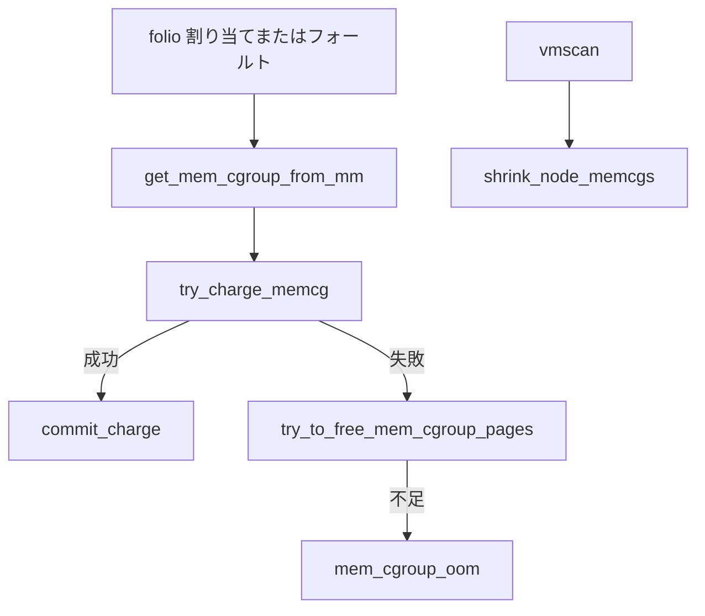

# 第31章 memcg とメモリ cgroup

> **本章で読むソース**
>
> - [`mm/memcontrol.c` L4721-L4730](https://github.com/gregkh/linux/blob/v6.18.38/mm/memcontrol.c#L4721-L4730)
> - [`mm/memcontrol.c` L4705-L4718](https://github.com/gregkh/linux/blob/v6.18.38/mm/memcontrol.c#L4705-L4718)
> - [`mm/memcontrol.c` L2300-L2364](https://github.com/gregkh/linux/blob/v6.18.38/mm/memcontrol.c#L2300-L2364)
> - [`mm/memcontrol.c` L2401-L2406](https://github.com/gregkh/linux/blob/v6.18.38/mm/memcontrol.c#L2401-L2406)
> - [`mm/memcontrol.c` L2504-L2515](https://github.com/gregkh/linux/blob/v6.18.38/mm/memcontrol.c#L2504-L2515)
> - [`mm/vmscan.c` L6022-L6039](https://github.com/gregkh/linux/blob/v6.18.38/mm/vmscan.c#L6022-L6039)

## この章の狙い

**memcg**（memory cgroup）が folio 課金と回収対象をどう束ねるかを読む。
cgroup v2 のコアは namespace 分冊と境界を分け、mm 側の charge と reclaim に焦点を当てる。

## 前提

- [folio とページ管理単位](../part00-foundation/02-folio-page-unit.md)
- [reclaim orchestration と direct/kswapd](../part04-reclaim/25-reclaim-orchestration.md)

## __mem_cgroup_charge：ユーザー映射の入口

フォールトやページ割り当てでは `mm` から memcg を引き、`charge_memcg` へ渡す。

[`mm/memcontrol.c` L4721-L4730](https://github.com/gregkh/linux/blob/v6.18.38/mm/memcontrol.c#L4721-L4730)

```c
int __mem_cgroup_charge(struct folio *folio, struct mm_struct *mm, gfp_t gfp)
{
	struct mem_cgroup *memcg;
	int ret;

	memcg = get_mem_cgroup_from_mm(mm);
	ret = charge_memcg(folio, memcg, gfp);
	css_put(&memcg->css);

	return ret;
```

## charge_memcg：try_charge と commit_charge

課金成功時だけ `commit_charge` で folio に memcg を刻む。

[`mm/memcontrol.c` L4705-L4718](https://github.com/gregkh/linux/blob/v6.18.38/mm/memcontrol.c#L4705-L4718)

```c
static int charge_memcg(struct folio *folio, struct mem_cgroup *memcg,
			gfp_t gfp)
{
	int ret;

	ret = try_charge(memcg, gfp, folio_nr_pages(folio));
	if (ret)
		goto out;

	css_get(&memcg->css);
	commit_charge(folio, memcg);
	memcg1_commit_charge(folio, memcg);
out:
	return ret;
```

## try_charge_memcg：上限超過と回収

`page_counter_try_charge` 失敗時は `try_to_free_mem_cgroup_pages` で階層回収を試す。

[`mm/memcontrol.c` L2300-L2364](https://github.com/gregkh/linux/blob/v6.18.38/mm/memcontrol.c#L2300-L2364)

```c
static int try_charge_memcg(struct mem_cgroup *memcg, gfp_t gfp_mask,
			    unsigned int nr_pages)
{
	unsigned int batch = max(MEMCG_CHARGE_BATCH, nr_pages);
	int nr_retries = MAX_RECLAIM_RETRIES;
	struct mem_cgroup *mem_over_limit;
	struct page_counter *counter;
	unsigned long nr_reclaimed;
	bool passed_oom = false;
	unsigned int reclaim_options = MEMCG_RECLAIM_MAY_SWAP;
	bool drained = false;
	bool raised_max_event = false;
	unsigned long pflags;
	bool allow_spinning = gfpflags_allow_spinning(gfp_mask);

retry:
	if (consume_stock(memcg, nr_pages))
		return 0;

	if (!allow_spinning)
		/* Avoid the refill and flush of the older stock */
		batch = nr_pages;

	if (!do_memsw_account() ||
	    page_counter_try_charge(&memcg->memsw, batch, &counter)) {
		if (page_counter_try_charge(&memcg->memory, batch, &counter))
			goto done_restock;
		if (do_memsw_account())
			page_counter_uncharge(&memcg->memsw, batch);
		mem_over_limit = mem_cgroup_from_counter(counter, memory);
	} else {
		mem_over_limit = mem_cgroup_from_counter(counter, memsw);
		reclaim_options &= ~MEMCG_RECLAIM_MAY_SWAP;
	}

	if (batch > nr_pages) {
		batch = nr_pages;
		goto retry;
	}

	/*
	 * Prevent unbounded recursion when reclaim operations need to
	 * allocate memory. This might exceed the limits temporarily,
	 * but we prefer facilitating memory reclaim and getting back
	 * under the limit over triggering OOM kills in these cases.
	 */
	if (unlikely(current->flags & PF_MEMALLOC))
		goto force;

	if (unlikely(task_in_memcg_oom(current)))
		goto nomem;

	if (!gfpflags_allow_blocking(gfp_mask))
		goto nomem;

	__memcg_memory_event(mem_over_limit, MEMCG_MAX, allow_spinning);
	raised_max_event = true;

	psi_memstall_enter(&pflags);
	nr_reclaimed = try_to_free_mem_cgroup_pages(mem_over_limit, nr_pages,
						    gfp_mask, reclaim_options, NULL);
	psi_memstall_leave(&pflags);

	if (mem_cgroup_margin(mem_over_limit) >= nr_pages)
		goto retry;
```

## mem_cgroup_oom

回収で空きが足りなければ memcg OOM キラーへ進む。

[`mm/memcontrol.c` L2401-L2406](https://github.com/gregkh/linux/blob/v6.18.38/mm/memcontrol.c#L2401-L2406)

```c
	if (mem_cgroup_oom(mem_over_limit, gfp_mask,
			   get_order(nr_pages * PAGE_SIZE))) {
		passed_oom = true;
		nr_retries = MAX_RECLAIM_RETRIES;
		goto retry;
	}
```

## commit_charge：folio への課金確定

[`mm/memcontrol.c` L2504-L2515](https://github.com/gregkh/linux/blob/v6.18.38/mm/memcontrol.c#L2504-L2515)

```c
static void commit_charge(struct folio *folio, struct mem_cgroup *memcg)
{
	VM_BUG_ON_FOLIO(folio_memcg_charged(folio), folio);
	/*
	 * Any of the following ensures page's memcg stability:
	 *
	 * - the page lock
	 * - LRU isolation
	 * - exclusive reference
	 */
	folio->memcg_data = (unsigned long)memcg;
}
```

`memcg_data` に課金先を格納し、回収時の lruvec 特定に使う。

## shrink_node_memcgs：階層走査

vmscan は `target_mem_cgroup` を起点に子 cgroup を走査し、各 lruvec を回収する。

[`mm/vmscan.c` L6022-L6039](https://github.com/gregkh/linux/blob/v6.18.38/mm/vmscan.c#L6022-L6039)

```c
	if (current_is_kswapd() || sc->memcg_full_walk)
		partial = NULL;

	memcg = mem_cgroup_iter(target_memcg, NULL, partial);
	do {
		struct lruvec *lruvec = mem_cgroup_lruvec(memcg, pgdat);
		unsigned long reclaimed;
		unsigned long scanned;

		/*
		 * This loop can become CPU-bound when target memcgs
		 * aren't eligible for reclaim - either because they
		 * don't have any reclaimable pages, or because their
		 * memory is explicitly protected. Avoid soft lockups.
		 */
		cond_resched();

		mem_cgroup_calculate_protection(target_memcg, memcg);
```

kswapd は `partial = NULL` で毎回フルウォークし、direct reclaim はイテレータ状態を再利用する。

## 処理の流れ



## 高速化と最適化の工夫

`consume_stock` と per-cpu バッチ課金で hot path の atomic を減らす。
`partial` 走査で direct reclaim が cgroup 木全体を毎回歩かないようにする。
folio の `memcg_data` 圧縮格納により、回収時の lruvec 特定を高速化する。

> **7.x 系での変化**
> v6.18.38 の [`charge_memcg`](https://github.com/gregkh/linux/blob/v6.18.38/mm/memcontrol.c#L4705-L4718) は `try_charge` 成功後に [`commit_charge(folio, memcg)`](https://github.com/gregkh/linux/blob/v6.18.38/mm/memcontrol.c#L2504-L2515) で `memcg_data` へ `mem_cgroup` を刻む。
> v7.1.3 では [`charge_memcg`](https://github.com/gregkh/linux/blob/v7.1.3/mm/memcontrol.c#L5015-L5032) が [`get_obj_cgroup_from_memcg`](https://github.com/gregkh/linux/blob/v7.1.3/mm/memcontrol.c#L5021-L5021) で `obj_cgroup` を取り、[`commit_charge(folio, objcg)`](https://github.com/gregkh/linux/blob/v7.1.3/mm/memcontrol.c#L2775-L2786) が `memcg_data` へ `obj_cgroup` を格納する。
> 課金確定の意味は「folio にどの cgroup 会計単位を結び付けるか」へ移り、本章の `commit_charge` 節の読み方が変わる。

## まとめ

memcg は folio 単位でメモリ使用量を会計し、上限で reclaim を誘発する。
`__mem_cgroup_charge` がユーザー映射の典型入口で、`try_charge_memcg` が回収と OOM の分岐を担う。
回収は `shrink_node_memcgs` が `target_mem_cgroup` を起点に階層走査する。

## 関連する章

- [reclaim orchestration と direct/kswapd](../part04-reclaim/25-reclaim-orchestration.md)
- namespace と cgroup 分冊（計画中）
