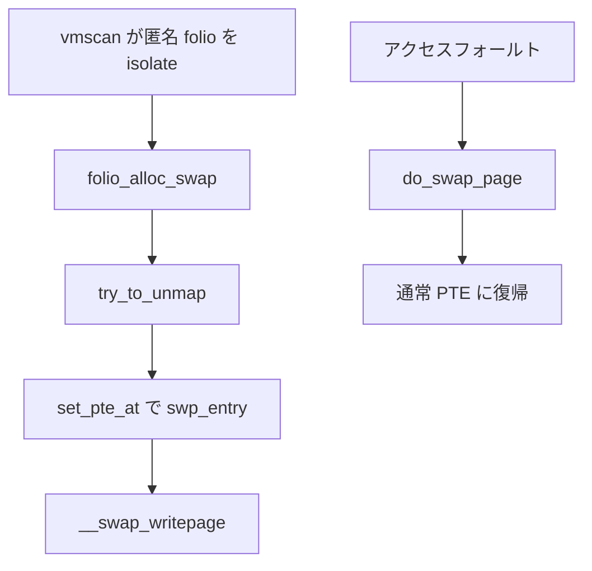

# 第32章 swap-out と swap-in データパス

> **本章で読むソース**
>
> - [`mm/vmscan.c` L1312-L1349](https://github.com/gregkh/linux/blob/v6.18.38/mm/vmscan.c#L1312-L1349)
> - [`mm/swapfile.c` L1428-L1475](https://github.com/gregkh/linux/blob/v6.18.38/mm/swapfile.c#L1428-L1475)
> - [`mm/vmscan.c` L1379-L1400](https://github.com/gregkh/linux/blob/v6.18.38/mm/vmscan.c#L1379-L1400)
> - [`mm/rmap.c` L2199-L2215](https://github.com/gregkh/linux/blob/v6.18.38/mm/rmap.c#L2199-L2215)
> - [`mm/page_io.c` L447-L467](https://github.com/gregkh/linux/blob/v6.18.38/mm/page_io.c#L447-L467)
> - [`mm/memory.c` L4596-L4618](https://github.com/gregkh/linux/blob/v6.18.38/mm/memory.c#L4596-L4618)

## この章の狙い

本章はスワップアウトとスワップインのデータパスに限定する。
swap 領域の管理は [swap area、cluster、zswap](33-swap-area-zswap.md) が扱う。

## 前提

- [reclaim orchestration と direct/kswapd](../part04-reclaim/25-reclaim-orchestration.md)
- [page-table walk と missing fault](../part03-virtual/16-page-table-walk-missing-fault.md)

## shrink_folio_list：スワップアウトの入口

匿名 swapbacked folio はスワップキャッシュに無ければ `folio_alloc_swap` でスロットを取る。

[`mm/vmscan.c` L1312-L1349](https://github.com/gregkh/linux/blob/v6.18.38/mm/vmscan.c#L1312-L1349)

```c
		if (folio_test_anon(folio) && folio_test_swapbacked(folio)) {
			if (!folio_test_swapcache(folio)) {
				if (!(sc->gfp_mask & __GFP_IO))
					goto keep_locked;
				if (folio_maybe_dma_pinned(folio))
					goto keep_locked;
				if (folio_test_large(folio)) {
					/* cannot split folio, skip it */
					if (!can_split_folio(folio, 1, NULL))
						goto activate_locked;
					/*
					 * Split partially mapped folios right away.
					 * We can free the unmapped pages without IO.
					 */
					if (data_race(!list_empty(&folio->_deferred_list) &&
					    folio_test_partially_mapped(folio)) &&
					    split_folio_to_list(folio, folio_list))
						goto activate_locked;
				}
				if (folio_alloc_swap(folio, __GFP_HIGH | __GFP_NOWARN)) {
					int __maybe_unused order = folio_order(folio);

					if (!folio_test_large(folio))
						goto activate_locked_split;
					/* Fallback to swap normal pages */
					if (split_folio_to_list(folio, folio_list))
						goto activate_locked;
#ifdef CONFIG_TRANSPARENT_HUGEPAGE
					if (nr_pages >= HPAGE_PMD_NR) {
						count_memcg_folio_events(folio,
							THP_SWPOUT_FALLBACK, 1);
						count_vm_event(THP_SWPOUT_FALLBACK);
					}
#endif
					count_mthp_stat(order, MTHP_STAT_SWPOUT_FALLBACK);
					if (folio_alloc_swap(folio, __GFP_HIGH | __GFP_NOWARN))
						goto activate_locked_split;
				}
```

## folio_alloc_swap：スロット確保

スロット確保と memcg swap 課金のあと、スワップキャッシュへ登録する。

[`mm/swapfile.c` L1428-L1475](https://github.com/gregkh/linux/blob/v6.18.38/mm/swapfile.c#L1428-L1475)

```c
int folio_alloc_swap(struct folio *folio, gfp_t gfp)
{
	unsigned int order = folio_order(folio);
	unsigned int size = 1 << order;
	swp_entry_t entry = {};

	VM_BUG_ON_FOLIO(!folio_test_locked(folio), folio);
	VM_BUG_ON_FOLIO(!folio_test_uptodate(folio), folio);

	if (order) {
		/*
		 * Reject large allocation when THP_SWAP is disabled,
		 * the caller should split the folio and try again.
		 */
		if (!IS_ENABLED(CONFIG_THP_SWAP))
			return -EAGAIN;

		/*
		 * Allocation size should never exceed cluster size
		 * (HPAGE_PMD_SIZE).
		 */
		if (size > SWAPFILE_CLUSTER) {
			VM_WARN_ON_ONCE(1);
			return -EINVAL;
		}
	}

again:
	local_lock(&percpu_swap_cluster.lock);
	if (!swap_alloc_fast(&entry, order))
		swap_alloc_slow(&entry, order);
	local_unlock(&percpu_swap_cluster.lock);

	if (unlikely(!order && !entry.val)) {
		if (swap_sync_discard())
			goto again;
	}

	/* Need to call this even if allocation failed, for MEMCG_SWAP_FAIL. */
	if (mem_cgroup_try_charge_swap(folio, entry))
		goto out_free;

	if (!entry.val)
		return -ENOMEM;

	swap_cache_add_folio(folio, entry, NULL);

	return 0;
```

## try_to_unmap：マッピング解除

スワップアウト前に `try_to_unmap` が全 PTE を辿り、参照を外す。

[`mm/vmscan.c` L1379-L1400](https://github.com/gregkh/linux/blob/v6.18.38/mm/vmscan.c#L1379-L1400)

```c
		if (folio_mapped(folio)) {
			enum ttu_flags flags = TTU_BATCH_FLUSH;
			bool was_swapbacked = folio_test_swapbacked(folio);

			if (folio_test_pmd_mappable(folio))
				flags |= TTU_SPLIT_HUGE_PMD;
			/*
			 * Without TTU_SYNC, try_to_unmap will only begin to
			 * hold PTL from the first present PTE within a large
			 * folio. Some initial PTEs might be skipped due to
			 * races with parallel PTE writes in which PTEs can be
			 * cleared temporarily before being written new present
			 * values. This will lead to a large folio is still
			 * mapped while some subpages have been partially
			 * unmapped after try_to_unmap; TTU_SYNC helps
			 * try_to_unmap acquire PTL from the first PTE,
			 * eliminating the influence of temporary PTE values.
			 */
			if (folio_test_large(folio))
				flags |= TTU_SYNC;

			try_to_unmap(folio, flags);
```

## try_to_unmap_one：PTE を swap entry に更新

匿名 folio の PTE は `swp_entry_to_pte` でスワップエントリに差し替える。

[`mm/rmap.c` L2199-L2215](https://github.com/gregkh/linux/blob/v6.18.38/mm/rmap.c#L2199-L2215)

```c
			dec_mm_counter(mm, MM_ANONPAGES);
			inc_mm_counter(mm, MM_SWAPENTS);
			swp_pte = swp_entry_to_pte(entry);
			if (anon_exclusive)
				swp_pte = pte_swp_mkexclusive(swp_pte);
			if (likely(pte_present(pteval))) {
				if (pte_soft_dirty(pteval))
					swp_pte = pte_swp_mksoft_dirty(swp_pte);
				if (pte_uffd_wp(pteval))
					swp_pte = pte_swp_mkuffd_wp(swp_pte);
			} else {
				if (pte_swp_soft_dirty(pteval))
					swp_pte = pte_swp_mksoft_dirty(swp_pte);
				if (pte_swp_uffd_wp(pteval))
					swp_pte = pte_swp_mkuffd_wp(swp_pte);
			}
			set_pte_at(mm, address, pvmw.pte, swp_pte);
```

## __swap_writepage：ディスクへ書き出し

スワップキャッシュ上の folio を swap デバイスへ書き出す。

[`mm/page_io.c` L447-L467](https://github.com/gregkh/linux/blob/v6.18.38/mm/page_io.c#L447-L467)

```c
void __swap_writepage(struct folio *folio, struct swap_iocb **swap_plug)
{
	struct swap_info_struct *sis = __swap_entry_to_info(folio->swap);

	VM_BUG_ON_FOLIO(!folio_test_swapcache(folio), folio);
	/*
	 * ->flags can be updated non-atomicially (scan_swap_map_slots),
	 * but that will never affect SWP_FS_OPS, so the data_race
	 * is safe.
	 */
	if (data_race(sis->flags & SWP_FS_OPS))
		swap_writepage_fs(folio, swap_plug);
	/*
	 * ->flags can be updated non-atomicially (scan_swap_map_slots),
	 * but that will never affect SWP_SYNCHRONOUS_IO, so the data_race
	 * is safe.
	 */
	else if (data_race(sis->flags & SWP_SYNCHRONOUS_IO))
		swap_writepage_bdev_sync(folio, sis);
	else
		swap_writepage_bdev_async(folio, sis);
```

## do_swap_page：スワップイン

フォールト時に PTE のスワップエントリから folio を復帰する。

[`mm/memory.c` L4596-L4618](https://github.com/gregkh/linux/blob/v6.18.38/mm/memory.c#L4596-L4618)

```c
vm_fault_t do_swap_page(struct vm_fault *vmf)
{
	struct vm_area_struct *vma = vmf->vma;
	struct folio *swapcache, *folio = NULL;
	DECLARE_WAITQUEUE(wait, current);
	struct page *page;
	struct swap_info_struct *si = NULL;
	rmap_t rmap_flags = RMAP_NONE;
	bool need_clear_cache = false;
	bool exclusive = false;
	swp_entry_t entry;
	pte_t pte;
	vm_fault_t ret = 0;
	void *shadow = NULL;
	int nr_pages;
	unsigned long page_idx;
	unsigned long address;
	pte_t *ptep;

	if (!pte_unmap_same(vmf))
		goto out;

	entry = pte_to_swp_entry(vmf->orig_pte);
```

## 処理の流れ



## 高速化と最適化の工夫

**swap cluster** と per-CPU ロックでスロット確保の競合を減らす。
`try_to_unmap` の `TTU_SYNC` は large folio の部分unmap競合を抑える。
スワップキャッシュは複数マッピングで同一エントリを共有し、読み込みを1回に抑える。

> **7.x 系での変化**
> v6.18.38 の [`folio_alloc_swap`](https://github.com/gregkh/linux/blob/v6.18.38/mm/swapfile.c#L1428-L1475) は `(folio, gfp)` を受け取り、`swap_alloc_fast/slow` が `swp_entry_t` を返してから [`swap_cache_add_folio`](https://github.com/gregkh/linux/blob/v6.18.38/mm/swapfile.c#L1473-L1473) で登録する。
> v7.1.3 では [`folio_alloc_swap(folio)`](https://github.com/gregkh/linux/blob/v7.1.3/mm/swapfile.c#L1695-L1739) に `gfp` 引数が無く、[`swap_alloc_fast/slow`](https://github.com/gregkh/linux/blob/v7.1.3/mm/swapfile.c#L1723-L1724) が folio へ swap entry を直接結び、失敗時は [`swap_cache_del_folio`](https://github.com/gregkh/linux/blob/v7.1.3/mm/swapfile.c#L1734-L1734) で巻き戻す。
> スロット確保からスワップキャッシュ登録までの責務分割が変わるため、本章の shrink 経路の読み方に影響する。

## まとめ

swap は vmscan が `folio_alloc_swap` でスロットを取り、`try_to_unmap` で PTE をスワップエントリ化し、`__swap_writepage` でディスクへ書き出す。
`do_swap_page` がフォールト経由のスワップインを処理する。

## 関連する章

- [memcg とメモリ cgroup](31-memcg.md)
- [ページテーブル走査と missing fault](../part03-virtual/16-page-table-walk-missing-fault.md)
