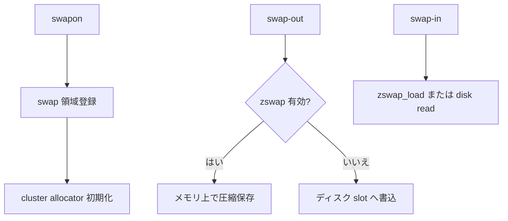

# 第33章 swap area、cluster、zswap

> **本章で読むソース**
>
> - [`mm/swapfile.c` L3454-L3488](https://github.com/gregkh/linux/blob/v6.18.38/mm/swapfile.c#L3454-L3488)
> - [`mm/swapfile.c` L489-L509](https://github.com/gregkh/linux/blob/v6.18.38/mm/swapfile.c#L489-L509)
> - [`mm/zswap.c` L1415-L1430](https://github.com/gregkh/linux/blob/v6.18.38/mm/zswap.c#L1415-L1430)
> - [`mm/zswap.c` L1601-L1626](https://github.com/gregkh/linux/blob/v6.18.38/mm/zswap.c#L1601-L1626)
> - [`mm/zswap.c` L1675-L1688](https://github.com/gregkh/linux/blob/v6.18.38/mm/zswap.c#L1675-L1688)
> - [`mm/zswap.c` L46-L48](https://github.com/gregkh/linux/blob/v6.18.38/mm/zswap.c#L46-L48)

## この章の狙い

**swapon** が swap デバイスを登録し cluster allocator でスロットを管理する流れと、**zswap** がスワップアウト前にメモリ上で圧縮する frontswap 層を読む。
データパス本体は [swap-out と swap-in データパス](32-swap-data-path.md) が扱う。

## 前提

- [swap-out と swap-in データパス](32-swap-data-path.md)
- [folio reclaim decision と dirty/writeback folio](../part04-reclaim/24-folio-reclaim-decision.md)

## swapon の入口

`alloc_swap_info` で swap インスタンスを確保し、ファイルを開いてヘッダを読む。

[`mm/swapfile.c` L3454-L3488](https://github.com/gregkh/linux/blob/v6.18.38/mm/swapfile.c#L3454-L3488)

```c
SYSCALL_DEFINE2(swapon, const char __user *, specialfile, int, swap_flags)
{
	struct swap_info_struct *si;
	struct filename *name;
	struct file *swap_file = NULL;
	struct address_space *mapping;
	struct dentry *dentry;
	int prio;
	int error;
	union swap_header *swap_header;
	int nr_extents;
	sector_t span;
	unsigned long maxpages;
	unsigned char *swap_map = NULL;
	unsigned long *zeromap = NULL;
	struct swap_cluster_info *cluster_info = NULL;
	struct folio *folio = NULL;
	struct inode *inode = NULL;
	bool inced_nr_rotate_swap = false;

	if (swap_flags & ~SWAP_FLAGS_VALID)
		return -EINVAL;

	if (!capable(CAP_SYS_ADMIN))
		return -EPERM;

	if (!swap_avail_heads)
		return -ENOMEM;

	si = alloc_swap_info();
	if (IS_ERR(si))
		return PTR_ERR(si);

	INIT_WORK(&si->discard_work, swap_discard_work);
	INIT_WORK(&si->reclaim_work, swap_reclaim_work);
```

## cluster テーブル割り当て

スロットは cluster 単位で管理され、空き cluster にテーブルを載せる。

[`mm/swapfile.c` L489-L509](https://github.com/gregkh/linux/blob/v6.18.38/mm/swapfile.c#L489-L509)

```c
static struct swap_cluster_info *
swap_cluster_alloc_table(struct swap_info_struct *si,
			 struct swap_cluster_info *ci)
{
	struct swap_table *table;

	/*
	 * Only cluster isolation from the allocator does table allocation.
	 * Swap allocator uses percpu clusters and holds the local lock.
	 */
	lockdep_assert_held(&ci->lock);
	lockdep_assert_held(&this_cpu_ptr(&percpu_swap_cluster)->lock);

	/* The cluster must be free and was just isolated from the free list. */
	VM_WARN_ON_ONCE(ci->flags || !cluster_is_empty(ci));

	table = swap_table_alloc(__GFP_HIGH | __GFP_NOMEMALLOC | __GFP_NOWARN);
	if (table) {
		rcu_assign_pointer(ci->table, table);
		return ci;
	}
```

## zswap_load

圧縮済みエントリを展開して folio に載せる。

[`mm/zswap.c` L1601-L1626](https://github.com/gregkh/linux/blob/v6.18.38/mm/zswap.c#L1601-L1626)

```c
int zswap_load(struct folio *folio)
{
	swp_entry_t swp = folio->swap;
	pgoff_t offset = swp_offset(swp);
	bool swapcache = folio_test_swapcache(folio);
	struct xarray *tree = swap_zswap_tree(swp);
	struct zswap_entry *entry;

	VM_WARN_ON_ONCE(!folio_test_locked(folio));

	if (zswap_never_enabled())
		return -ENOENT;

	/*
	 * Large folios should not be swapped in while zswap is being used, as
	 * they are not properly handled. Zswap does not properly load large
	 * folios, and a large folio may only be partially in zswap.
	 */
	if (WARN_ON_ONCE(folio_test_large(folio))) {
		folio_unlock(folio);
		return -EINVAL;
	}

	entry = xa_load(tree, offset);
	if (!entry)
		return -ENOENT;
```

## zswap_swapon

swap タイプごとに zswap ツリーを初期化する。

[`mm/zswap.c` L1675-L1688](https://github.com/gregkh/linux/blob/v6.18.38/mm/zswap.c#L1675-L1688)

```c
int zswap_swapon(int type, unsigned long nr_pages)
{
	struct xarray *trees, *tree;
	unsigned int nr, i;

	nr = DIV_ROUND_UP(nr_pages, ZSWAP_ADDRESS_SPACE_PAGES);
	trees = kvcalloc(nr, sizeof(*tree), GFP_KERNEL);
	if (!trees) {
		pr_err("alloc failed, zswap disabled for swap type %d\n", type);
		return -ENOMEM;
	}

	for (i = 0; i < nr; i++)
		xa_init(trees + i);
```

## zswap_store_page

スワップアウト直前に folio を圧縮し、zswap ツリーへ格納する。

[`mm/zswap.c` L1415-L1430](https://github.com/gregkh/linux/blob/v6.18.38/mm/zswap.c#L1415-L1430)

```c
static bool zswap_store_page(struct page *page,
			     struct obj_cgroup *objcg,
			     struct zswap_pool *pool)
{
	swp_entry_t page_swpentry = page_swap_entry(page);
	struct zswap_entry *entry, *old;

	/* allocate entry */
	entry = zswap_entry_cache_alloc(GFP_KERNEL, page_to_nid(page));
	if (!entry) {
		zswap_reject_kmemcache_fail++;
		return false;
	}

	if (!zswap_compress(page, entry, pool))
		goto compress_failed;
```

## 統計カウンタ

[`mm/zswap.c` L46-L48](https://github.com/gregkh/linux/blob/v6.18.38/mm/zswap.c#L46-L48)

```c
atomic_long_t zswap_stored_pages = ATOMIC_LONG_INIT(0);

static atomic_long_t zswap_stored_incompressible_pages = ATOMIC_LONG_INIT(0);
```

## 処理の流れ



## 高速化と最適化の工夫

zswap はディスク I/O を避け、圧縮で RAM 内にスワップデータを保持する。
cluster allocator は swap スロットの局所性を保ち、ディスクシークを減らす。
データパスと領域管理を分離することで、スワップポリシー変更の影響範囲を限定できる。

## まとめ

swap area 管理は swapon と cluster が担い、zswap は frontswap として圧縮層を提供する。
スワップアウトとインの PTE 更新は前章のデータパスが説明する。

## 関連する章

- [swap-out と swap-in データパス](32-swap-data-path.md)
- [reclaim orchestration と direct/kswapd](../part04-reclaim/25-reclaim-orchestration.md)
