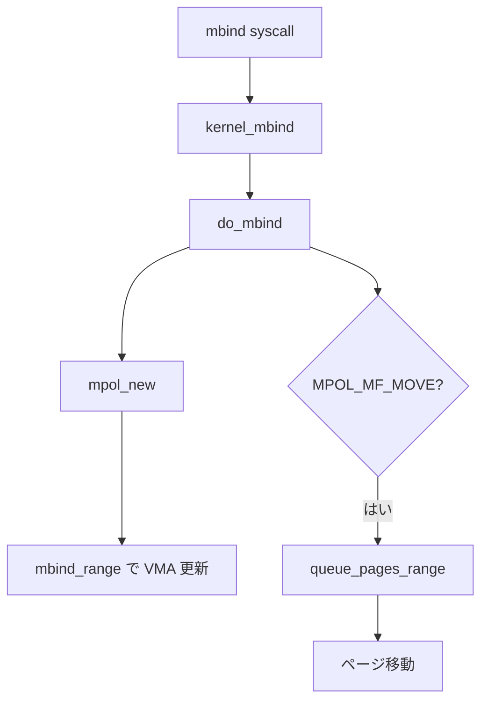
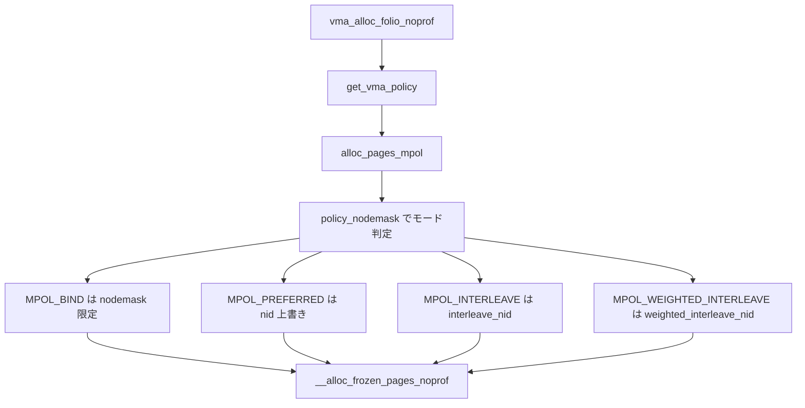
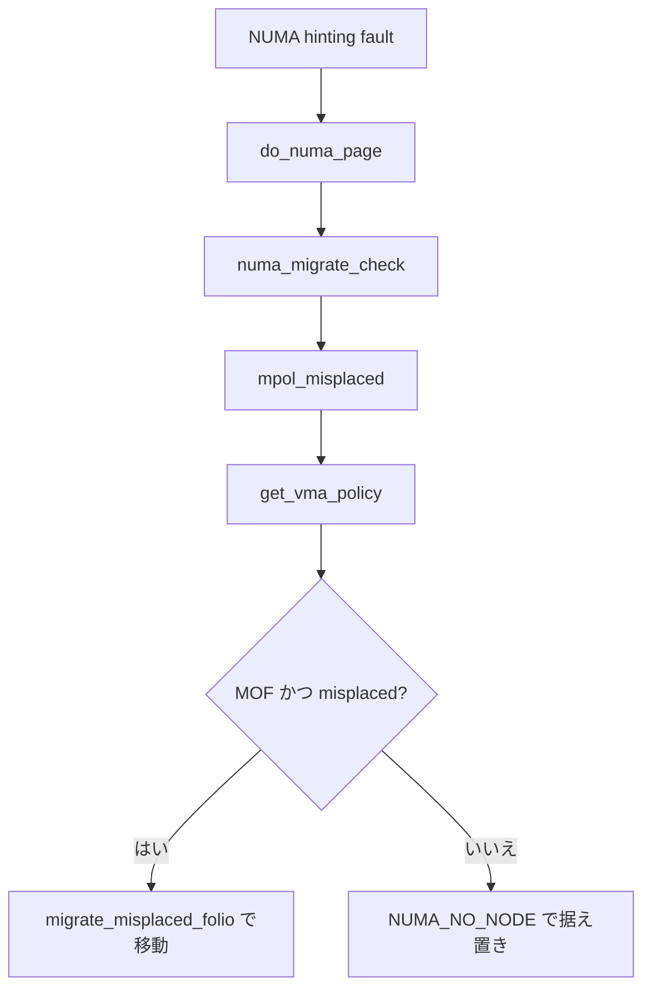

# 第34章 mempolicy と mbind

> **本章で読むソース**
>
> - [`mm/mempolicy.c` L1758-L1763](https://github.com/gregkh/linux/blob/v6.18.38/mm/mempolicy.c#L1758-L1763)
> - [`mm/mempolicy.c` L1670-L1689](https://github.com/gregkh/linux/blob/v6.18.38/mm/mempolicy.c#L1670-L1689)
> - [`mm/mempolicy.c` L1417-L1452](https://github.com/gregkh/linux/blob/v6.18.38/mm/mempolicy.c#L1417-L1452)
> - [`mm/mempolicy.c` L439-L480](https://github.com/gregkh/linux/blob/v6.18.38/mm/mempolicy.c#L439-L480)
> - [`mm/mempolicy.c` L1481-L1494](https://github.com/gregkh/linux/blob/v6.18.38/mm/mempolicy.c#L1481-L1494)
> - [`mm/mempolicy.c` L1973-L1986](https://github.com/gregkh/linux/blob/v6.18.38/mm/mempolicy.c#L1973-L1986)
> - [`mm/mempolicy.c` L2135-L2173](https://github.com/gregkh/linux/blob/v6.18.38/mm/mempolicy.c#L2135-L2173)
> - [`mm/mempolicy.c` L2180-L2243](https://github.com/gregkh/linux/blob/v6.18.38/mm/mempolicy.c#L2180-L2243)
> - [`mm/mempolicy.c` L2377-L2422](https://github.com/gregkh/linux/blob/v6.18.38/mm/mempolicy.c#L2377-L2422)
> - [`mm/memory.c` L5879-L5924](https://github.com/gregkh/linux/blob/v6.18.38/mm/memory.c#L5879-L5924)

## この章の狙い

**NUMA mempolicy** がプロセス既定と VMA 単位のノード選択をどう束ねるかを読む。
設定側は `mbind` システムコールから `do_mbind`、`mpol_new`、`mbind_range` まで追う。
割当側は `get_vma_policy` でポリシーを引き、`alloc_pages_mpol` が各モードの規則で割当先ノードを決めるまでを追う。
フォールト側は `do_numa_page` が `mpol_misplaced` を呼んで誤配置を判定する経路を追う。

## 前提

- [ゾーン、ノード、PFN](../part00-foundation/03-zones-nodes-pfn.md)
- [NUMA バランシングの fault 側](35-numa-fault-balancing.md)

## mbind システムコール

ユーザー空間は `mbind` でアドレス範囲へポリシーを適用する。

[`mm/mempolicy.c` L1758-L1763](https://github.com/gregkh/linux/blob/v6.18.38/mm/mempolicy.c#L1758-L1763)

```c
SYSCALL_DEFINE6(mbind, unsigned long, start, unsigned long, len,
		unsigned long, mode, const unsigned long __user *, nmask,
		unsigned long, maxnode, unsigned int, flags)
{
	return kernel_mbind(start, len, mode, nmask, maxnode, flags);
}
```

## kernel_mbind

フラグ検証と nodemask 取得のあと `do_mbind` へ委譲する。

[`mm/mempolicy.c` L1670-L1689](https://github.com/gregkh/linux/blob/v6.18.38/mm/mempolicy.c#L1670-L1689)

```c
static long kernel_mbind(unsigned long start, unsigned long len,
			 unsigned long mode, const unsigned long __user *nmask,
			 unsigned long maxnode, unsigned int flags)
{
	unsigned short mode_flags;
	nodemask_t nodes;
	int lmode = mode;
	int err;

	start = untagged_addr(start);
	err = sanitize_mpol_flags(&lmode, &mode_flags);
	if (err)
		return err;

	err = get_nodes(&nodes, nmask, maxnode);
	if (err)
		return err;

	return do_mbind(start, len, lmode, mode_flags, &nodes, flags);
}
```

## do_mbind

範囲検証のあと `mpol_new` でポリシー構造体を作り、VMA へ適用する。
`MPOL_MF_MOVE` 指定時は既存ページを移動対象としてキューに載せる。

[`mm/mempolicy.c` L1417-L1452](https://github.com/gregkh/linux/blob/v6.18.38/mm/mempolicy.c#L1417-L1452)

```c
static long do_mbind(unsigned long start, unsigned long len,
		     unsigned short mode, unsigned short mode_flags,
		     nodemask_t *nmask, unsigned long flags)
{
	struct mm_struct *mm = current->mm;
	struct vm_area_struct *vma, *prev;
	struct vma_iterator vmi;
	struct migration_mpol mmpol;
	struct mempolicy *new;
	unsigned long end;
	long err;
	long nr_failed;
	LIST_HEAD(pagelist);

	if (flags & ~(unsigned long)MPOL_MF_VALID)
		return -EINVAL;
	if ((flags & MPOL_MF_MOVE_ALL) && !capable(CAP_SYS_NICE))
		return -EPERM;

	if (start & ~PAGE_MASK)
		return -EINVAL;

	if (mode == MPOL_DEFAULT)
		flags &= ~MPOL_MF_STRICT;

	len = PAGE_ALIGN(len);
	end = start + len;

	if (end < start)
		return -EINVAL;
	if (end == start)
		return 0;

	new = mpol_new(mode, mode_flags, nmask);
	if (IS_ERR(new))
		return PTR_ERR(new);
```

## mpol_new

モードごとに nodemask の妥当性を検証し、`kmem_cache` から `mempolicy` を確保する。

[`mm/mempolicy.c` L439-L480](https://github.com/gregkh/linux/blob/v6.18.38/mm/mempolicy.c#L439-L480)

```c
static struct mempolicy *mpol_new(unsigned short mode, unsigned short flags,
				  nodemask_t *nodes)
{
	struct mempolicy *policy;

	if (mode == MPOL_DEFAULT) {
		if (nodes && !nodes_empty(*nodes))
			return ERR_PTR(-EINVAL);
		return NULL;
	}
	VM_BUG_ON(!nodes);

	/*
	 * MPOL_PREFERRED cannot be used with MPOL_F_STATIC_NODES or
	 * MPOL_F_RELATIVE_NODES if the nodemask is empty (local allocation).
	 * All other modes require a valid pointer to a non-empty nodemask.
	 */
	if (mode == MPOL_PREFERRED) {
		if (nodes_empty(*nodes)) {
			if (((flags & MPOL_F_STATIC_NODES) ||
			     (flags & MPOL_F_RELATIVE_NODES)))
				return ERR_PTR(-EINVAL);

			mode = MPOL_LOCAL;
		}
	} else if (mode == MPOL_LOCAL) {
		if (!nodes_empty(*nodes) ||
		    (flags & MPOL_F_STATIC_NODES) ||
		    (flags & MPOL_F_RELATIVE_NODES))
			return ERR_PTR(-EINVAL);
	} else if (nodes_empty(*nodes))
		return ERR_PTR(-EINVAL);

	policy = kmem_cache_alloc(policy_cache, GFP_KERNEL);
	if (!policy)
		return ERR_PTR(-ENOMEM);
	atomic_set(&policy->refcnt, 1);
	policy->mode = mode;
	policy->flags = flags;
	policy->home_node = NUMA_NO_NODE;

	return policy;
}
```

## VMA への適用とページ移動

`queue_pages_range` で移動候補を集め、`mbind_range` で各 VMA のポリシーを更新する。

[`mm/mempolicy.c` L1481-L1494](https://github.com/gregkh/linux/blob/v6.18.38/mm/mempolicy.c#L1481-L1494)

```c
	nr_failed = queue_pages_range(mm, start, end, nmask,
			flags | MPOL_MF_INVERT | MPOL_MF_WRLOCK, &pagelist);

	if (nr_failed < 0) {
		err = nr_failed;
		nr_failed = 0;
	} else {
		vma_iter_init(&vmi, mm, start);
		prev = vma_prev(&vmi);
		for_each_vma_range(vmi, vma, end) {
			err = mbind_range(&vmi, vma, &prev, start, end, new);
			if (err)
				break;
		}
	}
```

## get_vma_policy

割り当てとフォールトは VMA 共有ポリシーを優先し、無ければタスク既定へ落ちる。
interleave 系は `ilx` を VMA オフセットで進める。

[`mm/mempolicy.c` L1973-L1986](https://github.com/gregkh/linux/blob/v6.18.38/mm/mempolicy.c#L1973-L1986)

```c
struct mempolicy *get_vma_policy(struct vm_area_struct *vma,
				 unsigned long addr, int order, pgoff_t *ilx)
{
	struct mempolicy *pol;

	pol = __get_vma_policy(vma, addr, ilx);
	if (!pol)
		pol = get_task_policy(current);
	if (pol->mode == MPOL_INTERLEAVE ||
	    pol->mode == MPOL_WEIGHTED_INTERLEAVE) {
		*ilx += vma->vm_pgoff >> order;
		*ilx += (addr - vma->vm_start) >> (PAGE_SHIFT + order);
	}
	return pol;
}
```

## モード別の割当先ノード決定

割当時のノード選択は `policy_nodemask` に集約される。
6.18 では割当先ノードを決める独立関数を分けず、`policy_nodemask` が絞り込み用の nodemask を返すと同時に、引数 `*nid`（呼び出し側が渡した既定ノード）をモードに応じて上書きする。
つまり `policy_nodemask` の返り値と `*nid` の組で「どの候補集合の中で、どのノードを優先するか」が決まる。

各モードの決め方は次のとおりである。

- `MPOL_PREFERRED`：`*nid` を `pol->nodes` 先頭ノードで上書きして優先する。
  nodemask は返さないので、不足時は zonelist をたどって他ノードへフォールバックする。
- `MPOL_PREFERRED_MANY`：`pol->nodes` を nodemask として返し、`home_node` があればそれを `*nid` にする。
  優先集合から取れなければ他ノードへ落ちる。
- `MPOL_BIND`：対象ゾーンなら `pol->nodes` を nodemask として返し、割当先をその集合に限定する。
  `home_node` 指定時は `*nid` をそれにする。
- `MPOL_INTERLEAVE`：`interleave_nid` が `ilx % ノード数` で nodemask 内の順番ノードを選び、`*nid` を上書きする。
- `MPOL_WEIGHTED_INTERLEAVE`：`weighted_interleave_nid` が各ノードの重みに比例した配分でノードを選ぶ。

`interleave_nid` は `ilx` をノード数で割った剰余を先頭ノードから数えて順番ノードを返す。
均等ラウンドロビンなので、ノード間の帯域差は考慮しない。

`weighted_interleave_nid` は RCU で読む重みテーブル（`wi_state->iw_table`）を用い、`ilx` を重みの総和で割った剰余を各ノードの重みで消し込みながらノードを選ぶ。
重みの大きいノードほど連続して選ばれる区間が長くなり、帯域の大きいノードへ多くのページを寄せられる。
テーブル未初期化時は全ノードの重みを 1 とみなし、均等 interleave に等しくなる。

[`mm/mempolicy.c` L2135-L2173](https://github.com/gregkh/linux/blob/v6.18.38/mm/mempolicy.c#L2135-L2173)

```c
static unsigned int weighted_interleave_nid(struct mempolicy *pol, pgoff_t ilx)
{
	struct weighted_interleave_state *state;
	nodemask_t nodemask;
	unsigned int target, nr_nodes;
	u8 *table = NULL;
	unsigned int weight_total = 0;
	u8 weight;
	int nid = 0;

	nr_nodes = read_once_policy_nodemask(pol, &nodemask);
	if (!nr_nodes)
		return numa_node_id();

	rcu_read_lock();

	state = rcu_dereference(wi_state);
	/* Uninitialized wi_state means we should assume all weights are 1 */
	if (state)
		table = state->iw_table;

	/* calculate the total weight */
	for_each_node_mask(nid, nodemask)
		weight_total += table ? table[nid] : 1;

	/* Calculate the node offset based on totals */
	target = ilx % weight_total;
	nid = first_node(nodemask);
	while (target) {
		/* detect system default usage */
		weight = table ? table[nid] : 1;
		if (target < weight)
			break;
		target -= weight;
		nid = next_node_in(nid, nodemask);
	}
	rcu_read_unlock();
	return nid;
}
```

`interleave_nid` と `policy_nodemask` は次のとおりである。

[`mm/mempolicy.c` L2180-L2243](https://github.com/gregkh/linux/blob/v6.18.38/mm/mempolicy.c#L2180-L2243)

```c
static unsigned int interleave_nid(struct mempolicy *pol, pgoff_t ilx)
{
	nodemask_t nodemask;
	unsigned int target, nnodes;
	int i;
	int nid;

	nnodes = read_once_policy_nodemask(pol, &nodemask);
	if (!nnodes)
		return numa_node_id();
	target = ilx % nnodes;
	nid = first_node(nodemask);
	for (i = 0; i < target; i++)
		nid = next_node(nid, nodemask);
	return nid;
}

/*
 * Return a nodemask representing a mempolicy for filtering nodes for
 * page allocation, together with preferred node id (or the input node id).
 */
static nodemask_t *policy_nodemask(gfp_t gfp, struct mempolicy *pol,
				   pgoff_t ilx, int *nid)
{
	nodemask_t *nodemask = NULL;

	switch (pol->mode) {
	case MPOL_PREFERRED:
		/* Override input node id */
		*nid = first_node(pol->nodes);
		break;
	case MPOL_PREFERRED_MANY:
		nodemask = &pol->nodes;
		if (pol->home_node != NUMA_NO_NODE)
			*nid = pol->home_node;
		break;
	case MPOL_BIND:
		/* Restrict to nodemask (but not on lower zones) */
		if (apply_policy_zone(pol, gfp_zone(gfp)) &&
		    cpuset_nodemask_valid_mems_allowed(&pol->nodes))
			nodemask = &pol->nodes;
		if (pol->home_node != NUMA_NO_NODE)
			*nid = pol->home_node;
		/*
		 * __GFP_THISNODE shouldn't even be used with the bind policy
		 * because we might easily break the expectation to stay on the
		 * requested node and not break the policy.
		 */
		WARN_ON_ONCE(gfp & __GFP_THISNODE);
		break;
	case MPOL_INTERLEAVE:
		/* Override input node id */
		*nid = (ilx == NO_INTERLEAVE_INDEX) ?
			interleave_nodes(pol) : interleave_nid(pol, ilx);
		break;
	case MPOL_WEIGHTED_INTERLEAVE:
		*nid = (ilx == NO_INTERLEAVE_INDEX) ?
			weighted_interleave_nodes(pol) :
			weighted_interleave_nid(pol, ilx);
		break;
	}

	return nodemask;
}
```

## alloc_pages_mpol

VMA 割当は `vma_alloc_folio_noprof` が `get_vma_policy` でポリシーと `ilx` を得て、`alloc_pages_mpol` へ渡す。
`alloc_pages_mpol` は先頭で `policy_nodemask` を呼び、割当先ノード `nid` と絞り込み用 `nodemask` を確定させてから `__alloc_frozen_pages_noprof` へ渡す。
`MPOL_PREFERRED_MANY` は優先集合を試して失敗時に全ノードへ落とす `alloc_pages_preferred_many` へ分岐する。
THP ではローカル優先の fast path がある。

[`mm/mempolicy.c` L2377-L2422](https://github.com/gregkh/linux/blob/v6.18.38/mm/mempolicy.c#L2377-L2422)

```c
static struct page *alloc_pages_mpol(gfp_t gfp, unsigned int order,
		struct mempolicy *pol, pgoff_t ilx, int nid)
{
	nodemask_t *nodemask;
	struct page *page;

	nodemask = policy_nodemask(gfp, pol, ilx, &nid);

	if (pol->mode == MPOL_PREFERRED_MANY)
		return alloc_pages_preferred_many(gfp, order, nid, nodemask);

	if (IS_ENABLED(CONFIG_TRANSPARENT_HUGEPAGE) &&
	    /* filter "hugepage" allocation, unless from alloc_pages() */
	    order == HPAGE_PMD_ORDER && ilx != NO_INTERLEAVE_INDEX) {
		/*
		 * For hugepage allocation and non-interleave policy which
		 * allows the current node (or other explicitly preferred
		 * node) we only try to allocate from the current/preferred
		 * node and don't fall back to other nodes, as the cost of
		 * remote accesses would likely offset THP benefits.
		 *
		 * If the policy is interleave or does not allow the current
		 * node in its nodemask, we allocate the standard way.
		 */
		if (pol->mode != MPOL_INTERLEAVE &&
		    pol->mode != MPOL_WEIGHTED_INTERLEAVE &&
		    (!nodemask || node_isset(nid, *nodemask))) {
			/*
			 * First, try to allocate THP only on local node, but
			 * don't reclaim unnecessarily, just compact.
			 */
			page = __alloc_frozen_pages_noprof(
				gfp | __GFP_THISNODE | __GFP_NORETRY, order,
				nid, NULL);
			if (page || !(gfp & __GFP_DIRECT_RECLAIM))
				return page;
			/*
			 * If hugepage allocations are configured to always
			 * synchronous compact or the vma has been madvised
			 * to prefer hugepage backing, retry allowing remote
			 * memory with both reclaim and compact as well.
			 */
		}
	}

	page = __alloc_frozen_pages_noprof(gfp, order, nid, nodemask);
```

## mpol_misplaced：フォールト時のノード判定

割当側とは逆に、フォールト側は既存ページの現在ノードがポリシーに合うかを判定する。
NUMA hinting fault のハンドラ `do_numa_page` が `numa_migrate_check` を呼び、その中から `mpol_misplaced` が呼ばれる。
`mpol_misplaced` は自ら `get_vma_policy` でポリシーを引く。
`MPOL_F_MOF`（migrate on fault）が有効なとき、既存 folio のノードがポリシーと合わなければ移動先ノード ID を返す。

呼び出し元の連鎖は次のとおりである。

[`mm/memory.c` L5914-L5924](https://github.com/gregkh/linux/blob/v6.18.38/mm/memory.c#L5914-L5924)

```c
	count_vm_numa_event(NUMA_HINT_FAULTS);
#ifdef CONFIG_NUMA_BALANCING
	count_memcg_folio_events(folio, NUMA_HINT_FAULTS, 1);
#endif
	if (folio_nid(folio) == numa_node_id()) {
		count_vm_numa_event(NUMA_HINT_FAULTS_LOCAL);
		*flags |= TNF_FAULT_LOCAL;
	}

	return mpol_misplaced(folio, vmf, addr);
}
```

`mpol_misplaced` はポリシーを引いたあと、モードごとに移動先候補ノード `polnid` を決める。

[`mm/mempolicy.c` L2915-L2954](https://github.com/gregkh/linux/blob/v6.18.38/mm/mempolicy.c#L2915-L2954)

```c
int mpol_misplaced(struct folio *folio, struct vm_fault *vmf,
		   unsigned long addr)
{
	struct mempolicy *pol;
	pgoff_t ilx;
	struct zoneref *z;
	int curnid = folio_nid(folio);
	struct vm_area_struct *vma = vmf->vma;
	int thiscpu = raw_smp_processor_id();
	int thisnid = numa_node_id();
	int polnid = NUMA_NO_NODE;
	int ret = NUMA_NO_NODE;

	/*
	 * Make sure ptl is held so that we don't preempt and we
	 * have a stable smp processor id
	 */
	lockdep_assert_held(vmf->ptl);
	pol = get_vma_policy(vma, addr, folio_order(folio), &ilx);
	if (!(pol->flags & MPOL_F_MOF))
		goto out;

	switch (pol->mode) {
	case MPOL_INTERLEAVE:
		polnid = interleave_nid(pol, ilx);
		break;

	case MPOL_WEIGHTED_INTERLEAVE:
		polnid = weighted_interleave_nid(pol, ilx);
		break;

	case MPOL_PREFERRED:
		if (node_isset(curnid, pol->nodes))
			goto out;
		polnid = first_node(pol->nodes);
		break;

	case MPOL_LOCAL:
		polnid = numa_node_id();
		break;
```

割当側と同じ `interleave_nid`/`weighted_interleave_nid` を使い、interleave 系は `ilx` に対応するノードを移動先とする。
`MPOL_PREFERRED` は現在ノードが nodemask 内なら移動不要として抜け、そうでなければ先頭ノードを移動先にする。

## 処理の流れ

設定経路は `mbind` からポリシーを作って VMA へ適用し、必要ならページを移動する。



割当経路はポリシーを引いてモード別に割当先ノードを決め、ページアロケータへ渡す。



フォールト経路は `do_numa_page` が `mpol_misplaced` を呼び、誤配置なら移動先ノードへ移す。



## 高速化と最適化の工夫

`MPOL_LOCAL` は空 nodemask をローカル割り当てへ正規化し、ホットパスでの分岐を減らす。
`mpol_misplaced` は PTE ロック保持中に呼ばれ、フォールト経路で余計な再ロックを避ける。
`MPOL_MF_MOVE` はポリシー変更とページ移動を1回の syscall でまとめ、ユーザー空間の往復を減らす。
`MPOL_WEIGHTED_INTERLEAVE` はノード間の帯域差を重みテーブルへ反映し、均等 interleave では帯域の小さいノードがボトルネックになる問題を配分の偏りで緩和する。
重みテーブルは RCU で参照するため、割当ホットパスをロックで止めずに更新できる。

## まとめ

mempolicy はプロセス既定と VMA 共有ポリシーで NUMA 配置を制御する。
`mbind` は範囲指定でポリシーを差し替え、必要なら既存ページを移動する。
割り当ては `get_vma_policy` と `alloc_pages_mpol`、フォールトは `do_numa_page` が `mpol_misplaced` を呼ぶ。

## 関連する章

- [NUMA バランシングの fault 側](35-numa-fault-balancing.md)
- [page migration](../part01-physical/07-page-migration.md)
