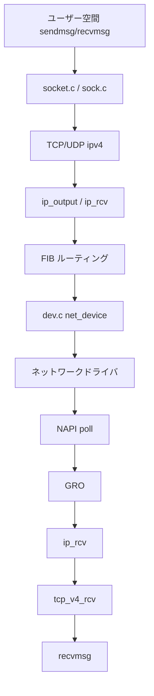
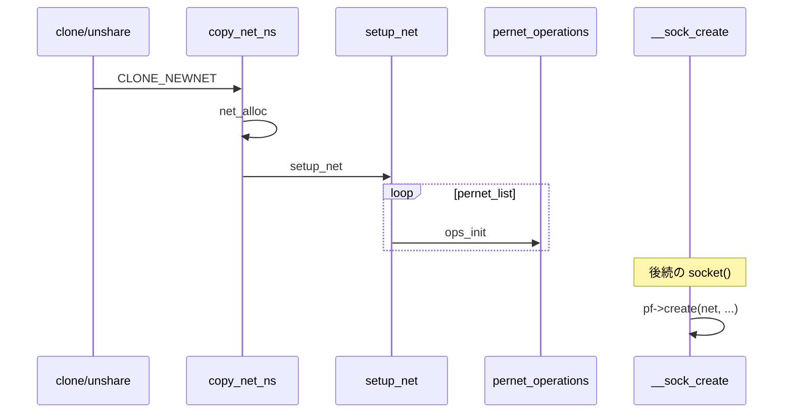

# 第1章 ネットワークスタックの全体像と net namespace

> **本章で読むソース**
>
> - [`net/core/net_namespace.c` L435-L464](https://github.com/gregkh/linux/blob/v6.18.38/net/core/net_namespace.c#L435-L464)
> - [`net/core/net_namespace.c` L550-L597](https://github.com/gregkh/linux/blob/v6.18.38/net/core/net_namespace.c#L550-L597)
> - [`net/core/net_namespace.c` L1428-L1435](https://github.com/gregkh/linux/blob/v6.18.38/net/core/net_namespace.c#L1428-L1435)
> - [`net/socket.c` L1535-L1606](https://github.com/gregkh/linux/blob/v6.18.38/net/socket.c#L1535-L1606)
> - [`net/socket.c` L3306-L3355](https://github.com/gregkh/linux/blob/v6.18.38/net/socket.c#L3306-L3355)
> - [`include/net/net_namespace.h` L61-L110](https://github.com/gregkh/linux/blob/v6.18.38/include/net/net_namespace.h#L61-L110)

## この章の狙い

Linux ネットワークスタックの地図として、ユーザー空間からカーネルへ入る入口、パケットが流れる主要経路、**net namespace** による隔離の仕組みを概観する。
後続章で `sk_buff`、ソケット、TCP、デバイス層を個別に読む前提として、全体の接続関係を押さえる。

## 前提

- システムコールとプロセスの概念を知っていること。
- [全体像と横断基盤](../../foundation/README.md) でカーネル起動と `init` namespace を読んでいると理解が早い。

## スタックの層とデータの流れ

ユーザー空間のアプリケーションは `socket`、`sendmsg`、`recvmsg` などのシステムコールでカーネルに入る。
カーネル内では次の層を経由する。

1. **ソケット層**（`net/socket.c`、`net/core/sock.c`）：ファイル記述子と `struct sock` を結びつける。
2. **プロトコル層**（`net/ipv4/` など）：TCP、UDP、ICMP を処理する。
3. **ネットワークデバイス層**（`net/core/dev.c`）：`net_device` への送受信、NAPI、GRO を担う。
4. **ドライバ**：ハードウェアキューと DMA を操作する。

送信は概ね `sendmsg` → プロトコル `sendmsg` → IP 出力 → ルーティング → neighbour 解決 → qdisc → ドライバの順に進む。
受信はドライバ → NAPI poll → `netif_receive_skb` → GRO → IP 入力 → TCP 受信 → `recvmsg` の逆順である。



netfilter フックは IP 入出力の途中に挿入される（第24章）。
XDP はドライバより手前でパケットを処理する（第27章）。

## struct net と init_net

各ネットワークリソースは **net namespace**（`struct net`）に属する。
初期 namespace はグローバルな `init_net` として定義され、ブート時に構築される。

[`include/net/net_namespace.h` L61-L110](https://github.com/gregkh/linux/blob/v6.18.38/include/net/net_namespace.h#L61-L110)

```c
struct net {
	/* First cache line can be often dirtied.
	 * Do not place here read-mostly fields.
	 */
	refcount_t		passive;	/* To decide when the network
						 * namespace should be freed.
						 */
	spinlock_t		rules_mod_lock;

	unsigned int		dev_base_seq;	/* protected by rtnl_mutex */
	u32			ifindex;

	spinlock_t		nsid_lock;
	atomic_t		fnhe_genid;

	struct list_head	list;		/* list of network namespaces */
	struct list_head	exit_list;	/* To linked to call pernet exit
						 * methods on dead net (
						 * pernet_ops_rwsem read locked),
						 * or to unregister pernet ops
						 * (pernet_ops_rwsem write locked).
						 */
	struct llist_node	defer_free_list;
	struct llist_node	cleanup_list;	/* namespaces on death row */

	struct list_head ptype_all;
	struct list_head ptype_specific;

#ifdef CONFIG_KEYS
	struct key_tag		*key_domain;	/* Key domain of operation tag */
#endif
	struct user_namespace   *user_ns;	/* Owning user namespace */
	struct ucounts		*ucounts;
	struct idr		netns_ids;

	struct ns_common	ns;
	struct ref_tracker_dir  refcnt_tracker;
	struct ref_tracker_dir  notrefcnt_tracker; /* tracker for objects not
						    * refcounted against netns
						    */
	struct list_head 	dev_base_head;
	struct proc_dir_entry 	*proc_net;
	struct proc_dir_entry 	*proc_net_stat;

#ifdef CONFIG_SYSCTL
	struct ctl_table_set	sysctls;
#endif

	struct sock 		*rtnl;			/* rtnetlink socket */
	struct sock		*genl_sock;
```

`dev_base_head` はその namespace 内の `net_device` 一覧を指す。
コンテナは `CLONE_NEWNET` で独立した `struct net` を得て、ルーティング表やデバイス一覧を他 namespace と分離する。

## setup_net と pernet 初期化

新しい `struct net` が作られると、`setup_net` が登録済みの **pernet_operations** を順に呼び出す。
各サブシステム（IPv4、netfilter、sysctl など）は `register_pernet_subsys` で初期化関数を登録しておき、namespace 作成時に自分の状態を構築する。

[`net/core/net_namespace.c` L435-L464](https://github.com/gregkh/linux/blob/v6.18.38/net/core/net_namespace.c#L435-L464)

```c
static __net_init int setup_net(struct net *net)
{
	/* Must be called with pernet_ops_rwsem held */
	const struct pernet_operations *ops;
	LIST_HEAD(net_exit_list);
	int error = 0;

	net->net_cookie = ns_tree_gen_id(&net->ns);

	list_for_each_entry(ops, &pernet_list, list) {
		error = ops_init(ops, net);
		if (error < 0)
			goto out_undo;
	}
	down_write(&net_rwsem);
	list_add_tail_rcu(&net->list, &net_namespace_list);
	up_write(&net_rwsem);
	ns_tree_add_raw(net);
out:
	return error;

out_undo:
	list_add(&net->exit_list, &net_exit_list);
	ops_undo_list(&pernet_list, ops, &net_exit_list, false);
	rcu_barrier();
	goto out;
}
```

失敗時は `out_undo` で既に成功した ops の exit を逆順に呼び、部分初期化を巻き戻す。
namespace ごとのリソースリークを防ぐための構造である。

## copy_net_ns と namespace の複製

`unshare` や `clone` で `CLONE_NEWNET` が指定されると、`copy_net_ns` が新しい `struct net` を割り当て、`setup_net` で初期化する。

[`net/core/net_namespace.c` L550-L597](https://github.com/gregkh/linux/blob/v6.18.38/net/core/net_namespace.c#L550-L597)

```c
struct net *copy_net_ns(u64 flags,
			struct user_namespace *user_ns, struct net *old_net)
{
	struct ucounts *ucounts;
	struct net *net;
	int rv;

	if (!(flags & CLONE_NEWNET))
		return get_net(old_net);

	ucounts = inc_net_namespaces(user_ns);
	if (!ucounts)
		return ERR_PTR(-ENOSPC);

	net = net_alloc();
	if (!net) {
		rv = -ENOMEM;
		goto dec_ucounts;
	}

	rv = preinit_net(net, user_ns);
	if (rv < 0)
		goto dec_ucounts;
	net->ucounts = ucounts;
	get_user_ns(user_ns);

	rv = down_read_killable(&pernet_ops_rwsem);
	if (rv < 0)
		goto put_userns;

	rv = setup_net(net);

	up_read(&pernet_ops_rwsem);
	// ... (中略) ...
	return net;
}
```

`inc_net_namespaces` はユーザーあたりの namespace 数上限を検査する。
上限超過時は `-ENOSPC` を返し、コンテナ乱立を抑える。

## register_pernet_subsys

サブシステムはブート時またはモジュールロード時に `register_pernet_subsys` で pernet ハンドラを登録する。
登録後に作られる namespace にはすべて init が走り、既存 namespace に対しても登録時に init が呼ばれる。

[`net/core/net_namespace.c` L1428-L1435](https://github.com/gregkh/linux/blob/v6.18.38/net/core/net_namespace.c#L1428-L1435)

```c
int register_pernet_subsys(struct pernet_operations *ops)
{
	int error;
	down_write(&pernet_ops_rwsem);
	error =  register_pernet_operations(first_device, ops);
	up_write(&pernet_ops_rwsem);
	return error;
}
```

`pernet_ops_rwsem` は namespace 作成と ops 登録を直列化する。
並行して `setup_net` と ops リスト変更が走ると、二重 init や未初期化参照が起きうるためである。

## sock_init とプロトコルファミリ登録

ネットワークサブシステムの早期初期化は `sock_init` が担う。
`skb_init` で `sk_buff` の SLAB キャッシュを作り、socket 用の擬似ファイルシステムをマウントする。

[`net/socket.c` L3306-L3355](https://github.com/gregkh/linux/blob/v6.18.38/net/socket.c#L3306-L3355)

```c
static int __init sock_init(void)
{
	int err;
	/*
	 *      Initialize the network sysctl infrastructure.
	 */
	err = net_sysctl_init();
	if (err)
		goto out;

	/*
	 *      Initialize skbuff SLAB cache
	 */
	skb_init();

	/*
	 *      Initialize the protocols module.
	 */

	init_inodecache();

	err = register_filesystem(&sock_fs_type);
	if (err)
		goto out;
	sock_mnt = kern_mount(&sock_fs_type);
	if (IS_ERR(sock_mnt)) {
		err = PTR_ERR(sock_mnt);
		goto out_mount;
	}

	/* The real protocol initialization is performed in later initcalls.
	 */

#ifdef CONFIG_NETFILTER
	err = netfilter_init();
	if (err)
		goto out;
#endif

	ptp_classifier_init();

out:
	return err;

out_mount:
	unregister_filesystem(&sock_fs_type);
	goto out;
}

core_initcall(sock_init);	/* early initcall */
```

各プロトコルファミリ（`PF_INET` など）は別の `initcall` で `sock_register` し、`net_families[]` に `create` 関数を登録する。
実際の TCP/UDP 初期化は `inet_init` など後段の initcall で行われる。

## __sock_create と namespace の受け渡し

ソケット生成の中核は `__sock_create` である。
第1引数の `struct net *` が、どの namespace のルーティング表やデバイス一覧を使うかを決める。

[`net/socket.c` L1535-L1606](https://github.com/gregkh/linux/blob/v6.18.38/net/socket.c#L1535-L1606)

```c
int __sock_create(struct net *net, int family, int type, int protocol,
			 struct socket **res, int kern)
{
	int err;
	struct socket *sock;
	const struct net_proto_family *pf;

	/*
	 *      Check protocol is in range
	 */
	if (family < 0 || family >= NPROTO)
		return -EAFNOSUPPORT;
	if (type < 0 || type >= SOCK_MAX)
		return -EINVAL;

	/* Compatibility.

	   This uglymoron is moved from INET layer to here to avoid
	   deadlock in module load.
	 */
	if (family == PF_INET && type == SOCK_PACKET) {
		pr_info_once("%s uses obsolete (PF_INET,SOCK_PACKET)\n",
			     current->comm);
		family = PF_PACKET;
	}

	err = security_socket_create(family, type, protocol, kern);
	if (err)
		return err;

	/*
	 *	Allocate the socket and allow the family to set things up. if
	 *	the protocol is 0, the family is instructed to select an appropriate
	 *	default.
	 */
	sock = sock_alloc();
	if (!sock) {
		net_warn_ratelimited("socket: no more sockets\n");
		return -ENFILE;	/* Not exactly a match, but its the
				   closest posix thing */
	}

	sock->type = type;

#ifdef CONFIG_MODULES
	/* Attempt to load a protocol module if the find failed.
	 *
	 * 12/09/1996 Marcin: But! this makes REALLY only sense, if the user
	 * requested real, full-featured networking support upon configuration.
	 * Otherwise module support will break!
	 */
	if (rcu_access_pointer(net_families[family]) == NULL)
		request_module("net-pf-%d", family);
#endif

	rcu_read_lock();
	pf = rcu_dereference(net_families[family]);
	err = -EAFNOSUPPORT;
	if (!pf)
		goto out_release;

	/*
	 * We will call the ->create function, that possibly is in a loadable
	 * module, so we have to bump that loadable module refcnt first.
	 */
	if (!try_module_get(pf->owner))
		goto out_release;

	/* Now protected by module ref count */
	rcu_read_unlock();

	err = pf->create(net, sock, protocol, kern);
```

`pf->create` は `PF_INET` なら `inet_create` に相当し、ここで `struct sock` がプロトコル別に初期化される（第8章）。

## 処理の流れ（namespace 作成からソケット生成）



## 高速化と最適化の工夫

**pernet_operations の遅延登録**は、`CONFIG_NET_NS` 無効時に `init_net` だけを対象に軽量化する。
`register_pernet_subsys` は `first_device` リストを使い、デバイス登録前に必要な ops だけを先に初期化する順序を保証する。

**RCU で保護された `net_namespace_list`** は、読み側が namespace 一覧をロックなしで辿れる。
namespace 削除は `cleanup_net` で遅延解放し、パケット処理中の参照と競合しない。

**`net_families` の RCU 参照**は、プロトコルモジュールのロード中でも既存ソケット生成をブロックしない。
`try_module_get` でモジュール参照を取ってから `create` を呼び、unload との競合を避ける。

## まとめ

ネットワークスタックはソケット層、プロトコル層、デバイス層に分かれ、すべて `struct net` に紐づく。
`setup_net` と pernet 機構が namespace ごとの状態を構築し、`__sock_create` がその namespace 文脈でソケットを生成する。
次章から `sk_buff`、ソケットオブジェクト、TCP、デバイス層を順に読む。

## 関連する章

- 次章：[sk_buff の構造と割り当て](02-sk_buff-structure-allocation.md)
- [struct sock とソケットオブジェクト](../part01-socket/05-struct-sock.md)
- [socket システムコール](../part01-socket/06-socket-syscalls.md)
