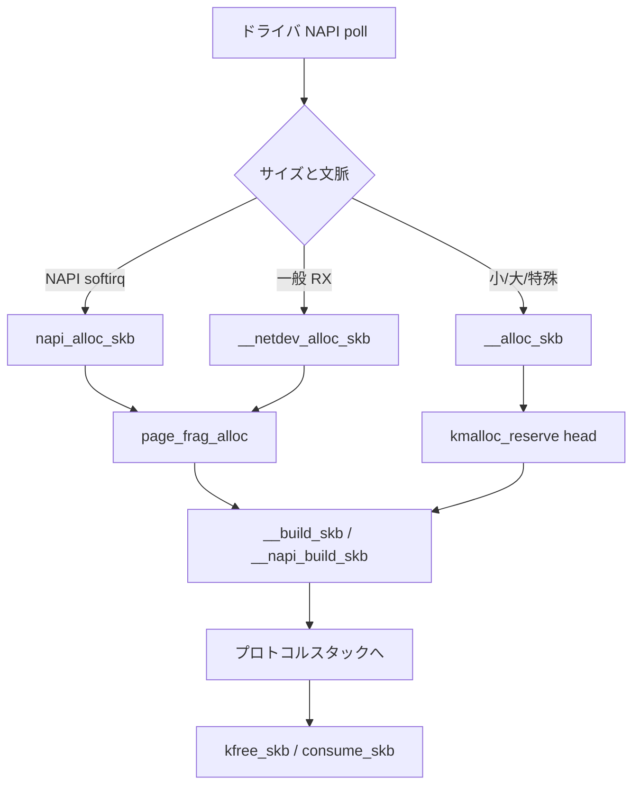

# 第2章 sk_buff の構造と割り当て

> **本章で読むソース**
>
> - [`include/linux/skbuff.h` L885-L964](https://github.com/gregkh/linux/blob/v6.18.38/include/linux/skbuff.h#L885-L964)
> - [`net/core/skbuff.c` L641-L702](https://github.com/gregkh/linux/blob/v6.18.38/net/core/skbuff.c#L641-L702)
> - [`net/core/skbuff.c` L718-L764](https://github.com/gregkh/linux/blob/v6.18.38/net/core/skbuff.c#L718-L764)
> - [`net/core/skbuff.c` L795-L838](https://github.com/gregkh/linux/blob/v6.18.38/net/core/skbuff.c#L795-L838)
> - [`net/core/skbuff.c` L1161-L1165](https://github.com/gregkh/linux/blob/v6.18.38/net/core/skbuff.c#L1161-L1165)
> - [`net/socket.c` L3316-L3319](https://github.com/gregkh/linux/blob/v6.18.38/net/socket.c#L3316-L3319)

## この章の狙い

ネットワークスタック全体で共有されるパケットバッファ **sk_buff** のレイアウトと、受信と送信で使われる割り当て経路を読む。
`head`/`data`/`tail`/`end` の関係と、SLAB キャッシュ、NAPI 専用割り当ての違いを押さえる。

## 前提

- [第1章](01-network-stack-overview.md) でスタックの層構造を読んでいること。
- SLUB キャッシュの概念は [メモリ管理分冊](../../mm/README.md) を参照。

## sk_buff が担う役割

各レイヤはパケットを `sk_buff` として受け渡す。
ヘッダを付け外しするときは `skb->data` ポインタを動かし、ペイロードを毎回コピーしない。
参照カウントで共有し、ブロードキャストや GRO で複数経路に同じデータを渡す。

## 主要フィールド

[`include/linux/skbuff.h` L885-L964](https://github.com/gregkh/linux/blob/v6.18.38/include/linux/skbuff.h#L885-L964)

```c
struct sk_buff {
	union {
		struct {
			/* These two members must be first to match sk_buff_head. */
			struct sk_buff		*next;
			struct sk_buff		*prev;

			union {
				struct net_device	*dev;
				/* Some protocols might use this space to store information,
				 * while device pointer would be NULL.
				 * UDP receive path is one user.
				 */
				unsigned long		dev_scratch;
			};
		};
		struct rb_node		rbnode; /* used in netem, ip4 defrag, and tcp stack */
		struct list_head	list;
		struct llist_node	ll_node;
	};

	struct sock		*sk;

	union {
		ktime_t		tstamp;
		u64		skb_mstamp_ns; /* earliest departure time */
	};
	/*
	 * This is the control buffer. It is free to use for every
	 * layer. Please put your private variables there. If you
	 * want to keep them across layers you have to do a skb_clone()
	 * first. This is owned by whoever has the skb queued ATM.
	 */
	char			cb[48] __aligned(8);

	union {
		struct {
			unsigned long	_skb_refdst;
			void		(*destructor)(struct sk_buff *skb);
		};
		struct list_head	tcp_tsorted_anchor;
#ifdef CONFIG_NET_SOCK_MSG
		unsigned long		_sk_redir;
#endif
	};

#if defined(CONFIG_NF_CONNTRACK) || defined(CONFIG_NF_CONNTRACK_MODULE)
	unsigned long		 _nfct;
#endif
	unsigned int		len,
				data_len;
	__u16			mac_len,
				hdr_len;

	/* Following fields are _not_ copied in __copy_skb_header()
	 * Note that queue_mapping is here mostly to fill a hole.
	 */
	__u16			queue_mapping;

/* if you move cloned around you also must adapt those constants */
#ifdef __BIG_ENDIAN_BITFIELD
#define CLONED_MASK	(1 << 7)
#else
#define CLONED_MASK	1
#endif
#define CLONED_OFFSET		offsetof(struct sk_buff, __cloned_offset)

	/* private: */
	__u8			__cloned_offset[0];
	/* public: */
	__u8			cloned:1,
				nohdr:1,
				fclone:2,
				peeked:1,
				head_frag:1,
				pfmemalloc:1,
				pp_recycle:1; /* page_pool recycle indicator */
#ifdef CONFIG_SKB_EXTENSIONS
	__u8			active_extensions;
#endif
```

`len` は論理パケット長、`data_len` はページフラグメント側の長さである。
`cb[]` は各レイヤが一時情報を置く制御バッファで、共有する場合は clone が必要とコメントされている。

## __alloc_skb と SLAB キャッシュ

汎用割り当ては `__alloc_skb` が担う。
`sk_buff` 本体は `skbuff_cache`（または fclone 用キャッシュ）から取り、データ領域は `kmalloc_reserve` で別途確保する。

[`net/core/skbuff.c` L641-L702](https://github.com/gregkh/linux/blob/v6.18.38/net/core/skbuff.c#L641-L702)

```c
struct sk_buff *__alloc_skb(unsigned int size, gfp_t gfp_mask,
			    int flags, int node)
{
	struct kmem_cache *cache;
	struct sk_buff *skb;
	bool pfmemalloc;
	u8 *data;

	cache = (flags & SKB_ALLOC_FCLONE)
		? net_hotdata.skbuff_fclone_cache : net_hotdata.skbuff_cache;

	if (sk_memalloc_socks() && (flags & SKB_ALLOC_RX))
		gfp_mask |= __GFP_MEMALLOC;

	if ((flags & (SKB_ALLOC_FCLONE | SKB_ALLOC_NAPI)) == SKB_ALLOC_NAPI &&
	    likely(node == NUMA_NO_NODE || node == numa_mem_id()))
		skb = napi_skb_cache_get();
	else
		skb = kmem_cache_alloc_node(cache, gfp_mask & ~GFP_DMA, node);
	if (unlikely(!skb))
		return NULL;
	prefetchw(skb);

	data = kmalloc_reserve(&size, gfp_mask, node, &pfmemalloc);
	if (unlikely(!data))
		goto nodata;

	memset(skb, 0, offsetof(struct sk_buff, tail));
	__build_skb_around(skb, data, size);
	skb->pfmemalloc = pfmemalloc;

	if (flags & SKB_ALLOC_FCLONE) {
		struct sk_buff_fclones *fclones;

		fclones = container_of(skb, struct sk_buff_fclones, skb1);

		skb->fclone = SKB_FCLONE_ORIG;
		refcount_set(&fclones->fclone_ref, 1);
	}

	return skb;

nodata:
	kmem_cache_free(cache, skb);
	return NULL;
}
```

`SKB_ALLOC_FCLONE` は後続の `skb_clone` を高速化するため、隣接スロットに複製用 `sk_buff` を同居させる。
`SKB_ALLOC_NAPI` 時は per-CPU の `napi_skb_cache` を使い、割り込み文脈でのキャッシュ局所性を高める。

## __netdev_alloc_skb と page_frag

ドライバ受信では `__netdev_alloc_skb` がよく使われる。
小さなパケットは `__alloc_skb` にフォールバックし、中程度のサイズは **page_frag** から切り出す。

[`net/core/skbuff.c` L718-L764](https://github.com/gregkh/linux/blob/v6.18.38/net/core/skbuff.c#L718-L764)

```c
struct sk_buff *__netdev_alloc_skb(struct net_device *dev, unsigned int len,
				   gfp_t gfp_mask)
{
	struct page_frag_cache *nc;
	struct sk_buff *skb;
	bool pfmemalloc;
	void *data;

	len += NET_SKB_PAD;

	if (len <= SKB_WITH_OVERHEAD(SKB_SMALL_HEAD_CACHE_SIZE) ||
	    len > SKB_WITH_OVERHEAD(PAGE_SIZE) ||
	    (gfp_mask & (__GFP_DIRECT_RECLAIM | GFP_DMA))) {
		skb = __alloc_skb(len, gfp_mask, SKB_ALLOC_RX, NUMA_NO_NODE);
		if (!skb)
			goto skb_fail;
		goto skb_success;
	}

	len = SKB_HEAD_ALIGN(len);

	if (in_hardirq() || irqs_disabled()) {
		nc = this_cpu_ptr(&netdev_alloc_cache);
		data = page_frag_alloc(nc, len, gfp_mask);
		pfmemalloc = page_frag_cache_is_pfmemalloc(nc);
	} else {
		local_bh_disable();
		local_lock_nested_bh(&napi_alloc_cache.bh_lock);

		nc = this_cpu_ptr(&napi_alloc_cache.page);
		data = page_frag_alloc(nc, len, gfp_mask);
		pfmemalloc = page_frag_cache_is_pfmemalloc(nc);

		local_unlock_nested_bh(&napi_alloc_cache.bh_lock);
		local_bh_enable();
	}

	if (unlikely(!data))
		return NULL;

	skb = __build_skb(data, len);
```

`NET_SKB_PAD` はプロトコルヘッダを prepend する余白である。
page_frag は同一ページ内で複数 skb の head を切り出し、ページ割り当て回数を減らす。

## napi_alloc_skb

NAPI poll 文脈では `napi_alloc_skb` が専用キャッシュを使う。
softirq 内であることを `DEBUG_NET_WARN_ON_ONCE(!in_softirq())` で検査する。

[`net/core/skbuff.c` L795-L838](https://github.com/gregkh/linux/blob/v6.18.38/net/core/skbuff.c#L795-L838)

```c
struct sk_buff *napi_alloc_skb(struct napi_struct *napi, unsigned int len)
{
	gfp_t gfp_mask = GFP_ATOMIC | __GFP_NOWARN;
	struct napi_alloc_cache *nc;
	struct sk_buff *skb;
	bool pfmemalloc;
	void *data;

	DEBUG_NET_WARN_ON_ONCE(!in_softirq());
	len += NET_SKB_PAD + NET_IP_ALIGN;

	if (len <= SKB_WITH_OVERHEAD(SKB_SMALL_HEAD_CACHE_SIZE) ||
	    len > SKB_WITH_OVERHEAD(PAGE_SIZE) ||
	    (gfp_mask & (__GFP_DIRECT_RECLAIM | GFP_DMA))) {
		skb = __alloc_skb(len, gfp_mask, SKB_ALLOC_RX | SKB_ALLOC_NAPI,
				  NUMA_NO_NODE);
		if (!skb)
			goto skb_fail;
		goto skb_success;
	}

	len = SKB_HEAD_ALIGN(len);

	local_lock_nested_bh(&napi_alloc_cache.bh_lock);
	nc = this_cpu_ptr(&napi_alloc_cache);

	data = page_frag_alloc(&nc->page, len, gfp_mask);
	pfmemalloc = page_frag_cache_is_pfmemalloc(&nc->page);
	local_unlock_nested_bh(&napi_alloc_cache.bh_lock);

	if (unlikely(!data))
		return NULL;

	skb = __napi_build_skb(data, len);
```

`NET_IP_ALIGN` は IP ヘッダをキャッシュライン境界に寄せ、一部 NIC の DMA 配置と揃える。

## 解放経路

参照カウントがゼロになると `__kfree_skb` がデータとメタデータを解放する。

[`net/core/skbuff.c` L1161-L1175](https://github.com/gregkh/linux/blob/v6.18.38/net/core/skbuff.c#L1161-L1175)

```c
void __kfree_skb(struct sk_buff *skb)
{
	skb_release_all(skb, SKB_DROP_REASON_NOT_SPECIFIED);
	kfree_skbmem(skb);
}
EXPORT_SYMBOL(__kfree_skb);
```

`skb_unref` で参照カウントを減らし、ゼロなら `skb_release_all` がデータとメタデータを解放する。

## skb_init とブート時初期化

`sock_init` は `skb_init` で `skbuff_cache` を登録する。
以降の `__alloc_skb` はすべてこのキャッシュを経由する。

[`net/socket.c` L3316-L3319](https://github.com/gregkh/linux/blob/v6.18.38/net/socket.c#L3316-L3319)

```c
	/*
	 *      Initialize skbuff SLAB cache
	 */
	skb_init();
```

## 処理の流れ（受信バッファ割り当て）



## 高速化と最適化の工夫

**head と skb_shared_info のキャッシュライン分離**は、`__alloc_skb` 内のコメントどおり `kmalloc` のアライメントに依存する。
受信 hot path では false sharing を減らす。

**fclone キャッシュ**は `skb_clone` 頻度の高い経路（TCP 再送や mirroring）で、2つ目の `sk_buff` メタデータ割り当てを省略する。

**page_frag** は 1 ページから複数 skb head を切り出し、ページアロケータへの往復を減らす。
NAPI 専用キャッシュは softirq 内のロック範囲を per-CPU に閉じる。

> **7.x 系での変化**
> [`net/core/skbuff.c` L225-L227](https://github.com/gregkh/linux/blob/v7.1.3/net/core/skbuff.c#L225-L227) では NAPI 用 skb キャッシュの `NAPI_SKB_CACHE_SIZE` が 64 から 128 に、`NAPI_SKB_CACHE_BULK` が 16 から 32 に拡大している。
> 受信 hot path の SLAB 取得回数削減が主目的である。

## まとめ

`sk_buff` はメタデータと可変長データ領域に分かれ、参照カウントで共有される。
受信では `napi_alloc_skb` と page_frag が hot path を最適化し、汎用経路は `__alloc_skb` が担う。
次章では clone と非線形データの扱いを読む。

## 関連する章

- 前章：[ネットワークスタックの全体像と net namespace](01-network-stack-overview.md)
- 次章：[sk_buff の clone、copy、非線形データ](03-sk_buff-clone-copy-nonlinear.md)
- [NAPI と netif_receive_skb](../part04-rx-fastpath/18-napi-netif-receive.md)
