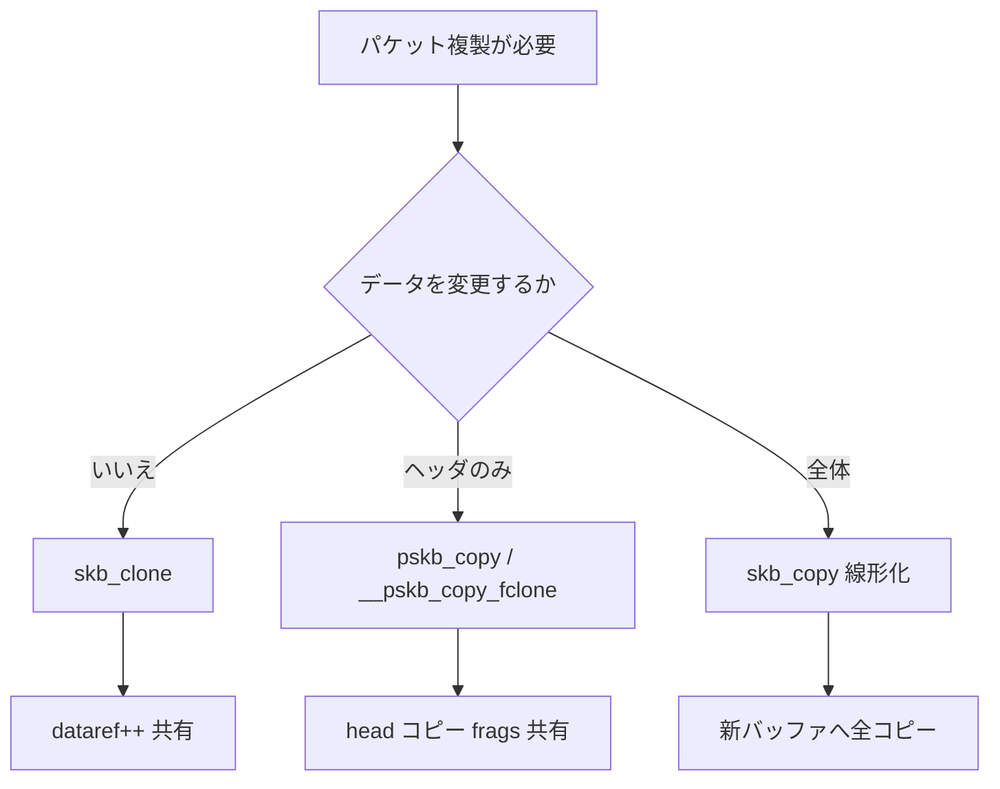

# 第3章 sk_buff の clone、copy、非線形データ

> **本章で読むソース**
>
> - [`net/core/skbuff.c` L1538-L1567](https://github.com/gregkh/linux/blob/v6.18.38/net/core/skbuff.c#L1538-L1567)
> - [`net/core/skbuff.c` L2028-L2055](https://github.com/gregkh/linux/blob/v6.18.38/net/core/skbuff.c#L2028-L2055)
> - [`net/core/skbuff.c` L2108-L2136](https://github.com/gregkh/linux/blob/v6.18.38/net/core/skbuff.c#L2108-L2136)
> - [`net/core/skbuff.c` L2156-L2188](https://github.com/gregkh/linux/blob/v6.18.38/net/core/skbuff.c#L2156-L2188)
> - [`net/core/skbuff.c` L2962-L2998](https://github.com/gregkh/linux/blob/v6.18.38/net/core/skbuff.c#L2962-L2998)
> - [`include/linux/skbuff.h` L593-L628](https://github.com/gregkh/linux/blob/v6.18.38/include/linux/skbuff.h#L593-L628)
> - [`net/core/skbuff.c` L1061-L1096](https://github.com/gregkh/linux/blob/v6.18.38/net/core/skbuff.c#L1061-L1096)
> - [`net/core/skbuff.c` L885-L888](https://github.com/gregkh/linux/blob/v6.18.38/net/core/skbuff.c#L885-L888)

## この章の狙い

同一パケットデータを複数の `sk_buff` で共有する **clone**、独立コピーを作る **copy**、ページフラグメントを持つ **非線形 skb** の三つを区別して読む。
netfilter の複製、ソケットへの配送、GRO の結合でどの API が選ばれるかを押さえる。

## 前提

- [第2章](02-sk_buff-structure-allocation.md) で `sk_buff` の基本構造と割り当てを読んでいること。

## clone と copy の違い

| 操作 | データ領域 | メタデータ | 典型用途 |
|---|---|---|---|
| `skb_clone` | 共有（参照カウント増加） | 新規 `sk_buff` | 観測、配送、フック複製 |
| `skb_copy` | 深いコピー（線形化含む） | 新規 | ヘッダとペイロードの変更 |
| `pskb_copy` | ヘッダのみコピー、frags 共有 | 新規 | ヘッダだけ書き換える |

`skb_clone` は高速だが、共有データを書き換えてはならない。
書き換えが必要なら `skb_copy` か `pskb_copy` を使う。

## __skb_clone の共有構造

clone は新しい `sk_buff` メタデータを作り、`skb->head` 以下を共有する。
`dataref` をインクリメントしてデータの所有者数を記録する。

[`net/core/skbuff.c` L1538-L1565](https://github.com/gregkh/linux/blob/v6.18.38/net/core/skbuff.c#L1538-L1565)

```c
static struct sk_buff *__skb_clone(struct sk_buff *n, struct sk_buff *skb)
{
#define C(x) n->x = skb->x

	n->next = n->prev = NULL;
	n->sk = NULL;
	__copy_skb_header(n, skb);

	C(len);
	C(data_len);
	C(mac_len);
	n->hdr_len = skb->nohdr ? skb_headroom(skb) : skb->hdr_len;
	n->cloned = 1;
	n->nohdr = 0;
	n->peeked = 0;
	C(pfmemalloc);
	C(pp_recycle);
	n->destructor = NULL;
	C(tail);
	C(end);
	C(head);
	C(head_frag);
	C(data);
	C(truesize);
	refcount_set(&n->users, 1);

	atomic_inc(&(skb_shinfo(skb)->dataref));
	skb->cloned = 1;
```

`n->sk = NULL` とすることで、clone 側がソケット参照を持たずに配送だけ行える。
元 skb の `cloned` フラグも立ち、共有状態であることを示す。

## skb_clone と fclone 高速経路

[`net/core/skbuff.c` L2028-L2055](https://github.com/gregkh/linux/blob/v6.18.38/net/core/skbuff.c#L2028-L2055)

```c
struct sk_buff *skb_clone(struct sk_buff *skb, gfp_t gfp_mask)
{
	struct sk_buff_fclones *fclones = container_of(skb,
						       struct sk_buff_fclones,
						       skb1);
	struct sk_buff *n;

	if (skb_orphan_frags(skb, gfp_mask))
		return NULL;

	if (skb->fclone == SKB_FCLONE_ORIG &&
	    refcount_read(&fclones->fclone_ref) == 1) {
		n = &fclones->skb2;
		refcount_set(&fclones->fclone_ref, 2);
		n->fclone = SKB_FCLONE_CLONE;
	} else {
		if (skb_pfmemalloc(skb))
			gfp_mask |= __GFP_MEMALLOC;

		n = kmem_cache_alloc(net_hotdata.skbuff_cache, gfp_mask);
		if (!n)
			return NULL;

		n->fclone = SKB_FCLONE_UNAVAILABLE;
	}

	return __skb_clone(n, skb);
}
```

`SKB_FCLONE_ORIG` かつ参照が 1 のとき、隣接スロット `skb2` をそのまま使う。
SLAB からの追加取得を避け、clone 密集経路のコストを下げる。

## skb_copy による線形化

`skb_copy` はヘッダとペイロード全体を新バッファへコピーする。
非線形 skb はこの呼び出しで線形化される。

[`net/core/skbuff.c` L2108-L2136](https://github.com/gregkh/linux/blob/v6.18.38/net/core/skbuff.c#L2108-L2136)

```c
struct sk_buff *skb_copy(const struct sk_buff *skb, gfp_t gfp_mask)
{
	struct sk_buff *n;
	unsigned int size;
	int headerlen;

	if (!skb_frags_readable(skb))
		return NULL;

	if (WARN_ON_ONCE(skb_shinfo(skb)->gso_type & SKB_GSO_FRAGLIST))
		return NULL;

	headerlen = skb_headroom(skb);
	size = skb_end_offset(skb) + skb->data_len;
	n = __alloc_skb(size, gfp_mask,
			skb_alloc_rx_flag(skb), NUMA_NO_NODE);
	if (!n)
		return NULL;

	skb_reserve(n, headerlen);
	skb_put(n, skb->len);

	BUG_ON(skb_copy_bits(skb, -headerlen, n->head, headerlen + skb->len));

	skb_copy_header(n, skb);
	return n;
}
```

`skb_copy_bits` で headroom から tail まで一括コピーする。
GSO fraglist 型はサポート外として警告する。

## pskb_copy とヘッダのみの複製

ヘッダだけ書き換える場合は `__pskb_copy_fclone` が使われる。
線形部分（通常はヘッダ）だけ新規確保し、ページフラグメントは共有する。

[`net/core/skbuff.c` L2156-L2185](https://github.com/gregkh/linux/blob/v6.18.38/net/core/skbuff.c#L2156-L2185)

```c
struct sk_buff *__pskb_copy_fclone(struct sk_buff *skb, int headroom,
				   gfp_t gfp_mask, bool fclone)
{
	unsigned int size = skb_headlen(skb) + headroom;
	int flags = skb_alloc_rx_flag(skb) | (fclone ? SKB_ALLOC_FCLONE : 0);
	struct sk_buff *n = __alloc_skb(size, gfp_mask, flags, NUMA_NO_NODE);

	if (!n)
		goto out;

	/* Set the data pointer */
	skb_reserve(n, headroom);
	/* Set the tail pointer and length */
	skb_put(n, skb_headlen(skb));
	/* Copy the bytes */
	skb_copy_from_linear_data(skb, n->data, n->len);

	n->truesize += skb->data_len;
	n->data_len  = skb->data_len;
	n->len	     = skb->len;

	if (skb_shinfo(skb)->nr_frags) {
		int i;

		if (skb_orphan_frags(skb, gfp_mask) ||
		    skb_zerocopy_clone(n, skb, gfp_mask)) {
			kfree_skb(n);
			n = NULL;
			goto out;
		}
```

IP オプションの挿入や NAT によるヘッダ変更など、ペイロードを触らない改変に向く。

## 非線形データと skb_shared_info

線形 head 以外のペイロードは `skb_shinfo(skb)` が指す `skb_shared_info` に載る。
`len` は skb 全体長、`data_len` はフラグメント側の長さである。

[`include/linux/skbuff.h` L934-L935](https://github.com/gregkh/linux/blob/v6.18.38/include/linux/skbuff.h#L934-L935)

```c
	unsigned int		len,
				data_len;
```

`data_len > 0` の skb は非線形と呼ばれ、`skb_copy_bits` が線形部と frags を横断して読む。

ページフラグメントは `nr_frags` と `frags[]` に、チェーンされた子 skb は `frag_list` に格納される。

[`include/linux/skbuff.h` L593-L628](https://github.com/gregkh/linux/blob/v6.18.38/include/linux/skbuff.h#L593-L628)

```c
struct skb_shared_info {
	__u8		flags;
	__u8		meta_len;
	__u8		nr_frags;
	__u8		tx_flags;
	unsigned short	gso_size;
	/* Warning: this field is not always filled in (UFO)! */
	unsigned short	gso_segs;
	struct sk_buff	*frag_list;
	union {
		struct skb_shared_hwtstamps hwtstamps;
		struct xsk_tx_metadata_compl xsk_meta;
	};
	unsigned int	gso_type;
	u32		tskey;

	/*
	 * Warning : all fields before dataref are cleared in __alloc_skb()
	 */
	atomic_t	dataref;

	union {
		struct {
			u32		xdp_frags_size;
			u32		xdp_frags_truesize;
		};

		/*
		 * Intermediate layers must ensure that destructor_arg
		 * remains valid until skb destructor.
		 */
		void		*destructor_arg;
	};

	/* must be last field, see pskb_expand_head() */
	skb_frag_t	frags[MAX_SKB_FRAGS];
};
```

`frags[i]` は `skb_frag_t` でページオフセットと長さを持ち、DMA マップ済みページを参照する。
`frag_list` は別 `sk_buff` の連結リストで、GSO や一部プロトコルが大きなペイロードを分割して載せる。

clone や `pskb_copy` では `skb_orphan_frags` が zero-copy frag（destructor 付きユーザ空間ページ）だけをカーネル側へコピーする。
通常の page frag では `skb_zcopy` が偽のため何もしない。
`skb_clone` 後も data area は clone 間で `dataref` により共有される。

[`include/linux/skbuff.h` L3393-L3400](https://github.com/gregkh/linux/blob/v6.18.38/include/linux/skbuff.h#L3393-L3400)

```c
static inline int skb_orphan_frags(struct sk_buff *skb, gfp_t gfp_mask)
{
	if (likely(!skb_zcopy(skb)))
		return 0;
	if (skb_shinfo(skb)->flags & SKBFL_DONT_ORPHAN)
		return 0;
	return skb_copy_ubufs(skb, gfp_mask);
}
```

`skb_copy_ubufs` はユーザ空間 frags をカーネルページへ複製し、destructor 経由の参照を外す。
共有データを書き換える前に zero-copy 状態だけを切り離す目的である。

## skb_release_data による解放

参照カウント `dataref` が 0 になったとき、`skb_release_data` が frags と `frag_list` を解放する。

[`net/core/skbuff.c` L1061-L1096](https://github.com/gregkh/linux/blob/v6.18.38/net/core/skbuff.c#L1061-L1096)

```c
static void skb_release_data(struct sk_buff *skb, enum skb_drop_reason reason)
{
	struct skb_shared_info *shinfo = skb_shinfo(skb);
	int i;

	if (!skb_data_unref(skb, shinfo))
		goto exit;

	if (skb_zcopy(skb)) {
		bool skip_unref = shinfo->flags & SKBFL_MANAGED_FRAG_REFS;

		skb_zcopy_clear(skb, true);
		if (skip_unref)
			goto free_head;
	}

	for (i = 0; i < shinfo->nr_frags; i++)
		__skb_frag_unref(&shinfo->frags[i], skb->pp_recycle);

free_head:
	if (shinfo->frag_list)
		kfree_skb_list_reason(shinfo->frag_list, reason);

	skb_free_head(skb);
exit:
	/* When we clone an SKB we copy the reycling bit. The pp_recycle
	 * bit is only set on the head though, so in order to avoid races
	 * while trying to recycle fragments on __skb_frag_unref() we need
	 * to make one SKB responsible for triggering the recycle path.
	 * So disable the recycling bit if an SKB is cloned and we have
	 * additional references to the fragmented part of the SKB.
	 * Eventually the last SKB will have the recycling bit set and it's
	 * dataref set to 0, which will trigger the recycling
	 */
	skb->pp_recycle = 0;
}
```

各 frag は `__skb_frag_unref` でページプールへ返すか `put_page` する。
`frag_list` は `kfree_skb_list_reason` で連鎖全体を再帰的に解放する。

[`net/core/skbuff.c` L885-L888](https://github.com/gregkh/linux/blob/v6.18.38/net/core/skbuff.c#L885-L888)

```c
static inline void skb_drop_fraglist(struct sk_buff *skb)
{
	skb_drop_list(&skb_shinfo(skb)->frag_list);
}
```

明示的に frag_list だけを外す経路では `skb_drop_fraglist` が使われる。
通常の `kfree_skb` は `skb_release_all` 経由で head state と data を順に片付ける。

## skb_copy_bits による横断読み取り

[`net/core/skbuff.c` L2962-L2998](https://github.com/gregkh/linux/blob/v6.18.38/net/core/skbuff.c#L2962-L2998)

```c
int skb_copy_bits(const struct sk_buff *skb, int offset, void *to, int len)
{
	int start = skb_headlen(skb);
	struct sk_buff *frag_iter;
	int i, copy;

	if (offset > (int)skb->len - len)
		goto fault;

	/* Copy header. */
	if ((copy = start - offset) > 0) {
		if (copy > len)
			copy = len;
		skb_copy_from_linear_data_offset(skb, offset, to, copy);
		if ((len -= copy) == 0)
			return 0;
		offset += copy;
		to     += copy;
	}

	if (!skb_frags_readable(skb))
		goto fault;

	for (i = 0; i < skb_shinfo(skb)->nr_frags; i++) {
		int end;
		skb_frag_t *f = &skb_shinfo(skb)->frags[i];

		WARN_ON(start > offset + len);

		end = start + skb_frag_size(f);
		if ((copy = end - offset) > 0) {
			u32 p_off, p_len, copied;
			struct page *p;
			u8 *vaddr;

			if (copy > len)
				copy = len;
```

まず線形部から読み、足りなければ各 frag を順に辿る。
チェックサム計算やソケットへの `copy_to_iter` がこの API 経由になる。

## 処理の流れ（複製 API の選択）



## 高速化と最適化の工夫

**fclone** は clone 用メタデータを事前確保し、SLAB ミスを減らす。
TCP や bridge で clone が連続する経路に効く。

**pskb_copy** は大きなペイロードをページ共有のまま残し、ヘッダ変更のコストを headlen に閉じる。
GSO セグメントではペイロードコピーを避ける。

**skb_copy_bits** は非線形 skb を透過的に読む単一 API で、上層が線形かどうかを意識しない。
分岐は skbuff.c 内に集約される。

## まとめ

`skb_clone` はデータ共有の軽量複製、`skb_copy` は独立バッファ、`pskb_copy` はヘッダ分離が基本である。
非線形 skb は `data_len` と frags で表現され、`skb_copy_bits` が読み取りを統一する。
次章ではパケットの送受信端点である `net_device` を読む。

## 関連する章

- 前章：[sk_buff の構造と割り当て](02-sk_buff-structure-allocation.md)
- 次章：[net_device と netdev ライフサイクル](04-netdev-lifecycle.md)
- [netfilter フック](../part06-netfilter/24-netfilter-hooks.md)
