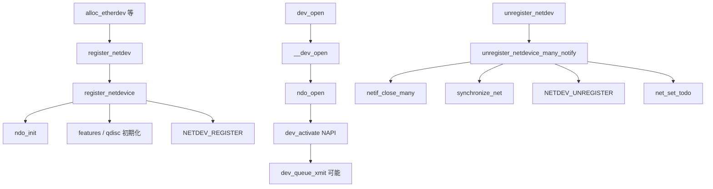

# 第4章 net_device と netdev ライフサイクル

> **本章で読むソース**
>
> - [`net/core/dev.c` L11225-L11259](https://github.com/gregkh/linux/blob/v6.18.38/net/core/dev.c#L11225-L11259)
> - [`net/core/dev.c` L11334-L11378](https://github.com/gregkh/linux/blob/v6.18.38/net/core/dev.c#L11334-L11378)
> - [`net/core/dev.c` L11447-L11460](https://github.com/gregkh/linux/blob/v6.18.38/net/core/dev.c#L11447-L11460)
> - [`net/core/dev.c` L1660-L1704](https://github.com/gregkh/linux/blob/v6.18.38/net/core/dev.c#L1660-L1704)
> - [`net/core/dev.c` L12253-L12308](https://github.com/gregkh/linux/blob/v6.18.38/net/core/dev.c#L12253-L12308)
> - [`net/core/dev.c` L12310-L12381](https://github.com/gregkh/linux/blob/v6.18.38/net/core/dev.c#L12310-L12381)
> - [`include/linux/netdevice.h` L2093-L2132](https://github.com/gregkh/linux/blob/v6.18.38/include/linux/netdevice.h#L2093-L2132)

## この章の狙い

パケット送受信のハードウェア抽象である **net_device** の登録、起動、停止、登録解除の流れを読む。
`register_netdev` と `ndo_open` の関係、notifier チェーン、ソフトウェアオフロード機能の初期設定を押さえる。

## 前提

- [第1章](01-network-stack-overview.md) で `struct net` と namespace を読んでいること。
- [第2章](02-sk_buff-structure-allocation.md) で `sk_buff` と `dev` ポインタの関係を知っていること。

## net_device の役割

各 NIC や仮想インタフェースは `net_device` で表現される。
`netdev_ops` が送信（`ndo_start_xmit`）、受信（NAPI poll）、アドレス設定を提供する。
ルーティング結果は `rtable` から `net_device` へ解決され、送信キューへ `sk_buff` が投入される。

## netdev_ops と reg_state

[`include/linux/netdevice.h` L2093-L2132](https://github.com/gregkh/linux/blob/v6.18.38/include/linux/netdevice.h#L2093-L2132)

```c
struct net_device {
	/* Cacheline organization can be found documented in
	 * Documentation/networking/net_cachelines/net_device.rst.
	 * Please update the document when adding new fields.
	 */

	/* TX read-mostly hotpath */
	__cacheline_group_begin(net_device_read_tx);
	struct_group(priv_flags_fast,
		unsigned long		priv_flags:32;
		unsigned long		lltx:1;
		unsigned long		netmem_tx:1;
	);
	const struct net_device_ops *netdev_ops;
	const struct header_ops *header_ops;
	struct netdev_queue	*_tx;
	netdev_features_t	gso_partial_features;
	unsigned int		real_num_tx_queues;
	unsigned int		gso_max_size;
	unsigned int		gso_ipv4_max_size;
	u16			gso_max_segs;
	s16			num_tc;
	unsigned int		mtu;
	unsigned short		needed_headroom;
	struct netdev_tc_txq	tc_to_txq[TC_MAX_QUEUE];
#ifdef CONFIG_XPS
	struct xps_dev_maps __rcu *xps_maps[XPS_MAPS_MAX];
#endif
#ifdef CONFIG_NETFILTER_EGRESS
	struct nf_hook_entries __rcu *nf_hooks_egress;
#endif
```

`reg_state` は別フィールドとして後方に定義される。
`netdev_ops` は送信（`ndo_start_xmit`）、`features` は GSO/GRO 等の能力を表す。

## register_netdevice の本体

`register_netdevice` は rtnl ロック下で呼ばれ、名前検証、ifindex 予約、機能ビット設定、notifier 通知を行う。

[`net/core/dev.c` L11225-L11259](https://github.com/gregkh/linux/blob/v6.18.38/net/core/dev.c#L11225-L11259)

```c
int register_netdevice(struct net_device *dev)
{
	int ret;
	struct net *net = dev_net(dev);

	BUILD_BUG_ON(sizeof(netdev_features_t) * BITS_PER_BYTE <
		     NETDEV_FEATURE_COUNT);
	BUG_ON(dev_boot_phase);
	ASSERT_RTNL();

	might_sleep();

	/* When net_device's are persistent, this will be fatal. */
	BUG_ON(dev->reg_state != NETREG_UNINITIALIZED);
	BUG_ON(!net);

	ret = ethtool_check_ops(dev->ethtool_ops);
	if (ret)
		return ret;

	/* rss ctx ID 0 is reserved for the default context, start from 1 */
	xa_init_flags(&dev->ethtool->rss_ctx, XA_FLAGS_ALLOC1);
	mutex_init(&dev->ethtool->rss_lock);

	spin_lock_init(&dev->addr_list_lock);
	netdev_set_addr_lockdep_class(dev);

	ret = dev_get_valid_name(net, dev, dev->name);
	if (ret < 0)
		goto out;

	ret = -ENOMEM;
	dev->name_node = netdev_name_node_head_alloc(dev);
	if (!dev->name_node)
		goto out;
```

`ndo_init` はドライバ固有の初期化で、ハードウェアリングや DMA リングの準備に相当する。

## ソフトウェアオフロードの有効化

登録時にソフトウェア GSO/GRO 機能を `features` に付与する。
ハードウェアが対応していなくても、スタック側でセグメント化や結合ができる。

[`net/core/dev.c` L11334-L11378](https://github.com/gregkh/linux/blob/v6.18.38/net/core/dev.c#L11334-L11378)

```c
	ret = call_netdevice_notifiers(NETDEV_POST_INIT, dev);
	ret = notifier_to_errno(ret);
	if (ret)
		goto err_ifindex_release;

	ret = netdev_register_kobject(dev);

	netdev_lock(dev);
	WRITE_ONCE(dev->reg_state, ret ? NETREG_UNREGISTERED : NETREG_REGISTERED);
	netdev_unlock(dev);

	if (ret)
		goto err_uninit_notify;

	netdev_lock_ops(dev);
	__netdev_update_features(dev);
	netdev_unlock_ops(dev);

	set_bit(__LINK_STATE_PRESENT, &dev->state);

	linkwatch_init_dev(dev);

	dev_init_scheduler(dev);

	netdev_hold(dev, &dev->dev_registered_tracker, GFP_KERNEL);
	list_netdevice(dev);

	add_device_randomness(dev->dev_addr, dev->addr_len);

	netdev_lock_ops(dev);
	ret = call_netdevice_notifiers(NETDEV_REGISTER, dev);
	netdev_unlock_ops(dev);
	ret = notifier_to_errno(ret);
```

`dev_init_scheduler` で送信 qdisc が結び付く（第22章）。
`NETDEV_REGISTER` notifier で IPv4/IPv6 層がデバイスを認識する。

## register_netdev ラッパー

ドライバは通常 `register_netdev` を呼ぶ。
rtnl ロックの取得と解放をラッパーが担う。

[`net/core/dev.c` L11447-L11460](https://github.com/gregkh/linux/blob/v6.18.38/net/core/dev.c#L11447-L11460)

```c
int register_netdev(struct net_device *dev)
{
	struct net *net = dev_net(dev);
	int err;

	if (rtnl_net_lock_killable(net))
		return -EINTR;

	err = register_netdevice(dev);

	rtnl_net_unlock(net);

	return err;
}
```

## __dev_open とリンクアップ

`ip link set up` や `ifconfig up` は `__dev_open` を経由して `ndo_open` を呼ぶ。

[`net/core/dev.c` L1660-L1704](https://github.com/gregkh/linux/blob/v6.18.38/net/core/dev.c#L1660-L1704)

```c
static int __dev_open(struct net_device *dev, struct netlink_ext_ack *extack)
{
	const struct net_device_ops *ops = dev->netdev_ops;
	int ret;

	ASSERT_RTNL();
	dev_addr_check(dev);

	if (!netif_device_present(dev)) {
		if (dev->dev.parent)
			pm_runtime_resume(dev->dev.parent);
		if (!netif_device_present(dev))
			return -ENODEV;
	}

	netpoll_poll_disable(dev);

	ret = call_netdevice_notifiers_extack(NETDEV_PRE_UP, dev, extack);
	ret = notifier_to_errno(ret);
	if (ret)
		return ret;

	set_bit(__LINK_STATE_START, &dev->state);

	netdev_ops_assert_locked(dev);

	if (ops->ndo_validate_addr)
		ret = ops->ndo_validate_addr(dev);

	if (!ret && ops->ndo_open)
		ret = ops->ndo_open(dev);

	netpoll_poll_enable(dev);

	if (ret)
		clear_bit(__LINK_STATE_START, &dev->state);
	else {
		netif_set_up(dev, true);
		dev_set_rx_mode(dev);
		dev_activate(dev);
```

`dev_activate` で NAPI がスケジュール可能になり、受信が始まる（第18章）。
失敗時は `__LINK_STATE_START` をクリアしてロールバックする。

## unregister_netdev と登録解除の本体

`unregister_netdev` は rtnl を取り、本体の `unregister_netdevice` へ委譲する薄いラッパーである。

[`net/core/dev.c` L12407-L12412](https://github.com/gregkh/linux/blob/v6.18.38/net/core/dev.c#L12407-L12412)

```c
void unregister_netdev(struct net_device *dev)
{
	rtnl_net_dev_lock(dev);
	unregister_netdevice(dev);
	rtnl_net_dev_unlock(dev);
}
```

実処理は `unregister_netdevice_many_notify` が担う。
複数デバイスをまとめて閉じ、リストから外し、notifier で各層に破棄を通知してから参照を落とす。

## unregister_netdevice_many_notify の流れ

まず稼働中デバイスを `netif_close_many` で閉じ、`unlist_netdevice` でデバイスチェーンから外す。
`reg_state` を `NETREG_UNREGISTERING` に遷移させたあと `synchronize_net` でパケット処理との同期を取る。

[`net/core/dev.c` L12253-L12308](https://github.com/gregkh/linux/blob/v6.18.38/net/core/dev.c#L12253-L12308)

```c
void unregister_netdevice_many_notify(struct list_head *head,
				      u32 portid, const struct nlmsghdr *nlh)
{
	struct net_device *dev, *tmp;
	LIST_HEAD(close_head);
	int cnt = 0;

	BUG_ON(dev_boot_phase);
	ASSERT_RTNL();

	if (list_empty(head))
		return;

	list_for_each_entry_safe(dev, tmp, head, unreg_list) {
		/* Some devices call without registering
		 * for initialization unwind. Remove those
		 * devices and proceed with the remaining.
		 */
		if (dev->reg_state == NETREG_UNINITIALIZED) {
			pr_debug("unregister_netdevice: device %s/%p never was registered\n",
				 dev->name, dev);

			WARN_ON(1);
			list_del(&dev->unreg_list);
			continue;
		}
		dev->dismantle = true;
		BUG_ON(dev->reg_state != NETREG_REGISTERED);
	}

	/* If device is running, close it first. Start with ops locked... */
	list_for_each_entry(dev, head, unreg_list) {
		if (!(dev->flags & IFF_UP))
			continue;
		if (netdev_need_ops_lock(dev)) {
			list_add_tail(&dev->close_list, &close_head);
			netdev_lock(dev);
		}
		netif_close_many_and_unlock_cond(&close_head);
	}
	netif_close_many_and_unlock(&close_head);
	/* ... now go over the rest. */
	list_for_each_entry(dev, head, unreg_list) {
		if (!netdev_need_ops_lock(dev))
			list_add_tail(&dev->close_list, &close_head);
	}
	netif_close_many(&close_head, true);

	list_for_each_entry(dev, head, unreg_list) {
		/* And unlink it from device chain. */
		unlist_netdevice(dev);
		netdev_lock(dev);
		WRITE_ONCE(dev->reg_state, NETREG_UNREGISTERING);
		netdev_unlock(dev);
	}
	flush_all_backlogs();
```

`synchronize_net` は受信側がデバイスポインタを触り終えるまで待つ grace period である。
登録時の `NETDEV_REGISTER` と対になる `NETDEV_UNREGISTER` はこの後段で送られる。

## qdisc 停止、notifier、参照解放

各デバイスについて qdisc を `dev_shutdown` で止め、XDP や memory provider を外す。
`NETDEV_UNREGISTER` notifier で IPv4/IPv6 や bridge が upper/lower デバイスを切り離す。
`ndo_uninit` のあと kobject を外し、二回目の `synchronize_net` の後に `netdev_put` と `net_set_todo` で遅延解放キューへ載せる。

[`net/core/dev.c` L12310-L12381](https://github.com/gregkh/linux/blob/v6.18.38/net/core/dev.c#L12310-L12381)

```c
	synchronize_net();

	list_for_each_entry(dev, head, unreg_list) {
		struct sk_buff *skb = NULL;

		/* Shutdown queueing discipline. */
		netdev_lock_ops(dev);
		dev_shutdown(dev);
		dev_tcx_uninstall(dev);
		dev_xdp_uninstall(dev);
		dev_memory_provider_uninstall(dev);
		netdev_unlock_ops(dev);
		bpf_dev_bound_netdev_unregister(dev);

		netdev_offload_xstats_disable_all(dev);

		/* Notify protocols, that we are about to destroy
		 * this device. They should clean all the things.
		 */
		call_netdevice_notifiers(NETDEV_UNREGISTER, dev);

		if (!(dev->rtnl_link_ops && dev->rtnl_link_initializing))
			skb = rtmsg_ifinfo_build_skb(RTM_DELLINK, dev, ~0U, 0,
						     GFP_KERNEL, NULL, 0,
						     portid, nlh);

		/*
		 *	Flush the unicast and multicast chains
		 */
		dev_uc_flush(dev);
		dev_mc_flush(dev);

		netdev_name_node_alt_flush(dev);
		netdev_name_node_free(dev->name_node);

		netdev_rss_contexts_free(dev);

		call_netdevice_notifiers(NETDEV_PRE_UNINIT, dev);

		if (dev->netdev_ops->ndo_uninit)
			dev->netdev_ops->ndo_uninit(dev);

		mutex_destroy(&dev->ethtool->rss_lock);

		net_shaper_flush_netdev(dev);

		if (skb)
			rtmsg_ifinfo_send(skb, dev, GFP_KERNEL, portid, nlh);

		/* Notifier chain MUST detach us all upper devices. */
		WARN_ON(netdev_has_any_upper_dev(dev));
		WARN_ON(netdev_has_any_lower_dev(dev));

		/* Remove entries from kobject tree */
		netdev_unregister_kobject(dev);
	}

	synchronize_net();

	list_for_each_entry(dev, head, unreg_list) {
		netdev_put(dev, &dev->dev_registered_tracker);
		net_set_todo(dev);
		cnt++;
	}
	atomic_add(cnt, &dev_unreg_count);

	list_del(head);
}
```

`net_set_todo` で載ったデバイスは `netdev_run_todo` が RCU 同期後に `kfree` する。
rtnl ロックを長時間保持しないため、登録解除の重い処理を分割している。

## 処理の流れ（ドライバ登録から送信可能まで）



## 高速化と最適化の工夫

**`wanted_features` と `hw_features` の分離**は、ユーザーが ethtool で変更可能な機能とハードウェア上限を区別する。
登録時にソフトウェア GSO/GRO を付与し、ハードウェア未対応でもスタック側最適化を使える。

**per-CPU 統計（`pcpu_refcnt`）**は、参照カウント更新のキャッシュライン競合を減らす（`CONFIG_PCPU_DEV_REFCNT`）。

**`linkwatch`** はキャリア変化を遅延処理し、リンクフラップ時の thundering herd を抑える。

## まとめ

`net_device` は rtnl 保護下で登録され、notifier で各プロトコル層に通知される。
`ndo_open` 後に NAPI と qdisc が有効になり、送受信 hot path が動き出す。
次章からソケット層と `struct sock` を読む。

## 関連する章

- 前章：[sk_buff の clone、copy、非線形データ](03-sk_buff-clone-copy-nonlinear.md)
- 次章：[struct sock とソケットオブジェクト](../part01-socket/05-struct-sock.md)
- [NAPI と netif_receive_skb](../part04-rx-fastpath/18-napi-netif-receive.md)
- [dev_queue_xmit](../part05-tx-qdisc/21-dev-queue-xmit.md)
