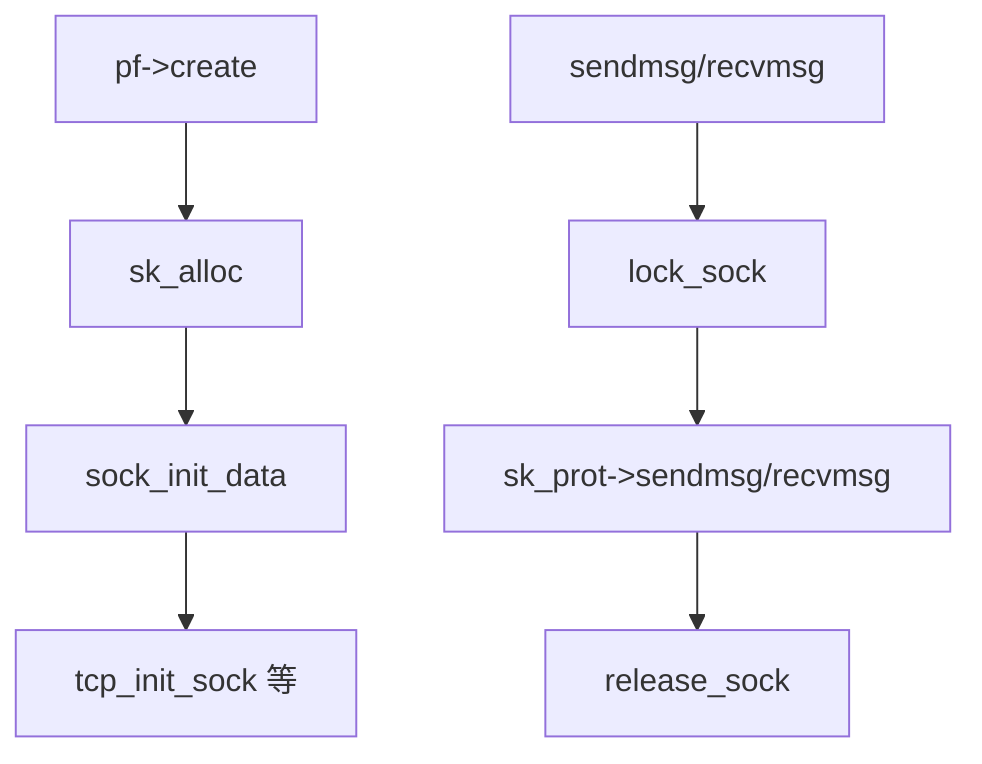

# 第5章 struct sock とソケットオブジェクト

> **本章で読むソース**
>
> - [`net/core/sock.c` L2295-L2331](https://github.com/gregkh/linux/blob/v6.18.38/net/core/sock.c#L2295-L2331)
> - [`net/core/sock.c` L3645-L3713](https://github.com/gregkh/linux/blob/v6.18.38/net/core/sock.c#L3645-L3713)
> - [`net/core/sock.c` L3716-L3723](https://github.com/gregkh/linux/blob/v6.18.38/net/core/sock.c#L3716-L3723)
> - [`net/core/sock.c` L3726-L3737](https://github.com/gregkh/linux/blob/v6.18.38/net/core/sock.c#L3726-L3737)
> - [`net/core/sock.c` L3740-L3754](https://github.com/gregkh/linux/blob/v6.18.38/net/core/sock.c#L3740-L3754)
> - [`include/net/sock.h` L354-L385](https://github.com/gregkh/linux/blob/v6.18.38/include/net/sock.h#L354-L385)

## この章の狙い

ソケット層の中核である **struct sock** の割り当て、初期化、ロック、解放を読む。
`struct socket`（VFS ファイルと結びつく側）と `struct sock`（プロトコル状態を持つ側）の二層構造を押さえる。

## 前提

- [第1章](../part00-overview/01-network-stack-overview.md) で `__sock_create` を概観していること。

## socket と sock の二層

ユーザーが `socket()` で得るファイル記述子は `struct socket` に結びつく。
実際の送受信状態、バッファ、プロトコルコールバックは `struct sock` に載る。
TCP ではさらに `struct tcp_sock` が `sock` を拡張する。

## sk_alloc と namespace 参照

プロトコルは `sk_alloc` で `struct sock` を確保する。
`struct proto` の SLAB キャッシュから取り、`sock_net_set` で namespace を紐づける。

[`net/core/sock.c` L2295-L2331](https://github.com/gregkh/linux/blob/v6.18.38/net/core/sock.c#L2295-L2331)

```c
struct sock *sk_alloc(struct net *net, int family, gfp_t priority,
		      struct proto *prot, int kern)
{
	struct sock *sk;

	sk = sk_prot_alloc(prot, priority | __GFP_ZERO, family);
	if (sk) {
		sk->sk_family = family;
		sk->sk_prot = sk->sk_prot_creator = prot;
		sk->sk_kern_sock = kern;
		sock_lock_init(sk);
		sk->sk_net_refcnt = kern ? 0 : 1;
		if (likely(sk->sk_net_refcnt)) {
			get_net_track(net, &sk->ns_tracker, priority);
			sock_inuse_add(net, 1);
		} else {
			net_passive_inc(net);
			__netns_tracker_alloc(net, &sk->ns_tracker,
					      false, priority);
		}

		sock_net_set(sk, net);
		refcount_set(&sk->sk_wmem_alloc, 1);

		mem_cgroup_sk_alloc(sk);
		cgroup_sk_alloc(&sk->sk_cgrp_data);
		sock_update_classid(&sk->sk_cgrp_data);
		sock_update_netprioidx(&sk->sk_cgrp_data);
		sk_tx_queue_clear(sk);
	}

	return sk;
}
```

カーネル内部ソケット（`kern=1`）は `sk_net_refcnt` を立てず `net_passive_inc` を使う。
ユーザー向けソケットは `get_net_track` で namespace 寿命を延ばす。

## sock_init_data_uid

`sk_alloc` 後に `sock_init_data` が共通フィールドを初期化する。

[`net/core/sock.c` L3645-L3713](https://github.com/gregkh/linux/blob/v6.18.38/net/core/sock.c#L3645-L3713)

```c
void sock_init_data_uid(struct socket *sock, struct sock *sk, kuid_t uid)
{
	sk_init_common(sk);
	sk->sk_send_head	=	NULL;

	timer_setup(&sk->sk_timer, NULL, 0);

	sk->sk_allocation	=	GFP_KERNEL;
	sk->sk_rcvbuf		=	READ_ONCE(sysctl_rmem_default);
	sk->sk_sndbuf		=	READ_ONCE(sysctl_wmem_default);
	sk->sk_state		=	TCP_CLOSE;
	sk->sk_use_task_frag	=	true;
	sk_set_socket(sk, sock);

	sock_set_flag(sk, SOCK_ZAPPED);

	if (sock) {
		sk->sk_type	=	sock->type;
		RCU_INIT_POINTER(sk->sk_wq, &sock->wq);
		sock->sk	=	sk;
	} else {
		RCU_INIT_POINTER(sk->sk_wq, NULL);
	}
	sk->sk_uid	=	uid;

	sk->sk_state_change	=	sock_def_wakeup;
	sk->sk_data_ready	=	sock_def_readable;
	sk->sk_write_space	=	sock_def_write_space;
	sk->sk_error_report	=	sock_def_error_report;
	sk->sk_destruct		=	sock_def_destruct;

	sk->sk_frag.page	=	NULL;
	sk->sk_frag.offset	=	0;
	sk->sk_peek_off		=	-1;

	sk->sk_write_pending	=	0;
	sk->sk_rcvlowat		=	1;
	sk->sk_rcvtimeo		=	MAX_SCHEDULE_TIMEOUT;
	sk->sk_sndtimeo		=	MAX_SCHEDULE_TIMEOUT;

	smp_wmb();
	refcount_set(&sk->sk_refcnt, 1);
	sk_drops_reset(sk);
}
```

`sk_data_ready` は受信データ到着時にソケット waitqueue を起こすデフォルトハンドラである。
プロトコルは必要に応じて上書きする。

## sock_init_data ラッパー

[`net/core/sock.c` L3716-L3723](https://github.com/gregkh/linux/blob/v6.18.38/net/core/sock.c#L3716-L3723)

```c
void sock_init_data(struct socket *sock, struct sock *sk)
{
	kuid_t uid = sock ?
		SOCK_INODE(sock)->i_uid :
		make_kuid(sock_net(sk)->user_ns, 0);

	sock_init_data_uid(sock, sk, uid);
}
```

## ソケットロック

プロトコル処理は `lock_sock` で `sk` を排他する。
スピンロックと「ユーザー所有」フラグの組み合わせで、システムコールと softirq の並行を調停する。

[`net/core/sock.c` L3726-L3737](https://github.com/gregkh/linux/blob/v6.18.38/net/core/sock.c#L3726-L3737)

```c
void lock_sock_nested(struct sock *sk, int subclass)
{
	mutex_acquire(&sk->sk_lock.dep_map, subclass, 0, _RET_IP_);

	might_sleep();
	spin_lock_bh(&sk->sk_lock.slock);
	if (sock_owned_by_user_nocheck(sk))
		__lock_sock(sk);
	sk->sk_lock.owned = 1;
	spin_unlock_bh(&sk->sk_lock.slock);
}
```

## release_sock とバックログ処理

ロック解放時にバックログキューがあれば `__release_sock` で処理する。

[`net/core/sock.c` L3740-L3754](https://github.com/gregkh/linux/blob/v6.18.38/net/core/sock.c#L3740-L3754)

```c
void release_sock(struct sock *sk)
{
	spin_lock_bh(&sk->sk_lock.slock);
	if (sk->sk_backlog.tail)
		__release_sock(sk);

	if (sk->sk_prot->release_cb)
		INDIRECT_CALL_INET_1(sk->sk_prot->release_cb,
				     tcp_release_cb, sk);

	sock_release_ownership(sk);
	if (waitqueue_active(&sk->sk_lock.wq))
		wake_up(&sk->sk_lock.wq);
	spin_unlock_bh(&sk->sk_lock.slock);
}
```

TCP は `tcp_release_cb` で遅延 ACK や再送タイマーを進める。

## struct sock の主要メンバー

[`include/net/sock.h` L354-L385](https://github.com/gregkh/linux/blob/v6.18.38/include/net/sock.h#L354-L385)

```c
struct sock {
	/*
	 * Now struct inet_timewait_sock also uses sock_common, so please just
	 * don't add nothing before this first member (__sk_common) --acme
	 */
	struct sock_common	__sk_common;
#define sk_node			__sk_common.skc_node
#define sk_nulls_node		__sk_common.skc_nulls_node
#define sk_refcnt		__sk_common.skc_refcnt
#define sk_tx_queue_mapping	__sk_common.skc_tx_queue_mapping
#ifdef CONFIG_SOCK_RX_QUEUE_MAPPING
#define sk_rx_queue_mapping	__sk_common.skc_rx_queue_mapping
#endif

#define sk_dontcopy_begin	__sk_common.skc_dontcopy_begin
#define sk_dontcopy_end		__sk_common.skc_dontcopy_end
#define sk_hash			__sk_common.skc_hash
#define sk_portpair		__sk_common.skc_portpair
#define sk_num			__sk_common.skc_num
#define sk_dport		__sk_common.skc_dport
#define sk_addrpair		__sk_common.skc_addrpair
#define sk_daddr		__sk_common.skc_daddr
#define sk_rcv_saddr		__sk_common.skc_rcv_saddr
#define sk_family		__sk_common.skc_family
#define sk_state		__sk_common.skc_state
#define sk_reuse		__sk_common.skc_reuse
#define sk_reuseport		__sk_common.skc_reuseport
#define sk_ipv6only		__sk_common.skc_ipv6only
#define sk_net_refcnt		__sk_common.skc_net_refcnt
#define sk_bound_dev_if		__sk_common.skc_bound_dev_if
#define sk_bind_node		__sk_common.skc_bind_node
#define sk_prot			__sk_common.skc_prot
```

`sk_receive_queue` と `sk_write_queue` はこの直後に定義され、プロトコルがパケットやセグメントを載せる。

## 処理の流れ（ソケット生成から利用可能まで）



## 高速化と最適化の工夫

**`sk_use_task_frag`** は送信時の小さな割り当てをタスクローカル page frag に寄せ、SLAB 圧力を減らす。

**`INDIRECT_CALL_INET_1` 付き release_cb** は `release_cb` が既知の `tcp_release_cb` と一致するとき直接呼び出しに展開し、それ以外のプロトコルだけ間接呼び出しを残す。

**`lock_sock_fast` 経路**（別関数）は所有権が空いていれば mutex 相当の重い待ちを省略する。

> **7.x 系での変化**
> [`net/core/sock.c` L3826-L3828](https://github.com/gregkh/linux/blob/v7.1.3/net/core/sock.c#L3826-L3828) では `INDIRECT_CALL_INET_1` の代わりに [`include/net/tcp.h` L379-L388](https://github.com/gregkh/linux/blob/v7.1.3/include/net/tcp.h#L379-L388) の `tcp_release_cb_cond` が `release_cb == tcp_release_cb` を判定し、遅延処理フラグがあるときだけ `tcp_release_cb` を呼ぶ。

## まとめ

`struct sock` はプロトコル状態の本体で、`sk_alloc` と `sock_init_data` で初期化される。
`lock_sock`/`release_sock` がユーザー文脈と softirq の境界を守る。
次章では `socket` システムコールの入口を読む。

## 関連する章

- 前章：[net_device と netdev ライフサイクル](../part00-overview/04-netdev-lifecycle.md)
- 次章：[socket システムコール](06-socket-syscalls.md)
- [PF_INET とプロトコル登録](08-pf-inet-registration.md)
