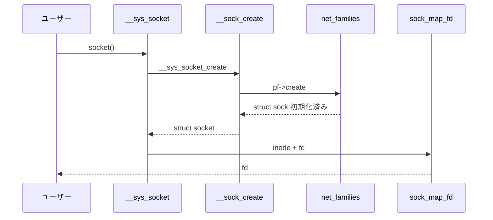

# 第6章 socket システムコール

> **本章で読むソース**
>
> - [`net/socket.c` L1743-L1757](https://github.com/gregkh/linux/blob/v6.18.38/net/socket.c#L1743-L1757)
> - [`net/socket.c` L1535-L1606](https://github.com/gregkh/linux/blob/v6.18.38/net/socket.c#L1535-L1606)
> - [`net/socket.c` L3306-L3334](https://github.com/gregkh/linux/blob/v6.18.38/net/socket.c#L3306-L3334)
> - [`net/socket.c` L1769-L1789](https://github.com/gregkh/linux/blob/v6.18.38/net/socket.c#L1769-L1789)
> - [`net/socket.c` L3301-L3304](https://github.com/gregkh/linux/blob/v6.18.38/net/socket.c#L3301-L3304)
> - [`include/linux/net.h` L232-L248](https://github.com/gregkh/linux/blob/v6.18.38/include/linux/net.h#L232-L248)

## この章の狙い

`socket`、`socketpair` システムコールが `struct socket` を生成し、プロトコルファミリの `create` に渡すまでを読む。
ファイル記述子とソケット inode の対応、LSM チェック、モジュール自動ロードの流れを押さえる。

## 前提

- [第5章](05-struct-sock.md) で `struct sock` の初期化を読んでいること。

## __sys_socket の流れ

[`net/socket.c` L1743-L1757](https://github.com/gregkh/linux/blob/v6.18.38/net/socket.c#L1743-L1757)

```c
int __sys_socket(int family, int type, int protocol)
{
	struct socket *sock;
	int flags;

	sock = __sys_socket_create(family, type,
				   update_socket_protocol(family, type, protocol));
	if (IS_ERR(sock))
		return PTR_ERR(sock);

	flags = type & ~SOCK_TYPE_MASK;
	if (SOCK_NONBLOCK != O_NONBLOCK && (flags & SOCK_NONBLOCK))
		flags = (flags & ~SOCK_NONBLOCK) | O_NONBLOCK;

	return sock_map_fd(sock, flags & (O_CLOEXEC | O_NONBLOCK));
```

`type` の上位ビットに `SOCK_NONBLOCK` と `SOCK_CLOEXEC` が埋め込まれる。
`sock_map_fd` が socket 専用 inode とファイル記述子を割り当てる。

## __sock_create

[`net/socket.c` L1535-L1606](https://github.com/gregkh/linux/blob/v6.18.38/net/socket.c#L1535-L1606)

```c
int __sock_create(struct net *net, int family, int type, int protocol,
			 struct socket **res, int kern)
{
	int err;
	struct socket *sock;
	const struct net_proto_family *pf;

	/*
	 *      Check protocol is in range
	 */
	if (family < 0 || family >= NPROTO)
		return -EAFNOSUPPORT;
	if (type < 0 || type >= SOCK_MAX)
		return -EINVAL;

	/* Compatibility.

	   This uglymoron is moved from INET layer to here to avoid
	   deadlock in module load.
	 */
	if (family == PF_INET && type == SOCK_PACKET) {
		pr_info_once("%s uses obsolete (PF_INET,SOCK_PACKET)\n",
			     current->comm);
		family = PF_PACKET;
	}

	err = security_socket_create(family, type, protocol, kern);
	if (err)
		return err;

	/*
	 *	Allocate the socket and allow the family to set things up. if
	 *	the protocol is 0, the family is instructed to select an appropriate
	 *	default.
	 */
	sock = sock_alloc();
	if (!sock) {
		net_warn_ratelimited("socket: no more sockets\n");
		return -ENFILE;	/* Not exactly a match, but its the
				   closest posix thing */
	}

	sock->type = type;

#ifdef CONFIG_MODULES
	/* Attempt to load a protocol module if the find failed.
	 *
	 * 12/09/1996 Marcin: But! this makes REALLY only sense, if the user
	 * requested real, full-featured networking support upon configuration.
	 * Otherwise module support will break!
	 */
	if (rcu_access_pointer(net_families[family]) == NULL)
		request_module("net-pf-%d", family);
#endif

	rcu_read_lock();
	pf = rcu_dereference(net_families[family]);
	err = -EAFNOSUPPORT;
	if (!pf)
		goto out_release;

	/*
	 * We will call the ->create function, that possibly is in a loadable
	 * module, so we have to bump that loadable module refcnt first.
	 */
	if (!try_module_get(pf->owner))
		goto out_release;

	/* Now protected by module ref count */
	rcu_read_unlock();

	err = pf->create(net, sock, protocol, kern);
```

`security_socket_create` が LSM の第一関門である。
`net_families[family]` は RCU で参照され、モジュールロード中も既存エントリを読める。

## net_proto_family テーブル

[`include/linux/net.h` L38-L55](https://github.com/gregkh/linux/blob/v6.18.38/include/linux/net.h#L38-L55)

```c
 */
enum socket_flags {
	SOCKWQ_ASYNC_NOSPACE,
	SOCKWQ_ASYNC_WAITDATA,
	SOCK_NOSPACE,
	SOCK_SUPPORT_ZC,
	SOCK_CUSTOM_SOCKOPT,
};

#ifndef ARCH_HAS_SOCKET_TYPES
/**
 * enum sock_type - Socket types
 * @SOCK_STREAM: stream (connection) socket
 * @SOCK_DGRAM: datagram (conn.less) socket
 * @SOCK_RAW: raw socket
 * @SOCK_RDM: reliably-delivered message
 * @SOCK_SEQPACKET: sequential packet socket
 * @SOCK_DCCP: Datagram Congestion Control Protocol socket
```

`PF_INET` 登録時に `inet_create` が `create` に入る（第8章）。

## socketpair の fd 予約

[`net/socket.c` L1769-L1789](https://github.com/gregkh/linux/blob/v6.18.38/net/socket.c#L1769-L1789)

```c
int __sys_socketpair(int family, int type, int protocol, int __user *usockvec)
{
	struct socket *sock1, *sock2;
	int fd1, fd2, err;
	struct file *newfile1, *newfile2;
	int flags;

	flags = type & ~SOCK_TYPE_MASK;
	if (flags & ~(SOCK_CLOEXEC | SOCK_NONBLOCK))
		return -EINVAL;
	type &= SOCK_TYPE_MASK;

	if (SOCK_NONBLOCK != O_NONBLOCK && (flags & SOCK_NONBLOCK))
		flags = (flags & ~SOCK_NONBLOCK) | O_NONBLOCK;

	/*
	 * reserve descriptors and make sure we won't fail
	 * to return them to userland.
	 */
	fd1 = get_unused_fd_flags(flags);
	if (unlikely(fd1 < 0))
```

2つの fd を先に確保し、途中失敗でもユーザー空間に片方だけ返さない。

## sock_init と擬似 fs

[`net/socket.c` L3306-L3334](https://github.com/gregkh/linux/blob/v6.18.38/net/socket.c#L3306-L3334)

```c
static int __init sock_init(void)
{
	int err;
	err = net_sysctl_init();
	if (err)
		goto out;

	skb_init();

	init_inodecache();

	err = register_filesystem(&sock_fs_type);
	if (err)
		goto out;
	sock_mnt = kern_mount(&sock_fs_type);
	if (IS_ERR(sock_mnt)) {
		err = PTR_ERR(sock_mnt);
		goto out_mount;
	}
```

ソケットは通常ファイルと同様に VFS を通じて操作される。

## sock_is_registered

[`net/socket.c` L3301-L3304](https://github.com/gregkh/linux/blob/v6.18.38/net/socket.c#L3301-L3304)

```c
bool sock_is_registered(int family)
{
	return family < NPROTO && rcu_access_pointer(net_families[family]);
}
```

## 処理の流れ



## 高速化と最適化の工夫

**`INDIRECT_CALL` なしの create 経路**は一度だけモジュール参照を取り、以降はプロトコル固有の高速パスへ委譲する。

**socket inode キャッシュ**（`init_inodecache`）はソケット生成の SLAB コストを下げる。

**`update_socket_protocol`** は `SOCK_STREAM` と `IPPROTO_IP` の組み合わせを実プロトコル番号へ正規化し、ルックアップを単純化する。

## まとめ

`socket()` は `__sock_create` でファミリ別 `create` を呼び、成功後に fd を返す。
namespace は `current` の `nsproxy` から渡される。
次章では `sendmsg`/`recvmsg` を読む。

## 関連する章

- 前章：[struct sock とソケットオブジェクト](05-struct-sock.md)
- 次章：[sendmsg と recvmsg の一般経路](07-sendmsg-recvmsg.md)
- [PF_INET とプロトコル登録](08-pf-inet-registration.md)
