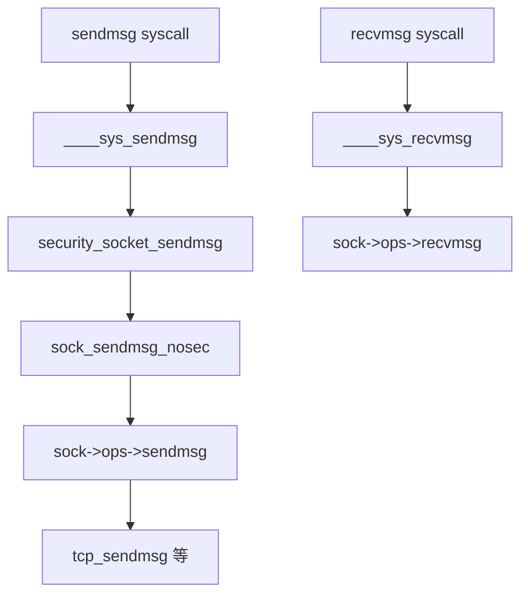

# 第7章 sendmsg と recvmsg の一般経路

> **本章で読むソース**
>
> - [`net/socket.c` L725-L735](https://github.com/gregkh/linux/blob/v6.18.38/net/socket.c#L725-L735)
> - [`net/socket.c` L737-L743](https://github.com/gregkh/linux/blob/v6.18.38/net/socket.c#L737-L743)
> - [`net/socket.c` L753-L770](https://github.com/gregkh/linux/blob/v6.18.38/net/socket.c#L753-L770)
> - [`net/socket.c` L1076-L1085](https://github.com/gregkh/linux/blob/v6.18.38/net/socket.c#L1076-L1085)
> - [`net/socket.c` L2574-L2618](https://github.com/gregkh/linux/blob/v6.18.38/net/socket.c#L2574-L2618)
> - [`net/socket.c` L2825-L2851](https://github.com/gregkh/linux/blob/v6.18.38/net/socket.c#L2825-L2851)

## この章の狙い

データ送受信の共通入口である `sendmsg` と `recvmsg` が、LSM を通過して `sock->ops` のプロトコル実装へ委譲するまでを読む。
`iov_iter`、`msghdr`、アドレスコピーの扱いを押さえる。

## 前提

- [第6章](06-socket-syscalls.md) で `struct socket` 生成を読んでいること。

## sock_sendmsg_nosec と INDIRECT_CALL

[`net/socket.c` L725-L735](https://github.com/gregkh/linux/blob/v6.18.38/net/socket.c#L725-L735)

```c
static inline int sock_sendmsg_nosec(struct socket *sock, struct msghdr *msg)
{
	int ret = INDIRECT_CALL_INET(READ_ONCE(sock->ops)->sendmsg, inet6_sendmsg,
				     inet_sendmsg, sock, msg,
				     msg_data_left(msg));
	BUG_ON(ret == -EIOCBQUEUED);

	if (trace_sock_send_length_enabled())
		call_trace_sock_send_length(sock->sk, ret, 0);
	return ret;
}
```

`INDIRECT_CALL_INET` は IPv4/IPv6 の分岐を間接呼び出し最適化で高速化する。
TCP ストリームソケットでは `inet_sendmsg` → `tcp_sendmsg` へ続く。

## __sock_sendmsg の LSM

[`net/socket.c` L737-L743](https://github.com/gregkh/linux/blob/v6.18.38/net/socket.c#L737-L743)

```c
static int __sock_sendmsg(struct socket *sock, struct msghdr *msg)
{
	int err = security_socket_sendmsg(sock, msg,
					  msg_data_left(msg));

	return err ?: sock_sendmsg_nosec(sock, msg);
}
```

## sock_sendmsg のアドレスコピー

ユーザー指定の宛先アドレスはカーネルスタック上のコピーに差し替えられる。
プロトコルが `msg_name` を書き換えても、呼び出し元のバッファを壊さないためである。

[`net/socket.c` L753-L770](https://github.com/gregkh/linux/blob/v6.18.38/net/socket.c#L753-L770)

```c
int sock_sendmsg(struct socket *sock, struct msghdr *msg)
{
	struct sockaddr_storage *save_addr = (struct sockaddr_storage *)msg->msg_name;
	struct sockaddr_storage address;
	int save_len = msg->msg_namelen;
	int ret;

	if (msg->msg_name) {
		memcpy(&address, msg->msg_name, msg->msg_namelen);
		msg->msg_name = &address;
	}

	ret = __sock_sendmsg(sock, msg);
	msg->msg_name = save_addr;
	msg->msg_namelen = save_len;

	return ret;
}
```

## ____sys_sendmsg

システムコールは `msghdr` をカーネル表現に組み立て、制御メッセージ（cmsg）をコピーしてから `sock_sendmsg_nosec` を呼ぶ。

[`net/socket.c` L2574-L2618](https://github.com/gregkh/linux/blob/v6.18.38/net/socket.c#L2574-L2618)

```c
static int ____sys_sendmsg(struct socket *sock, struct msghdr *msg_sys,
			   unsigned int flags, struct used_address *used_address,
			   unsigned int allowed_msghdr_flags)
{
	unsigned char ctl[sizeof(struct cmsghdr) + 20]
				__aligned(sizeof(__kernel_size_t));
	unsigned char *ctl_buf = ctl;
	int ctl_len;
	ssize_t err;

	err = -ENOBUFS;

	if (msg_sys->msg_controllen > INT_MAX)
		goto out;
	flags |= (msg_sys->msg_flags & allowed_msghdr_flags);
	ctl_len = msg_sys->msg_controllen;
	if ((MSG_CMSG_COMPAT & flags) && ctl_len) {
		err =
		    cmsghdr_from_user_compat_to_kern(msg_sys, sock->sk, ctl,
						     sizeof(ctl));
		if (err)
			goto out;
		ctl_buf = msg_sys->msg_control;
		ctl_len = msg_sys->msg_controllen;
	} else if (ctl_len) {
		BUILD_BUG_ON(sizeof(struct cmsghdr) !=
			     CMSG_ALIGN(sizeof(struct cmsghdr)));
		if (ctl_len > sizeof(ctl)) {
			ctl_buf = sock_kmalloc(sock->sk, ctl_len, GFP_KERNEL);
			if (ctl_buf == NULL)
				goto out;
		}
		err = -EFAULT;
		if (copy_from_user(ctl_buf, msg_sys->msg_control_user, ctl_len))
			goto out_freectl;
		msg_sys->msg_control = ctl_buf;
		msg_sys->msg_control_is_user = false;
	}
	flags &= ~MSG_INTERNAL_SENDMSG_FLAGS;
	msg_sys->msg_flags = flags;

	if (sock->file->f_flags & O_NONBLOCK)
		msg_sys->msg_flags |= MSG_DONTWAIT;
```

小さな cmsg はスタックバッファ `ctl` に収め、大きい場合だけ `sock_kmalloc` する。

## recvmsg 経路

[`net/socket.c` L1076-L1085](https://github.com/gregkh/linux/blob/v6.18.38/net/socket.c#L1076-L1085)

```c
static inline int sock_recvmsg_nosec(struct socket *sock, struct msghdr *msg,
				     int flags)
{
	int ret = INDIRECT_CALL_INET(READ_ONCE(sock->ops)->recvmsg,
				     inet6_recvmsg,
				     inet_recvmsg, sock, msg,
				     msg_data_left(msg), flags);
	if (trace_sock_recv_length_enabled())
		call_trace_sock_recv_length(sock->sk, ret, flags);
	return ret;
```

## ____sys_recvmsg

[`net/socket.c` L2825-L2851](https://github.com/gregkh/linux/blob/v6.18.38/net/socket.c#L2825-L2851)

```c
static int ____sys_recvmsg(struct socket *sock, struct msghdr *msg_sys,
			   struct user_msghdr __user *msg,
			   struct sockaddr __user *uaddr,
			   unsigned int flags, int nosec)
{
	struct compat_msghdr __user *msg_compat =
					(struct compat_msghdr __user *) msg;
	int __user *uaddr_len = COMPAT_NAMELEN(msg);
	struct sockaddr_storage addr;
	unsigned long cmsg_ptr;
	int len;
	ssize_t err;

	msg_sys->msg_name = &addr;
	cmsg_ptr = (unsigned long)msg_sys->msg_control;
	msg_sys->msg_flags = flags & (MSG_CMSG_CLOEXEC|MSG_CMSG_COMPAT);

	msg_sys->msg_namelen = 0;

	if (sock->file->f_flags & O_NONBLOCK)
		flags |= MSG_DONTWAIT;

	if (unlikely(nosec))
		err = sock_recvmsg_nosec(sock, msg_sys, flags);
	else
		err = sock_recvmsg(sock, msg_sys, flags);
```

受信後、必要なら `uaddr` へ送信元アドレスを `copy_to_user` する。

## 処理の流れ



## 高速化と最適化の工夫

**スタック上の cmsg バッファ**は小さな制御メッセージで kmalloc を避ける。

**`INDIRECT_CALL_INET`** は IPv4 が主流なワークロードで分岐予測を助ける。

**`iov_iter`** 統合により、sendfile、splice、io_uring から同じ下層経路を再利用できる。

## まとめ

`sendmsg`/`recvmsg` は socket 層で共通処理を済ませ、プロトコル別 `sendmsg`/`recvmsg` へ委譲する。
TCP/UDP の詳細は各プロトコル実装側で続く。
次章では `PF_INET` 登録を読む。

## 関連する章

- 前章：[socket システムコール](06-socket-syscalls.md)
- 次章：[PF_INET とプロトコル登録](08-pf-inet-registration.md)
- [TCP 送信経路](../part02-tcp/10-tcp-output-path.md)
