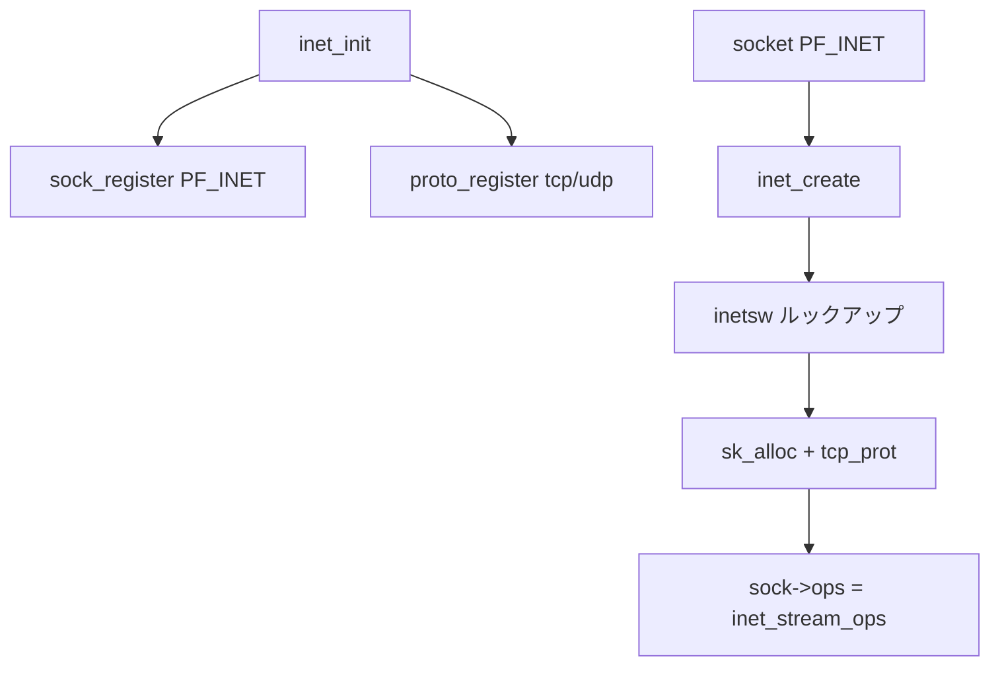

# 第8章 PF_INET とプロトコル登録

> **本章で読むソース**
>
> - [`net/ipv4/af_inet.c` L254-L290](https://github.com/gregkh/linux/blob/v6.18.38/net/ipv4/af_inet.c#L254-L290)
> - [`net/ipv4/af_inet.c` L327-L362](https://github.com/gregkh/linux/blob/v6.18.38/net/ipv4/af_inet.c#L327-L362)
> - [`net/ipv4/af_inet.c` L1146-L1163](https://github.com/gregkh/linux/blob/v6.18.38/net/ipv4/af_inet.c#L1146-L1163)
> - [`net/ipv4/af_inet.c` L1885-L1915](https://github.com/gregkh/linux/blob/v6.18.38/net/ipv4/af_inet.c#L1885-L1915)
> - [`net/socket.c` L1535-L1548](https://github.com/gregkh/linux/blob/v6.18.38/net/socket.c#L1535-L1548)
> - [`include/linux/net.h` L232-L237](https://github.com/gregkh/linux/blob/v6.18.38/include/linux/net.h#L232-L237)

## この章の狙い

IPv4 ソケット生成の入口 `inet_create` と、`inetsw` テーブルによる type/protocol 解決、`inet_init` でのプロトコル登録を読む。
`struct proto`（`tcp_prot`、`udp_prot`）と `proto_ops` の対応を押さえる。

## 前提

- [第6章](06-socket-syscalls.md) で `__sock_create` を読んでいること。

## inet_create のルックアップ

[`net/ipv4/af_inet.c` L254-L290](https://github.com/gregkh/linux/blob/v6.18.38/net/ipv4/af_inet.c#L254-L290)

```c
static int inet_create(struct net *net, struct socket *sock, int protocol,
		       int kern)
{
	struct sock *sk;
	struct inet_protosw *answer;
	struct inet_sock *inet;
	struct proto *answer_prot;
	unsigned char answer_flags;
	int try_loading_module = 0;
	int err;

	if (protocol < 0 || protocol >= IPPROTO_MAX)
		return -EINVAL;

	sock->state = SS_UNCONNECTED;

lookup_protocol:
	err = -ESOCKTNOSUPPORT;
	rcu_read_lock();
	list_for_each_entry_rcu(answer, &inetsw[sock->type], list) {

		err = 0;
		if (protocol == answer->protocol) {
			if (protocol != IPPROTO_IP)
				break;
		} else {
			if (IPPROTO_IP == protocol) {
				protocol = answer->protocol;
				break;
			}
			if (IPPROTO_IP == answer->protocol)
				break;
		}
		err = -EPROTONOSUPPORT;
	}
```

`inetsw[SOCK_STREAM]` には TCP、`SOCK_DGRAM` には UDP が登録される。
`IPPROTO_IP` はワイルドカードとして具体番号へ解決される。

## sk_alloc と sock_init_data

[`net/ipv4/af_inet.c` L327-L362](https://github.com/gregkh/linux/blob/v6.18.38/net/ipv4/af_inet.c#L327-L362)

```c
	sk = sk_alloc(net, PF_INET, GFP_KERNEL, answer_prot, kern);
	if (!sk)
		goto out;

	err = 0;
	if (INET_PROTOSW_REUSE & answer_flags)
		sk->sk_reuse = SK_CAN_REUSE;

	if (INET_PROTOSW_ICSK & answer_flags)
		inet_init_csk_locks(sk);

	inet = inet_sk(sk);
	inet_assign_bit(IS_ICSK, sk, INET_PROTOSW_ICSK & answer_flags);

	inet_clear_bit(NODEFRAG, sk);

	if (SOCK_RAW == sock->type) {
		inet->inet_num = protocol;
		if (IPPROTO_RAW == protocol)
			inet_set_bit(HDRINCL, sk);
	}

	if (READ_ONCE(net->ipv4.sysctl_ip_no_pmtu_disc))
		inet->pmtudisc = IP_PMTUDISC_DONT;
	else
		inet->pmtudisc = IP_PMTUDISC_WANT;

	atomic_set(&inet->inet_id, 0);

	sock_init_data(sock, sk);

	sk->sk_destruct	   = inet_sock_destruct;
	sk->sk_protocol	   = protocol;
	sk->sk_backlog_rcv = sk->sk_prot->backlog_rcv;
	sk->sk_txrehash = READ_ONCE(net->core.sysctl_txrehash);
```

TCP は `INET_PROTOSW_ICSK` 付きで `inet_connection_sock` 用ロックが初期化される。

## inet_family_ops と inetsw_array

[`net/ipv4/af_inet.c` L1146-L1163](https://github.com/gregkh/linux/blob/v6.18.38/net/ipv4/af_inet.c#L1146-L1163)

```c
static const struct net_proto_family inet_family_ops = {
	.family = PF_INET,
	.create = inet_create,
	.owner	= THIS_MODULE,
};

/* Upon startup we insert all the elements in inetsw_array[] into
 * the linked list inetsw.
 */
static struct inet_protosw inetsw_array[] =
{
	{
		.type =       SOCK_STREAM,
		.protocol =   IPPROTO_TCP,
		.prot =       &tcp_prot,
		.ops =        &inet_stream_ops,
		.flags =      INET_PROTOSW_PERMANENT |
			      INET_PROTOSW_ICSK,
```

`ops` は socket 層の `sendmsg`/`recvmsg` 実装（`inet_sendmsg` 等）を指す。
`prot` は `struct sock` 用のプロトコル操作（`connect`、`disconnect`、タイマー）を指す。

## inet_init

ブート時に `proto_register` で SLAB を登録し、`sock_register` で `PF_INET` を公開する。

[`net/ipv4/af_inet.c` L1885-L1915](https://github.com/gregkh/linux/blob/v6.18.38/net/ipv4/af_inet.c#L1885-L1915)

```c
static int __init inet_init(void)
{
	struct inet_protosw *q;
	struct list_head *r;
	int rc;

	sock_skb_cb_check_size(sizeof(struct inet_skb_parm));

	raw_hashinfo_init(&raw_v4_hashinfo);

	rc = proto_register(&tcp_prot, 1);
	if (rc)
		goto out;

	rc = proto_register(&udp_prot, 1);
	if (rc)
		goto out_unregister_tcp_proto;

	rc = proto_register(&raw_prot, 1);
	if (rc)
		goto out_unregister_udp_proto;

	rc = proto_register(&ping_prot, 1);
	if (rc)
		goto out_unregister_raw_proto;

	(void)sock_register(&inet_family_ops);
```

## net_proto_family

[`include/linux/net.h` L232-L237](https://github.com/gregkh/linux/blob/v6.18.38/include/linux/net.h#L232-L237)

```c
struct net_proto_family {
	int		family;
	int		(*create)(struct net *net, struct socket *sock,
				  int protocol, int kern);
	struct module	*owner;
};
```

## __sock_create からの接続

[`net/socket.c` L1535-L1548](https://github.com/gregkh/linux/blob/v6.18.38/net/socket.c#L1535-L1548)

```c
int __sock_create(struct net *net, int family, int type, int protocol,
			 struct socket **res, int kern)
{
	int err;
	struct socket *sock;
	const struct net_proto_family *pf;

	/*
	 *      Check protocol is in range
	 */
	if (family < 0 || family >= NPROTO)
		return -EAFNOSUPPORT;
	if (type < 0 || type >= SOCK_MAX)
		return -EINVAL;
```

`family == PF_INET` のとき `pf->create` は `inet_create` になる。

## 処理の流れ



## 高速化と最適化の工夫

**`proto_register` の SLAB** は `sk_alloc` を高速化し、ソケットごとのゼロ初期化コストを抑える。

**`inetsw` の RCU リスト**はルックアップを読み取り専用で行い、モジュール追加時だけ writer が走る。

**`request_module` フォールバック**（`inet_create` 内）は必要時だけプロトコルモジュールをロードし、起動時間を短く保つ。

## まとめ

`PF_INET` は `inet_family_ops` で登録され、`inet_create` が type/protocol から `tcp_prot` 等を選ぶ。
以降の TCP 処理は `struct proto` と `proto_ops` の二層で進む。
次章から TCP 接続と送受信を読む。

## 関連する章

- 前章：[sendmsg と recvmsg の一般経路](07-sendmsg-recvmsg.md)
- 次章：[TCP 接続の確立とソケット状態](../part02-tcp/09-tcp-connection-establishment.md)
