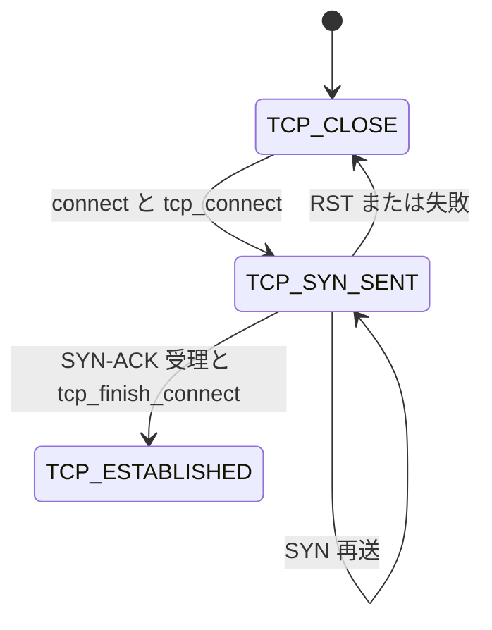

# 第9章 TCP 接続の確立とソケット状態

> **本章で読むソース**
>
> - [`net/ipv4/tcp_ipv4.c` L222-L256](https://github.com/gregkh/linux/blob/v6.18.38/net/ipv4/tcp_ipv4.c#L222-L256)
> - [`net/ipv4/tcp_ipv4.c` L292-L327](https://github.com/gregkh/linux/blob/v6.18.38/net/ipv4/tcp_ipv4.c#L292-L327)
> - [`net/ipv4/tcp_output.c` L4228-L4309](https://github.com/gregkh/linux/blob/v6.18.38/net/ipv4/tcp_output.c#L4228-L4309)
> - [`include/net/tcp_states.h` L12-L35](https://github.com/gregkh/linux/blob/v6.18.38/include/net/tcp_states.h#L12-L35)
> - [`net/ipv4/tcp_input.c` L6913-L6967](https://github.com/gregkh/linux/blob/v6.18.38/net/ipv4/tcp_input.c#L6913-L6967)
> - [`net/ipv4/tcp_input.c` L6616-L6708](https://github.com/gregkh/linux/blob/v6.18.38/net/ipv4/tcp_input.c#L6616-L6708)
> - [`net/ipv4/tcp_input.c` L6738-L6738](https://github.com/gregkh/linux/blob/v6.18.38/net/ipv4/tcp_input.c#L6738-L6738)
> - [`net/ipv4/tcp_input.c` L6497-L6526](https://github.com/gregkh/linux/blob/v6.18.38/net/ipv4/tcp_input.c#L6497-L6526)
> - [`net/ipv4/tcp_ipv4.c` L3490-L3496](https://github.com/gregkh/linux/blob/v6.18.38/net/ipv4/tcp_ipv4.c#L3490-L3496)

## この章の狙い

能動的接続（`connect`）における `tcp_v4_connect` と `tcp_connect`、ソケット状態遷移（`TCP_SYN_SENT` など）を読む。
ルーティング解決、ポート割り当て、SYN 送信までの流れを押さえる。

## 前提

- [第8章](../part01-socket/08-pf-inet-registration.md) で `inet_create` と `tcp_prot` を読んでいること。

## TCP 状態一覧

[`include/net/tcp_states.h` L12-L35](https://github.com/gregkh/linux/blob/v6.18.38/include/net/tcp_states.h#L12-L35)

```c
enum {
	TCP_ESTABLISHED = 1,
	TCP_SYN_SENT,
	TCP_SYN_RECV,
	TCP_FIN_WAIT1,
	TCP_FIN_WAIT2,
	TCP_TIME_WAIT,
	TCP_CLOSE,
	TCP_CLOSE_WAIT,
	TCP_LAST_ACK,
	TCP_LISTEN,
	TCP_CLOSING,	/* Now a valid state */
	TCP_NEW_SYN_RECV,
	TCP_BOUND_INACTIVE, /* Pseudo-state for inet_diag */

	TCP_MAX_STATES	/* Leave at the end! */
};

#define TCP_STATE_MASK	0xF

#define TCP_ACTION_FIN	(1 << TCP_CLOSE)

enum {
	TCPF_ESTABLISHED = (1 << TCP_ESTABLISHED),
```

能動接続は `TCP_CLOSE` → `TCP_SYN_SENT` → `TCP_ESTABLISHED` へ遷移する。

## tcp_v4_connect のルーティング

[`net/ipv4/tcp_ipv4.c` L222-L256](https://github.com/gregkh/linux/blob/v6.18.38/net/ipv4/tcp_ipv4.c#L222-L256)

```c
int tcp_v4_connect(struct sock *sk, struct sockaddr *uaddr, int addr_len)
{
	struct sockaddr_in *usin = (struct sockaddr_in *)uaddr;
	struct inet_timewait_death_row *tcp_death_row;
	struct inet_sock *inet = inet_sk(sk);
	struct tcp_sock *tp = tcp_sk(sk);
	struct ip_options_rcu *inet_opt;
	struct net *net = sock_net(sk);
	__be16 orig_sport, orig_dport;
	__be32 daddr, nexthop;
	struct flowi4 *fl4;
	struct rtable *rt;
	int err;

	if (addr_len < sizeof(struct sockaddr_in))
		return -EINVAL;

	if (usin->sin_family != AF_INET)
		return -EAFNOSUPPORT;

	nexthop = daddr = usin->sin_addr.s_addr;
	inet_opt = rcu_dereference_protected(inet->inet_opt,
					     lockdep_sock_is_held(sk));
	if (inet_opt && inet_opt->opt.srr) {
		if (!daddr)
			return -EINVAL;
		nexthop = inet_opt->opt.faddr;
	}

	orig_sport = inet->inet_sport;
	orig_dport = usin->sin_port;
	fl4 = &inet->cork.fl.u.ip4;
	rt = ip_route_connect(fl4, nexthop, inet->inet_saddr,
			      sk->sk_bound_dev_if, IPPROTO_TCP, orig_sport,
			      orig_dport, sk);
```

`ip_route_connect` が出力インタフェースと nexthop を決める（第14章）。

## ポート割り当てと SYN_SENT

[`net/ipv4/tcp_ipv4.c` L292-L327](https://github.com/gregkh/linux/blob/v6.18.38/net/ipv4/tcp_ipv4.c#L292-L327)

```c
	inet->inet_dport = usin->sin_port;
	sk_daddr_set(sk, daddr);

	inet_csk(sk)->icsk_ext_hdr_len = psp_sk_overhead(sk);
	if (inet_opt)
		inet_csk(sk)->icsk_ext_hdr_len += inet_opt->opt.optlen;

	tp->rx_opt.mss_clamp = TCP_MSS_DEFAULT;

	tcp_set_state(sk, TCP_SYN_SENT);
	err = inet_hash_connect(tcp_death_row, sk);
	if (err)
		goto failure;

	sk_set_txhash(sk);

	rt = ip_route_newports(fl4, rt, orig_sport, orig_dport,
			       inet->inet_sport, inet->inet_dport, sk);
	if (IS_ERR(rt)) {
		err = PTR_ERR(rt);
		rt = NULL;
		goto failure;
	}
	tp->tcp_usec_ts = dst_tcp_usec_ts(&rt->dst);
	sk->sk_gso_type = SKB_GSO_TCPV4;
	sk_setup_caps(sk, &rt->dst);
	rt = NULL;

	if (likely(!tp->repair)) {
		union tcp_seq_and_ts_off st;
```

`inet_hash_connect` がローカルポートを選び、ソケットをハッシュ表へ挿入する。
状態を `TCP_SYN_SENT` にしてから行うため、並行 lookup と整合する。

## tcp_connect と SYN 送信

[`net/ipv4/tcp_output.c` L4228-L4309](https://github.com/gregkh/linux/blob/v6.18.38/net/ipv4/tcp_output.c#L4228-L4309)

```c
int tcp_connect(struct sock *sk)
{
	struct tcp_sock *tp = tcp_sk(sk);
	struct sk_buff *buff;
	int err;

	tcp_call_bpf(sk, BPF_SOCK_OPS_TCP_CONNECT_CB, 0, NULL);

	// ... (中略) ... TCP_MD5SIG / TCP_AO キー検査 ...

	if (inet_csk(sk)->icsk_af_ops->rebuild_header(sk))
		return -EHOSTUNREACH; /* Routing failure or similar. */

	tcp_connect_init(sk);

	if (unlikely(tp->repair)) {
		tcp_finish_connect(sk, NULL);
		return 0;
	}

	buff = tcp_stream_alloc_skb(sk, sk->sk_allocation, true);
	if (unlikely(!buff))
		return -ENOBUFS;

	tcp_init_nondata_skb(buff, sk, tp->write_seq, TCPHDR_SYN);
	tcp_mstamp_refresh(tp);
	tp->retrans_stamp = tcp_time_stamp_ts(tp);
	tcp_connect_queue_skb(sk, buff);
	tcp_ecn_send_syn(sk, buff);
	tcp_rbtree_insert(&sk->tcp_rtx_queue, buff);

	err = tp->fastopen_req ? tcp_send_syn_data(sk, buff) :
	      tcp_transmit_skb(sk, buff, 1, sk->sk_allocation);
```

SYN は再送キューに載せ、`tcp_transmit_skb` で IP 層へ渡される。

## tcp_prot への connect 登録

[`net/ipv4/tcp_ipv4.c` L3490-L3496](https://github.com/gregkh/linux/blob/v6.18.38/net/ipv4/tcp_ipv4.c#L3490-L3496)

```c
struct proto tcp_prot = {
	.name			= "TCP",
	.owner			= THIS_MODULE,
	.close			= tcp_close,
	.pre_connect		= tcp_v4_pre_connect,
	.connect		= tcp_v4_connect,
	.disconnect		= tcp_disconnect,
```

`connect` システムコールは `tcp_prot.connect` → `tcp_v4_connect` → `tcp_connect` へ続く。

## tcp_rcv_state_process と SYN_SENT 分岐

受信セグメントは `tcp_rcv_state_process` が状態に応じて分岐する。
`TCP_SYN_SENT` では `tcp_rcv_synsent_state_process` が SYN-ACK を検証する。

[`net/ipv4/tcp_input.c` L6913-L6967](https://github.com/gregkh/linux/blob/v6.18.38/net/ipv4/tcp_input.c#L6913-L6967)

```c
enum skb_drop_reason
tcp_rcv_state_process(struct sock *sk, struct sk_buff *skb)
{
	struct tcp_sock *tp = tcp_sk(sk);
	struct inet_connection_sock *icsk = inet_csk(sk);
	const struct tcphdr *th = tcp_hdr(skb);
	struct request_sock *req;
	int queued = 0;
	SKB_DR(reason);

	switch (sk->sk_state) {
	case TCP_CLOSE:
		SKB_DR_SET(reason, TCP_CLOSE);
		goto discard;

	case TCP_LISTEN:
		if (th->ack)
			return SKB_DROP_REASON_TCP_FLAGS;
		// ... (中略) ...
	case TCP_SYN_SENT:
		tp->rx_opt.saw_tstamp = 0;
		tcp_mstamp_refresh(tp);
		queued = tcp_rcv_synsent_state_process(sk, skb, th);
		if (queued >= 0)
			return queued;

		/* Do step6 onward by hand. */
		tcp_urg(sk, skb, th);
		__kfree_skb(skb);
		tcp_data_snd_check(sk);
		return 0;
	}
```

## SYN-ACK の ACK 妥当性検査

`tcp_rcv_synsent_state_process` は ACK シーケンスが `snd_una` より新しく `snd_nxt` 以下であることを要求する。
PAWS や RST もここで処理し、不正な SYN-ACK は reset へ落ちる。

[`net/ipv4/tcp_input.c` L6616-L6708](https://github.com/gregkh/linux/blob/v6.18.38/net/ipv4/tcp_input.c#L6616-L6708)

```c
static int tcp_rcv_synsent_state_process(struct sock *sk, struct sk_buff *skb,
					 const struct tcphdr *th)
{
	struct inet_connection_sock *icsk = inet_csk(sk);
	struct tcp_sock *tp = tcp_sk(sk);
	struct tcp_fastopen_cookie foc = { .len = -1 };
	int saved_clamp = tp->rx_opt.mss_clamp;
	bool fastopen_fail;
	SKB_DR(reason);

	tcp_parse_options(sock_net(sk), skb, &tp->rx_opt, 0, &foc);
	if (tp->rx_opt.saw_tstamp && tp->rx_opt.rcv_tsecr)
		tp->rx_opt.rcv_tsecr -= tp->tsoffset;

	if (th->ack) {
		if (!after(TCP_SKB_CB(skb)->ack_seq, tp->snd_una) ||
		    after(TCP_SKB_CB(skb)->ack_seq, tp->snd_nxt)) {
			if (icsk->icsk_retransmits == 0)
				tcp_reset_xmit_timer(sk, ICSK_TIME_RETRANS,
						     TCP_TIMEOUT_MIN, false);
			SKB_DR_SET(reason, TCP_INVALID_ACK_SEQUENCE);
			goto reset_and_undo;
		}
		// ... (中略) PAWS / RST 検査 ...
		if (!th->syn) {
			SKB_DR_SET(reason, TCP_FLAGS);
			goto discard_and_undo;
		}

		tcp_init_wl(tp, TCP_SKB_CB(skb)->seq);
		tcp_try_undo_spurious_syn(sk);
		tcp_ack(sk, skb, FLAG_SLOWPATH);

		WRITE_ONCE(tp->rcv_nxt, TCP_SKB_CB(skb)->seq + 1);
		tp->rcv_wup = TCP_SKB_CB(skb)->seq + 1;
		tp->snd_wnd = ntohs(th->window);
```

SYN フラグ付き ACK が受理されると `rcv_nxt` と受信窓が初期化され、`tcp_ack` で送信側の未確認データが進む。

## tcp_finish_connect と ESTABLISHED 遷移

シーケンス初期化のあと `tcp_finish_connect` が状態を `TCP_ESTABLISHED` にし、輻輳制御と fast path を有効化する。

[`net/ipv4/tcp_input.c` L6738-L6738](https://github.com/gregkh/linux/blob/v6.18.38/net/ipv4/tcp_input.c#L6738-L6738)

```c
		tcp_finish_connect(sk, skb);
```

[`net/ipv4/tcp_input.c` L6497-L6526](https://github.com/gregkh/linux/blob/v6.18.38/net/ipv4/tcp_input.c#L6497-L6526)

```c
void tcp_finish_connect(struct sock *sk, struct sk_buff *skb)
{
	struct tcp_sock *tp = tcp_sk(sk);
	struct inet_connection_sock *icsk = inet_csk(sk);

	tcp_ao_finish_connect(sk, skb);
	tcp_set_state(sk, TCP_ESTABLISHED);
	icsk->icsk_ack.lrcvtime = tcp_jiffies32;

	if (skb) {
		icsk->icsk_af_ops->sk_rx_dst_set(sk, skb);
		security_inet_conn_established(sk, skb);
		sk_mark_napi_id(sk, skb);
	}

	tcp_init_transfer(sk, BPF_SOCK_OPS_ACTIVE_ESTABLISHED_CB, skb);

	tp->lsndtime = tcp_jiffies32;

	if (sock_flag(sk, SOCK_KEEPOPEN))
		tcp_reset_keepalive_timer(sk, keepalive_time_when(tp));

	if (!tp->rx_opt.snd_wscale)
		__tcp_fast_path_on(tp, tp->snd_wnd);
	else
		tp->pred_flags = 0;
}
```

`tcp_init_transfer` 内で `tcp_init_congestion_control` が呼ばれ、以降の ACK で cwnd が更新される準備が整う。

## inet_csk_init_xmit_timers

[`net/ipv4/inet_connection_sock.c` L744-L758](https://github.com/gregkh/linux/blob/v6.18.38/net/ipv4/inet_connection_sock.c#L744-L758)

```c
void inet_csk_init_xmit_timers(struct sock *sk,
			       void (*retransmit_handler)(struct timer_list *t),
			       void (*delack_handler)(struct timer_list *t),
			       void (*keepalive_handler)(struct timer_list *t))
{
	struct inet_connection_sock *icsk = inet_csk(sk);

	timer_setup(&icsk->icsk_retransmit_timer, retransmit_handler, 0);
	timer_setup(&icsk->icsk_delack_timer, delack_handler, 0);
	timer_setup(&sk->sk_timer, keepalive_handler, 0);
	icsk->icsk_pending = icsk->icsk_ack.pending = 0;
}
```

## 処理の流れ



能動接続の確立条件は、送信済み SYN の ACK（`snd_una` 進行）と SYN フラグ付き応答の両方である。
ACK だけ、または SYN だけでは `tcp_finish_connect` へ進まない。

## 高速化と最適化の工夫

**`inet_hash_connect` のポート選択**は death row（TIME_WAIT ソケット）と連携し、四つ組の再利用を安全に行う。

**`sk_set_txhash`** は送信パケットのキュー選択を安定させ、多キュー NIC でキャッシュ局所性を上げる。

**Fast Open 経路**（別分岐）は RTT を省略できるが、本章では通常の 3 ウェイハンドシェイクを主とする。

## まとめ

能動接続はルーティングとポート割り当ての後 `TCP_SYN_SENT` となり、`tcp_connect` が SYN を送出する。
SYN-ACK 受信時は `tcp_rcv_synsent_state_process` が ACK を検証し、`tcp_finish_connect` で `TCP_ESTABLISHED` へ遷移する。
次章では送信経路を読む。

## 関連する章

- 前章：[PF_INET とプロトコル登録](../part01-socket/08-pf-inet-registration.md)
- 次章：[TCP 送信経路とセグメント化](10-tcp-output-path.md)
- [FIB とルーティング検索](../part03-ipv4/14-fib-routing-lookup.md)
