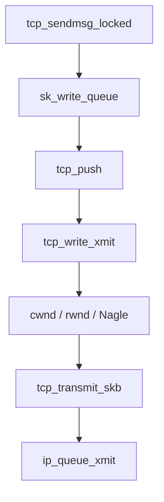

# 第10章 TCP 送信経路とセグメント化

> **本章で読むソース**
>
> - [`net/ipv4/tcp.c` L1079-L1120](https://github.com/gregkh/linux/blob/v6.18.38/net/ipv4/tcp.c#L1079-L1120)
> - [`net/ipv4/tcp.c` L1197-L1230](https://github.com/gregkh/linux/blob/v6.18.38/net/ipv4/tcp.c#L1197-L1230)
> - [`net/ipv4/tcp.c` L746-L778](https://github.com/gregkh/linux/blob/v6.18.38/net/ipv4/tcp.c#L746-L778)
> - [`net/ipv4/tcp_output.c` L1447-L1531](https://github.com/gregkh/linux/blob/v6.18.38/net/ipv4/tcp_output.c#L1447-L1531)
> - [`net/ipv4/tcp_output.c` L1630-L1642](https://github.com/gregkh/linux/blob/v6.18.38/net/ipv4/tcp_output.c#L1630-L1642)
> - [`net/ipv4/tcp_output.c` L2880-L2906](https://github.com/gregkh/linux/blob/v6.18.38/net/ipv4/tcp_output.c#L2880-L2906)
> - [`net/ipv4/tcp_output.c` L2908-L2955](https://github.com/gregkh/linux/blob/v6.18.38/net/ipv4/tcp_output.c#L2908-L2955)
> - [`net/ipv4/tcp_output.c` L3151-L3175](https://github.com/gregkh/linux/blob/v6.18.38/net/ipv4/tcp_output.c#L3151-L3175)

## この章の狙い

`tcp_sendmsg` から `tcp_write_xmit`、TSO/GSO によるセグメント化、`tcp_transmit_skb` までの送信 hot path を読む。
cwnd、rwnd、Nagle、パーシングが送信をどう制限するかを押さえる。

## 前提

- [第9章](09-tcp-connection-establishment.md) で TCP 接続確立を読んでいること。

## tcp_sendmsg_locked と write queue への skb 生成

`sendmsg` は `tcp_sendmsg_locked` が `sk_write_queue` に skb を積み、ユーザーデータをコピーする。

[`net/ipv4/tcp.c` L1079-L1120](https://github.com/gregkh/linux/blob/v6.18.38/net/ipv4/tcp.c#L1079-L1120)

```c
int tcp_sendmsg_locked(struct sock *sk, struct msghdr *msg, size_t size)
{
	struct net_devmem_dmabuf_binding *binding = NULL;
	struct tcp_sock *tp = tcp_sk(sk);
	struct ubuf_info *uarg = NULL;
	struct sk_buff *skb;
	struct sockcm_cookie sockc;
	int flags, err, copied = 0;
	int mss_now = 0, size_goal, copied_syn = 0;
	int process_backlog = 0;
	int sockc_err = 0;
	int zc = 0;
	long timeo;

	flags = msg->msg_flags;

	sockc = (struct sockcm_cookie){ .tsflags = READ_ONCE(sk->sk_tsflags) };
	if (msg->msg_controllen) {
		sockc_err = sock_cmsg_send(sk, msg, &sockc);
	}
```

[`net/ipv4/tcp.c` L1197-L1230](https://github.com/gregkh/linux/blob/v6.18.38/net/ipv4/tcp.c#L1197-L1230)

```c
	while (msg_data_left(msg)) {
		int copy = 0;

		skb = tcp_write_queue_tail(sk);
		if (skb)
			copy = size_goal - skb->len;

		trace_tcp_sendmsg_locked(sk, msg, skb, size_goal);

		if (copy <= 0 || !tcp_skb_can_collapse_to(skb)) {
			bool first_skb;

new_segment:
			if (!sk_stream_memory_free(sk))
				goto wait_for_space;
			first_skb = tcp_rtx_and_write_queues_empty(sk);
			skb = tcp_stream_alloc_skb(sk, sk->sk_allocation,
						   first_skb);
			if (!skb)
				goto wait_for_space;
			tcp_skb_entail(sk, skb);
			copy = size_goal;
		}
```

末尾 skb に載せきれなければ `tcp_stream_alloc_skb` で新セグメントを確保し `tcp_skb_entail` でキューへ連結する。

## tcp_push と tcp_write_xmit

送信を実際に起こすのは `tcp_push` で、末尾で `__tcp_push_pending_frames` が `tcp_write_xmit` を呼ぶ。

[`net/ipv4/tcp.c` L746-L778](https://github.com/gregkh/linux/blob/v6.18.38/net/ipv4/tcp.c#L746-L778)

```c
void tcp_push(struct sock *sk, int flags, int mss_now,
	      int nonagle, int size_goal)
{
	struct tcp_sock *tp = tcp_sk(sk);
	struct sk_buff *skb;

	skb = tcp_write_queue_tail(sk);
	if (!skb)
		return;
	if (!(flags & MSG_MORE) || forced_push(tp))
		tcp_mark_push(tp, skb);

	tcp_mark_urg(tp, flags);

	if (tcp_should_autocork(sk, skb, size_goal)) {
		if (!test_bit(TSQ_THROTTLED, &sk->sk_tsq_flags)) {
			NET_INC_STATS(sock_net(sk), LINUX_MIB_TCPAUTOCORKING);
			set_bit(TSQ_THROTTLED, &sk->sk_tsq_flags);
			smp_mb__after_atomic();
		}
		if (refcount_read(&sk->sk_wmem_alloc) > skb->truesize)
			return;
	}

	if (flags & MSG_MORE)
		nonagle = TCP_NAGLE_CORK;

	__tcp_push_pending_frames(sk, mss_now, nonagle);
}
```

## tcp_write_xmit の役割

送信キュー先頭からパケットを取り出し、cwnd と rwnd を検査してから `tcp_transmit_skb` へ進む。

[`net/ipv4/tcp_output.c` L2880-L2906](https://github.com/gregkh/linux/blob/v6.18.38/net/ipv4/tcp_output.c#L2880-L2906)

```c
static bool tcp_write_xmit(struct sock *sk, unsigned int mss_now, int nonagle,
			   int push_one, gfp_t gfp)
{
	struct tcp_sock *tp = tcp_sk(sk);
	struct sk_buff *skb;
	unsigned int tso_segs, sent_pkts;
	u32 cwnd_quota, max_segs;
	int result;
	bool is_cwnd_limited = false, is_rwnd_limited = false;

	sent_pkts = 0;

	tcp_mstamp_refresh(tp);

	/* AccECN option beacon depends on mstamp, it may change mss */
	if (tcp_ecn_mode_accecn(tp) && tcp_accecn_option_beacon_check(sk))
		mss_now = tcp_current_mss(sk);

	if (!push_one) {
		/* Do MTU probing. */
		result = tcp_mtu_probe(sk);
		if (!result) {
			return false;
		} else if (result > 0) {
			sent_pkts = 1;
		}
	}
```

## cwnd と Nagle の検査

[`net/ipv4/tcp_output.c` L2908-L2955](https://github.com/gregkh/linux/blob/v6.18.38/net/ipv4/tcp_output.c#L2908-L2955)

```c
	while ((skb = tcp_send_head(sk))) {
		unsigned int limit;
		int missing_bytes;

		if (tcp_pacing_check(sk))
			break;

		cwnd_quota = tcp_cwnd_test(tp);
		if (!cwnd_quota) {
			if (push_one == 2)
				cwnd_quota = 1;
			else
				break;
		}
		cwnd_quota = min(cwnd_quota, max_segs);
		missing_bytes = cwnd_quota * mss_now - skb->len;
		if (missing_bytes > 0)
			tcp_grow_skb(sk, skb, missing_bytes);

		tso_segs = tcp_set_skb_tso_segs(skb, mss_now);

		if (unlikely(!tcp_snd_wnd_test(tp, skb, mss_now))) {
			is_rwnd_limited = true;
			break;
		}

		if (tso_segs == 1) {
			if (unlikely(!tcp_nagle_test(tp, skb, mss_now,
						     (tcp_skb_is_last(sk, skb) ?
						      nonagle : TCP_NAGLE_PUSH))))
				break;
		} else {
			if (!push_one &&
			    tcp_tso_should_defer(sk, skb, &is_cwnd_limited,
						 &is_rwnd_limited, max_segs))
				break;
		}
```

`tcp_pacing_check` が真なら送信を一時停止し、レート制御する（第12章の輻輳制御と連動）。

## __tcp_transmit_skb と IP 層への投入

`tcp_transmit_skb` は `__tcp_transmit_skb` へ委譲する。
ここで TCP ヘッダを構築し、チェックサム後に `icsk_af_ops->queue_xmit` で IPv4/IPv6 へ渡す。

[`net/ipv4/tcp_output.c` L1447-L1531](https://github.com/gregkh/linux/blob/v6.18.38/net/ipv4/tcp_output.c#L1447-L1531)

```c
static int __tcp_transmit_skb(struct sock *sk, struct sk_buff *skb,
			      int clone_it, gfp_t gfp_mask, u32 rcv_nxt)
{
	const struct inet_connection_sock *icsk = inet_csk(sk);
	struct inet_sock *inet;
	struct tcp_sock *tp;
	struct tcp_skb_cb *tcb;
	struct tcp_out_options opts;
	unsigned int tcp_options_size, tcp_header_size;
	struct sk_buff *oskb = NULL;
	struct tcp_key key;
	struct tcphdr *th;
	u64 prior_wstamp;
	int err;

	BUG_ON(!skb || !tcp_skb_pcount(skb));
	tp = tcp_sk(sk);
	// ... (中略) clone 処理 ...
	inet = inet_sk(sk);
	tcb = TCP_SKB_CB(skb);
	memset(&opts, 0, sizeof(opts));

	tcp_get_current_key(sk, &key);
	if (unlikely(tcb->tcp_flags & TCPHDR_SYN)) {
		tcp_options_size = tcp_syn_options(sk, skb, &opts, &key);
	} else {
		tcp_options_size = tcp_established_options(sk, skb, &opts, &key);
		if (tcp_skb_pcount(skb) > 1)
			tcb->tcp_flags |= TCPHDR_PSH;
	}
	tcp_header_size = tcp_options_size + sizeof(struct tcphdr);
	skb_push(skb, tcp_header_size);
	skb_reset_transport_header(skb);
```

[`net/ipv4/tcp_output.c` L1630-L1642](https://github.com/gregkh/linux/blob/v6.18.38/net/ipv4/tcp_output.c#L1630-L1642)

```c
	err = INDIRECT_CALL_INET(icsk->icsk_af_ops->queue_xmit,
				 inet6_csk_xmit, ip_queue_xmit,
				 sk, skb, &inet->cork.fl);

	if (unlikely(err > 0)) {
		tcp_enter_cwr(sk);
		err = net_xmit_eval(err);
	}
	if (!err && oskb) {
		tcp_update_skb_after_send(sk, oskb, prior_wstamp);
		tcp_rate_skb_sent(sk, oskb);
	}
	return err;
}
```

`INDIRECT_CALL_INET` は IPv4 向けに `ip_queue_xmit` への直接呼び出しを最適化する。

## TSO セグメント数

[`include/net/tcp.h` L1126-L1134](https://github.com/gregkh/linux/blob/v6.18.38/include/net/tcp.h#L1126-L1134)

```c
static inline int tcp_skb_pcount(const struct sk_buff *skb)
{
	return TCP_SKB_CB(skb)->tcp_gso_segs;
}

static inline void tcp_skb_pcount_set(struct sk_buff *skb, int segs)
{
	TCP_SKB_CB(skb)->tcp_gso_segs = segs;
}
```

## __tcp_push_pending_frames

[`net/ipv4/tcp_output.c` L3151-L3175](https://github.com/gregkh/linux/blob/v6.18.38/net/ipv4/tcp_output.c#L3151-L3175)

```c
void __tcp_push_pending_frames(struct sock *sk, unsigned int cur_mss,
			       int nonagle)
{
	if (unlikely(sk->sk_state == TCP_CLOSE))
		return;

	if (tcp_write_xmit(sk, cur_mss, nonagle, 0,
			   sk_gfp_mask(sk, GFP_ATOMIC)))
		tcp_check_probe_timer(sk);
}

void tcp_push_one(struct sock *sk, unsigned int mss_now)
{
	struct sk_buff *skb = tcp_send_head(sk);

	BUG_ON(!skb || skb->len < mss_now);

	tcp_write_xmit(sk, mss_now, TCP_NAGLE_PUSH, 1, sk->sk_allocation);
}
```

## 処理の流れ



## 高速化と最適化の工夫

**TSO/GSO** はカーネルと NIC の境界でセグメント分割を遅延し、システムコールあたりのパケット数を減らす。

**`tcp_grow_skb`** は cwnd 枠内で skb をまとめ、小さなセグメント乱発を抑える。

**パーシング（`tcp_pacing_check`）** はバースト送信を平準化し、バッファブロートを減らす。

> **7.x 系での変化**
> [`net/ipv4/tcp_output.c` L433-L444](https://github.com/gregkh/linux/blob/v7.1.3/net/ipv4/tcp_output.c#L433-L444) では `struct tcp_out_options` の一部フィールドが `struct_group(cleared, ...)` にまとめられ、`__tcp_transmit_skb` 入口でまとめてゼロクリアする対象が明示化されている。

## まとめ

TCP 送信は書き込みキューにデータを載せ、`tcp_write_xmit` が輻輳と受信窓を見ながら `tcp_transmit_skb` を呼ぶ。
次章では受信と ACK 処理を読む。

## 関連する章

- 前章：[TCP 接続の確立とソケット状態](09-tcp-connection-establishment.md)
- 次章：[TCP 受信経路と ACK 処理](11-tcp-input-ack.md)
- [IPv4 出力](../part03-ipv4/13-ipv4-output.md)
