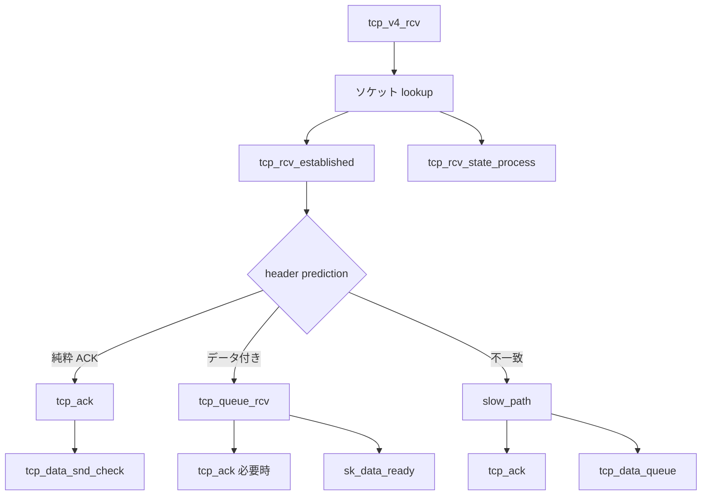

# 第11章 TCP 受信経路と ACK 処理

> **本章で読むソース**
>
> - [`net/ipv4/tcp_input.c` L3985-L4000](https://github.com/gregkh/linux/blob/v6.18.38/net/ipv4/tcp_input.c#L3985-L4000)
> - [`net/ipv4/tcp_input.c` L4014-L4040](https://github.com/gregkh/linux/blob/v6.18.38/net/ipv4/tcp_input.c#L4014-L4040)
> - [`net/ipv4/tcp_ipv4.c` L2206-L2230](https://github.com/gregkh/linux/blob/v6.18.38/net/ipv4/tcp_ipv4.c#L2206-L2230)
> - [`net/ipv4/tcp_input.c` L5890-L5912](https://github.com/gregkh/linux/blob/v6.18.38/net/ipv4/tcp_input.c#L5890-L5912)
> - [`net/ipv4/tcp_input.c` L3733-L3754](https://github.com/gregkh/linux/blob/v6.18.38/net/ipv4/tcp_input.c#L3733-L3754)
> - [`net/ipv4/tcp_input.c` L6263-L6364](https://github.com/gregkh/linux/blob/v6.18.38/net/ipv4/tcp_input.c#L6263-L6364)
> - [`net/ipv4/tcp_input.c` L6394-L6418](https://github.com/gregkh/linux/blob/v6.18.38/net/ipv4/tcp_input.c#L6394-L6418)
> - [`net/ipv4/tcp_input.c` L6441-L6454](https://github.com/gregkh/linux/blob/v6.18.38/net/ipv4/tcp_input.c#L6441-L6454)

## この章の狙い

IPv4 から届く TCP セグメントの入口 `tcp_v4_rcv` と、受信状態機械の中核 `tcp_ack` を読む。
ACK による送信窓更新、重複 ACK、チャレンジ ACK の防御を押さえる。

## 前提

- [第10章](10-tcp-output-path.md) で送信と再送キューを読んでいること。

## tcp_v4_rcv 入口

IP 層はプロトコルハンドラとして `tcp_v4_rcv` を呼ぶ。

[`net/ipv4/tcp_ipv4.c` L2206-L2230](https://github.com/gregkh/linux/blob/v6.18.38/net/ipv4/tcp_ipv4.c#L2206-L2230)

```c
int tcp_v4_rcv(struct sk_buff *skb)
{
	struct net *net = dev_net_rcu(skb->dev);
	enum skb_drop_reason drop_reason;
	enum tcp_tw_status tw_status;
	int sdif = inet_sdif(skb);
	int dif = inet_iif(skb);
	const struct iphdr *iph;
	const struct tcphdr *th;
	struct sock *sk = NULL;
	bool refcounted;
	int ret;
	u32 isn;

	drop_reason = SKB_DROP_REASON_NOT_SPECIFIED;
	if (skb->pkt_type != PACKET_HOST)
		goto discard_it;

	__TCP_INC_STATS(net, TCP_MIB_INSEGS);

	if (!pskb_may_pull(skb, sizeof(struct tcphdr)))
		goto discard_it;

	th = (const struct tcphdr *)skb->data;
```

ソケット lookup 後、確立済み接続は `tcp_rcv_established`、それ以外は `tcp_rcv_state_process` へ分岐する。

## tcp_rcv_established と header prediction

確立済み接続の hot path は `tcp_rcv_established` が担う。
`pred_flags` とシーケンスが一致すれば header prediction で ACK だけ、またはデータ付き ACK を処理する。

[`net/ipv4/tcp_input.c` L6263-L6364](https://github.com/gregkh/linux/blob/v6.18.38/net/ipv4/tcp_input.c#L6263-L6364)

```c
void tcp_rcv_established(struct sock *sk, struct sk_buff *skb)
{
	enum skb_drop_reason reason = SKB_DROP_REASON_NOT_SPECIFIED;
	const struct tcphdr *th = (const struct tcphdr *)skb->data;
	struct tcp_sock *tp = tcp_sk(sk);
	unsigned int len = skb->len;

	trace_tcp_probe(sk, skb);

	tcp_mstamp_refresh(tp);
	if (unlikely(!rcu_access_pointer(sk->sk_rx_dst)))
		inet_csk(sk)->icsk_af_ops->sk_rx_dst_set(sk, skb);

	tp->rx_opt.saw_tstamp = 0;
	tp->rx_opt.accecn = 0;

	if ((tcp_flag_word(th) & TCP_HP_BITS) == tp->pred_flags &&
	    TCP_SKB_CB(skb)->seq == tp->rcv_nxt &&
	    !after(TCP_SKB_CB(skb)->ack_seq, tp->snd_nxt)) {
		int tcp_header_len = tp->tcp_header_len;
		s32 delta = 0;
		int flag = 0;
		// ... (中略) タイムスタンプ検査 ...
		if (len <= tcp_header_len) {
			if (len == tcp_header_len) {
				tcp_ack(sk, skb, flag);
				__kfree_skb(skb);
				tcp_data_snd_check(sk);
				tp->rcv_rtt_last_tsecr = tp->rx_opt.rcv_tsecr;
				return;
			} else { /* Header too small */
				reason = SKB_DROP_REASON_PKT_TOO_SMALL;
				TCP_INC_STATS(sock_net(sk), TCP_MIB_INERRS);
				goto discard;
			}
		}
```

純粋 ACK は `tcp_ack` のあと skb を即解放し、データ送信の余地を `tcp_data_snd_check` で確認する。

## データ受信と sk_data_ready

ペイロード付きセグメントは `tcp_queue_rcv` で受信キューへ載せ、必要なら `tcp_ack` 後に `tcp_data_ready` でユーザーへ通知する。

[`net/ipv4/tcp_input.c` L6394-L6418](https://github.com/gregkh/linux/blob/v6.18.38/net/ipv4/tcp_input.c#L6394-L6418)

```c
			tcp_cleanup_skb(skb);
			__skb_pull(skb, tcp_header_len);
			tcp_ecn_received_counters(sk, skb,
						  len - tcp_header_len);
			eaten = tcp_queue_rcv(sk, skb, &fragstolen);

			tcp_event_data_recv(sk, skb);

			if (TCP_SKB_CB(skb)->ack_seq != tp->snd_una) {
				tcp_ack(sk, skb, flag | FLAG_DATA);
				tcp_data_snd_check(sk);
				if (!inet_csk_ack_scheduled(sk))
					goto no_ack;
			} else {
				tcp_update_wl(tp, TCP_SKB_CB(skb)->seq);
			}

			__tcp_ack_snd_check(sk, 0);
no_ack:
			if (eaten)
				kfree_skb_partial(skb, fragstolen);
			tcp_data_ready(sk);
			return;
```

順序外セグメントは prediction を外れ、`slow_path` で `tcp_data_queue` が out-of-order queue を扱う。

[`net/ipv4/tcp_input.c` L6441-L6454](https://github.com/gregkh/linux/blob/v6.18.38/net/ipv4/tcp_input.c#L6441-L6454)

```c
	reason = tcp_ack(sk, skb, FLAG_SLOWPATH | FLAG_UPDATE_TS_RECENT);
	if ((int)reason < 0) {
		reason = -reason;
		goto discard;
	}
	tcp_rcv_rtt_measure_ts(sk, skb);

	tcp_urg(sk, skb, th);

	tcp_data_queue(sk, skb);

	tcp_data_snd_check(sk);
```

## tcp_ack の概要

[`net/ipv4/tcp_input.c` L3985-L4000](https://github.com/gregkh/linux/blob/v6.18.38/net/ipv4/tcp_input.c#L3985-L4000)

```c
static int tcp_ack(struct sock *sk, const struct sk_buff *skb, int flag)
{
	struct inet_connection_sock *icsk = inet_csk(sk);
	struct tcp_sock *tp = tcp_sk(sk);
	struct tcp_sacktag_state sack_state;
	struct rate_sample rs = { .prior_delivered = 0 };
	u32 prior_snd_una = tp->snd_una;
	bool is_sack_reneg = tp->is_sack_reneg;
	u32 ack_seq = TCP_SKB_CB(skb)->seq;
	u32 ack = TCP_SKB_CB(skb)->ack_seq;
	int num_dupack = 0;
	int prior_packets = tp->packets_out;
	u32 delivered = tp->delivered;
	u32 lost = tp->lost;
	int rexmit = REXMIT_NONE; /* Flag to (re)transmit to recover losses */
	u32 ecn_count = 0;	  /* Did we receive ECE/an AccECN ACE update? */
```

`ack` は相手が受信済みと宣言する送信シーケンスの次値である。

## 古い ACK とチャレンジ ACK

[`net/ipv4/tcp_input.c` L4014-L4040](https://github.com/gregkh/linux/blob/v6.18.38/net/ipv4/tcp_input.c#L4014-L4040)

```c
	if (before(ack, prior_snd_una)) {
		u32 max_window;

		max_window = min_t(u64, tp->max_window, tp->bytes_acked);
		if (before(ack, prior_snd_una - max_window)) {
			if (!(flag & FLAG_NO_CHALLENGE_ACK))
				tcp_send_challenge_ack(sk, false);
			return -SKB_DROP_REASON_TCP_TOO_OLD_ACK;
		}
		goto old_ack;
	}

	if (after(ack, tp->snd_nxt)) {
		if (!(flag & FLAG_NO_CHALLENGE_ACK))
			tcp_send_challenge_ack(sk, false);
		return -SKB_DROP_REASON_TCP_ACK_UNSENT_DATA;
	}

	if (after(ack, prior_snd_una)) {
		flag |= FLAG_SND_UNA_ADVANCED;
		WRITE_ONCE(icsk->icsk_retransmits, 0);
	}
```

RFC 5961 に沿い、異常 ACK にはチャレンジ ACK で応答する。

## 受信窓の更新

[`net/ipv4/tcp_input.c` L3733-L3754](https://github.com/gregkh/linux/blob/v6.18.38/net/ipv4/tcp_input.c#L3733-L3754)

```c
static int tcp_ack_update_window(struct sock *sk, const struct sk_buff *skb, u32 ack,
				 u32 ack_seq)
{
	struct tcp_sock *tp = tcp_sk(sk);
	int flag = 0;
	u32 nwin = ntohs(tcp_hdr(skb)->window);

	if (likely(!tcp_hdr(skb)->syn))
		nwin <<= tp->rx_opt.snd_wscale;

	if (tcp_may_update_window(tp, ack, ack_seq, nwin)) {
		flag |= FLAG_WIN_UPDATE;
		tcp_update_wl(tp, ack_seq);

		if (tp->snd_wnd != nwin) {
			tp->snd_wnd = nwin;

			tp->pred_flags = 0;
			tcp_fast_path_check(sk);
```

ウィンドウスケールオプションは `snd_wscale` で解釈する。

## 遅延 ACK

[`net/ipv4/tcp_input.c` L5890-L5912](https://github.com/gregkh/linux/blob/v6.18.38/net/ipv4/tcp_input.c#L5890-L5912)

```c
static void __tcp_ack_snd_check(struct sock *sk, int ofo_possible)
{
	struct tcp_sock *tp = tcp_sk(sk);
	unsigned long rtt, delay;

	if (((tp->rcv_nxt - tp->rcv_wup) > inet_csk(sk)->icsk_ack.rcv_mss &&
	    (tp->rcv_nxt - tp->copied_seq < sk->sk_rcvlowat ||
	     __tcp_select_window(sk) >= tp->rcv_wnd)) ||
	    tcp_in_quickack_mode(sk) ||
	    inet_csk(sk)->icsk_ack.pending & ICSK_ACK_NOW) {
		if (sock_owned_by_user_nocheck(sk) &&
		    READ_ONCE(sock_net(sk)->ipv4.sysctl_tcp_backlog_ack_defer)) {
```

一定量受信するまで ACK を遅延し、逆方向トラフィックを減らす。



## 高速化と最適化の工夫

**早期デマルチプレックス（`tcp_v4_early_demux`）** はルーティング後にソケットを先に結び、確立済み接続の lookup コストを下げる。

**遅延 ACK** は小パケットの ACK 乱発を抑え、CPU と帯域を節約する。

**SACK 処理** は `tcp_sacktag_write_queue` で再送対象だけを選び、全体再送を避ける。

> **7.x 系での変化**
> [`net/ipv4/tcp_input.c` L929-L940](https://github.com/gregkh/linux/blob/v7.1.3/net/ipv4/tcp_input.c#L929-L940) では `tcp_rcvbuf_grow` が低 RTT 接続向けに `sysctl_tcp_rcvbuf_low_rtt` を参照し、受信バッファの伸び方を RTT 比例に抑える分岐が追加されている。
> 高スループットかつ短 RTT のワークロードで `sk_rcvbuf` の過大化を避けるのが目的である。

## まとめ

受信は `tcp_v4_rcv` から始まり、`tcp_ack` が送信側状態を更新する。
データは `sk_receive_queue` へ載り、`sk_data_ready` でユーザーへ通知される。
次章では輻輳制御と再送タイマーを読む。

## 関連する章

- 前章：[TCP 送信経路とセグメント化](10-tcp-output-path.md)
- 次章：[輻輳制御と再送タイマー](12-tcp-congestion-retransmit.md)
- [IPv4 入力](../part03-ipv4/15-ipv4-input-delivery.md)
