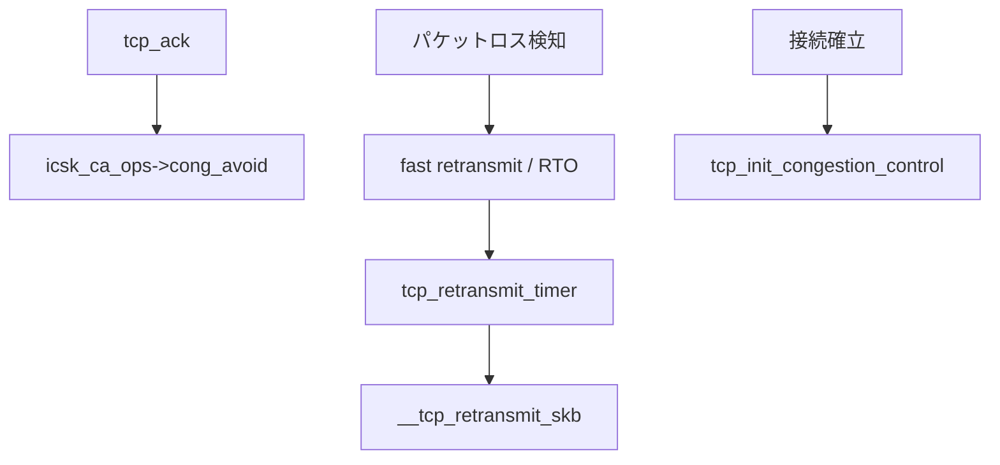

# 第12章 輻輳制御と再送タイマー

> **本章で読むソース**
>
> - [`net/ipv4/tcp_cong.c` L236-L248](https://github.com/gregkh/linux/blob/v6.18.38/net/ipv4/tcp_cong.c#L236-L248)
> - [`net/ipv4/tcp_cong.c` L93-L109](https://github.com/gregkh/linux/blob/v6.18.38/net/ipv4/tcp_cong.c#L93-L109)
> - [`net/ipv4/tcp_timer.c` L532-L557](https://github.com/gregkh/linux/blob/v6.18.38/net/ipv4/tcp_timer.c#L532-L557)
> - [`net/ipv4/tcp_timer.c` L701-L718](https://github.com/gregkh/linux/blob/v6.18.38/net/ipv4/tcp_timer.c#L701-L718)
> - [`net/ipv4/tcp_timer.c` L727-L744](https://github.com/gregkh/linux/blob/v6.18.38/net/ipv4/tcp_timer.c#L727-L744)
> - [`include/net/tcp.h` L1427-L1436](https://github.com/gregkh/linux/blob/v6.18.38/include/net/tcp.h#L1427-L1436)
> - [`net/ipv4/tcp_input.c` L3640-L3657](https://github.com/gregkh/linux/blob/v6.18.38/net/ipv4/tcp_input.c#L3640-L3657)
> - [`net/ipv4/tcp_input.c` L4125-L4151](https://github.com/gregkh/linux/blob/v6.18.38/net/ipv4/tcp_input.c#L4125-L4151)
> - [`net/ipv4/tcp_output.c` L3466-L3538](https://github.com/gregkh/linux/blob/v6.18.38/net/ipv4/tcp_output.c#L3466-L3538)

## この章の狙い

TCP の輻輳制御アルゴリズム（CA）の登録と初期化、RTO タイマーによる再送を読む。
`icsk_ca_ops` と `tcp_retransmit_timer` の関係を押さえる。

## 前提

- [第10章](10-tcp-output-path.md) と [第11章](11-tcp-input-ack.md) で送受信と ACK を読んでいること。

## tcp_init_congestion_control

接続ごとに CA（cubic、reno など）の `init` が呼ばれる。

[`net/ipv4/tcp_cong.c` L236-L248](https://github.com/gregkh/linux/blob/v6.18.38/net/ipv4/tcp_cong.c#L236-L248)

```c
void tcp_init_congestion_control(struct sock *sk)
{
	struct inet_connection_sock *icsk = inet_csk(sk);

	tcp_sk(sk)->prior_ssthresh = 0;
	if (icsk->icsk_ca_ops->init)
		icsk->icsk_ca_ops->init(sk);
	if (tcp_ca_needs_ecn(sk))
		INET_ECN_xmit(sk);
	else
		INET_ECN_dontxmit(sk);
	icsk->icsk_ca_initialized = 1;
}
```

ECN 対応 CA では ECT ビットを付与する。

## CA モジュールの登録

[`net/ipv4/tcp_cong.c` L93-L109](https://github.com/gregkh/linux/blob/v6.18.38/net/ipv4/tcp_cong.c#L93-L109)

```c
int tcp_register_congestion_control(struct tcp_congestion_ops *ca)
{
	int ret;

	ret = tcp_validate_congestion_control(ca);
	if (ret)
		return ret;

	ca->key = jhash(ca->name, sizeof(ca->name), strlen(ca->name));

	spin_lock(&tcp_cong_list_lock);
	if (ca->key == TCP_CA_UNSPEC || tcp_ca_find_key(ca->key)) {
		pr_notice("%s already registered or non-unique key\n",
			  ca->name);
		ret = -EEXIST;
	} else {
		list_add_tail_rcu(&ca->list, &tcp_cong_list);
```

`tcp_congestion_ops` は `cong_avoid`、`ssthresh`、`undo_cwnd` などのコールバックを提供する。

## tcp_retransmit_timer

RTO 満了時に再送キュー先頭を再送出する。

[`net/ipv4/tcp_timer.c` L532-L557](https://github.com/gregkh/linux/blob/v6.18.38/net/ipv4/tcp_timer.c#L532-L557)

```c
void tcp_retransmit_timer(struct sock *sk)
{
	struct tcp_sock *tp = tcp_sk(sk);
	struct net *net = sock_net(sk);
	struct inet_connection_sock *icsk = inet_csk(sk);
	struct request_sock *req;
	struct sk_buff *skb;

	req = rcu_dereference_protected(tp->fastopen_rsk,
					lockdep_sock_is_held(sk));
	if (req) {
		WARN_ON_ONCE(sk->sk_state != TCP_SYN_RECV &&
			     sk->sk_state != TCP_FIN_WAIT1);
		tcp_fastopen_synack_timer(sk, req);
		return;
	}

	if (!tp->packets_out)
		return;

	skb = tcp_rtx_queue_head(sk);
	if (WARN_ON_ONCE(!skb))
		return;
```

## RTO タイマーと再送

[`net/ipv4/tcp_timer.c` L701-L718](https://github.com/gregkh/linux/blob/v6.18.38/net/ipv4/tcp_timer.c#L701-L718)

```c
	if (time_after(icsk_timeout(icsk), jiffies)) {
		sk_reset_timer(sk, &icsk->icsk_retransmit_timer,
			       icsk_timeout(icsk));
		return;
	}
	tcp_mstamp_refresh(tcp_sk(sk));
	event = icsk->icsk_pending;

	switch (event) {
	case ICSK_TIME_REO_TIMEOUT:
		tcp_rack_reo_timeout(sk);
		break;
	case ICSK_TIME_LOSS_PROBE:
		tcp_send_loss_probe(sk);
		break;
	case ICSK_TIME_RETRANS:
		smp_store_release(&icsk->icsk_pending, 0);
		tcp_retransmit_timer(sk);
		break;
```

## タイマーとユーザー所有の遅延

[`net/ipv4/tcp_timer.c` L727-L744](https://github.com/gregkh/linux/blob/v6.18.38/net/ipv4/tcp_timer.c#L727-L744)

```c
static void tcp_write_timer(struct timer_list *t)
{
	struct inet_connection_sock *icsk =
			timer_container_of(icsk, t, icsk_retransmit_timer);
	struct sock *sk = &icsk->icsk_inet.sk;

	/* Avoid locking the socket when there is no pending event. */
	if (!smp_load_acquire(&icsk->icsk_pending))
		goto out;

	bh_lock_sock(sk);
	if (!sock_owned_by_user(sk)) {
		tcp_write_timer_handler(sk);
	} else {
		/* delegate our work to tcp_release_cb() */
		if (!test_and_set_bit(TCP_WRITE_TIMER_DEFERRED, &sk->sk_tsq_flags))
			sock_hold(sk);
	}
```

## tcp_cong_control と cwnd 更新条件

cwnd は ACK ごとに無条件更新されるわけではない。
`tcp_cong_control` が輻輳状態を見て `tcp_cong_avoid` または `tcp_cwnd_reduction` を選ぶ。

[`net/ipv4/tcp_input.c` L3640-L3657](https://github.com/gregkh/linux/blob/v6.18.38/net/ipv4/tcp_input.c#L3640-L3657)

```c
static void tcp_cong_control(struct sock *sk, u32 ack, u32 acked_sacked,
			     int flag, const struct rate_sample *rs)
{
	const struct inet_connection_sock *icsk = inet_csk(sk);

	if (icsk->icsk_ca_ops->cong_control) {
		icsk->icsk_ca_ops->cong_control(sk, ack, flag, rs);
		return;
	}

	if (tcp_in_cwnd_reduction(sk)) {
		tcp_cwnd_reduction(sk, acked_sacked, rs->losses, flag);
	} else if (tcp_may_raise_cwnd(sk, flag)) {
		tcp_cong_avoid(sk, ack, acked_sacked);
	}
	tcp_update_pacing_rate(sk);
}
```

`cong_control` コールバックを持つ CA はここで一括処理し、従来型は `tcp_cong_avoid` が `icsk_ca_ops->cong_avoid` を呼ぶ。

## fast retransmit と tcp_xmit_recovery

重複 ACK が疑わしいとき `tcp_fastretrans_alert` が輻輳状態を遷移させ、再送方針 `rexmit` を決める。
その後 `tcp_xmit_recovery` が実際の再送を起動する。

[`net/ipv4/tcp_input.c` L4125-L4151](https://github.com/gregkh/linux/blob/v6.18.38/net/ipv4/tcp_input.c#L4125-L4151)

```c
	if (tcp_ack_is_dubious(sk, flag)) {
		if (!(flag & (FLAG_SND_UNA_ADVANCED |
			      FLAG_NOT_DUP | FLAG_DSACKING_ACK))) {
			num_dupack = 1;
			if (!(flag & FLAG_DATA))
				num_dupack = max_t(u16, 1, skb_shinfo(skb)->gso_segs);
		}
		tcp_fastretrans_alert(sk, prior_snd_una, num_dupack, &flag,
				      &rexmit);
	}

	if (flag & FLAG_SET_XMIT_TIMER)
		tcp_set_xmit_timer(sk);

	delivered = tcp_newly_delivered(sk, delivered, ecn_count, flag);
	tcp_rate_gen(sk, delivered, lost, is_sack_reneg, sack_state.rate);
	tcp_cong_control(sk, ack, delivered, flag, sack_state.rate);
	tcp_xmit_recovery(sk, rexmit);
	return 1;
```

## __tcp_retransmit_skb

RTO や fast retransmit の実体は `__tcp_retransmit_skb` が再送キュー先頭 skb を整形して `tcp_transmit_skb` へ渡す。

[`net/ipv4/tcp_output.c` L3466-L3538](https://github.com/gregkh/linux/blob/v6.18.38/net/ipv4/tcp_output.c#L3466-L3538)

```c
int __tcp_retransmit_skb(struct sock *sk, struct sk_buff *skb, int segs)
{
	struct inet_connection_sock *icsk = inet_csk(sk);
	struct tcp_sock *tp = tcp_sk(sk);
	unsigned int cur_mss;
	int diff, len, err;
	int avail_wnd;

	if (icsk->icsk_mtup.probe_size)
		icsk->icsk_mtup.probe_size = 0;

	if (skb_still_in_host_queue(sk, skb)) {
		err = -EBUSY;
		goto out;
	}

start:
	if (before(TCP_SKB_CB(skb)->seq, tp->snd_una)) {
		if (unlikely(TCP_SKB_CB(skb)->tcp_flags & TCPHDR_SYN)) {
			TCP_SKB_CB(skb)->tcp_flags &= ~TCPHDR_SYN;
			TCP_SKB_CB(skb)->seq++;
			goto start;
		}
		if (unlikely(before(TCP_SKB_CB(skb)->end_seq, tp->snd_una))) {
			WARN_ON_ONCE(1);
			err = -EINVAL;
			goto out;
		}
		if (tcp_trim_head(sk, skb, tp->snd_una - TCP_SKB_CB(skb)->seq)) {
			err = -ENOMEM;
			goto out;
		}
	}

	if (inet_csk(sk)->icsk_af_ops->rebuild_header(sk)) {
		err = -EHOSTUNREACH; /* Routing failure or similar. */
		goto out;
	}

	cur_mss = tcp_current_mss(sk);
	avail_wnd = tcp_wnd_end(tp) - TCP_SKB_CB(skb)->seq;
	// ... (中略) 分割と clone ...
```

## 重複 ACK の疑い

[`net/ipv4/tcp_input.c` L3613-L3617](https://github.com/gregkh/linux/blob/v6.18.38/net/ipv4/tcp_input.c#L3613-L3617)

```c
static inline bool tcp_ack_is_dubious(const struct sock *sk, const int flag)
{
	return !(flag & FLAG_NOT_DUP) || (flag & FLAG_CA_ALERT) ||
		inet_csk(sk)->icsk_ca_state != TCP_CA_Open;
}
```

重複 ACK が続くと fast retransmit 経路へ入る。

## snd_cwnd へのアクセス

[`include/net/tcp.h` L1427-L1436](https://github.com/gregkh/linux/blob/v6.18.38/include/net/tcp.h#L1427-L1436)

```c
static inline u32 tcp_snd_cwnd(const struct tcp_sock *tp)
{
	return tp->snd_cwnd;
}

static inline void tcp_snd_cwnd_set(struct tcp_sock *tp, u32 val)
{
	WARN_ON_ONCE((int)val <= 0);
	WRITE_ONCE(tp->snd_cwnd, val);
}
```

`tcp_write_xmit` の `tcp_cwnd_test` はこの値を参照する。

## 処理の流れ



## 高速化と最適化の工夫

**プラガブル CA** はカーネル再ビルドなしで cubic、BBR 等を切り替えられる。

**SACK と DSACK** は不要な全体再送を避け、RTO までの待ちを減らす。

**タイマー遅延（`TCP_WRITE_TIMER_DEFERRED`）** は `lock_sock` 競合時に softirq からの再入を防ぐ。

## まとめ

輻輳制御は `tcp_congestion_ops` で差し替え可能で、`tcp_cong_control` が CA 状態と ACK フラグに応じて `cong_avoid` または `tcp_cwnd_reduction` を呼ぶ。
ACK ごとに必ず cwnd が増えるわけではなく、`tcp_may_raise_cwnd` や CA 状態で分岐する。
ロス検知後は fast retransmit または RTO 経由で `__tcp_retransmit_skb` が再送する。
次章から IPv4 層とルーティングを読む。

## 関連する章

- 前章：[TCP 受信経路と ACK 処理](11-tcp-input-ack.md)
- 次章：[IPv4 出力と ip_local_out](../part03-ipv4/13-ipv4-output.md)
