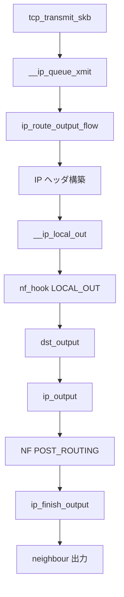

# 第13章 IPv4 出力と ip_local_out

> **本章で読むソース**
>
> - [`net/ipv4/ip_output.c` L102-L123](https://github.com/gregkh/linux/blob/v6.18.38/net/ipv4/ip_output.c#L102-L123)
> - [`net/ipv4/ip_output.c` L125-L134](https://github.com/gregkh/linux/blob/v6.18.38/net/ipv4/ip_output.c#L125-L134)
> - [`net/ipv4/ip_output.c` L463-L501](https://github.com/gregkh/linux/blob/v6.18.38/net/ipv4/ip_output.c#L463-L501)
> - [`net/ipv4/ip_output.c` L503-L509](https://github.com/gregkh/linux/blob/v6.18.38/net/ipv4/ip_output.c#L503-L509)
> - [`include/uapi/linux/netfilter.h` L43-L48](https://github.com/gregkh/linux/blob/v6.18.38/include/uapi/linux/netfilter.h#L43-L48)
> - [`net/ipv4/ip_output.c` L428-L444](https://github.com/gregkh/linux/blob/v6.18.38/net/ipv4/ip_output.c#L428-L444)
> - [`net/ipv4/ip_output.c` L318-L332](https://github.com/gregkh/linux/blob/v6.18.38/net/ipv4/ip_output.c#L318-L332)

## この章の狙い

TCP や UDP が組み立てた `sk_buff` が IPv4 ヘッダを付け、netfilter を通過して `dst_output` へ渡るまでを読む。
`__ip_local_out` と `ip_queue_xmit` の役割分担を押さえる。

## 前提

- [第10章](../part02-tcp/10-tcp-output-path.md) で TCP 送信が IP 層へ渡ることを読んでいること。

## __ip_local_out と NF_INET_LOCAL_OUT

[`net/ipv4/ip_output.c` L102-L123](https://github.com/gregkh/linux/blob/v6.18.38/net/ipv4/ip_output.c#L102-L123)

```c
int __ip_local_out(struct net *net, struct sock *sk, struct sk_buff *skb)
{
	struct iphdr *iph = ip_hdr(skb);

	IP_INC_STATS(net, IPSTATS_MIB_OUTREQUESTS);

	iph_set_totlen(iph, skb->len);
	ip_send_check(iph);

	skb = l3mdev_ip_out(sk, skb);
	if (unlikely(!skb))
		return 0;

	skb->protocol = htons(ETH_P_IP);

	return nf_hook(NFPROTO_IPV4, NF_INET_LOCAL_OUT,
		       net, sk, skb, NULL, skb_dst_dev(skb),
		       dst_output);
}
```

`ip_send_check` で IP ヘッダのチェックサムを計算する。
`NF_INET_LOCAL_OUT` フックの後、`dst_output` が neighbour 解決とデバイス送信へ進む。

## ip_local_out

[`net/ipv4/ip_output.c` L125-L134](https://github.com/gregkh/linux/blob/v6.18.38/net/ipv4/ip_output.c#L125-L134)

```c
int ip_local_out(struct net *net, struct sock *sk, struct sk_buff *skb)
{
	int err;

	err = __ip_local_out(net, sk, skb);
	if (likely(err == 1))
		err = dst_output(net, sk, skb);

	return err;
}
```

`nf_hook` が `NF_ACCEPT` 相当の 1 を返すと、`dst_output` が続く。
IPv4 の `dst.output` は `ip_output` に設定されている。

## ip_output と ip_finish_output

`dst_output` は `ip_output` を呼び、`NF_INET_POST_ROUTING` の後 `ip_finish_output` で GSO 分割と L2 送信へ進む。

[`net/ipv4/ip_output.c` L428-L444](https://github.com/gregkh/linux/blob/v6.18.38/net/ipv4/ip_output.c#L428-L444)

```c
int ip_output(struct net *net, struct sock *sk, struct sk_buff *skb)
{
	struct net_device *dev, *indev = skb->dev;
	int ret_val;

	rcu_read_lock();
	dev = skb_dst_dev_rcu(skb);
	skb->dev = dev;
	skb->protocol = htons(ETH_P_IP);

	ret_val = NF_HOOK_COND(NFPROTO_IPV4, NF_INET_POST_ROUTING,
				net, sk, skb, indev, dev,
				ip_finish_output,
				!(IPCB(skb)->flags & IPSKB_REROUTED));
	rcu_read_unlock();
	return ret_val;
}
```

POST_ROUTING の `okfn` として渡される `ip_finish_output` は、cgroup BPF egress を実行した後 `__ip_finish_output` へ進む。

[`net/ipv4/ip_output.c` L318-L332](https://github.com/gregkh/linux/blob/v6.18.38/net/ipv4/ip_output.c#L318-L332)

```c
static int ip_finish_output(struct net *net, struct sock *sk, struct sk_buff *skb)
{
	int ret;

	ret = BPF_CGROUP_RUN_PROG_INET_EGRESS(sk, skb);
	switch (ret) {
	case NET_XMIT_SUCCESS:
		return __ip_finish_output(net, sk, skb);
	case NET_XMIT_CN:
		return __ip_finish_output(net, sk, skb) ? : ret;
	default:
		kfree_skb_reason(skb, SKB_DROP_REASON_BPF_CGROUP_EGRESS);
		return ret;
	}
}
```

## __ip_queue_xmit のルーティング

ソケット送信では `__ip_queue_xmit` がルートを解決し IP ヘッダを構築する。

[`net/ipv4/ip_output.c` L463-L501](https://github.com/gregkh/linux/blob/v6.18.38/net/ipv4/ip_output.c#L463-L501)

```c
int __ip_queue_xmit(struct sock *sk, struct sk_buff *skb, struct flowi *fl,
		    __u8 tos)
{
	struct inet_sock *inet = inet_sk(sk);
	struct net *net = sock_net(sk);
	struct ip_options_rcu *inet_opt;
	struct flowi4 *fl4;
	struct rtable *rt;
	struct iphdr *iph;
	int res;

	/* Skip all of this if the packet is already routed,
	 * f.e. by something like SCTP.
	 */
	rcu_read_lock();
	inet_opt = rcu_dereference(inet->inet_opt);
	fl4 = &fl->u.ip4;
	rt = skb_rtable(skb);
	if (rt)
		goto packet_routed;

	/* Make sure we can route this packet. */
	rt = dst_rtable(__sk_dst_check(sk, 0));
	if (!rt) {
		inet_sk_init_flowi4(inet, fl4);

		/* sctp_v4_xmit() uses its own DSCP value */
		fl4->flowi4_dscp = inet_dsfield_to_dscp(tos);

		/* If this fails, retransmit mechanism of transport layer will
		 * keep trying until route appears or the connection times
		 * itself out.
		 */
		rt = ip_route_output_flow(net, fl4, sk);
		if (IS_ERR(rt))
			goto no_route;
		sk_setup_caps(sk, &rt->dst);
	}
	skb_dst_set_noref(skb, &rt->dst);
```

キャッシュ済み `sk_dst` があれば `ip_route_output_flow` を省略する。

## IP ヘッダの push

[`net/ipv4/ip_output.c` L503-L509](https://github.com/gregkh/linux/blob/v6.18.38/net/ipv4/ip_output.c#L503-L509)

```c
packet_routed:
	if (inet_opt && inet_opt->opt.is_strictroute && rt->rt_uses_gateway)
		goto no_route;

	skb_push(skb, sizeof(struct iphdr) + (inet_opt ? inet_opt->opt.optlen : 0));
	skb_reset_network_header(skb);
```

## netfilter フック点

[`include/uapi/linux/netfilter.h` L43-L48](https://github.com/gregkh/linux/blob/v6.18.38/include/uapi/linux/netfilter.h#L43-L48)

```c
	NF_INET_PRE_ROUTING,
	NF_INET_LOCAL_IN,
	NF_INET_FORWARD,
	NF_INET_LOCAL_OUT,
	NF_INET_POST_ROUTING,
	NF_INET_NUMHOOKS,
```

送信は `LOCAL_OUT` → `POST_ROUTING` の順でフックされる（第24章）。

## 処理の流れ



## 高速化と最適化の工夫

**`sk_dst` キャッシュ**は同一接続の繰り返し送信で FIB 検索を省略する。

**`ip_send_check` のインライン化**はソフトウェアチェックサム計算をヘッダ構築直後に閉じる。

**GSO 対応**は IP 層より下でセグメント分割を遅延し、ホスト CPU 負荷を下げる（第10章の TSO と連動）。

## まとめ

IPv4 出力はルート解決、ヘッダ構築、`NF_INET_LOCAL_OUT`、`dst_output`、`ip_output`、`NF_INET_POST_ROUTING`、`ip_finish_output` の順で進む。
次章では FIB ルーティング検索を読む。

## 関連する章

- 前章：[輻輳制御と再送タイマー](../part02-tcp/12-tcp-congestion-retransmit.md)
- 次章：[FIB とルーティング検索](14-fib-routing-lookup.md)
- [netfilter フック](../part06-netfilter/24-netfilter-hooks.md)
