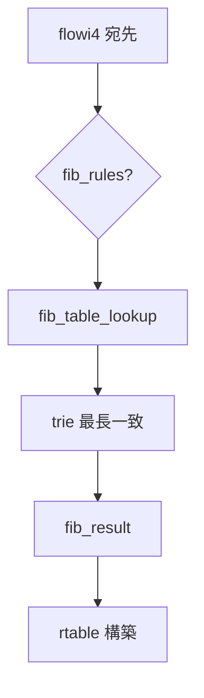

# 第14章 FIB とルーティング検索

> **本章で読むソース**
>
> - [`net/ipv4/fib_trie.c` L1420-L1440](https://github.com/gregkh/linux/blob/v6.18.38/net/ipv4/fib_trie.c#L1420-L1440)
> - [`net/ipv4/fib_trie.c` L1446-L1465](https://github.com/gregkh/linux/blob/v6.18.38/net/ipv4/fib_trie.c#L1446-L1465)
> - [`net/ipv4/route.c` L2356-L2361](https://github.com/gregkh/linux/blob/v6.18.38/net/ipv4/route.c#L2356-L2361)
> - [`net/ipv4/route.c` L2810-L2815](https://github.com/gregkh/linux/blob/v6.18.38/net/ipv4/route.c#L2810-L2815)
> - [`net/core/fib_rules.c` L1-L20](https://github.com/gregkh/linux/blob/v6.18.38/net/core/fib_rules.c#L1-L20)
> - [`include/net/ip_fib.h` L257-L264](https://github.com/gregkh/linux/blob/v6.18.38/include/net/ip_fib.h#L257-L264)

## この章の狙い

Linux の IPv4 転送情報ベース（FIB）が trie 構造で最長一致プレフィックス検索を行う仕組みを読む。
`fib_table_lookup` と `fib_lookup` の関係、rtnetlink によるルート更新の入口を押さえる。

## 前提

- [第13章](13-ipv4-output.md) で `ip_route_output_flow` が FIB を使うことを読んでいること。

## fib_table_lookup

[`net/ipv4/fib_trie.c` L1420-L1440](https://github.com/gregkh/linux/blob/v6.18.38/net/ipv4/fib_trie.c#L1420-L1440)

```c
int fib_table_lookup(struct fib_table *tb, const struct flowi4 *flp,
		     struct fib_result *res, int fib_flags)
{
	struct trie *t = (struct trie *) tb->tb_data;
	const t_key key = ntohl(flp->daddr);
	struct key_vector *n, *pn;
	struct fib_alias *fa;
	unsigned long index;
	t_key cindex;

	pn = t->kv;
	cindex = 0;

	n = get_child_rcu(pn, cindex);
	if (!n) {
		trace_fib_table_lookup(tb->tb_id, flp, NULL, -EAGAIN);
		return -EAGAIN;
	}
```

`flowi4` の宛先アドレスをキーに trie を辿る。
`rcu_read_lock` 下で呼ばれる設計である。

## trie 走査ループ

[`net/ipv4/fib_trie.c` L1446-L1465](https://github.com/gregkh/linux/blob/v6.18.38/net/ipv4/fib_trie.c#L1446-L1465)

```c
	/* Step 1: Travel to the longest prefix match in the trie */
	for (;;) {
		index = get_cindex(key, n);

		/* This bit of code is a bit tricky but it combines multiple
		 * checks into a single check.  The prefix consists of the
		 * prefix plus zeros for the "bits" in the prefix. The index
		 * is the difference between the key and this value.  From
		 * this we can actually derive several pieces of data.
		 *   if (index >= (1ul << bits))
		 *     we have a mismatch in skip bits and failed
		 *   else
		 *     we know the value is cindex
		 *
		 * This check is safe even if bits == KEYLENGTH due to the
		 * fact that we can only allocate a node with 32 bits if a
		 * long is greater than 32 bits.
		 */
		if (index >= (1ul << n->bits))
			break;
```

最長一致プレフィックスに到達すると `fib_alias` から `fib_info` を得る。

## fib_lookup からの呼び出し

受信経路でも `fib_lookup` が使われる。

[`net/ipv4/route.c` L2356-L2361](https://github.com/gregkh/linux/blob/v6.18.38/net/ipv4/route.c#L2356-L2361)

```c
	err = fib_lookup(net, &fl4, res, 0);
	if (err != 0) {
		if (!IN_DEV_FORWARD(in_dev))
			err = -EHOSTUNREACH;
		goto no_route;
	}
```

## 出力経路での fib_lookup

[`net/ipv4/route.c` L2810-L2815](https://github.com/gregkh/linux/blob/v6.18.38/net/ipv4/route.c#L2810-L2815)

```c
		flags |= RTCF_LOCAL;
		goto make_route;
	}

	err = fib_lookup(net, fl4, res, 0);
	if (err) {
```

## fib_rules とポリシールーティング

[`net/core/fib_rules.c` L1-L20](https://github.com/gregkh/linux/blob/v6.18.38/net/core/fib_rules.c#L1-L20)

```c
// SPDX-License-Identifier: GPL-2.0-only
/*
 * net/core/fib_rules.c		Generic Routing Rules
 *
 * Authors:	Thomas Graf <tgraf@suug.ch>
 */

#include <linux/types.h>
#include <linux/kernel.h>
#include <linux/slab.h>
#include <linux/list.h>
#include <linux/module.h>
#include <net/net_namespace.h>
#include <net/inet_dscp.h>
#include <net/sock.h>
#include <net/fib_rules.h>
#include <net/ip_tunnels.h>
#include <linux/indirect_call_wrapper.h>

#if defined(CONFIG_IPV6) && defined(CONFIG_IPV6_MULTIPLE_TABLES)
```

`ip rule` でテーブル選択が変わる場合、`fib_rules_lookup` が先に走る。

## fib_table 構造

[`include/net/ip_fib.h` L257-L264](https://github.com/gregkh/linux/blob/v6.18.38/include/net/ip_fib.h#L257-L264)

```c
struct fib_table {
	struct hlist_node	tb_hlist;
	u32			tb_id;
	int			tb_num_default;
	struct rcu_head		rcu;
	unsigned long 		*tb_data;
	unsigned long		__data[];
};
```

## 処理の流れ



## rtnetlink との境界

ルート追加は `rtnetlink`（`net/core/rtnetlink.c`）の `RTM_NEWROUTE` で行われる。
本章では検索 hot path に焦点を当て、設定 API の詳細は独立章にしない（NET-PLAN 承認どおり）。

> **IPv6 との対応**
> IPv6 は `net/ipv6/ip6_fib.c` と `fib6_table_lookup` が同様の役割を担う。
> デュアルスタック環境ではテーブル ID と rule が分かれる。

## 高速化と最適化の工夫

**LC-trie（leaf compressed trie）** は共通プレフィックスを圧縮し、走査ステップを減らす。

**RCU による読み取り**は転送 hot path でロックを取らない。

**ルートキャッシュ（`dst` エントリ）**は同一フローの繰り返し検索を省略する。

## まとめ

FIB 検索は trie 上の最長一致で `fib_result` を得、 `rtable` 生成に使われる。
ポリシールーティング時は `fib_rules` が先にテーブルを選ぶ。
次章では IPv4 受信を読む。

## 関連する章

- 前章：[IPv4 出力と ip_local_out](13-ipv4-output.md)
- 次章：[IPv4 入力とローカル配送](15-ipv4-input-delivery.md)
- [neighbour と ARP 解決](16-neighbour-arp.md)
