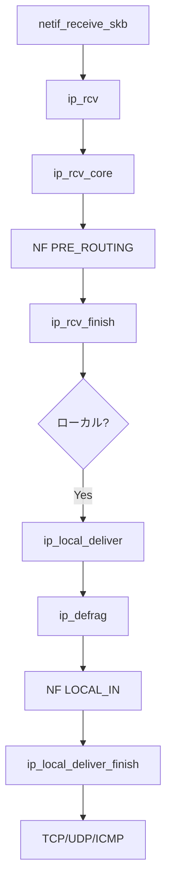

# 第15章 IPv4 入力とローカル配送

> **本章で読むソース**
>
> - [`net/ipv4/ip_input.c` L564-L576](https://github.com/gregkh/linux/blob/v6.18.38/net/ipv4/ip_input.c#L564-L576)
> - [`net/ipv4/ip_input.c` L248-L263](https://github.com/gregkh/linux/blob/v6.18.38/net/ipv4/ip_input.c#L248-L263)
> - [`net/ipv4/ip_input.c` L322-L427](https://github.com/gregkh/linux/blob/v6.18.38/net/ipv4/ip_input.c#L322-L427)
> - [`net/ipv4/ip_input.c` L439-L455](https://github.com/gregkh/linux/blob/v6.18.38/net/ipv4/ip_input.c#L439-L455)
> - [`net/ipv4/ip_input.c` L227-L242](https://github.com/gregkh/linux/blob/v6.18.38/net/ipv4/ip_input.c#L227-L242)
> - [`include/uapi/linux/netfilter.h` L43-L45](https://github.com/gregkh/linux/blob/v6.18.38/include/uapi/linux/netfilter.h#L43-L45)

## この章の狙い

NIC から上がったパケットが `ip_rcv` を経て netfilter、ルーティング判定、ローカル配送まで進む経路を読む。
`NF_INET_PRE_ROUTING` と `NF_INET_LOCAL_IN` の位置を押さえる。

## 前提

- [第18章](../part04-rx-fastpath/18-napi-netif-receive.md) で `netif_receive_skb` が L3 ハンドラへ渡すことを読んでいること（順序上は後章だが、受信の全体像のため相互参照する）。

## ip_rcv 入口

[`net/ipv4/ip_input.c` L564-L576](https://github.com/gregkh/linux/blob/v6.18.38/net/ipv4/ip_input.c#L564-L576)

```c
int ip_rcv(struct sk_buff *skb, struct net_device *dev, struct packet_type *pt,
	   struct net_device *orig_dev)
{
	struct net *net = dev_net(dev);

	skb = ip_rcv_core(skb, net);
	if (skb == NULL)
		return NET_RX_DROP;

	return NF_HOOK(NFPROTO_IPV4, NF_INET_PRE_ROUTING,
		       net, NULL, skb, dev, NULL,
		       ip_rcv_finish);
}
```

`ip_rcv_core` でヘッダ検証と統計更新を行う。
`NF_INET_PRE_ROUTING` の後 `ip_rcv_finish` がルーティングを決める。

## ip_rcv_finish_core と経路決定

`ip_rcv_finish` は `ip_rcv_finish_core` で FIB lookup と early demux を行い、成功時に `dst_input` へ渡す。

[`net/ipv4/ip_input.c` L439-L455](https://github.com/gregkh/linux/blob/v6.18.38/net/ipv4/ip_input.c#L439-L455)

```c
static int ip_rcv_finish(struct net *net, struct sock *sk, struct sk_buff *skb)
{
	struct net_device *dev = skb->dev;
	int ret;

	skb = l3mdev_ip_rcv(skb);
	if (!skb)
		return NET_RX_SUCCESS;

	ret = ip_rcv_finish_core(net, skb, dev, NULL);
	if (ret != NET_RX_DROP)
		ret = dst_input(skb);
	return ret;
}
```

[`net/ipv4/ip_input.c` L322-L427](https://github.com/gregkh/linux/blob/v6.18.38/net/ipv4/ip_input.c#L322-L427)

```c
static int ip_rcv_finish_core(struct net *net,
			      struct sk_buff *skb, struct net_device *dev,
			      const struct sk_buff *hint)
{
	const struct iphdr *iph = ip_hdr(skb);
	struct rtable *rt;
	int drop_reason;

	if (READ_ONCE(net->ipv4.sysctl_ip_early_demux) &&
	    !skb_dst(skb) &&
	    !skb->sk &&
	    !ip_is_fragment(iph)) {
		switch (iph->protocol) {
		case IPPROTO_TCP:
			if (READ_ONCE(net->ipv4.sysctl_tcp_early_demux)) {
				tcp_v4_early_demux(skb);
				iph = ip_hdr(skb);
			}
			break;
		case IPPROTO_UDP:
			if (READ_ONCE(net->ipv4.sysctl_udp_early_demux)) {
				drop_reason = udp_v4_early_demux(skb);
				if (unlikely(drop_reason))
					goto drop_error;
				iph = ip_hdr(skb);
			}
			break;
		}
	}

	if (!skb_valid_dst(skb)) {
		drop_reason = ip_route_input_noref(skb, iph->daddr, iph->saddr,
						   ip4h_dscp(iph), dev);
		if (unlikely(drop_reason))
			goto drop_error;
	}
	// ... (中略) マルチキャスト検査 ...
	return NET_RX_SUCCESS;
```

`dst_input` は `rt_type` に応じて `ip_local_deliver`、転送、破棄へ分岐する。

## ip_local_deliver

ローカル宛パケットは `ip_local_deliver` へ進む。

[`net/ipv4/ip_input.c` L248-L263](https://github.com/gregkh/linux/blob/v6.18.38/net/ipv4/ip_input.c#L248-L263)

```c
int ip_local_deliver(struct sk_buff *skb)
{
	/*
	 *	Reassemble IP fragments.
	 */
	struct net *net = dev_net(skb->dev);

	if (ip_is_fragment(ip_hdr(skb))) {
		if (ip_defrag(net, skb, IP_DEFRAG_LOCAL_DELIVER))
			return 0;
	}

	return NF_HOOK(NFPROTO_IPV4, NF_INET_LOCAL_IN,
		       net, NULL, skb, skb->dev, NULL,
		       ip_local_deliver_finish);
}
```

## フラグメント再組立て

[`net/ipv4/ip_input.c` L255-L258](https://github.com/gregkh/linux/blob/v6.18.38/net/ipv4/ip_input.c#L255-L258)

```c
	if (ip_is_fragment(ip_hdr(skb))) {
		if (ip_defrag(net, skb, IP_DEFRAG_LOCAL_DELIVER))
			return 0;
	}
```

断片が揃うまで `ip_defrag` が保持し、完了後に上位プロトコルへ渡す。

## ip_local_deliver_finish と L4 ハンドラ

`LOCAL_IN` フック通過後、`ip_local_deliver_finish` がプロトコル番号でハンドラを引く。

[`net/ipv4/ip_input.c` L227-L242](https://github.com/gregkh/linux/blob/v6.18.38/net/ipv4/ip_input.c#L227-L242)

```c
static int ip_local_deliver_finish(struct net *net, struct sock *sk, struct sk_buff *skb)
{
	if (unlikely(skb_orphan_frags_rx(skb, GFP_ATOMIC))) {
		__IP_INC_STATS(net, IPSTATS_MIB_INDISCARDS);
		kfree_skb_reason(skb, SKB_DROP_REASON_NOMEM);
		return 0;
	}

	skb_clear_delivery_time(skb);
	__skb_pull(skb, skb_network_header_len(skb));

	rcu_read_lock();
	ip_protocol_deliver_rcu(net, skb, ip_hdr(skb)->protocol);
	rcu_read_unlock();

	return 0;
}
```

`ip_protocol_deliver_rcu` は `inet_protos` から TCP、UDP、ICMP 等の `handler` を呼ぶ。

## netfilter フック点（受信側）

[`include/uapi/linux/netfilter.h` L43-L45](https://github.com/gregkh/linux/blob/v6.18.38/include/uapi/linux/netfilter.h#L43-L45)

```c
	NF_INET_PRE_ROUTING,
	NF_INET_LOCAL_IN,
	NF_INET_FORWARD,
```

受信は `PRE_ROUTING` で DNAT 等が走り、ローカル宛は `LOCAL_IN` を通る。

## 処理の流れ



## 高速化と最適化の工夫

**`ip_sublist_rcv` バッチ処理**は複数パケットをリストでまとめ、キャッシュ効率を上げる。

**Early demux**（`sysctl_ip_early_demux`）はルーティング前にソケットを特定し、二重検索を避ける。

**GRO との連携**は IP 層に届く前にセグメントを結合し、スタック通過回数を減らす（第19章）。

## まとめ

IPv4 受信は `ip_rcv` → `PRE_ROUTING` → ルーティング → `ip_local_deliver` → `LOCAL_IN` → L4 の順である。
次章では neighbour 解決を読む。

## 関連する章

- 前章：[FIB とルーティング検索](14-fib-routing-lookup.md)
- 次章：[neighbour と ARP 解決](16-neighbour-arp.md)
- [NAPI と netif_receive_skb](../part04-rx-fastpath/18-napi-netif-receive.md)
