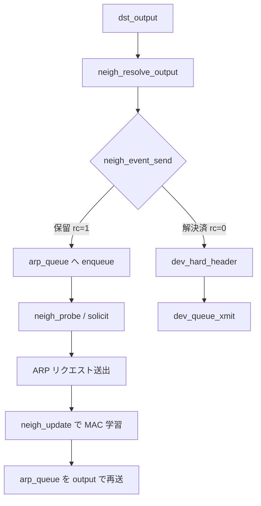

# 第16章 neighbour と ARP 解決

> **本章で読むソース**
>
> - [`net/core/neighbour.c` L1576-L1606](https://github.com/gregkh/linux/blob/v6.18.38/net/core/neighbour.c#L1576-L1606)
> - [`net/core/neighbour.c` L1201-L1277](https://github.com/gregkh/linux/blob/v6.18.38/net/core/neighbour.c#L1201-L1277)
> - [`net/core/neighbour.c` L1090-L1102](https://github.com/gregkh/linux/blob/v6.18.38/net/core/neighbour.c#L1090-L1102)
> - [`net/core/neighbour.c` L1494-L1502](https://github.com/gregkh/linux/blob/v6.18.38/net/core/neighbour.c#L1494-L1502)
> - [`include/net/neighbour.h` L138-L160](https://github.com/gregkh/linux/blob/v6.18.38/include/net/neighbour.h#L138-L160)
> - [`net/ipv4/arp.c` L1-L20](https://github.com/gregkh/linux/blob/v6.18.38/net/ipv4/arp.c#L1-L20)

## この章の狙い

L3 宛先から L2 アドレスへ写す neighbour サブシステムを読む。
`neigh_resolve_output` が ARP 解決、`arp_queue` への保留、解決後の再送までをどうつなぐかを押さえる。

## 前提

- [第13章](13-ipv4-output.md) で `dst_output` が neighbour 出力を呼ぶことを読んでいること。

## neigh_resolve_output

[`net/core/neighbour.c` L1576-L1606](https://github.com/gregkh/linux/blob/v6.18.38/net/core/neighbour.c#L1576-L1606)

```c
int neigh_resolve_output(struct neighbour *neigh, struct sk_buff *skb)
{
	int rc = 0;

	if (!neigh_event_send(neigh, skb)) {
		int err;
		struct net_device *dev = neigh->dev;
		unsigned int seq;

		if (dev->header_ops->cache && !READ_ONCE(neigh->hh.hh_len))
			neigh_hh_init(neigh);

		do {
			__skb_pull(skb, skb_network_offset(skb));
			seq = read_seqbegin(&neigh->ha_lock);
			err = dev_hard_header(skb, dev, ntohs(skb->protocol),
					      neigh->ha, NULL, skb->len);
		} while (read_seqretry(&neigh->ha_lock, seq));

		if (err >= 0)
			rc = dev_queue_xmit(skb);
		else
			goto out_kfree_skb;
	}
out:
	return rc;
out_kfree_skb:
	rc = -EINVAL;
	kfree_skb_reason(skb, SKB_DROP_REASON_NEIGH_HH_FILLFAIL);
	goto out;
}
```

`neigh_event_send` が非 0 を返すと skb は呼び出し元へ返らず、ARP 解決待ちキューに載る。

## __neigh_event_send と NUD 状態遷移

未解決の neighbour は `NUD_INCOMPLETE` へ遷移し、タイマーと solicitation を起動する。
`arp_queue` にはバイト上限があり、溢れた skb は破棄される。

[`net/core/neighbour.c` L1201-L1277](https://github.com/gregkh/linux/blob/v6.18.38/net/core/neighbour.c#L1201-L1277)

```c
int __neigh_event_send(struct neighbour *neigh, struct sk_buff *skb,
		       const bool immediate_ok)
{
	int rc;
	bool immediate_probe = false;

	write_lock_bh(&neigh->lock);

	rc = 0;
	if (neigh->nud_state & (NUD_CONNECTED | NUD_DELAY | NUD_PROBE))
		goto out_unlock_bh;
	if (neigh->dead)
		goto out_dead;

	if (!(neigh->nud_state & (NUD_STALE | NUD_INCOMPLETE))) {
		if (NEIGH_VAR(neigh->parms, MCAST_PROBES) +
		    NEIGH_VAR(neigh->parms, APP_PROBES)) {
			atomic_set(&neigh->probes,
				   NEIGH_VAR(neigh->parms, UCAST_PROBES));
			neigh_del_timer(neigh);
			WRITE_ONCE(neigh->nud_state, NUD_INCOMPLETE);
			neigh->updated = now;
			// ... (中略) タイマー設定 ...
			neigh_add_timer(neigh, next);
		} else {
			WRITE_ONCE(neigh->nud_state, NUD_FAILED);
			kfree_skb_reason(skb, SKB_DROP_REASON_NEIGH_FAILED);
			return 1;
		}
	} else if (neigh->nud_state & NUD_STALE) {
		WRITE_ONCE(neigh->nud_state, NUD_DELAY);
		neigh_add_timer(neigh, jiffies +
				NEIGH_VAR(neigh->parms, DELAY_PROBE_TIME));
	}

	if (neigh->nud_state == NUD_INCOMPLETE) {
		if (skb) {
			while (neigh->arp_queue_len_bytes + skb->truesize >
			       NEIGH_VAR(neigh->parms, QUEUE_LEN_BYTES)) {
				struct sk_buff *buff;

				buff = __skb_dequeue(&neigh->arp_queue);
				if (!buff)
					break;
				neigh->arp_queue_len_bytes -= buff->truesize;
				kfree_skb_reason(buff, SKB_DROP_REASON_NEIGH_QUEUEFULL);
			}
			skb_dst_force(skb);
			__skb_queue_tail(&neigh->arp_queue, skb);
			neigh->arp_queue_len_bytes += skb->truesize;
		}
		rc = 1;
	}
out_unlock_bh:
	if (immediate_probe)
		neigh_probe(neigh);
	// ... (中略) ...
	return rc;
}
```

`NUD_STALE` からは即 solicitation せず `NUD_DELAY` で猶予を置く設計になっている。

## neigh_probe と ARP solicitation

タイマー満了や即時 probe では `neigh_probe` が `neigh->ops->solicit` を呼ぶ。
IPv4 では `arp_solicit` が ARP リクエストを送出する。

[`net/core/neighbour.c` L1090-L1102](https://github.com/gregkh/linux/blob/v6.18.38/net/core/neighbour.c#L1090-L1102)

```c
static void neigh_probe(struct neighbour *neigh)
	__releases(neigh->lock)
{
	struct sk_buff *skb = skb_peek_tail(&neigh->arp_queue);
	if (skb)
		skb = skb_clone(skb, GFP_ATOMIC);
	write_unlock(&neigh->lock);
	if (neigh->ops->solicit)
		neigh->ops->solicit(neigh, skb);
	atomic_inc(&neigh->probes);
	consume_skb(skb);
}
```

## ARP 応答後の保留キュー再送

`neigh_update` が MAC を学習すると `NUD_CONNECTED` へ遷移し、`arp_queue` に溜まった skb を `output` で再送する。

[`net/core/neighbour.c` L1494-L1502](https://github.com/gregkh/linux/blob/v6.18.38/net/core/neighbour.c#L1494-L1502)

```c
			READ_ONCE(n1->output)(n1, skb);
			if (n2)
				neigh_release(n2);
			rcu_read_unlock();

			write_lock_bh(&neigh->lock);
		}
		__skb_queue_purge(&neigh->arp_queue);
		neigh->arp_queue_len_bytes = 0;
```

## struct neighbour

[`include/net/neighbour.h` L138-L160](https://github.com/gregkh/linux/blob/v6.18.38/include/net/neighbour.h#L138-L160)

```c
struct neighbour {
	struct hlist_node	hash;
	struct hlist_node	dev_list;
	struct neigh_table	*tbl;
	struct neigh_parms	*parms;
	unsigned long		confirmed;
	unsigned long		updated;
	rwlock_t		lock;
	refcount_t		refcnt;
	unsigned int		arp_queue_len_bytes;
	struct sk_buff_head	arp_queue;
	struct timer_list	timer;
	unsigned long		used;
	atomic_t		probes;
	u8			nud_state;
	u8			type;
	u8			dead;
	u8			protocol;
	u32			flags;
	seqlock_t		ha_lock;
	unsigned char		ha[ALIGN(MAX_ADDR_LEN, sizeof(unsigned long))] __aligned(8);
	struct hh_cache		hh;
	int			(*output)(struct neighbour *, struct sk_buff *);
```

`arp_queue` は解決待ちパケットを保持する。

## ARP モジュール

[`net/ipv4/arp.c` L1-L20](https://github.com/gregkh/linux/blob/v6.18.38/net/ipv4/arp.c#L1-L20)

```c
// SPDX-License-Identifier: GPL-2.0-or-later
/* linux/net/ipv4/arp.c
 *
 * Copyright (C) 1994 by Florian  La Roche
 *
 * This module implements the Address Resolution Protocol ARP (RFC 826),
 * which is used to convert IP addresses (or in the future maybe other
 * high-level addresses) into a low-level hardware address (like an Ethernet
 * address).
```

IPv4 の ARP は `neigh_table` の `arp_tbl` として登録される。

## 処理の流れ



## 高速化と最適化の工夫

**hh_cache（ハードヘッダキャッシュ）**は Ethernet ヘッダをテンプレート化し、`dev_hard_header` のコストを下げる。

**seqlock（`ha_lock`）**は読み取り側のロック競合を減らしつつ MAC 更新と整合を取る。

**`arp_queue` のバイト上限**は解決待ちパケットが無制限に溜まるのを防ぎ、メモリ圧迫時に古い skb から破棄する。

> **7.x 系での変化**
> [`net/core/neighbour.c` L1312-L1324](https://github.com/gregkh/linux/blob/v7.1.3/net/core/neighbour.c#L1312-L1324) では ARP 応答後の保留キュー送信が `neigh_update_process_arp_queue` に切り出され、`neigh_update` 本体から `process_arp_queue` フラグ経由で呼ばれる。

## まとめ

neighbour 層は L3→L2 写像を管理し、未解決時は `__neigh_event_send` が NUD 遷移と `arp_queue` 投入、solicitation を行う。
解決後は `neigh_update` が保留パケットを `output` 経由で `dev_queue_xmit` へ流す。
次章では UDP と ICMP の概観を読む。

## 関連する章

- 前章：[IPv4 入力とローカル配送](15-ipv4-input-delivery.md)
- 次章：[UDP と ICMP 概観](17-udp-icmp-overview.md)
- [dev_queue_xmit](../part05-tx-qdisc/21-dev-queue-xmit.md)
