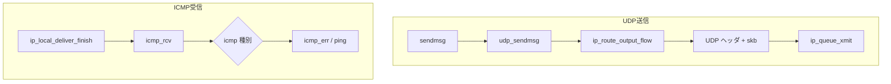

# 第17章 UDP と ICMP 概観

> **本章で読むソース**
>
> - [`net/ipv4/udp.c` L1270-L1302](https://github.com/gregkh/linux/blob/v6.18.38/net/ipv4/udp.c#L1270-L1302)
> - [`net/ipv4/udp.c` L1304-L1306](https://github.com/gregkh/linux/blob/v6.18.38/net/ipv4/udp.c#L1304-L1306)
> - [`net/ipv4/icmp.c` L1241-L1256](https://github.com/gregkh/linux/blob/v6.18.38/net/ipv4/icmp.c#L1241-L1256)
> - [`net/ipv4/icmp.c` L1258-L1267](https://github.com/gregkh/linux/blob/v6.18.38/net/ipv4/icmp.c#L1258-L1267)
> - [`net/ipv4/udp.c` L1286-L1287](https://github.com/gregkh/linux/blob/v6.18.38/net/ipv4/udp.c#L1286-L1287)
> - [`net/ipv4/udp.c` L1292-L1293](https://github.com/gregkh/linux/blob/v6.18.38/net/ipv4/udp.c#L1292-L1293)

## この章の狙い

TCP 以外の主要 L4 として UDP 送信と ICMP 受信の入口を読む。
第2部で詳述した TCP と対比し、接続なしとエラー通知の経路を押さえる。

## 前提

- [第7章](../part01-socket/07-sendmsg-recvmsg.md) で `sendmsg` がプロトコルハンドラへ委譲することを読んでいること。

## udp_sendmsg 入口

[`net/ipv4/udp.c` L1270-L1302](https://github.com/gregkh/linux/blob/v6.18.38/net/ipv4/udp.c#L1270-L1302)

```c
int udp_sendmsg(struct sock *sk, struct msghdr *msg, size_t len)
{
	struct inet_sock *inet = inet_sk(sk);
	struct udp_sock *up = udp_sk(sk);
	DECLARE_SOCKADDR(struct sockaddr_in *, usin, msg->msg_name);
	struct flowi4 fl4_stack;
	struct flowi4 *fl4;
	int ulen = len;
	struct ipcm_cookie ipc;
	struct rtable *rt = NULL;
	int free = 0;
	int connected = 0;
	__be32 daddr, faddr, saddr;
	u8 scope;
	__be16 dport;
	int err, is_udplite = IS_UDPLITE(sk);
	int corkreq = udp_test_bit(CORK, sk) || msg->msg_flags & MSG_MORE;
	int (*getfrag)(void *, char *, int, int, int, struct sk_buff *);
	struct sk_buff *skb;
	struct ip_options_data opt_copy;
	int uc_index;

	if (len > 0xFFFF)
		return -EMSGSIZE;

	/*
	 *	Check the flags.
	 */

	if (msg->msg_flags & MSG_OOB) /* Mirror BSD error message compatibility */
		return -EOPNOTSUPP;

	getfrag = is_udplite ? udplite_getfrag : ip_generic_getfrag;
```

## cork と pending 状態

[`net/ipv4/udp.c` L1304-L1306](https://github.com/gregkh/linux/blob/v6.18.38/net/ipv4/udp.c#L1304-L1306)

```c
	fl4 = &inet->cork.fl.u.ip4;
	if (READ_ONCE(up->pending)) {
		/*
```

`MSG_MORE` や `UDP_CORK` 時は複数 `sendmsg` をまとめて 1 パケットにする。

## icmp_rcv 入口

[`net/ipv4/icmp.c` L1241-L1256](https://github.com/gregkh/linux/blob/v6.18.38/net/ipv4/icmp.c#L1241-L1256)

```c
int icmp_rcv(struct sk_buff *skb)
{
	enum skb_drop_reason reason = SKB_DROP_REASON_NOT_SPECIFIED;
	struct rtable *rt = skb_rtable(skb);
	struct net *net = dev_net_rcu(rt->dst.dev);
	struct icmphdr *icmph;

	if (!xfrm4_policy_check(NULL, XFRM_POLICY_IN, skb)) {
		struct sec_path *sp = skb_sec_path(skb);
		int nh;

		if (!(sp && sp->xvec[sp->len - 1]->props.flags &
				 XFRM_STATE_ICMP)) {
			reason = SKB_DROP_REASON_XFRM_POLICY;
			goto drop;
		}
```

## ICMP の XFRM 逆方向チェック

[`net/ipv4/icmp.c` L1258-L1267](https://github.com/gregkh/linux/blob/v6.18.38/net/ipv4/icmp.c#L1258-L1267)

```c
		if (!pskb_may_pull(skb, sizeof(*icmph) + sizeof(struct iphdr)))
			goto drop;

		nh = skb_network_offset(skb);
		skb_set_network_header(skb, sizeof(*icmph));

		if (!xfrm4_policy_check_reverse(NULL, XFRM_POLICY_IN,
						skb)) {
			reason = SKB_DROP_REASON_XFRM_POLICY;
			goto drop;
```

## UDP の getfrag 選択

[`net/ipv4/udp.c` L1286-L1287](https://github.com/gregkh/linux/blob/v6.18.38/net/ipv4/udp.c#L1286-L1287)

```c
	int corkreq = udp_test_bit(CORK, sk) || msg->msg_flags & MSG_MORE;
	int (*getfrag)(void *, char *, int, int, int, struct sk_buff *);
```

## サイズ制限

[`net/ipv4/udp.c` L1292-L1293](https://github.com/gregkh/linux/blob/v6.18.38/net/ipv4/udp.c#L1292-L1293)

```c
	if (len > 0xFFFF)
		return -EMSGSIZE;
```

## 処理の流れ



## TCP との対比

| 観点 | TCP | UDP |
|------|-----|-----|
| 接続 | 3-way handshake | なし（connect は任意） |
| 信頼性 | 再送と順序保証 | なし |
| 送信入口 | `tcp_sendmsg` | `udp_sendmsg` |
| 輻輳制御 | あり（第12章） | なし |

ICMP はエラー通知（Destination Unreachable 等）と echo（ping）を担う。

## 高速化と最適化の工夫

**UDP GSO**は大きな UDP ペイロードを NIC 分割に委ね、ホスト CPU を省く。

**UDP hash 受信**（`__udp4_lib_lookup`）は 4 タプルハッシュでソケットを O(1) 近くで特定する。

**ICMP の rate limit**はエラー応答のフラッドを防ぎ、攻撃面を抑える。

## まとめ

UDP は `udp_sendmsg` からルート解決と IP 出力へ直結する。
ICMP は `icmp_rcv` で種別ごとに処理し、TCP のエラー通知にも使われる。
次章から受信最適化（NAPI）を読む。

## 関連する章

- 前章：[neighbour と ARP 解決](16-neighbour-arp.md)
- 次章：[NAPI と netif_receive_skb](../part04-rx-fastpath/18-napi-netif-receive.md)
- [TCP 送信経路](../part02-tcp/10-tcp-output-path.md)
