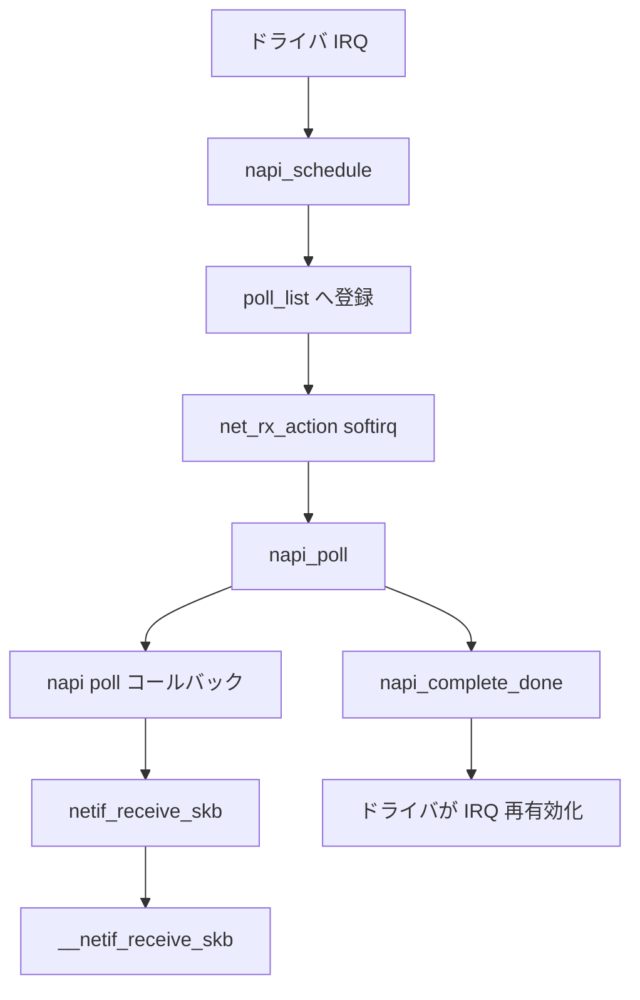

# 第18章 NAPI と netif_receive_skb

> **本章で読むソース**
>
> - [`net/core/dev.c` L6627-L6635](https://github.com/gregkh/linux/blob/v6.18.38/net/core/dev.c#L6627-L6635)
> - [`net/core/dev.c` L7787-L7826](https://github.com/gregkh/linux/blob/v6.18.38/net/core/dev.c#L7787-L7826)
> - [`net/core/dev.c` L7635-L7686](https://github.com/gregkh/linux/blob/v6.18.38/net/core/dev.c#L7635-L7686)
> - [`net/core/dev.c` L6688-L6754](https://github.com/gregkh/linux/blob/v6.18.38/net/core/dev.c#L6688-L6754)
> - [`net/core/dev.c` L6370-L6380](https://github.com/gregkh/linux/blob/v6.18.38/net/core/dev.c#L6370-L6380)
> - [`net/core/dev.c` L6295-L6319](https://github.com/gregkh/linux/blob/v6.18.38/net/core/dev.c#L6295-L6319)
> - [`net/core/dev.c` L6561-L6591](https://github.com/gregkh/linux/blob/v6.18.38/net/core/dev.c#L6561-L6591)

## この章の狙い

割り込みコンテキストからソフトIRQへパケット処理を遅延する NAPI の仕組みを読む。
`napi_schedule` から `net_rx_action`、`napi->poll`、`napi_complete_done` までの契約を押さえる。

## 前提

- [第4章](../part00-overview/04-netdev-lifecycle.md) で `net_device` の受信キューを読んでいること。

## __napi_schedule とソフトIRQ への登録

ドライバは IRQ 内で `napi_schedule` を呼び、NAPI インスタンスを per-CPU `poll_list` へ載せる。
`NET_RX_SOFTIRQ` が `net_rx_action` を起動する。

[`net/core/dev.c` L6627-L6635](https://github.com/gregkh/linux/blob/v6.18.38/net/core/dev.c#L6627-L6635)

```c
void __napi_schedule(struct napi_struct *n)
{
	unsigned long flags;

	local_irq_save(flags);
	____napi_schedule(this_cpu_ptr(&softnet_data), n);
	local_irq_restore(flags);
}
EXPORT_SYMBOL(__napi_schedule);
```

## net_rx_action と netdev_budget

ソフトIRQ ハンドラは `poll_list` 上の NAPI を順に `napi_poll` し、グローバル `netdev_budget` と時間上限で打ち切る。

[`net/core/dev.c` L7787-L7826](https://github.com/gregkh/linux/blob/v6.18.38/net/core/dev.c#L7787-L7826)

```c
static __latent_entropy void net_rx_action(void)
{
	struct softnet_data *sd = this_cpu_ptr(&softnet_data);
	unsigned long time_limit = jiffies +
		usecs_to_jiffies(READ_ONCE(net_hotdata.netdev_budget_usecs));
	struct bpf_net_context __bpf_net_ctx, *bpf_net_ctx;
	int budget = READ_ONCE(net_hotdata.netdev_budget);
	LIST_HEAD(list);
	LIST_HEAD(repoll);

	bpf_net_ctx = bpf_net_ctx_set(&__bpf_net_ctx);
start:
	sd->in_net_rx_action = true;
	local_irq_disable();
	list_splice_init(&sd->poll_list, &list);
	local_irq_enable();

	for (;;) {
		struct napi_struct *n;

		skb_defer_free_flush();

		if (list_empty(&list)) {
			if (list_empty(&repoll)) {
				sd->in_net_rx_action = false;
				barrier();
				if (!list_empty(&sd->poll_list))
					goto start;
				if (!sd_has_rps_ipi_waiting(sd))
					goto end;
			}
			break;
		}

		n = list_first_entry(&list, struct napi_struct, poll_list);
		budget -= napi_poll(n, &repoll);
```

budget 枯渇時は `time_squeeze` を増やし、残り NAPI を次の softirq ラウンドへ回す。

## napi_poll と poll コールバック

`napi_poll` はドライバ登録の `napi->poll` を `weight` 付きで呼ぶ。
GRO バッチが残る場合は `gro_flush_normal` で上層へ流す。

[`net/core/dev.c` L7635-L7686](https://github.com/gregkh/linux/blob/v6.18.38/net/core/dev.c#L7635-L7686)

```c
	if (napi_is_scheduled(n)) {
		work = n->poll(n, weight);
		trace_napi_poll(n, work, weight);

		xdp_do_check_flushed(n);
	}

	if (unlikely(work > weight))
		netdev_err_once(n->dev, "NAPI poll function %pS returned %d, exceeding its budget of %d.\n",
				n->poll, work, weight);

	if (likely(work < weight))
		return work;
	// ... (中略) ...
	gro_flush_normal(&n->gro, HZ >= 1000);

	if (unlikely(!list_empty(&n->poll_list))) {
		pr_warn_once("%s: Budget exhausted after napi rescheduled\n",
			     n->dev ? n->dev->name : "backlog");
		return work;
	}

	*repoll = true;
```

ドライバの `poll` は `work` に処理したパケット数を返し、`weight` 未満なら NAPI 完了へ進む。

## napi_complete_done と IRQ 再有効化契約

`napi_complete_done` は `NAPIF_STATE_SCHED` を落とし、GRO を flush する。
`NAPIF_STATE_MISSED` が立っていれば再スケジュールし、ドライバは IRQ を再有効化してよいタイミングを待つ。

[`net/core/dev.c` L6688-L6754](https://github.com/gregkh/linux/blob/v6.18.38/net/core/dev.c#L6688-L6754)

```c
bool napi_complete_done(struct napi_struct *n, int work_done)
{
	unsigned long flags, val, new, timeout = 0;
	bool ret = true;

	if (unlikely(n->state & (NAPIF_STATE_NPSVC |
				 NAPIF_STATE_IN_BUSY_POLL)))
		return false;

	if (work_done) {
		if (n->gro.bitmask)
			timeout = napi_get_gro_flush_timeout(n);
		n->defer_hard_irqs_count = napi_get_defer_hard_irqs(n);
	}
	// ... (中略) defer_hard_irqs ...
	gro_flush_normal(&n->gro, !!timeout);

	if (unlikely(!list_empty(&n->poll_list))) {
		local_irq_save(flags);
		list_del_init(&n->poll_list);
		local_irq_restore(flags);
	}
	WRITE_ONCE(n->list_owner, -1);

	val = READ_ONCE(n->state);
	do {
		WARN_ON_ONCE(!(val & NAPIF_STATE_SCHED));
		new = val & ~(NAPIF_STATE_MISSED | NAPIF_STATE_SCHED |
			      NAPIF_STATE_SCHED_THREADED |
			      NAPIF_STATE_PREFER_BUSY_POLL);
		new |= (val & NAPIF_STATE_MISSED) / NAPIF_STATE_MISSED *
						    NAPIF_STATE_SCHED;
	} while (!try_cmpxchg(&n->state, &val, new));

	if (unlikely(val & NAPIF_STATE_MISSED)) {
		__napi_schedule(n);
		return false;
	}
	// ... (中略) hrtimer ...
	return ret;
}
```

## netif_receive_skb

ドライバ `poll` や backlog 処理の末端で L3 へ渡す入口である。

[`net/core/dev.c` L6370-L6380](https://github.com/gregkh/linux/blob/v6.18.38/net/core/dev.c#L6370-L6380)

```c
int netif_receive_skb(struct sk_buff *skb)
{
	int ret;

	trace_netif_receive_skb_entry(skb);

	ret = netif_receive_skb_internal(skb);
	trace_netif_receive_skb_exit(ret);

	return ret;
}
```

## netif_receive_skb_internal と RPS

[`net/core/dev.c` L6295-L6319](https://github.com/gregkh/linux/blob/v6.18.38/net/core/dev.c#L6295-L6319)

```c
static int netif_receive_skb_internal(struct sk_buff *skb)
{
	int ret;

	net_timestamp_check(READ_ONCE(net_hotdata.tstamp_prequeue), skb);

	if (skb_defer_rx_timestamp(skb))
		return NET_RX_SUCCESS;

	rcu_read_lock();
#ifdef CONFIG_RPS
	if (static_branch_unlikely(&rps_needed)) {
		struct rps_dev_flow voidflow, *rflow = &voidflow;
		int cpu = get_rps_cpu(skb->dev, skb, &rflow);

		if (cpu >= 0) {
			ret = enqueue_to_backlog(skb, cpu, &rflow->last_qtail);
			rcu_read_unlock();
			return ret;
		}
	}
#endif
	ret = __netif_receive_skb(skb);
	rcu_read_unlock();
	return ret;
}
```

## process_backlog

per-CPU backlog の NAPI `poll` は `process_queue` から skb を取り出し `__netif_receive_skb` へ渡す。

[`net/core/dev.c` L6561-L6591](https://github.com/gregkh/linux/blob/v6.18.38/net/core/dev.c#L6561-L6591)

```c
static int process_backlog(struct napi_struct *napi, int quota)
{
	struct softnet_data *sd = container_of(napi, struct softnet_data, backlog);
	bool again = true;
	int work = 0;

	if (sd_has_rps_ipi_waiting(sd)) {
		local_irq_disable();
		net_rps_action_and_irq_enable(sd);
	}

	napi->weight = READ_ONCE(net_hotdata.dev_rx_weight);
	while (again) {
		struct sk_buff *skb;

		local_lock_nested_bh(&softnet_data.process_queue_bh_lock);
		while ((skb = __skb_dequeue(&sd->process_queue))) {
			local_unlock_nested_bh(&softnet_data.process_queue_bh_lock);
			rcu_read_lock();
			__netif_receive_skb(skb);
			rcu_read_unlock();
```

## 処理の流れ



## 高速化と最適化の工夫

**`netdev_budget` と `netdev_budget_usecs`**は 1 回の softirq で処理するパケット数と時間を上限し、他 softirq への飢餓を防ぐ。

**NAPI の weight**はドライバ `poll` あたりの処理上限であり、レイテンシとスループットのトレードオフを調整する。

**per-CPU `softnet_data`**は `poll_list` と backlog を CPU ローカルに閉じ、ロック競合を減らす。

> **7.x 系での変化**
> [`net/core/dev.c` L7866-L7870](https://github.com/gregkh/linux/blob/v7.1.3/net/core/dev.c#L7866-L7870) では threaded NAPI の busy poll 経路で `napi_complete_done` 時に flush されない GRO パケットを `gro_flush_normal` で明示的に流す処理が追加されている。

## まとめ

NAPI は IRQ から `net_rx_action` へ処理を移し、`napi->poll` が `netif_receive_skb` 経由で L3 へ渡す。
`napi_complete_done` が GRO flush とスケジュール状態を片付け、ドライバの IRQ 再有効化タイミングを決める。
次章では GRO を読む。

## 関連する章

- 前章：[UDP と ICMP 概観](../part03-ipv4/17-udp-icmp-overview.md)
- 次章：[GRO とソフトウェアオフロード受信](19-gro-receive-offload.md)
- [IPv4 入力とローカル配送](../part03-ipv4/15-ipv4-input-delivery.md)
