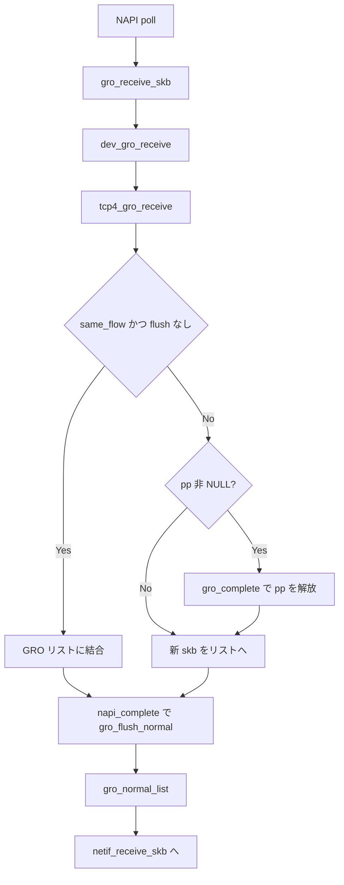

# 第19章 GRO とソフトウェアオフロード受信

> **本章で読むソース**
>
> - [`net/core/gro.c` L638-L651](https://github.com/gregkh/linux/blob/v6.18.38/net/core/gro.c#L638-L651)
> - [`net/core/gro.c` L476-L531](https://github.com/gregkh/linux/blob/v6.18.38/net/core/gro.c#L476-L531)
> - [`net/core/gro.c` L543-L567](https://github.com/gregkh/linux/blob/v6.18.38/net/core/gro.c#L543-L567)
> - [`net/ipv4/tcp_offload.c` L313-L374](https://github.com/gregkh/linux/blob/v6.18.38/net/ipv4/tcp_offload.c#L313-L374)
> - [`net/ipv4/tcp_offload.c` L447-L463](https://github.com/gregkh/linux/blob/v6.18.38/net/ipv4/tcp_offload.c#L447-L463)
> - [`include/net/gro.h` L514-L533](https://github.com/gregkh/linux/blob/v6.18.38/include/net/gro.h#L514-L533)

## この章の狙い

Generic Receive Offload（GRO）が複数パケットを結合し、プロトコルスタックの通過回数を減らす仕組みを読む。
`dev_gro_receive` から TCP 固有の `tcp_gro_receive`、flush、`gro_normal_list` への配送まで追う。

## 前提

- [第18章](18-napi-netif-receive.md) で NAPI `poll` 内でパケットが処理されることを読んでいること。

## gro_receive_skb

[`net/core/gro.c` L638-L651](https://github.com/gregkh/linux/blob/v6.18.38/net/core/gro.c#L638-L651)

```c
gro_result_t gro_receive_skb(struct gro_node *gro, struct sk_buff *skb)
{
	gro_result_t ret;

	__skb_mark_napi_id(skb, gro);
	trace_napi_gro_receive_entry(skb);

	skb_gro_reset_offset(skb, 0);

	ret = gro_skb_finish(gro, skb, dev_gro_receive(gro, skb));
	trace_napi_gro_receive_exit(ret);

	return ret;
}
```

## dev_gro_receive とプロトコルハンドラ

Ethernet タイプに応じて `packet_offload` の `gro_receive` を呼ぶ。
TCP/IPv4 では `tcp4_gro_receive` が登録されている。

[`net/core/gro.c` L476-L531](https://github.com/gregkh/linux/blob/v6.18.38/net/core/gro.c#L476-L531)

```c
static enum gro_result dev_gro_receive(struct gro_node *gro,
				       struct sk_buff *skb)
{
	u32 bucket = skb_get_hash_raw(skb) & (GRO_HASH_BUCKETS - 1);
	struct list_head *head = &net_hotdata.offload_base;
	struct gro_list *gro_list = &gro->hash[bucket];
	struct packet_offload *ptype;
	__be16 type = skb->protocol;
	struct sk_buff *pp = NULL;
	enum gro_result ret;
	int same_flow;

	if (netif_elide_gro(skb->dev))
		goto normal;

	gro_list_prepare(&gro_list->list, skb);

	rcu_read_lock();
	list_for_each_entry_rcu(ptype, head, list) {
		if (ptype->type == type && ptype->callbacks.gro_receive)
			goto found_ptype;
	}
	rcu_read_unlock();
	goto normal;

found_ptype:
	skb_set_network_header(skb, skb_gro_offset(skb));
	skb_reset_mac_len(skb);
	*(u32 *)&NAPI_GRO_CB(skb)->zeroed = 0;
	NAPI_GRO_CB(skb)->flush = skb_has_frag_list(skb);
	NAPI_GRO_CB(skb)->count = 1;
	// ... (中略) GSO 検査 ...

	pp = INDIRECT_CALL_INET(ptype->callbacks.gro_receive,
				ipv6_gro_receive, inet_gro_receive,
				&gro_list->list, skb);
```

## 結合失敗時の flush とリスト保持

`gro_receive` が別フローと判定しても、`pp` が非 NULL のときだけ古い skb を `gro_complete` する。
`same_flow` が偽でも `pp` が NULL なら既存 skb は complete せず、新 skb を GRO リストへ載せられる。

[`net/core/gro.c` L543-L567](https://github.com/gregkh/linux/blob/v6.18.38/net/core/gro.c#L543-L567)

```c
	if (pp) {
		skb_list_del_init(pp);
		gro_complete(gro, pp);
		gro_list->count--;
	}

	if (same_flow)
		goto ok;

	if (NAPI_GRO_CB(skb)->flush)
		goto normal;

	if (unlikely(gro_list->count >= MAX_GRO_SKBS))
		gro_flush_oldest(gro, &gro_list->list);
	else
		gro_list->count++;

	gro_try_pull_from_frag0(skb);
	NAPI_GRO_CB(skb)->age = jiffies;
	NAPI_GRO_CB(skb)->last = skb;
	if (!skb_is_gso(skb))
		skb_shinfo(skb)->gso_size = skb_gro_len(skb);
	list_add(&skb->list, &gro_list->list);
	ret = GRO_HELD;
```

同一ハッシュバケット内でも TCP ヘッダ比較で `same_flow` が偽なら、`pp` が返っていればその skb を `gro_complete` してから新 skb を保持する。
`pp` が NULL なら complete せずリストへ追加する。

## tcp_gro_receive の結合判定

[`net/ipv4/tcp_offload.c` L447-L468](https://github.com/gregkh/linux/blob/v6.18.38/net/ipv4/tcp_offload.c#L447-L468)

```c
struct sk_buff *tcp4_gro_receive(struct list_head *head, struct sk_buff *skb)
{
	struct tcphdr *th;

	/* Don't bother verifying checksum if we're going to flush anyway. */
	if (!NAPI_GRO_CB(skb)->flush &&
	    skb_gro_checksum_validate(skb, IPPROTO_TCP,
				      inet_gro_compute_pseudo))
		goto flush;

	th = tcp_gro_pull_header(skb);
	if (!th)
		goto flush;

	tcp4_check_fraglist_gro(head, skb, th);

	return tcp_gro_receive(head, skb, th);

flush:
	NAPI_GRO_CB(skb)->flush = 1;
	return NULL;
}
```

[`net/ipv4/tcp_offload.c` L313-L374](https://github.com/gregkh/linux/blob/v6.18.38/net/ipv4/tcp_offload.c#L313-L374)

```c
struct sk_buff *tcp_gro_receive(struct list_head *head, struct sk_buff *skb,
				struct tcphdr *th)
{
	unsigned int thlen = th->doff * 4;
	struct sk_buff *pp = NULL;
	struct sk_buff *p;
	struct tcphdr *th2;
	unsigned int len;
	__be32 flags;
	unsigned int mss = 1;
	int flush = 1;

	len = skb_gro_len(skb);
	flags = tcp_flag_word(th);

	p = tcp_gro_lookup(head, th);
	if (!p)
		goto out_check_final;

	th2 = tcp_hdr(p);
	flush = (__force int)(flags & TCP_FLAG_CWR);
	flush |= (__force int)((flags ^ tcp_flag_word(th2)) &
		  ~(TCP_FLAG_FIN | TCP_FLAG_PSH));
	flush |= (__force int)(th->ack_seq ^ th2->ack_seq);
	// ... (中略) オプションと seq 比較 ...
	if (flush || skb_gro_receive(p, skb)) {
		mss = 1;
		goto out_check_final;
	}
```

`flush` が立つと `pp` に既存 skb が返り、結合は行われない。

## napi_gro_flush と gro_normal_list

NAPI 終了時の `gro_flush_normal` は GRO リストを flush し、バッチ済み skb を `netif_receive_skb_list_internal` へ渡す。

[`include/net/gro.h` L514-L533](https://github.com/gregkh/linux/blob/v6.18.38/include/net/gro.h#L514-L533)

```c
static inline void napi_gro_flush(struct napi_struct *napi, bool flush_old)
{
	gro_flush(&napi->gro, flush_old);
}

static inline void gro_normal_list(struct gro_node *gro)
{
	if (!gro->rx_count)
		return;
	netif_receive_skb_list_internal(&gro->rx_list);
	INIT_LIST_HEAD(&gro->rx_list);
	gro->rx_count = 0;
}

static inline void gro_flush_normal(struct gro_node *gro, bool flush_old)
{
	gro_flush(gro, flush_old);
	gro_normal_list(gro);
}
```

## 処理の流れ



## 高速化と最適化の工夫

**ハッシュバケット（`GRO_HASH_BUCKETS`）**はフロー単位で結合候補を分離し、検索コストを抑える。

**`gro_normal_list` のバッチ配送**は結合済み skb をリストで上層へ渡し、ロックとプロトコル入口の呼び出し回数を減らす。

**`INDIRECT_CALL_INET` による `gro_receive` 分岐**は IPv4 向けに直接 `inet_gro_receive` を呼び、間接呼び出しコストを下げる。

## まとめ

GRO は `dev_gro_receive` がプロトコル別 `gro_receive` を選び、TCP ではシーケンスとフラグ一致で結合する。
結合できない skb は flush され、`gro_flush_normal` 経由で通常の受信スタックへ入る。
次章では RPS と RFS を読む。

## 関連する章

- 前章：[NAPI と netif_receive_skb](18-napi-netif-receive.md)
- 次章：[RPS、RFS と受信ステアリング](20-rps-rfs-steering.md)
- [TCP 受信経路](../part02-tcp/11-tcp-input-ack.md)
