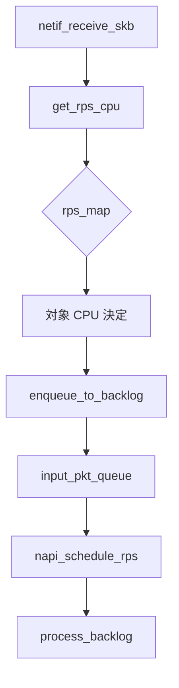

# 第20章 RPS、RFS と受信ステアリング

> **本章で読むソース**
>
> - [`net/core/dev.c` L5030-L5059](https://github.com/gregkh/linux/blob/v6.18.38/net/core/dev.c#L5030-L5059)
> - [`net/core/dev.c` L5041-L5052](https://github.com/gregkh/linux/blob/v6.18.38/net/core/dev.c#L5041-L5052)
> - [`net/core/dev.c` L5056-L5064](https://github.com/gregkh/linux/blob/v6.18.38/net/core/dev.c#L5056-L5064)
> - [`net/core/dev.c` L5285-L5318](https://github.com/gregkh/linux/blob/v6.18.38/net/core/dev.c#L5285-L5318)
> - [`net/core/dev.c` L5302-L5316](https://github.com/gregkh/linux/blob/v6.18.38/net/core/dev.c#L5302-L5316)
> - [`net/core/dev.c` L5296-L5300](https://github.com/gregkh/linux/blob/v6.18.38/net/core/dev.c#L5296-L5300)

## この章の狙い

Receive Packet Steering（RPS）がパケットを別 CPU の backlog へ配送する仕組みを読む。
`get_rps_cpu` と `enqueue_to_backlog` の連携を押さえる。

## 前提

- [第18章](18-napi-netif-receive.md) で `netif_receive_skb_internal` の RPS 分岐を読んでいること。

## get_rps_cpu

[`net/core/dev.c` L5030-L5059](https://github.com/gregkh/linux/blob/v6.18.38/net/core/dev.c#L5030-L5059)

```c
static int get_rps_cpu(struct net_device *dev, struct sk_buff *skb,
		       struct rps_dev_flow **rflowp)
{
	const struct rps_sock_flow_table *sock_flow_table;
	struct netdev_rx_queue *rxqueue = dev->_rx;
	struct rps_dev_flow_table *flow_table;
	struct rps_map *map;
	int cpu = -1;
	u32 tcpu;
	u32 hash;

	if (skb_rx_queue_recorded(skb)) {
		u16 index = skb_get_rx_queue(skb);

		if (unlikely(index >= dev->real_num_rx_queues)) {
			WARN_ONCE(dev->real_num_rx_queues > 1,
				  "%s received packet on queue %u, but number "
				  "of RX queues is %u\n",
				  dev->name, index, dev->real_num_rx_queues);
			goto done;
		}
		rxqueue += index;
	}

	/* Avoid computing hash if RFS/RPS is not active for this rxqueue */

	flow_table = rcu_dereference(rxqueue->rps_flow_table);
	map = rcu_dereference(rxqueue->rps_map);
	if (!flow_table && !map)
		goto done;
```

## RX キュー選択

[`net/core/dev.c` L5041-L5052](https://github.com/gregkh/linux/blob/v6.18.38/net/core/dev.c#L5041-L5052)

```c
	if (skb_rx_queue_recorded(skb)) {
		u16 index = skb_get_rx_queue(skb);

		if (unlikely(index >= dev->real_num_rx_queues)) {
			WARN_ONCE(dev->real_num_rx_queues > 1,
				  "%s received packet on queue %u, but number "
				  "of RX queues is %u\n",
				  dev->name, index, dev->real_num_rx_queues);
			goto done;
		}
		rxqueue += index;
	}
```

## ハッシュ計算

[`net/core/dev.c` L5056-L5064](https://github.com/gregkh/linux/blob/v6.18.38/net/core/dev.c#L5056-L5064)

```c
	flow_table = rcu_dereference(rxqueue->rps_flow_table);
	map = rcu_dereference(rxqueue->rps_map);
	if (!flow_table && !map)
		goto done;

	skb_reset_network_header(skb);
	hash = skb_get_hash(skb);
	if (!hash)
		goto done;
```

RFS（Receive Flow Steering）は `rps_sock_flow_table` でソケットと CPU を結び付ける。

## enqueue_to_backlog

[`net/core/dev.c` L5285-L5318](https://github.com/gregkh/linux/blob/v6.18.38/net/core/dev.c#L5285-L5318)

```c
static int enqueue_to_backlog(struct sk_buff *skb, int cpu,
			      unsigned int *qtail)
{
	enum skb_drop_reason reason;
	struct softnet_data *sd;
	unsigned long flags;
	unsigned int qlen;
	int max_backlog;
	u32 tail;

	reason = SKB_DROP_REASON_DEV_READY;
	if (!netif_running(skb->dev))
		goto bad_dev;

	reason = SKB_DROP_REASON_CPU_BACKLOG;
	sd = &per_cpu(softnet_data, cpu);

	qlen = skb_queue_len_lockless(&sd->input_pkt_queue);
	max_backlog = READ_ONCE(net_hotdata.max_backlog);
	if (unlikely(qlen > max_backlog))
		goto cpu_backlog_drop;
	backlog_lock_irq_save(sd, &flags);
	qlen = skb_queue_len(&sd->input_pkt_queue);
	if (qlen <= max_backlog && !skb_flow_limit(skb, qlen)) {
		if (!qlen) {
			/* Schedule NAPI for backlog device. We can use
			 * non atomic operation as we own the queue lock.
			 */
			if (!__test_and_set_bit(NAPI_STATE_SCHED,
						&sd->backlog.state))
				napi_schedule_rps(sd);
		}
		__skb_queue_tail(&sd->input_pkt_queue, skb);
		tail = rps_input_queue_tail_incr(sd);
```

## backlog 上限

[`net/core/dev.c` L5302-L5305](https://github.com/gregkh/linux/blob/v6.18.38/net/core/dev.c#L5302-L5305)

```c
	qlen = skb_queue_len_lockless(&sd->input_pkt_queue);
	max_backlog = READ_ONCE(net_hotdata.max_backlog);
	if (unlikely(qlen > max_backlog))
		goto cpu_backlog_drop;
```

## デバイス稼働チェック

[`net/core/dev.c` L5296-L5300](https://github.com/gregkh/linux/blob/v6.18.38/net/core/dev.c#L5296-L5300)

```c
	if (!netif_running(skb->dev))
		goto bad_dev;

	reason = SKB_DROP_REASON_CPU_BACKLOG;
	sd = &per_cpu(softnet_data, cpu);
```

## 処理の流れ



## 高速化と最適化の工夫

**ソフトウェア RSS**は NIC がマルチキュー非対応でも CPU 間で受信負荷を分散する。

**RFS**はアプリケーションが動く CPU へフローを寄せ、キャッシュ局所性を上げる。

**`max_backlog` 制限**はメモリ枯渇と livelock を防ぐ。

## まとめ

RPS はハッシュと `rps_map` で受信 CPU を選び、backlog 経由で処理する。
RFS はソケットと CPU の対応を更新し、アプリと同じ CPU でプロトコル処理を行う。
次章から送信経路を読む。

## 関連する章

- 前章：[GRO とソフトウェアオフロード受信](19-gro-receive-offload.md)
- 次章：[dev_queue_xmit と送信キュー投入](../part05-tx-qdisc/21-dev-queue-xmit.md)
- [NAPI と netif_receive_skb](18-napi-netif-receive.md)
