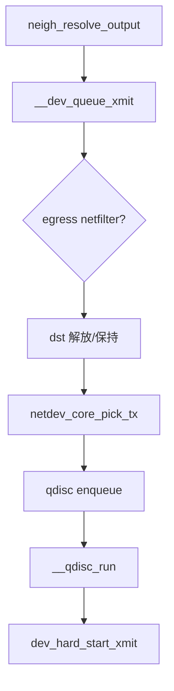

# 第21章 dev_queue_xmit と送信キュー投入

> **本章で読むソース**
>
> - [`net/core/dev.c` L4701-L4724](https://github.com/gregkh/linux/blob/v6.18.38/net/core/dev.c#L4701-L4724)
> - [`net/core/dev.c` L4745-L4761](https://github.com/gregkh/linux/blob/v6.18.38/net/core/dev.c#L4745-L4761)
> - [`net/core/dev.c` L4155-L4253](https://github.com/gregkh/linux/blob/v6.18.38/net/core/dev.c#L4155-L4253)

## この章の狙い

L2 ヘッダ付与後にパケットが qdisc へ入り、NIC ドライバへ渡るまでの `__dev_queue_xmit` を読む。
egress netfilter と TX キュー選択の分岐を押さえる。

## 前提

- [第16章](../part03-ipv4/16-neighbour-arp.md) で `neigh_resolve_output` が `dev_queue_xmit` を呼ぶことを読んでいること。

## __dev_queue_xmit 入口

[`net/core/dev.c` L4701-L4724](https://github.com/gregkh/linux/blob/v6.18.38/net/core/dev.c#L4701-L4724)

```c
int __dev_queue_xmit(struct sk_buff *skb, struct net_device *sb_dev)
{
	struct net_device *dev = skb->dev;
	struct netdev_queue *txq = NULL;
	struct Qdisc *q;
	int rc = -ENOMEM;
	bool again = false;

	skb_reset_mac_header(skb);
	skb_assert_len(skb);

	if (unlikely(skb_shinfo(skb)->tx_flags &
		     (SKBTX_SCHED_TSTAMP | SKBTX_BPF)))
		__skb_tstamp_tx(skb, NULL, NULL, skb->sk, SCM_TSTAMP_SCHED);

	/* Disable soft irqs for various locks below. Also
	 * stops preemption for RCU.
	 */
	rcu_read_lock_bh();

	skb_update_prio(skb);

	qdisc_pkt_len_init(skb);
	tcx_set_ingress(skb, false);
```

## skb 検証

[`net/core/dev.c` L4709-L4710](https://github.com/gregkh/linux/blob/v6.18.38/net/core/dev.c#L4709-L4710)

```c
	skb_reset_mac_header(skb);
	skb_assert_len(skb);
```

## RCU と softirq 抑止

[`net/core/dev.c` L4719-L4721](https://github.com/gregkh/linux/blob/v6.18.38/net/core/dev.c#L4719-L4721)

```c
	rcu_read_lock_bh();

	skb_update_prio(skb);
```

## dst 解放と TX キュー選択

[`net/core/dev.c` L4745-L4761](https://github.com/gregkh/linux/blob/v6.18.38/net/core/dev.c#L4745-L4761)

```c
	/* If device/qdisc don't need skb->dst, release it right now while
	 * its hot in this cpu cache.
	 */
	if (dev->priv_flags & IFF_XMIT_DST_RELEASE)
		skb_dst_drop(skb);
	else
		skb_dst_force(skb);

	if (!txq)
		txq = netdev_core_pick_tx(dev, skb, sb_dev);

	q = rcu_dereference_bh(txq->qdisc);

	trace_net_dev_queue(skb);
	if (q->enqueue) {
		rc = __dev_xmit_skb(skb, q, dev, txq);
		goto out;
```

## netdev_core_pick_tx

[`net/core/dev.c` L4753-L4756](https://github.com/gregkh/linux/blob/v6.18.38/net/core/dev.c#L4753-L4756)

```c
	if (!txq)
		txq = netdev_core_pick_tx(dev, skb, sb_dev);

	q = rcu_dereference_bh(txq->qdisc);
```

マルチキュー NIC ではハッシュや XPS で TX キューを選ぶ。

## qdisc への enqueue

[`net/core/dev.c` L4758-L4761](https://github.com/gregkh/linux/blob/v6.18.38/net/core/dev.c#L4758-L4761)

```c
	trace_net_dev_queue(skb);
	if (q->enqueue) {
		rc = __dev_xmit_skb(skb, q, dev, txq);
		goto out;
```

qdisc がないソフトウェアデバイス（loopback 等）は直接 `dev_hard_start_xmit` へ進む。

## __dev_xmit_skb と enqueue 戻り値

qdisc への投入、バイパス送信、`__qdisc_run` 起動までを担う。
`NET_XMIT_SUCCESS` / `NET_XMIT_DROP` / `NET_XMIT_CN` が上位へ返る。

[`net/core/dev.c` L4155-L4253](https://github.com/gregkh/linux/blob/v6.18.38/net/core/dev.c#L4155-L4253)

```c
static inline int __dev_xmit_skb(struct sk_buff *skb, struct Qdisc *q,
				 struct net_device *dev,
				 struct netdev_queue *txq)
{
	spinlock_t *root_lock = qdisc_lock(q);
	struct sk_buff *to_free = NULL;
	bool contended;
	int rc;

	qdisc_calculate_pkt_len(skb, q);

	tcf_set_drop_reason(skb, SKB_DROP_REASON_QDISC_DROP);
	// ... (中略) ...
	} else if ((q->flags & TCQ_F_CAN_BYPASS) && !qdisc_qlen(q) &&
		   qdisc_run_begin(q)) {
		qdisc_bstats_update(q, skb);

		if (sch_direct_xmit(skb, q, dev, txq, root_lock, true)) {
			// ... (中略) ...
			__qdisc_run(q);
		}

		qdisc_run_end(q);
		rc = NET_XMIT_SUCCESS;
	} else {
		WRITE_ONCE(q->owner, smp_processor_id());
		rc = dev_qdisc_enqueue(skb, q, &to_free, txq);
		WRITE_ONCE(q->owner, -1);
		if (qdisc_run_begin(q)) {
			// ... (中略) ...
			__qdisc_run(q);
			qdisc_run_end(q);
		}
	}
	// ... (中略) ...
}
```

空キューかつ `TCQ_F_CAN_BYPASS` なら enqueue を省略して `sch_direct_xmit` へ直行する。
通常経路は `dev_qdisc_enqueue` のあと `__qdisc_run` で dequeue 送信を始める。

## 処理の流れ



## 高速化と最適化の工夫

**`IFF_XMIT_DST_RELEASE`**は送信直後に `dst` を解放し、キャッシュを温めた状態で参照を切る。

**XPS（Transmit Packet Steering）**はフローを固定 TX キューに割り当て、キャッシュ局所性を上げる。

**BQL（Byte Queue Limits）**はドライバリングのバイト数を制限し、バッファブロートを抑える。

## まとめ

`__dev_queue_xmit` は egress 処理、TX キュー選択、qdisc 投入までを担う。
次章では qdisc フレームワークを読む。

## 関連する章

- 前章：[RPS、RFS と受信ステアリング](../part04-rx-fastpath/20-rps-rfs-steering.md)
- 次章：[qdisc フレームワークと sch_generic](22-qdisc-framework.md)
- [neighbour と ARP 解決](../part03-ipv4/16-neighbour-arp.md)
