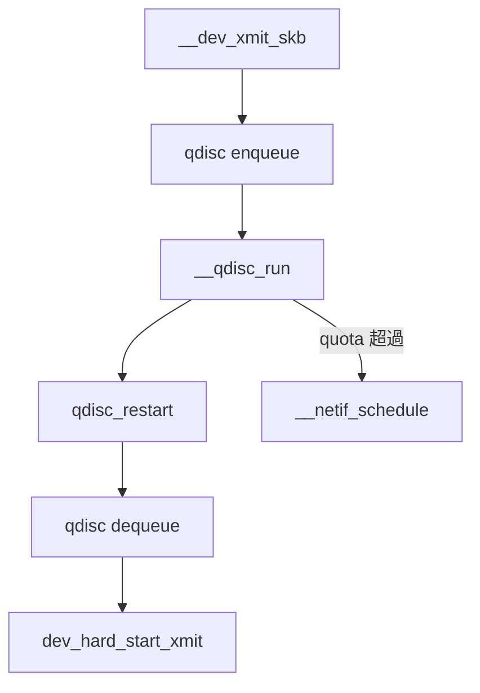

# 第22章 qdisc フレームワークと sch_generic

> **本章で読むソース**
>
> - [`net/sched/sch_generic.c` L415-L431](https://github.com/gregkh/linux/blob/v6.18.38/net/sched/sch_generic.c#L415-L431)
> - [`net/sched/sch_generic.c` L393-L413](https://github.com/gregkh/linux/blob/v6.18.38/net/sched/sch_generic.c#L393-L413)
> - [`net/sched/sch_generic.c` L319-L371](https://github.com/gregkh/linux/blob/v6.18.38/net/sched/sch_generic.c#L319-L371)
> - [`net/sched/sch_api.c` L1244-L1267](https://github.com/gregkh/linux/blob/v6.18.38/net/sched/sch_api.c#L1244-L1267)

## この章の狙い

traffic control の中心である qdisc がパケットをキューし、送信をスケジュールする仕組みを読む。
`__qdisc_run` と `qdisc_create` の役割を押さえる。

## 前提

- [第21章](21-dev-queue-xmit.md) で `__dev_xmit_skb` が qdisc へパケットを渡すことを読んでいること。

## __qdisc_run

[`net/sched/sch_generic.c` L415-L431](https://github.com/gregkh/linux/blob/v6.18.38/net/sched/sch_generic.c#L415-L431)

```c
void __qdisc_run(struct Qdisc *q)
{
	int quota = READ_ONCE(net_hotdata.dev_tx_weight);
	int packets;

	while (qdisc_restart(q, &packets, quota)) {
		quota -= packets;
		if (quota <= 0) {
			if (q->flags & TCQ_F_NOLOCK)
				set_bit(__QDISC_STATE_MISSED, &q->state);
			else
				__netif_schedule(q);

			break;
		}
	}
}
```

`dev_tx_weight` 分のパケットを送信し、quota 超過時は再スケジュールする。

## qdisc_restart と dequeue

`dequeue_skb` で qdisc から skb を取り出し、`sch_direct_xmit` へ渡す。

[`net/sched/sch_generic.c` L393-L413](https://github.com/gregkh/linux/blob/v6.18.38/net/sched/sch_generic.c#L393-L413)

```c
static inline bool qdisc_restart(struct Qdisc *q, int *packets, int budget)
{
	spinlock_t *root_lock = NULL;
	struct netdev_queue *txq;
	struct net_device *dev;
	struct sk_buff *skb;
	bool validate;

	/* Dequeue packet */
	skb = dequeue_skb(q, &validate, packets, budget);
	if (unlikely(!skb))
		return false;

	if (!(q->flags & TCQ_F_NOLOCK))
		root_lock = qdisc_lock(q);

	dev = qdisc_dev(q);
	txq = skb_get_tx_queue(dev, skb);

	return sch_direct_xmit(skb, q, dev, txq, root_lock, validate);
}
```

## sch_direct_xmit と NETDEV_TX_BUSY

ドライバが `NETDEV_TX_BUSY` を返すと skb を qdisc へ再キューし、false を返して送信ループを止める。

[`net/sched/sch_generic.c` L319-L371](https://github.com/gregkh/linux/blob/v6.18.38/net/sched/sch_generic.c#L319-L371)

```c
bool sch_direct_xmit(struct sk_buff *skb, struct Qdisc *q,
		     struct net_device *dev, struct netdev_queue *txq,
		     spinlock_t *root_lock, bool validate)
{
	int ret = NETDEV_TX_BUSY;
	// ... (中略) ...
	if (likely(skb)) {
		HARD_TX_LOCK(dev, txq, smp_processor_id());
		if (!netif_xmit_frozen_or_stopped(txq))
			skb = dev_hard_start_xmit(skb, dev, txq, &ret);
		else
			qdisc_maybe_clear_missed(q, txq);

		HARD_TX_UNLOCK(dev, txq);
	}
	// ... (中略) ...
	if (!dev_xmit_complete(ret)) {
		/* Driver returned NETDEV_TX_BUSY - requeue skb */
		if (unlikely(ret != NETDEV_TX_BUSY))
			net_warn_ratelimited("BUG %s code %d qlen %d\n",
					     dev->name, ret, q->q.qlen);

		dev_requeue_skb(skb, q);
		return false;
	}

	return true;
}
```

`__qdisc_run` は false が返ると while を抜け、必要なら `__netif_schedule` で再開する。

## quota 管理

[`net/sched/sch_generic.c` L417-L422](https://github.com/gregkh/linux/blob/v6.18.38/net/sched/sch_generic.c#L417-L422)

```c
	int quota = READ_ONCE(net_hotdata.dev_tx_weight);
	int packets;

	while (qdisc_restart(q, &packets, quota)) {
		quota -= packets;
		if (quota <= 0) {
```

## 再スケジュール

[`net/sched/sch_generic.c` L420-L430](https://github.com/gregkh/linux/blob/v6.18.38/net/sched/sch_generic.c#L420-L430)

```c
		if (quota <= 0) {
			if (q->flags & TCQ_F_NOLOCK)
				set_bit(__QDISC_STATE_MISSED, &q->state);
			else
				__netif_schedule(q);

			break;
		}
	}
}
```

NOLOCK qdisc は MISSED フラグで再実行を示す。

## qdisc_create

[`net/sched/sch_api.c` L1244-L1267](https://github.com/gregkh/linux/blob/v6.18.38/net/sched/sch_api.c#L1244-L1267)

```c
static struct Qdisc *qdisc_create(struct net_device *dev,
				  struct netdev_queue *dev_queue,
				  u32 parent, u32 handle,
				  struct nlattr **tca, int *errp,
				  struct netlink_ext_ack *extack)
{
	int err;
	struct nlattr *kind = tca[TCA_KIND];
	struct Qdisc *sch;
	struct Qdisc_ops *ops;
	struct qdisc_size_table *stab;

	ops = qdisc_lookup_ops(kind);
	if (!ops) {
		err = -ENOENT;
		NL_SET_ERR_MSG(extack, "Specified qdisc kind is unknown");
		goto err_out;
	}

	sch = qdisc_alloc(dev_queue, ops, extack);
	if (IS_ERR(sch)) {
		err = PTR_ERR(sch);
		goto err_out2;
	}
```

## qdisc_lookup_ops

[`net/sched/sch_api.c` L1256-L1260](https://github.com/gregkh/linux/blob/v6.18.38/net/sched/sch_api.c#L1256-L1260)

```c
	ops = qdisc_lookup_ops(kind);
	if (!ops) {
		err = -ENOENT;
		NL_SET_ERR_MSG(extack, "Specified qdisc kind is unknown");
		goto err_out;
```

`tc` コマンドの `kind`（pfifo_fast、fq_codel 等）で ops を解決する。

## qdisc_alloc

[`net/sched/sch_api.c` L1263-L1267](https://github.com/gregkh/linux/blob/v6.18.38/net/sched/sch_api.c#L1263-L1267)

```c
	sch = qdisc_alloc(dev_queue, ops, extack);
	if (IS_ERR(sch)) {
		err = PTR_ERR(sch);
		goto err_out2;
	}
```

## 処理の流れ



## 高速化と最適化の工夫

**`dev_tx_weight` quota**はソフトIRQ の独占を防ぎ、受信処理との公平性を保つ。

**TCQ_F_NOLOCK qdisc**は root ロックなしで enqueue/dequeue し、マルチキュー NIC の並列性を上げる。

**qdisc バッチ dequeue**は複数パケットをまとめてドライバへ渡し、per-packet オーバーヘッドを減らす。

## まとめ

qdisc は enqueue でパケットを保持し、`__qdisc_run` が dequeue と送信を駆動する。
`tc` 経由の `qdisc_create` で種別ごとの ops が登録される。
次章では mq、fq、fq_codel を読む。

## 関連する章

- 前章：[dev_queue_xmit と送信キュー投入](21-dev-queue-xmit.md)
- 次章：[mq、fq、fq_codel](23-mq-fq-fq-codel.md)
