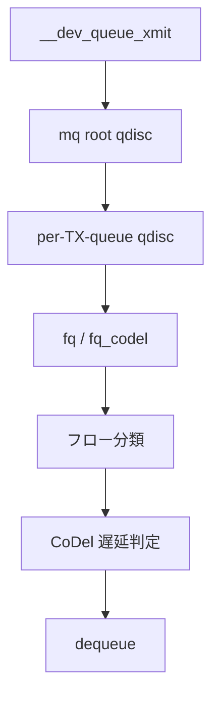

# 第23章 mq、fq、fq_codel

> **本章で読むソース**
>
> - [`net/sched/sch_mq.c` L67-L98](https://github.com/gregkh/linux/blob/v6.18.38/net/sched/sch_mq.c#L67-L98)
> - [`net/sched/sch_fq.c` L542-L574](https://github.com/gregkh/linux/blob/v6.18.38/net/sched/sch_fq.c#L542-L574)
> - [`net/sched/sch_fq.c` L648-L781](https://github.com/gregkh/linux/blob/v6.18.38/net/sched/sch_fq.c#L648-L781)
> - [`net/sched/sch_fq_codel.c` L185-L219](https://github.com/gregkh/linux/blob/v6.18.38/net/sched/sch_fq_codel.c#L185-L219)
> - [`net/sched/sch_fq_codel.c` L282-L325](https://github.com/gregkh/linux/blob/v6.18.38/net/sched/sch_fq_codel.c#L282-L325)
> - [`include/net/codel_impl.h` L104-L143](https://github.com/gregkh/linux/blob/v6.18.38/include/net/codel_impl.h#L104-L143)

## この章の狙い

マルチキュー NIC 向けの mq qdisc と、フロー単位公平性を持つ fq、遅延制御の fq_codel を読む。
現代 Linux のデフォルト送信キュー構成を押さえる。

## 前提

- [第22章](22-qdisc-framework.md) で qdisc の enqueue/dequeue サイクルを読んでいること。

## mq_init

[`net/sched/sch_mq.c` L67-L98](https://github.com/gregkh/linux/blob/v6.18.38/net/sched/sch_mq.c#L67-L98)

```c
static int mq_init(struct Qdisc *sch, struct nlattr *opt,
		   struct netlink_ext_ack *extack)
{
	struct net_device *dev = qdisc_dev(sch);
	struct mq_sched *priv = qdisc_priv(sch);
	struct netdev_queue *dev_queue;
	struct Qdisc *qdisc;
	unsigned int ntx;

	if (sch->parent != TC_H_ROOT)
		return -EOPNOTSUPP;

	if (!netif_is_multiqueue(dev))
		return -EOPNOTSUPP;

	/* pre-allocate qdiscs, attachment can't fail */
	priv->qdiscs = kcalloc(dev->num_tx_queues, sizeof(priv->qdiscs[0]),
			       GFP_KERNEL);
	if (!priv->qdiscs)
		return -ENOMEM;

	for (ntx = 0; ntx < dev->num_tx_queues; ntx++) {
		dev_queue = netdev_get_tx_queue(dev, ntx);
		qdisc = qdisc_create_dflt(dev_queue, get_default_qdisc_ops(dev, ntx),
					  TC_H_MAKE(TC_H_MAJ(sch->handle),
						    TC_H_MIN(ntx + 1)),
					  extack);
		if (!qdisc)
			return -ENOMEM;
		priv->qdiscs[ntx] = qdisc;
		qdisc->flags |= TCQ_F_ONETXQUEUE | TCQ_F_NOPARENT;
	}
```

## マルチキュー要件

[`net/sched/sch_mq.c` L79-L86](https://github.com/gregkh/linux/blob/v6.18.38/net/sched/sch_mq.c#L79-L86)

```c
	if (!netif_is_multiqueue(dev))
		return -EOPNOTSUPP;

	/* pre-allocate qdiscs, attachment can't fail */
	priv->qdiscs = kcalloc(dev->num_tx_queues, sizeof(priv->qdiscs[0]),
			       GFP_KERNEL);
	if (!priv->qdiscs)
		return -ENOMEM;
```

## 各 TX キューへの子 qdisc

[`net/sched/sch_mq.c` L88-L98](https://github.com/gregkh/linux/blob/v6.18.38/net/sched/sch_mq.c#L88-L98)

```c
	for (ntx = 0; ntx < dev->num_tx_queues; ntx++) {
		dev_queue = netdev_get_tx_queue(dev, ntx);
		qdisc = qdisc_create_dflt(dev_queue, get_default_qdisc_ops(dev, ntx),
					  TC_H_MAKE(TC_H_MAJ(sch->handle),
						    TC_H_MIN(ntx + 1)),
					  extack);
		if (!qdisc)
			return -ENOMEM;
		priv->qdiscs[ntx] = qdisc;
		qdisc->flags |= TCQ_F_ONETXQUEUE | TCQ_F_NOPARENT;
	}
```

## fq_enqueue

[`net/sched/sch_fq.c` L542-L574](https://github.com/gregkh/linux/blob/v6.18.38/net/sched/sch_fq.c#L542-L574)

```c
static int fq_enqueue(struct sk_buff *skb, struct Qdisc *sch,
		      struct sk_buff **to_free)
{
	struct fq_sched_data *q = qdisc_priv(sch);
	struct fq_flow *f;
	u64 now;
	u8 band;

	band = fq_prio2band(q->prio2band, skb->priority & TC_PRIO_MAX);
	if (unlikely(q->band_pkt_count[band] >= sch->limit)) {
		q->stat_band_drops[band]++;
		return qdisc_drop_reason(skb, sch, to_free,
					 FQDR(BAND_LIMIT));
	}

	now = ktime_get_ns();
	if (!skb->tstamp) {
		fq_skb_cb(skb)->time_to_send = now;
	} else {
		/* Check if packet timestamp is too far in the future. */
		if (fq_packet_beyond_horizon(skb, q, now)) {
			if (q->horizon_drop) {
				q->stat_horizon_drops++;
				return qdisc_drop_reason(skb, sch, to_free,
							 FQDR(HORIZON_LIMIT));
			}
			q->stat_horizon_caps++;
			skb->tstamp = now + q->horizon;
		}
		fq_skb_cb(skb)->time_to_send = skb->tstamp;
	}

	f = fq_classify(sch, skb, now);
```

## fq_dequeue と pacing

dequeue 側は `new_flows` / `old_flows` をローテーションし、`time_to_send` が未来のフローはスロットルする。

[`net/sched/sch_fq.c` L648-L781](https://github.com/gregkh/linux/blob/v6.18.38/net/sched/sch_fq.c#L648-L781)

```c
static struct sk_buff *fq_dequeue(struct Qdisc *sch)
{
	struct fq_sched_data *q = qdisc_priv(sch);
	// ... (中略) ...
	skb = fq_peek(f);
	if (skb) {
		u64 time_next_packet = max_t(u64, fq_skb_cb(skb)->time_to_send,
					     f->time_next_packet);

		if (now + q->offload_horizon < time_next_packet) {
			head->first = f->next;
			f->time_next_packet = time_next_packet;
			fq_flow_set_throttled(q, f);
			goto begin;
		}
		// ... (中略) ...
		fq_dequeue_skb(sch, f, skb);
	} else {
		head->first = f->next;
		/* force a pass through old_flows to prevent starvation */
		if (head == &pband->new_flows) {
			fq_flow_add_tail(q, f, OLD_FLOW);
		} else {
			fq_flow_set_detached(f);
		}
		goto begin;
	}
out:
	return skb;
}
```

`fq_skb_cb(skb)->time_to_send` は enqueue 時に設定した pacing 時刻である。

## fq_codel_enqueue

[`net/sched/sch_fq_codel.c` L185-L219](https://github.com/gregkh/linux/blob/v6.18.38/net/sched/sch_fq_codel.c#L185-L219)

```c
static int fq_codel_enqueue(struct sk_buff *skb, struct Qdisc *sch,
			    struct sk_buff **to_free)
{
	struct fq_codel_sched_data *q = qdisc_priv(sch);
	unsigned int idx, prev_backlog, prev_qlen;
	struct fq_codel_flow *flow;
	int ret;
	unsigned int pkt_len;
	bool memory_limited;

	idx = fq_codel_classify(skb, sch, &ret);
	if (idx == 0) {
		if (ret & __NET_XMIT_BYPASS)
			qdisc_qstats_drop(sch);
		__qdisc_drop(skb, to_free);
		return ret;
	}
	idx--;

	codel_set_enqueue_time(skb);
	flow = &q->flows[idx];
	flow_queue_add(flow, skb);
	q->backlogs[idx] += qdisc_pkt_len(skb);
	qdisc_qstats_backlog_inc(sch, skb);

	if (list_empty(&flow->flowchain)) {
		list_add_tail(&flow->flowchain, &q->new_flows);
		q->new_flow_count++;
		flow->deficit = q->quantum;
	}
	get_codel_cb(skb)->mem_usage = skb->truesize;
	q->memory_usage += get_codel_cb(skb)->mem_usage;
	memory_limited = q->memory_usage > q->memory_limit;
	if (++sch->q.qlen <= sch->limit && !memory_limited)
		return NET_XMIT_SUCCESS;
```

## fq_codel_dequeue と CoDel sojourn time

`new_flows` を優先しつつ `codel_dequeue` で sojourn time（滞留時間）を判定する。

[`net/sched/sch_fq_codel.c` L282-L326](https://github.com/gregkh/linux/blob/v6.18.38/net/sched/sch_fq_codel.c#L282-L326)

```c
static struct sk_buff *fq_codel_dequeue(struct Qdisc *sch)
{
	struct fq_codel_sched_data *q = qdisc_priv(sch);
	struct sk_buff *skb;
	struct fq_codel_flow *flow;
	struct list_head *head;

begin:
	head = &q->new_flows;
	if (list_empty(head)) {
		head = &q->old_flows;
		if (list_empty(head))
			return NULL;
	}
	flow = list_first_entry(head, struct fq_codel_flow, flowchain);

	if (flow->deficit <= 0) {
		flow->deficit += q->quantum;
		list_move_tail(&flow->flowchain, &q->old_flows);
		goto begin;
	}

	skb = codel_dequeue(sch, &sch->qstats.backlog, &q->cparams,
			    &flow->cvars, &q->cstats, qdisc_pkt_len,
			    codel_get_enqueue_time, drop_func, dequeue_func);

	if (!skb) {
		/* force a pass through old_flows to prevent starvation */
		if ((head == &q->new_flows) && !list_empty(&q->old_flows))
			list_move_tail(&flow->flowchain, &q->old_flows);
		else
			list_del_init(&flow->flowchain);
		goto begin;
	}
	qdisc_bstats_update(sch, skb);
	flow->deficit -= qdisc_pkt_len(skb);

	if (q->cstats.drop_count) {
		qdisc_tree_reduce_backlog(sch, q->cstats.drop_count,
					  q->cstats.drop_len);
		q->cstats.drop_count = 0;
		q->cstats.drop_len = 0;
	}
	return skb;
}
```

## codel_should_drop

sojourn time が `target` を超え、かつ `interval` 以上続くとドロップ候補になる。

[`include/net/codel_impl.h` L104-L143](https://github.com/gregkh/linux/blob/v6.18.38/include/net/codel_impl.h#L104-L143)

```c
static bool codel_should_drop(const struct sk_buff *skb,
			      void *ctx,
			      struct codel_vars *vars,
			      struct codel_params *params,
			      struct codel_stats *stats,
			      codel_skb_len_t skb_len_func,
			      codel_skb_time_t skb_time_func,
			      u32 *backlog,
			      codel_time_t now)
{
	// ... (中略) ...
	vars->ldelay = now - skb_time_func(skb);
	// ... (中略) ...
	if (codel_time_before(vars->ldelay, params->target) ||
	    *backlog <= params->mtu) {
		vars->first_above_time = 0;
		return false;
	}
	// ... (中略) ...
	} else if (codel_time_after(now, vars->first_above_time)) {
		ok_to_drop = true;
	}
	return ok_to_drop;
}
```

`codel_set_enqueue_time` で記録した時刻と現在時刻の差が sojourn time である。

## 処理の流れ



## 高速化と最適化の工夫

**フロー分離（fq）**は大流量フローが小流量を飢えさせる bufferbloat を防ぐ。

**CoDel**はキュー滞留時間に基づきドロップし、低レイテンシを維持する。

**memory_limit**は qdisc が消費するメモリを上限し、OOM を防ぐ。

## まとめ

mq は TX キューごとに子 qdisc を持ち、fq_codel がフロー公平性と遅延制御を担う。
多くのディストリビューションでデフォルト root qdisc として使われる。
次章から netfilter を読む。

## 関連する章

- 前章：[qdisc フレームワークと sch_generic](22-qdisc-framework.md)
- 次章：[netfilter フックと IPv4 フック点](../part06-netfilter/24-netfilter-hooks.md)
