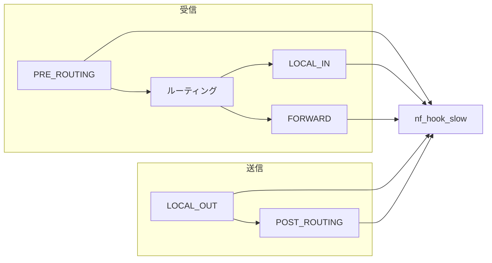

# 第24章 netfilter フックと IPv4 フック点

> **本章で読むソース**
>
> - [`include/linux/netfilter.h` L227-L278](https://github.com/gregkh/linux/blob/v6.18.38/include/linux/netfilter.h#L227-L278)
> - [`include/linux/netfilter.h` L311-L320](https://github.com/gregkh/linux/blob/v6.18.38/include/linux/netfilter.h#L311-L320)
> - [`net/netfilter/core.c` L616-L648](https://github.com/gregkh/linux/blob/v6.18.38/net/netfilter/core.c#L616-L648)
> - [`net/netfilter/core.c` L425-L439](https://github.com/gregkh/linux/blob/v6.18.38/net/netfilter/core.c#L425-L439)
> - [`include/uapi/linux/netfilter.h` L43-L48](https://github.com/gregkh/linux/blob/v6.18.38/include/uapi/linux/netfilter.h#L43-L48)

## この章の狙い

netfilter がパケット通過点にフックを挿入し、iptables/nftables が処理する基盤を読む。
`nf_hook_slow` の verdict 処理に加え、`nf_hook` の fast path とフック登録を押さえる。

## 前提

- [第13章](../part03-ipv4/13-ipv4-output.md) で `NF_INET_LOCAL_OUT` を読んでいること。
- [第15章](../part03-ipv4/15-ipv4-input-delivery.md) で `NF_INET_PRE_ROUTING` と `LOCAL_IN` を読んでいること。

## nf_hook と fast path

フック未登録時は `hook_head` が NULL のまま戻り値 1 を返し、`NF_HOOK` が `okfn` をそのまま呼ぶ。
`CONFIG_JUMP_LABEL` 有効時は `nf_hooks_needed` の static key で分岐自体を省略する。

[`include/linux/netfilter.h` L227-L278](https://github.com/gregkh/linux/blob/v6.18.38/include/linux/netfilter.h#L227-L278)

```c
static inline int nf_hook(u_int8_t pf, unsigned int hook, struct net *net,
			  struct sock *sk, struct sk_buff *skb,
			  struct net_device *indev, struct net_device *outdev,
			  int (*okfn)(struct net *, struct sock *, struct sk_buff *))
{
	struct nf_hook_entries *hook_head = NULL;
	int ret = 1;

#ifdef CONFIG_JUMP_LABEL
	if (__builtin_constant_p(pf) &&
	    __builtin_constant_p(hook) &&
	    !static_key_false(&nf_hooks_needed[pf][hook]))
		return 1;
#endif

	rcu_read_lock();
	switch (pf) {
	case NFPROTO_IPV4:
		hook_head = rcu_dereference(net->nf.hooks_ipv4[hook]);
		break;
	// ... (中略) ...
	}

	if (hook_head) {
		struct nf_hook_state state;

		nf_hook_state_init(&state, hook, pf, indev, outdev,
				   sk, net, okfn);

		ret = nf_hook_slow(skb, &state, hook_head, 0);
	}
	rcu_read_unlock();

	return ret;
}
```

## NF_HOOK と okfn 続行

戻り値 1 のときだけ後続処理（`ip_rcv_finish` 等）へ進む。

[`include/linux/netfilter.h` L311-L320](https://github.com/gregkh/linux/blob/v6.18.38/include/linux/netfilter.h#L311-L320)

```c
static inline int
NF_HOOK(uint8_t pf, unsigned int hook, struct net *net, struct sock *sk, struct sk_buff *skb,
	struct net_device *in, struct net_device *out,
	int (*okfn)(struct net *, struct sock *, struct sk_buff *))
{
	int ret = nf_hook(pf, hook, net, sk, skb, in, out, okfn);
	if (ret == 1)
		ret = okfn(net, sk, skb);
	return ret;
}
```

## nf_hook_slow

[`net/netfilter/core.c` L616-L648](https://github.com/gregkh/linux/blob/v6.18.38/net/netfilter/core.c#L616-L648)

```c
int nf_hook_slow(struct sk_buff *skb, struct nf_hook_state *state,
		 const struct nf_hook_entries *e, unsigned int s)
{
	unsigned int verdict;
	int ret;

	for (; s < e->num_hook_entries; s++) {
		verdict = nf_hook_entry_hookfn(&e->hooks[s], skb, state);
		switch (verdict & NF_VERDICT_MASK) {
		case NF_ACCEPT:
			break;
		case NF_DROP:
			kfree_skb_reason(skb,
					 SKB_DROP_REASON_NETFILTER_DROP);
			ret = NF_DROP_GETERR(verdict);
			if (ret == 0)
				ret = -EPERM;
			return ret;
		case NF_QUEUE:
			ret = nf_queue(skb, state, s, verdict);
			if (ret == 1)
				continue;
			return ret;
		case NF_STOLEN:
			return NF_DROP_GETERR(verdict);
		default:
			WARN_ON_ONCE(1);
			return 0;
		}
	}

	return 1;
}
```

登録済みフックを優先度順に実行する。

## フック登録と nf_hook_entries

`nf_register_net_hook` は `nf_hook_entries_grow` で既存配列に新フックを挿入し、RCU で `net->nf.hooks_ipv4[hook]` 等を差し替える。

[`net/netfilter/core.c` L425-L439](https://github.com/gregkh/linux/blob/v6.18.38/net/netfilter/core.c#L425-L439)

```c
	pp = nf_hook_entry_head(net, pf, reg->hooknum, reg->dev);
	if (!pp)
		return -EINVAL;

	mutex_lock(&nf_hook_mutex);

	p = nf_entry_dereference(*pp);
	new_hooks = nf_hook_entries_grow(p, reg);

	if (!IS_ERR(new_hooks)) {
		hooks_validate(new_hooks);
		rcu_assign_pointer(*pp, new_hooks);
	}

	mutex_unlock(&nf_hook_mutex);
```

priority 値の小さいフックほど先に `nf_hook_slow` のループへ入る。

## NF_ACCEPT

[`net/netfilter/core.c` L622-L626](https://github.com/gregkh/linux/blob/v6.18.38/net/netfilter/core.c#L622-L626)

```c
	for (; s < e->num_hook_entries; s++) {
		verdict = nf_hook_entry_hookfn(&e->hooks[s], skb, state);
		switch (verdict & NF_VERDICT_MASK) {
		case NF_ACCEPT:
			break;
```

## NF_DROP

[`net/netfilter/core.c` L627-L633](https://github.com/gregkh/linux/blob/v6.18.38/net/netfilter/core.c#L627-L633)

```c
		case NF_DROP:
			kfree_skb_reason(skb,
					 SKB_DROP_REASON_NETFILTER_DROP);
			ret = NF_DROP_GETERR(verdict);
			if (ret == 0)
				ret = -EPERM;
			return ret;
```

## NF_QUEUE と NF_STOLEN

[`net/netfilter/core.c` L634-L640](https://github.com/gregkh/linux/blob/v6.18.38/net/netfilter/core.c#L634-L640)

```c
		case NF_QUEUE:
			ret = nf_queue(skb, state, s, verdict);
			if (ret == 1)
				continue;
			return ret;
		case NF_STOLEN:
			return NF_DROP_GETERR(verdict);
```

ユーザ空間（conntrackd 等）へパケットを渡す `NF_QUEUE` と、カーネルが所有権を取る `NF_STOLEN` がある。

## 正常終了

[`net/netfilter/core.c` L647-L648](https://github.com/gregkh/linux/blob/v6.18.38/net/netfilter/core.c#L647-L648)

```c
	return 1;
}
```

戻り値 1 は呼び出し元の `okfn` 続行を意味する。

## IPv4 フック点一覧

[`include/uapi/linux/netfilter.h` L43-L48](https://github.com/gregkh/linux/blob/v6.18.38/include/uapi/linux/netfilter.h#L43-L48)

```c
	NF_INET_PRE_ROUTING,
	NF_INET_LOCAL_IN,
	NF_INET_FORWARD,
	NF_INET_LOCAL_OUT,
	NF_INET_POST_ROUTING,
	NF_INET_NUMHOOKS,
```

## 処理の流れ



## 高速化と最適化の工夫

**フックエントリのバッチ登録**は `nf_hook_entries` に複数フックをまとめ、キャッシュ効率を上げる。

**static key（`nf_hooks_needed`）**はフック未登録時のオーバーヘッドをほぼゼロにする。

**per-net namespace 分離**はコンテナごとに独立したルールセットを持てる。

## まとめ

netfilter は5つの IPv4 フック点でパケットを横取りし、verdict で続行、破棄、キューイングを決める。
次章では conntrack を読む。

## 関連する章

- 前章：[mq、fq、fq_codel](../part05-tx-qdisc/23-mq-fq-fq-codel.md)
- 次章：[nf_conntrack と接続追跡](25-nf-conntrack.md)
- [IPv4 出力と ip_local_out](../part03-ipv4/13-ipv4-output.md)
