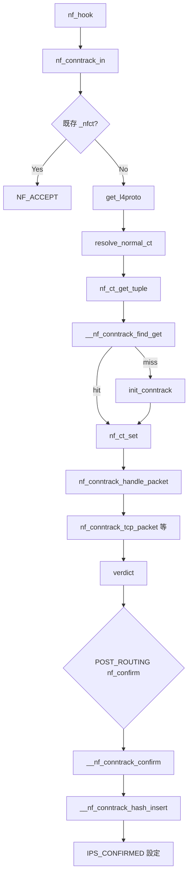

# 第25章 nf_conntrack と接続追跡

> **本章で読むソース**
>
> - [`net/netfilter/nf_conntrack_core.c` L2010-L2093](https://github.com/gregkh/linux/blob/v6.18.38/net/netfilter/nf_conntrack_core.c#L2010-L2093)
> - [`net/netfilter/nf_conntrack_core.c` L1863-L1924](https://github.com/gregkh/linux/blob/v6.18.38/net/netfilter/nf_conntrack_core.c#L1863-L1924)
> - [`net/netfilter/nf_conntrack_core.c` L1657-L1714](https://github.com/gregkh/linux/blob/v6.18.38/net/netfilter/nf_conntrack_core.c#L1657-L1714)
> - [`net/netfilter/nf_conntrack_core.c` L1758-L1860](https://github.com/gregkh/linux/blob/v6.18.38/net/netfilter/nf_conntrack_core.c#L1758-L1860)
> - [`net/netfilter/nf_conntrack_core.c` L1201-L1339](https://github.com/gregkh/linux/blob/v6.18.38/net/netfilter/nf_conntrack_core.c#L1201-L1339)
> - [`net/netfilter/nf_conntrack_core.c` L1971-L2007](https://github.com/gregkh/linux/blob/v6.18.38/net/netfilter/nf_conntrack_core.c#L1971-L2007)
> - [`include/uapi/linux/netfilter/nf_conntrack_common.h` L11-L20](https://github.com/gregkh/linux/blob/v6.18.38/include/uapi/linux/netfilter/nf_conntrack_common.h#L11-L20)

## この章の狙い

connection tracking が 5 タプルからフローを識別し、NAT やステートフルフィルタの基盤データを提供する仕組みを読む。
`nf_conntrack_in` から `resolve_normal_ct`、未確認 `nf_conn` の生成、`nf_ct_set`、後段の `__nf_conntrack_confirm` によるハッシュ公開、L4 tracker まで追う。

## 前提

- [第24章](24-netfilter-hooks.md) で netfilter フックの verdict を読んでいること。

## nf_conntrack_in

netfilter フックから呼ばれ、skb に `nf_conn` を紐付ける入口である。

[`net/netfilter/nf_conntrack_core.c` L2010-L2093](https://github.com/gregkh/linux/blob/v6.18.38/net/netfilter/nf_conntrack_core.c#L2010-L2093)

```c
unsigned int
nf_conntrack_in(struct sk_buff *skb, const struct nf_hook_state *state)
{
	enum ip_conntrack_info ctinfo;
	struct nf_conn *ct, *tmpl;
	u_int8_t protonum;
	int dataoff, ret;

	tmpl = nf_ct_get(skb, &ctinfo);
	if (tmpl || ctinfo == IP_CT_UNTRACKED) {
		/* Previously seen (loopback or untracked)?  Ignore. */
		if ((tmpl && !nf_ct_is_template(tmpl)) ||
		     ctinfo == IP_CT_UNTRACKED)
			return NF_ACCEPT;
		skb->_nfct = 0;
	}

	/* rcu_read_lock()ed by nf_hook_thresh */
	dataoff = get_l4proto(skb, skb_network_offset(skb), state->pf, &protonum);
	if (dataoff <= 0) {
		NF_CT_STAT_INC_ATOMIC(state->net, invalid);
		ret = NF_ACCEPT;
		goto out;
	}

	if (protonum == IPPROTO_ICMP || protonum == IPPROTO_ICMPV6) {
		ret = nf_conntrack_handle_icmp(tmpl, skb, dataoff,
					       protonum, state);
		if (ret <= 0) {
			ret = -ret;
			goto out;
		}
		/* ICMP[v6] protocol trackers may assign one conntrack. */
		if (skb->_nfct)
			goto out;
	}
repeat:
	ret = resolve_normal_ct(tmpl, skb, dataoff,
				protonum, state);
	if (ret < 0) {
		/* Too stressed to deal. */
		NF_CT_STAT_INC_ATOMIC(state->net, drop);
		ret = NF_DROP;
		goto out;
	}

	ct = nf_ct_get(skb, &ctinfo);
	if (!ct) {
		/* Not valid part of a connection */
		NF_CT_STAT_INC_ATOMIC(state->net, invalid);
		ret = NF_ACCEPT;
		goto out;
	}

	ret = nf_conntrack_handle_packet(ct, skb, dataoff, ctinfo, state);
	if (ret <= 0) {
		/* Invalid: inverse of the return code tells
		 * the netfilter core what to do */
		nf_ct_put(ct);
		skb->_nfct = 0;
		/* Special case: TCP tracker reports an attempt to reopen a
		 * closed/aborted connection. We have to go back and create a
		 * fresh conntrack.
		 */
		if (ret == -NF_REPEAT)
			goto repeat;

		NF_CT_STAT_INC_ATOMIC(state->net, invalid);
		if (ret == NF_DROP)
			NF_CT_STAT_INC_ATOMIC(state->net, drop);

		ret = -ret;
		goto out;
	}

	if (ctinfo == IP_CT_ESTABLISHED_REPLY &&
	    !test_and_set_bit(IPS_SEEN_REPLY_BIT, &ct->status))
		nf_conntrack_event_cache(IPCT_REPLY, ct);
out:
	if (tmpl)
		nf_ct_put(tmpl);

	return ret;
}
```

既に `skb->_nfct` が付いていれば `NF_ACCEPT` で早期 return する。
新規パケットは `get_l4proto` で L4 オフセットを得たあと `resolve_normal_ct` へ進む。
TCP tracker が再接続を検出したときは `NF_REPEAT` で `repeat` ラベルへ戻り、新しい `nf_conn` を作り直す。

## resolve_normal_ct と tuple 検索

5 タプルを抽出し、ゾーン付きハッシュで既存エントリを探す。
見つからなければ `init_conntrack` で新規作成し、方向に応じた `ctinfo` を `nf_ct_set` で skb に載せる。

[`net/netfilter/nf_conntrack_core.c` L1863-L1924](https://github.com/gregkh/linux/blob/v6.18.38/net/netfilter/nf_conntrack_core.c#L1863-L1924)

```c
static int
resolve_normal_ct(struct nf_conn *tmpl,
		  struct sk_buff *skb,
		  unsigned int dataoff,
		  u_int8_t protonum,
		  const struct nf_hook_state *state)
{
	const struct nf_conntrack_zone *zone;
	struct nf_conntrack_tuple tuple;
	struct nf_conntrack_tuple_hash *h;
	enum ip_conntrack_info ctinfo;
	struct nf_conntrack_zone tmp;
	u32 hash, zone_id, rid;
	struct nf_conn *ct;

	if (!nf_ct_get_tuple(skb, skb_network_offset(skb),
			     dataoff, state->pf, protonum, state->net,
			     &tuple))
		return 0;

	/* look for tuple match */
	zone = nf_ct_zone_tmpl(tmpl, skb, &tmp);

	zone_id = nf_ct_zone_id(zone, IP_CT_DIR_ORIGINAL);
	hash = hash_conntrack_raw(&tuple, zone_id, state->net);
	h = __nf_conntrack_find_get(state->net, zone, &tuple, hash);

	if (!h) {
		rid = nf_ct_zone_id(zone, IP_CT_DIR_REPLY);
		if (zone_id != rid) {
			u32 tmp = hash_conntrack_raw(&tuple, rid, state->net);

			h = __nf_conntrack_find_get(state->net, zone, &tuple, tmp);
		}
	}

	if (!h) {
		h = init_conntrack(state->net, tmpl, &tuple,
				   skb, dataoff, hash);
		if (!h)
			return 0;
		if (IS_ERR(h))
			return PTR_ERR(h);
	}
	ct = nf_ct_tuplehash_to_ctrack(h);

	/* It exists; we have (non-exclusive) reference. */
	if (NF_CT_DIRECTION(h) == IP_CT_DIR_REPLY) {
		ctinfo = IP_CT_ESTABLISHED_REPLY;
	} else {
		unsigned long status = READ_ONCE(ct->status);

		/* Once we've had two way comms, always ESTABLISHED. */
		if (likely(status & IPS_SEEN_REPLY))
			ctinfo = IP_CT_ESTABLISHED;
		else if (status & IPS_EXPECTED)
			ctinfo = IP_CT_RELATED;
		else
			ctinfo = IP_CT_NEW;
	}
	nf_ct_set(skb, ct, ctinfo);
	return 0;
}
```

同じパケット tuple について、directional zone の ORIGINAL 用 zone ID と REPLY 用 zone ID が異なる場合に備え、両方の ID でハッシュを計算して再検索する。
NAT 後の reply tuple は `nf_conn` の `tuplehash[IP_CT_DIR_REPLY]` として通常の hash lookup で検索される。
`nf_ct_set` が `skb->_nfct` に `nf_conn` ポインタと `ctinfo` を詰める。

## __nf_conntrack_alloc（未確認 conntrack の確保）

`__nf_conntrack_alloc` は `nf_conn` と ORIGINAL/REPLY の `tuplehash` を初期化するだけで、この時点では `IPS_CONFIRMED` は未設定であり、conntrack ハッシュへは挿入されない。
ハッシュ値は `tuplehash[IP_CT_DIR_REPLY].hnnode.pprev` に保存され、後段の `__nf_conntrack_confirm` が再利用する。

[`net/netfilter/nf_conntrack_core.c` L1657-L1714](https://github.com/gregkh/linux/blob/v6.18.38/net/netfilter/nf_conntrack_core.c#L1657-L1714)

```c
static struct nf_conn *
__nf_conntrack_alloc(struct net *net,
		     const struct nf_conntrack_zone *zone,
		     const struct nf_conntrack_tuple *orig,
		     const struct nf_conntrack_tuple *repl,
		     gfp_t gfp, u32 hash)
{
	struct nf_conntrack_net *cnet = nf_ct_pernet(net);
	unsigned int ct_count;
	struct nf_conn *ct;

	/* We don't want any race condition at early drop stage */
	ct_count = atomic_inc_return(&cnet->count);

	if (nf_conntrack_max && unlikely(ct_count > nf_conntrack_max)) {
		if (!early_drop(net, hash)) {
			if (!conntrack_gc_work.early_drop)
				conntrack_gc_work.early_drop = true;
			atomic_dec(&cnet->count);
			if (net == &init_net)
				net_warn_ratelimited("nf_conntrack: table full, dropping packet\n");
			else
				net_warn_ratelimited("nf_conntrack: table full in netns %u, dropping packet\n",
						     net->ns.inum);
			return ERR_PTR(-ENOMEM);
		}
	}

	/*
	 * Do not use kmem_cache_zalloc(), as this cache uses
	 * SLAB_TYPESAFE_BY_RCU.
	 */
	ct = kmem_cache_alloc(nf_conntrack_cachep, gfp);
	if (ct == NULL)
		goto out;

	spin_lock_init(&ct->lock);
	ct->tuplehash[IP_CT_DIR_ORIGINAL].tuple = *orig;
	ct->tuplehash[IP_CT_DIR_ORIGINAL].hnnode.pprev = NULL;
	ct->tuplehash[IP_CT_DIR_REPLY].tuple = *repl;
	/* save hash for reusing when confirming */
	*(unsigned long *)(&ct->tuplehash[IP_CT_DIR_REPLY].hnnode.pprev) = hash;
	ct->status = 0;
	WRITE_ONCE(ct->timeout, 0);
	write_pnet(&ct->ct_net, net);
	memset_after(ct, 0, __nfct_init_offset);

	nf_ct_zone_add(ct, zone);

	/* Because we use RCU lookups, we set ct_general.use to zero before
	 * this is inserted in any list.
	 */
	refcount_set(&ct->ct_general.use, 0);
	return ct;
out:
	atomic_dec(&cnet->count);
	return ERR_PTR(-ENOMEM);
}
```

`refcount_set(..., 0)` のまま未確認状態が続き、`init_conntrack` が skb へ載せる直前に 1 へ上げる。

## init_conntrack

逆方向 tuple を必ず `nf_ct_invert_tuple` で生成したあと `__nf_conntrack_alloc` を呼び、expect があれば `IPS_EXPECTED` と `master`、helper を関連付ける。
この段階ではまだハッシュ公開前であり、`nf_ct_set` が skb への一時関連付けを担う。

[`net/netfilter/nf_conntrack_core.c` L1758-L1860](https://github.com/gregkh/linux/blob/v6.18.38/net/netfilter/nf_conntrack_core.c#L1758-L1860)

```c
static noinline struct nf_conntrack_tuple_hash *
init_conntrack(struct net *net, struct nf_conn *tmpl,
	       const struct nf_conntrack_tuple *tuple,
	       struct sk_buff *skb,
	       unsigned int dataoff, u32 hash)
{
	struct nf_conn *ct;
	struct nf_conn_help *help;
	struct nf_conntrack_tuple repl_tuple;
#ifdef CONFIG_NF_CONNTRACK_EVENTS
	struct nf_conntrack_ecache *ecache;
#endif
	struct nf_conntrack_expect *exp = NULL;
	const struct nf_conntrack_zone *zone;
	struct nf_conn_timeout *timeout_ext;
	struct nf_conntrack_zone tmp;
	struct nf_conntrack_net *cnet;

	if (!nf_ct_invert_tuple(&repl_tuple, tuple))
		return NULL;

	zone = nf_ct_zone_tmpl(tmpl, skb, &tmp);
	ct = __nf_conntrack_alloc(net, zone, tuple, &repl_tuple, GFP_ATOMIC,
				  hash);
	if (IS_ERR(ct))
		return ERR_CAST(ct);

	if (!nf_ct_add_synproxy(ct, tmpl)) {
		nf_conntrack_free(ct);
		return ERR_PTR(-ENOMEM);
	}

	timeout_ext = tmpl ? nf_ct_timeout_find(tmpl) : NULL;

	if (timeout_ext)
		nf_ct_timeout_ext_add(ct, rcu_dereference(timeout_ext->timeout),
				      GFP_ATOMIC);

	nf_ct_acct_ext_add(ct, GFP_ATOMIC);
	nf_ct_tstamp_ext_add(ct, GFP_ATOMIC);
	nf_ct_labels_ext_add(ct);

#ifdef CONFIG_NF_CONNTRACK_EVENTS
	ecache = tmpl ? nf_ct_ecache_find(tmpl) : NULL;

	if ((ecache || net->ct.sysctl_events) &&
	    !nf_ct_ecache_ext_add(ct, ecache ? ecache->ctmask : 0,
				  ecache ? ecache->expmask : 0,
				  GFP_ATOMIC)) {
		nf_conntrack_free(ct);
		return ERR_PTR(-ENOMEM);
	}
#endif

	cnet = nf_ct_pernet(net);
	if (cnet->expect_count) {
		spin_lock_bh(&nf_conntrack_expect_lock);
		exp = nf_ct_find_expectation(net, zone, tuple, !tmpl || nf_ct_is_confirmed(tmpl));
		if (exp) {
			/* Welcome, Mr. Bond.  We've been expecting you... */
			__set_bit(IPS_EXPECTED_BIT, &ct->status);
			/* exp->master safe, refcnt bumped in nf_ct_find_expectation */
			ct->master = exp->master;
			if (exp->helper) {
				help = nf_ct_helper_ext_add(ct, GFP_ATOMIC);
				if (help)
					rcu_assign_pointer(help->helper, exp->helper);
			}

#ifdef CONFIG_NF_CONNTRACK_MARK
			ct->mark = READ_ONCE(exp->master->mark);
#endif
#ifdef CONFIG_NF_CONNTRACK_SECMARK
			ct->secmark = exp->master->secmark;
#endif
			NF_CT_STAT_INC(net, expect_new);
		}
		spin_unlock_bh(&nf_conntrack_expect_lock);
	}
	if (!exp && tmpl)
		__nf_ct_try_assign_helper(ct, tmpl, GFP_ATOMIC);

	/* Other CPU might have obtained a pointer to this object before it was
	 * released.  Because refcount is 0, refcount_inc_not_zero() will fail.
	 *
	 * After refcount_set(1) it will succeed; ensure that zeroing of
	 * ct->status and the correct ct->net pointer are visible; else other
	 * core might observe CONFIRMED bit which means the entry is valid and
	 * in the hash table, but its not (anymore).
	 */
	smp_wmb();

	/* Now it is going to be associated with an sk_buff, set refcount to 1. */
	refcount_set(&ct->ct_general.use, 1);

	if (exp) {
		if (exp->expectfn)
			exp->expectfn(ct, exp);
		nf_ct_expect_put(exp);
	}

	return &ct->tuplehash[IP_CT_DIR_ORIGINAL];
}
```

expect は逆方向 tuple の生成を省略せず、`IPS_EXPECTED` と `master`、helper の関連付けに使われる。
ORIGINAL 側 `tuplehash` を返し、`resolve_normal_ct` が `nf_ct_set` で skb に載せる。

## __nf_conntrack_confirm（ハッシュへの公開）

POST_ROUTING 等の `nf_confirm` フックから呼ばれ、ORIGINAL 方向のパケットだけが対象になる。
競合を再検査したうえで `__nf_conntrack_hash_insert` を実行し、最後に `IPS_CONFIRMED` を立てて lookup 可能にする。

[`net/netfilter/nf_conntrack_core.c` L1201-L1339](https://github.com/gregkh/linux/blob/v6.18.38/net/netfilter/nf_conntrack_core.c#L1201-L1339)

```c
/* Confirm a connection given skb; places it in hash table */
int
__nf_conntrack_confirm(struct sk_buff *skb)
{
	unsigned int chainlen = 0, sequence, max_chainlen;
	const struct nf_conntrack_zone *zone;
	unsigned int hash, reply_hash;
	struct nf_conntrack_tuple_hash *h;
	struct nf_conn *ct;
	struct nf_conn_help *help;
	struct hlist_nulls_node *n;
	enum ip_conntrack_info ctinfo;
	struct net *net;
	int ret = NF_DROP;

	ct = nf_ct_get(skb, &ctinfo);
	net = nf_ct_net(ct);

	/* ipt_REJECT uses nf_conntrack_attach to attach related
	   ICMP/TCP RST packets in other direction.  Actual packet
	   which created connection will be IP_CT_NEW or for an
	   expected connection, IP_CT_RELATED. */
	if (CTINFO2DIR(ctinfo) != IP_CT_DIR_ORIGINAL)
		return NF_ACCEPT;

	zone = nf_ct_zone(ct);
	local_bh_disable();

	do {
		sequence = read_seqcount_begin(&nf_conntrack_generation);
		/* reuse the hash saved before */
		hash = *(unsigned long *)&ct->tuplehash[IP_CT_DIR_REPLY].hnnode.pprev;
		hash = scale_hash(hash);
		reply_hash = hash_conntrack(net,
					   &ct->tuplehash[IP_CT_DIR_REPLY].tuple,
					   nf_ct_zone_id(nf_ct_zone(ct), IP_CT_DIR_REPLY));
	} while (nf_conntrack_double_lock(hash, reply_hash, sequence));

	// ... (中略) ...

	/* Timeout is relative to confirmation time, not original
	   setting time, otherwise we'd get timer wrap in
	   weird delay cases. */
	ct->timeout += nfct_time_stamp;

	__nf_conntrack_insert_prepare(ct);

	/* Since the lookup is lockless, hash insertion must be done after
	 * setting ct->timeout. The RCU barriers guarantee that no other CPU
	 * can find the conntrack before the above stores are visible.
	 */
	__nf_conntrack_hash_insert(ct, hash, reply_hash);

	/* IPS_CONFIRMED unset means 'ct not (yet) in hash', conntrack lookups
	 * skip entries that lack this bit.  This happens when a CPU is looking
	 * at a stale entry that is being recycled due to SLAB_TYPESAFE_BY_RCU
	 * or when another CPU encounters this entry right after the insertion
	 * but before the set-confirm-bit below.  This bit must not be set until
	 * after __nf_conntrack_hash_insert().
	 */
	smp_mb__before_atomic();
	set_bit(IPS_CONFIRMED_BIT, &ct->status);

	nf_conntrack_double_unlock(hash, reply_hash);
	local_bh_enable();

	/* ext area is still valid (rcu read lock is held,
	 * but will go out of scope soon, we need to remove
	 * this conntrack again.
	 */
	if (!nf_ct_ext_valid_post(ct->ext)) {
		nf_ct_kill(ct);
		NF_CT_STAT_INC_ATOMIC(net, drop);
		return NF_DROP;
	}

	help = nfct_help(ct);
	if (help && help->helper)
		nf_conntrack_event_cache(IPCT_HELPER, ct);

	nf_conntrack_event_cache(master_ct(ct) ?
				 IPCT_RELATED : IPCT_NEW, ct);
	return NF_ACCEPT;
}
```

未確認の間は `__nf_conntrack_find_get` の lookup が `IPS_CONFIRMED` 未設定エントリを飛ばすため、confirm までは他 CPU から見えない。

## nf_conntrack_handle_packet と L4 tracker

`nf_ct_set` のあと `nf_conntrack_handle_packet` がプロトコル別 tracker へ委譲する。
TCP は `nf_conntrack_tcp_packet` がシーケンスと状態遷移を検証し、UDP はタイムアウト更新のみ、などである。

[`net/netfilter/nf_conntrack_core.c` L1971-L2007](https://github.com/gregkh/linux/blob/v6.18.38/net/netfilter/nf_conntrack_core.c#L1971-L2007)

```c
static int nf_conntrack_handle_packet(struct nf_conn *ct,
				      struct sk_buff *skb,
				      unsigned int dataoff,
				      enum ip_conntrack_info ctinfo,
				      const struct nf_hook_state *state)
{
	switch (nf_ct_protonum(ct)) {
	case IPPROTO_TCP:
		return nf_conntrack_tcp_packet(ct, skb, dataoff,
					       ctinfo, state);
	case IPPROTO_UDP:
		return nf_conntrack_udp_packet(ct, skb, dataoff,
					       ctinfo, state);
	case IPPROTO_ICMP:
		return nf_conntrack_icmp_packet(ct, skb, ctinfo, state);
#if IS_ENABLED(CONFIG_IPV6)
	case IPPROTO_ICMPV6:
		return nf_conntrack_icmpv6_packet(ct, skb, ctinfo, state);
#endif
	// ... (中略) SCTP / GRE ...
	}

	return generic_packet(ct, skb, ctinfo);
}
```

`generic_packet` は未知プロトコル向けで、`nf_ct_refresh_acct` でタイムアウトだけ延長して `NF_ACCEPT` を返す。
TCP tracker が不正シーケンスを検出すると負の戻り値となり、`nf_conntrack_in` が `skb->_nfct` を外して `NF_REPEAT` または drop へ進む。

## 接続状態（ctinfo）

[`include/uapi/linux/netfilter/nf_conntrack_common.h` L11-L20](https://github.com/gregkh/linux/blob/v6.18.38/include/uapi/linux/netfilter/nf_conntrack_common.h#L11-L20)

```c
	/* Like NEW, but related to an existing connection, or ICMP error
	   (in either direction). */
	IP_CT_RELATED,

	/* Started a new connection to track (only
           IP_CT_DIR_ORIGINAL); may be a retransmission. */
	IP_CT_NEW,

	/* >= this indicates reply direction */
	IP_CT_IS_REPLY,
```

`IP_CT_NEW` は初回 ORIGINAL 方向、`IP_CT_ESTABLISHED` は双方向通信確認後、`IP_CT_RELATED` は expect 経由の関連フローである。

## 処理の流れ



## 高速化と最適化の工夫

**ゾーン付きハッシュ（`hash_conntrack_raw`）**は namespace と zone ID を混ぜたバケット検索で、接続テーブル全体の線形走査を避ける。

**`likely(status & IPS_SEEN_REPLY)`**は確立済みフローが大半である前提で分岐予測を効かせ、`ctinfo` 判定コストを抑える。

**expect 機構**は `nf_ct_invert_tuple` による逆方向 tuple 生成を省略せず、`IPS_EXPECTED` と `master`、helper を関連フローへ引き継ぐ。
ハッシュ公開は後段の `__nf_conntrack_confirm` が担う。

## まとめ

conntrack はパケットごとに 5 タプルをハッシュし、`nf_conn` を `skb->_nfct` に載せる。
`resolve_normal_ct` が検索と未確認 `nf_conn` の生成を担い、`__nf_conntrack_confirm` がハッシュへ公開する。
L4 tracker がシーケンス妥当性を検証する。
次章では nf_tables を読む。

## 関連する章

- 前章：[netfilter フックと IPv4 フック点](24-netfilter-hooks.md)
- 次章：[nf_tables 概観](26-nf-tables-overview.md)
