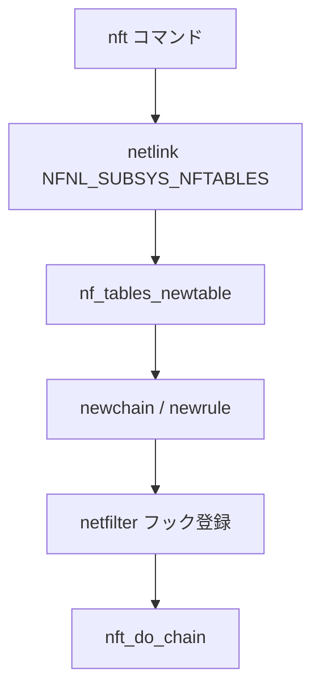

# 第26章 nf_tables 概観

> **本章で読むソース**
>
> - [`net/netfilter/nf_tables_api.c` L1590-L1613](https://github.com/gregkh/linux/blob/v6.18.38/net/netfilter/nf_tables_api.c#L1590-L1613)
> - [`net/netfilter/nf_tables_core.c` L249-L313](https://github.com/gregkh/linux/blob/v6.18.38/net/netfilter/nf_tables_core.c#L249-L313)
> - [`include/uapi/linux/netfilter/nf_tables.h` L1-L20](https://github.com/gregkh/linux/blob/v6.18.38/include/uapi/linux/netfilter/nf_tables.h#L1-L20)

## この章の狙い

iptables の後継である nf_tables がテーブル、チェイン、ルール、セットを管理する API を読む。
設定経路の `nf_tables_newtable` と、パケット経路の `nft_do_chain` を押さえる。

## 前提

- [第24章](24-netfilter-hooks.md) で netfilter フック点を読んでいること。

## nf_tables_newtable

[`net/netfilter/nf_tables_api.c` L1590-L1613](https://github.com/gregkh/linux/blob/v6.18.38/net/netfilter/nf_tables_api.c#L1590-L1613)

```c
static int nf_tables_newtable(struct sk_buff *skb, const struct nfnl_info *info,
			      const struct nlattr * const nla[])
{
	struct nftables_pernet *nft_net = nft_pernet(info->net);
	struct netlink_ext_ack *extack = info->extack;
	u8 genmask = nft_genmask_next(info->net);
	u8 family = info->nfmsg->nfgen_family;
	struct net *net = info->net;
	const struct nlattr *attr;
	struct nft_table *table;
	struct nft_ctx ctx;
	u32 flags = 0;
	int err;

	if (!nft_supported_family(family))
		return -EOPNOTSUPP;

	lockdep_assert_held(&nft_net->commit_mutex);
	attr = nla[NFTA_TABLE_NAME];
	table = nft_table_lookup(net, attr, family, genmask,
				 NETLINK_CB(skb).portid);
	if (IS_ERR(table)) {
		if (PTR_ERR(table) != -ENOENT)
			return PTR_ERR(table);
```

`nft` コマンドの `add table` がこの経路に入る。

## nft_do_chain とルール評価

netfilter フックから呼ばれるチェイン評価の本体である。
ルール blob 内の expression を順に実行し、verdict が確定するまで進む。

[`net/netfilter/nf_tables_core.c` L249-L313](https://github.com/gregkh/linux/blob/v6.18.38/net/netfilter/nf_tables_core.c#L249-L313)

```c
unsigned int
nft_do_chain(struct nft_pktinfo *pkt, void *priv)
{
	const struct nft_chain *chain = priv, *basechain = chain;
	const struct net *net = nft_net(pkt);
	const struct nft_expr *expr, *last;
	const struct nft_rule_dp *rule;
	struct nft_regs regs;
	unsigned int stackptr = 0;
	struct nft_jumpstack jumpstack[NFT_JUMP_STACK_SIZE];
	bool genbit = READ_ONCE(net->nft.gencursor);
	struct nft_rule_blob *blob;
	struct nft_traceinfo info;

	info.trace = false;
	if (static_branch_unlikely(&nft_trace_enabled))
		nft_trace_init(&info, pkt, basechain);
do_chain:
	if (genbit)
		blob = rcu_dereference(chain->blob_gen_1);
	else
		blob = rcu_dereference(chain->blob_gen_0);

	rule = (struct nft_rule_dp *)blob->data;
next_rule:
	regs.verdict.code = NFT_CONTINUE;
	for (; !rule->is_last ; rule = nft_rule_next(rule)) {
		nft_rule_dp_for_each_expr(expr, last, rule) {
			if (expr->ops == &nft_cmp_fast_ops)
				nft_cmp_fast_eval(expr, &regs);
			else if (expr->ops == &nft_cmp16_fast_ops)
				nft_cmp16_fast_eval(expr, &regs);
			else if (expr->ops == &nft_bitwise_fast_ops)
				nft_bitwise_fast_eval(expr, &regs);
			else if (expr->ops != &nft_payload_fast_ops ||
				 !nft_payload_fast_eval(expr, &regs, pkt))
				expr_call_ops_eval(expr, &regs, pkt);

			if (regs.verdict.code != NFT_CONTINUE)
				break;
		}

		switch (regs.verdict.code) {
		case NFT_BREAK:
			regs.verdict.code = NFT_CONTINUE;
			nft_trace_copy_nftrace(pkt, &info);
			continue;
		case NFT_CONTINUE:
			nft_trace_packet(pkt, &regs.verdict,  &info, rule,
					 NFT_TRACETYPE_RULE);
			continue;
		}
		break;
	}

	nft_trace_verdict(pkt, &info, rule, &regs);

	switch (regs.verdict.code & NF_VERDICT_MASK) {
	case NF_ACCEPT:
	case NF_QUEUE:
	case NF_STOLEN:
		return regs.verdict.code;
	case NF_DROP:
		return NF_DROP_REASON(pkt->skb, SKB_DROP_REASON_NETFILTER_DROP, EPERM);
	}
```

`nft_cmp_fast_ops` 等の fast path はよく使う比較を専用 evaluator へ直行させる。
`NFT_JUMP` / `NFT_GOTO` は別チェインへ制御を移し、戻りは jump stack で管理する。

## ファミリ検査

[`net/netfilter/nf_tables_api.c` L1604-L1605](https://github.com/gregkh/linux/blob/v6.18.38/net/netfilter/nf_tables_api.c#L1604-L1605)

```c
	if (!nft_supported_family(family))
		return -EOPNOTSUPP;
```

IPv4、IPv6、inet（デュアル）等のファミリを区別する。

## テーブル lookup

[`net/netfilter/nf_tables_api.c` L1607-L1613](https://github.com/gregkh/linux/blob/v6.18.38/net/netfilter/nf_tables_api.c#L1607-L1613)

```c
	lockdep_assert_held(&nft_net->commit_mutex);
	attr = nla[NFTA_TABLE_NAME];
	table = nft_table_lookup(net, attr, family, genmask,
				 NETLINK_CB(skb).portid);
	if (IS_ERR(table)) {
		if (PTR_ERR(table) != -ENOENT)
			return PTR_ERR(table);
```

## 既存テーブル更新

[`net/netfilter/nf_tables_api.c` L1611-L1620](https://github.com/gregkh/linux/blob/v6.18.38/net/netfilter/nf_tables_api.c#L1611-L1620)

```c
	if (IS_ERR(table)) {
		if (PTR_ERR(table) != -ENOENT)
			return PTR_ERR(table);
	} else {
		if (info->nlh->nlmsg_flags & NLM_F_EXCL) {
			NL_SET_BAD_ATTR(extack, attr);
			return -EEXIST;
		}
		if (info->nlh->nlmsg_flags & NLM_F_REPLACE)
			return -EOPNOTSUPP;
```

## genmask と世代管理

[`net/netfilter/nf_tables_api.c` L1596-L1602](https://github.com/gregkh/linux/blob/v6.18.38/net/netfilter/nf_tables_api.c#L1596-L1602)

```c
	u8 family = info->nfmsg->nfgen_family;
	struct net *net = info->net;
	const struct nlattr *attr;
	struct nft_table *table;
	struct nft_ctx ctx;
	u32 flags = 0;
	int err;
```

トランザクション commit まで変更は次世代マスクで隠される。

## nf_tables ヘッダ

[`include/uapi/linux/netfilter/nf_tables.h` L1-L20](https://github.com/gregkh/linux/blob/v6.18.38/include/uapi/linux/netfilter/nf_tables.h#L1-L20)

```c
/* SPDX-License-Identifier: GPL-2.0 WITH Linux-syscall-note */
#ifndef _LINUX_NF_TABLES_H
#define _LINUX_NF_TABLES_H

#define NFT_NAME_MAXLEN		256
#define NFT_TABLE_MAXNAMELEN	NFT_NAME_MAXLEN
#define NFT_CHAIN_MAXNAMELEN	NFT_NAME_MAXLEN
#define NFT_SET_MAXNAMELEN	NFT_NAME_MAXLEN
#define NFT_OBJ_MAXNAMELEN	NFT_NAME_MAXLEN
#define NFT_USERDATA_MAXLEN	256
#define NFT_OSF_MAXGENRELEN	16

/**
 * enum nft_registers - nf_tables registers
 *
 * nf_tables used to have five registers: a verdict register and four data
 * registers of size 16. The data registers have been changed to 16 registers
 * of size 4. For compatibility reasons, the NFT_REG_[1-4] registers still
 * map to areas of size 16, the 4 byte registers are addressed using
 * NFT_REG32_00 - NFT_REG32_15.
```

## 処理の流れ



## iptables との関係

nftables はチェインをフック点に直接結び付ける。
iptables の `-t filter -A INPUT` 相当は `nft add rule ip filter input ...` で表現する。
本章は設定 API とパケット評価の両方を扱い、個々の expression 実装の詳細は対象外とする。

## 高速化と最適化の工夫

**セット（hash、bitmap）**はルールマッチを O(1) 近くにし、大量ルールでもスケールする。

**genmask トランザクション**は複数変更を原子的に commit し、途中状態を datapath に露出しない。

**flowtable offload**は確立済みフローをハードウェアや fast path へオフロードする（対応 NIC 時）。

## まとめ

nf_tables は netlink API でテーブルとルールを管理し、netfilter フックに評価関数を登録する。
`nf_tables_newtable` がテーブル作成の入口である。
次章から XDP を読む。

## 関連する章

- 前章：[nf_conntrack と接続追跡](25-nf-conntrack.md)
- 次章：[XDP プログラムと早期処理](../part07-xdp/27-xdp-program-early.md)
- [netfilter フックと IPv4 フック点](24-netfilter-hooks.md)
