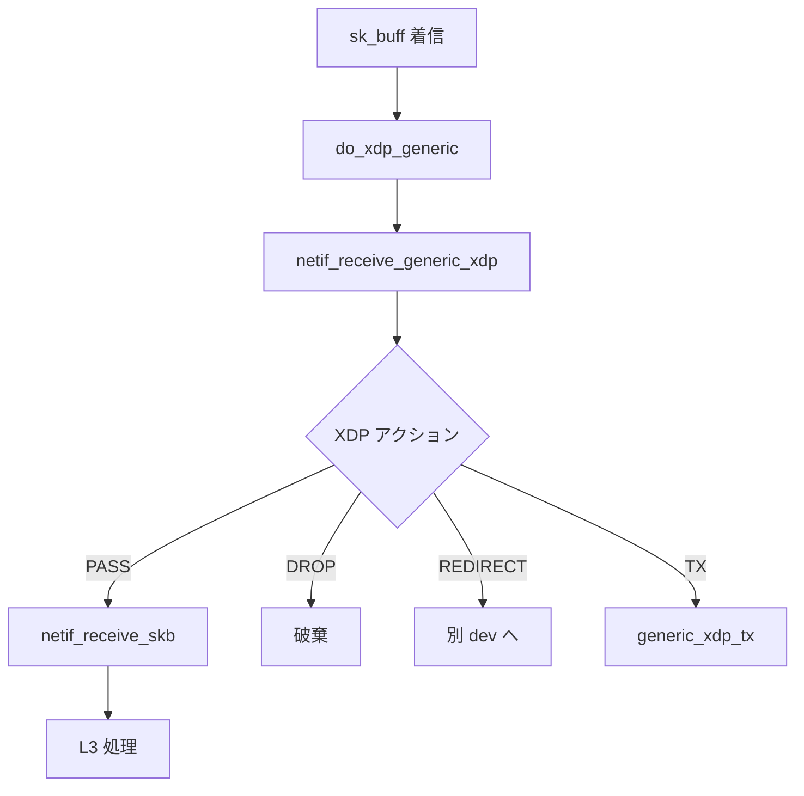

# 第27章 XDP プログラムと早期処理

> **本章で読むソース**
>
> - [`net/core/dev.c` L5567-L5595](https://github.com/gregkh/linux/blob/v6.18.38/net/core/dev.c#L5567-L5595)
> - [`net/core/dev.c` L5487-L5515](https://github.com/gregkh/linux/blob/v6.18.38/net/core/dev.c#L5487-L5515)
> - [`net/core/dev.c` L5515-L5530](https://github.com/gregkh/linux/blob/v6.18.38/net/core/dev.c#L5515-L5530)
> - [`net/core/dev.c` L5497-L5498](https://github.com/gregkh/linux/blob/v6.18.38/net/core/dev.c#L5497-L5498)
> - [`net/core/filter.c` L1554-L1568](https://github.com/gregkh/linux/blob/v6.18.38/net/core/filter.c#L1554-L1568)
> - [`net/core/dev.c` L5565-L5565](https://github.com/gregkh/linux/blob/v6.18.38/net/core/dev.c#L5565-L5565)

## この章の狙い

XDP（eXpress Data Path）がプロトコルスタックより前で BPF プログラムを実行する仕組みを読む。
本章は **generic XDP**（`do_xdp_generic`）の `sk_buff` ベース経路を扱い、ドライバ内 native XDP は対象外とする。

## 前提

- [第18章](../part04-rx-fastpath/18-napi-netif-receive.md) で `netif_receive_skb` がスタック入口であることを読んでいること。

## XDP とソケット BPF の境界

| 観点 | XDP | ソケット BPF（`filter.c`） |
|------|-----|---------------------------|
| 実行位置 | `netif_receive_skb` 直前（generic。本章の対象） | ソケットに `attach` 後、`recvmsg` 等のデータパス |
| 対象 | 全着信パケット（デバイス単位） | 特定ソケットに届いたパケット |
| API | `bpf()` + XDP プログラム | `setsockopt(SO_ATTACH_FILTER)` / `sk_attach_filter` |
| 典型用途 | DDoS 防御、ロードバランサ、パケット転送 | tcpdump 互換フィルタ、ソケット単位の選別 |

本分冊では BPF verifier の詳細は扱わない。
XDP とソケットフィルタは実行位置とスコープが異なる別機構である。

## do_xdp_generic

[`net/core/dev.c` L5567-L5595](https://github.com/gregkh/linux/blob/v6.18.38/net/core/dev.c#L5567-L5595)

```c
int do_xdp_generic(const struct bpf_prog *xdp_prog, struct sk_buff **pskb)
{
	struct bpf_net_context __bpf_net_ctx, *bpf_net_ctx;

	if (xdp_prog) {
		struct xdp_buff xdp;
		u32 act;
		int err;

		bpf_net_ctx = bpf_net_ctx_set(&__bpf_net_ctx);
		act = netif_receive_generic_xdp(pskb, &xdp, xdp_prog);
		if (act != XDP_PASS) {
			switch (act) {
			case XDP_REDIRECT:
				err = xdp_do_generic_redirect((*pskb)->dev, *pskb,
							      &xdp, xdp_prog);
				if (err)
					goto out_redir;
				break;
			case XDP_TX:
				generic_xdp_tx(*pskb, xdp_prog);
				break;
			}
			bpf_net_ctx_clear(bpf_net_ctx);
			return XDP_DROP;
		}
		bpf_net_ctx_clear(bpf_net_ctx);
	}
	return XDP_PASS;
}
```

generic XDP は `sk_buff` ベースで動作し、native XDP より遅いが任意の NIC で使える。

## netif_receive_generic_xdp

[`net/core/dev.c` L5487-L5515](https://github.com/gregkh/linux/blob/v6.18.38/net/core/dev.c#L5487-L5515)

```c
static u32 netif_receive_generic_xdp(struct sk_buff **pskb,
				     struct xdp_buff *xdp,
				     const struct bpf_prog *xdp_prog)
{
	struct sk_buff *skb = *pskb;
	u32 mac_len, act = XDP_DROP;

	/* Reinjected packets coming from act_mirred or similar should
	 * not get XDP generic processing.
	 */
	if (skb_is_redirected(skb))
		return XDP_PASS;

	/* XDP packets must have sufficient headroom of XDP_PACKET_HEADROOM
	 * bytes. This is the guarantee that also native XDP provides,
	 * thus we need to do it here as well.
	 */
	mac_len = skb->data - skb_mac_header(skb);
	__skb_push(skb, mac_len);

	if (skb_cloned(skb) || skb_is_nonlinear(skb) ||
	    skb_headroom(skb) < XDP_PACKET_HEADROOM) {
		if (netif_skb_check_for_xdp(pskb, xdp_prog))
			goto do_drop;
	}

	__skb_pull(*pskb, mac_len);

	act = bpf_prog_run_generic_xdp(*pskb, xdp, xdp_prog);
```

## XDP アクション処理

[`net/core/dev.c` L5515-L5530](https://github.com/gregkh/linux/blob/v6.18.38/net/core/dev.c#L5515-L5530)

```c
	act = bpf_prog_run_generic_xdp(*pskb, xdp, xdp_prog);
	switch (act) {
	case XDP_REDIRECT:
	case XDP_TX:
	case XDP_PASS:
		break;
	default:
		bpf_warn_invalid_xdp_action((*pskb)->dev, xdp_prog, act);
		fallthrough;
	case XDP_ABORTED:
		trace_xdp_exception((*pskb)->dev, xdp_prog, act);
		fallthrough;
	case XDP_DROP:
	do_drop:
		kfree_skb(*pskb);
		break;
```

`XDP_PASS` は通常スタック処理へ、`XDP_DROP` は破棄、`XDP_REDIRECT` は別インタフェースへ転送する。

## 再注入パケットのスキップ

[`net/core/dev.c` L5497-L5498](https://github.com/gregkh/linux/blob/v6.18.38/net/core/dev.c#L5497-L5498)

```c
	if (skb_is_redirected(skb))
		return XDP_PASS;
```

## sk_attach_filter（ソケット BPF）

[`net/core/filter.c` L1554-L1568](https://github.com/gregkh/linux/blob/v6.18.38/net/core/filter.c#L1554-L1568)

```c
int sk_attach_filter(struct sock_fprog *fprog, struct sock *sk)
{
	struct bpf_prog *prog = __get_filter(fprog, sk);
	int err;

	if (IS_ERR(prog))
		return PTR_ERR(prog);

	err = __sk_attach_prog(prog, sk);
	if (err < 0) {
		__bpf_prog_release(prog);
		return err;
	}

	return 0;
}
```

これはソケット単位のフィルタであり、XDP とは独立した attach 点を持つ。

## generic_xdp_needed_key

[`net/core/dev.c` L5565-L5565](https://github.com/gregkh/linux/blob/v6.18.38/net/core/dev.c#L5565-L5565)

```c
static DEFINE_STATIC_KEY_FALSE(generic_xdp_needed_key);
```

XDP プログラム未登録時は fast path オーバーヘッドを抑える。

## 処理の流れ



native XDP は NIC ドライバが `xdp_buff` を組み立てて `bpf_prog_run_xdp` を呼ぶ別経路であり、本章では図に含めない。

## 高速化と最適化の工夫

**generic XDP**は既存 `sk_buff` から `xdp_buff` ビューを作り、ドライバ改造なしで BPF を試せる反面、native より割り当てとヘッダ調整コストが残る。

**XDP_REDIRECT**は CPU 間やデバイス間転送を BPF マップで高速化する。

**static key**は XDP 未使用時の分岐コストを排除する。

## まとめ

XDP は受信の最前段（generic では `netif_receive_skb` 直前）で BPF を実行し、DROP、PASS、REDIRECT、TX を選べる。
ソケット BPF はアプリケーション単位のフィルタであり、実行位置とスコープが異なる。
次章では AF_XDP のゼロコピー受信を読む。

## 関連する章

- 前章：[nf_tables 概観](../part06-netfilter/26-nf-tables-overview.md)
- 次章：[AF_XDP とゼロコピー受信](28-af-xdp-zero-copy.md)
- [NAPI と netif_receive_skb](../part04-rx-fastpath/18-napi-netif-receive.md)
