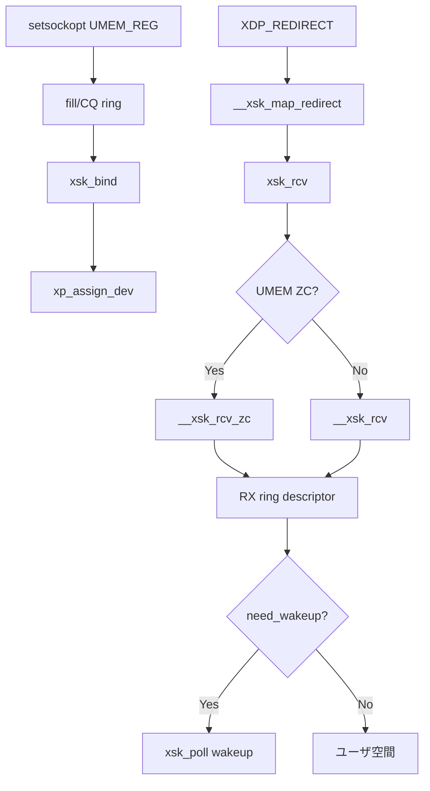

# 第28章 AF_XDP とゼロコピー受信

> **本章で読むソース**
>
> - [`net/xdp/xdp_umem.c` L157-L239](https://github.com/gregkh/linux/blob/v6.18.38/net/xdp/xdp_umem.c#L157-L239)
> - [`net/xdp/xsk.c` L1508-L1549](https://github.com/gregkh/linux/blob/v6.18.38/net/xdp/xsk.c#L1508-L1549)
> - [`net/xdp/xsk.c` L1551-L1572](https://github.com/gregkh/linux/blob/v6.18.38/net/xdp/xsk.c#L1551-L1572)
> - [`net/xdp/xsk.c` L1286-L1428](https://github.com/gregkh/linux/blob/v6.18.38/net/xdp/xsk.c#L1286-L1428)
> - [`net/xdp/xsk_buff_pool.c` L167-L204](https://github.com/gregkh/linux/blob/v6.18.38/net/xdp/xsk_buff_pool.c#L167-L204)
> - [`net/xdp/xsk.c` L372-L389](https://github.com/gregkh/linux/blob/v6.18.38/net/xdp/xsk.c#L372-L389)
> - [`net/xdp/xsk.c` L146-L160](https://github.com/gregkh/linux/blob/v6.18.38/net/xdp/xsk.c#L146-L160)
> - [`net/xdp/xsk.c` L1115-L1145](https://github.com/gregkh/linux/blob/v6.18.38/net/xdp/xsk.c#L1115-L1145)
> - [`net/xdp/xsk.c` L392-L407](https://github.com/gregkh/linux/blob/v6.18.38/net/xdp/xsk.c#L392-L407)
> - [`include/uapi/linux/if_xdp.h` L1-L20](https://github.com/gregkh/linux/blob/v6.18.38/include/uapi/linux/if_xdp.h#L1-L20)

## この章の狙い

AF_XDP ソケットが XDP プログラムからパケットをユーザ空間へ直接渡す仕組みを読む。
UMEM 登録、fill/completion ring、bind 時のドライバ pool 設定、`xsk_rcv_zc`、`need_wakeup` まで追う。

## 前提

- [第27章](27-xdp-program-early.md) で XDP の `XDP_REDIRECT` を読んでいること。

## xdp_umem_reg

ユーザが登録したメモリ領域を chunk 単位で pin し、AF_XDP ソケットが参照する UMEM を作る。

[`net/xdp/xdp_umem.c` L157-L239](https://github.com/gregkh/linux/blob/v6.18.38/net/xdp/xdp_umem.c#L157-L239)

```c
static int xdp_umem_reg(struct xdp_umem *umem, struct xdp_umem_reg *mr)
{
	bool unaligned_chunks = mr->flags & XDP_UMEM_UNALIGNED_CHUNK_FLAG;
	u32 chunk_size = mr->chunk_size, headroom = mr->headroom;
	u64 addr = mr->addr, size = mr->len;
	u32 chunks_rem, npgs_rem;
	u64 chunks, npgs;
	int err;

	if (chunk_size < XDP_UMEM_MIN_CHUNK_SIZE || chunk_size > PAGE_SIZE) {
		return -EINVAL;
	}
	// ... (中略) ...
	umem->size = size;
	umem->headroom = headroom;
	umem->chunk_size = chunk_size;
	umem->chunks = chunks;
	umem->npgs = npgs;
	// ... (中略) ...
	err = xdp_umem_pin_pages(umem, (unsigned long)addr);
```

`setsockopt(XDP_UMEM_REG)` から `xdp_umem_create` 経由で呼ばれる。

## fill ring と completion ring

UMEM 用の fill queue（FQ）と completion queue（CQ）をソケットへ結び付ける。

[`net/xdp/xsk.c` L1551-L1572](https://github.com/gregkh/linux/blob/v6.18.38/net/xdp/xsk.c#L1551-L1572)

```c
	case XDP_UMEM_FILL_RING:
	case XDP_UMEM_COMPLETION_RING:
	{
		struct xsk_queue **q;
		int entries;

		if (optlen < sizeof(entries))
			return -EINVAL;
		if (copy_from_sockptr(&entries, optval, sizeof(entries)))
			return -EFAULT;

		mutex_lock(&xs->mutex);
		if (xs->state != XSK_READY) {
			mutex_unlock(&xs->mutex);
			return -EBUSY;
		}

		q = (optname == XDP_UMEM_FILL_RING) ? &xs->fq_tmp :
			&xs->cq_tmp;
		err = xsk_init_queue(entries, q, true);
		mutex_unlock(&xs->mutex);
		return err;
	}
```

RX ring はパケット descriptor、TX ring は送信 descriptor をユーザと共有する（本章では RX 経路を中心に読む）。

## xsk_bind とドライバ pool 設定

bind 時に `xp_create_and_assign_umem` で buffer pool を作り、`xp_assign_dev` が NIC の queue に pool を登録する。

[`net/xdp/xsk.c` L1412-L1429](https://github.com/gregkh/linux/blob/v6.18.38/net/xdp/xsk.c#L1412-L1429)

```c
	} else if (!xs->umem || !xsk_validate_queues(xs)) {
		err = -EINVAL;
		goto out_unlock;
	} else {
		/* This xsk has its own umem. */
		xs->pool = xp_create_and_assign_umem(xs, xs->umem);
		if (!xs->pool) {
			err = -ENOMEM;
			goto out_unlock;
		}

		err = xp_assign_dev(xs->pool, dev, qid, flags);
		if (err) {
			xp_destroy(xs->pool);
			xs->pool = NULL;
			goto out_unlock;
		}
	}
```

[`net/xdp/xsk_buff_pool.c` L167-L204](https://github.com/gregkh/linux/blob/v6.18.38/net/xdp/xsk_buff_pool.c#L167-L204)

```c
int xp_assign_dev(struct xsk_buff_pool *pool,
		  struct net_device *netdev, u16 queue_id, u16 flags)
{
	// ... (中略) ...
	err = xsk_reg_pool_at_qid(netdev, pool, queue_id);
	if (err)
		return err;
	// ... (中略) ...
	if (flags & XDP_USE_NEED_WAKEUP)
		pool->uses_need_wakeup = true;
	pool->cached_need_wakeup = XDP_WAKEUP_TX;
```

`XDP_ZEROCOPY` 指定時はドライバが ZC をサポートするか `ndo_bpf` で確認し、UMEM フレームを DMA 可能にする。

## xsk_rcv

[`net/xdp/xsk.c` L372-L389](https://github.com/gregkh/linux/blob/v6.18.38/net/xdp/xsk.c#L372-L389)

```c
static int xsk_rcv(struct xdp_sock *xs, struct xdp_buff *xdp)
{
	u32 len = xdp_get_buff_len(xdp);
	int err;

	err = xsk_rcv_check(xs, xdp, len);
	if (err)
		return err;

	if (xdp->rxq->mem.type == MEM_TYPE_XSK_BUFF_POOL) {
		len = xdp->data_end - xdp->data;
		return xsk_rcv_zc(xs, xdp, len);
	}

	err = __xsk_rcv(xs, xdp, len);
	if (!err)
		xdp_return_buff(xdp);
	return err;
}
```

`MEM_TYPE_XSK_BUFF_POOL` のときゼロコピー経路（`xsk_rcv_zc`）へ分岐する。

## ゼロコピー分岐

[`net/xdp/xsk.c` L381-L384](https://github.com/gregkh/linux/blob/v6.18.38/net/xdp/xsk.c#L381-L384)

```c
	if (xdp->rxq->mem.type == MEM_TYPE_XSK_BUFF_POOL) {
		len = xdp->data_end - xdp->data;
		return xsk_rcv_zc(xs, xdp, len);
	}
```

ユーザが登録した UMEM のフレームへ直接書き込み、コピーを省略する。

## コピーモード

[`net/xdp/xsk.c` L386-L389](https://github.com/gregkh/linux/blob/v6.18.38/net/xdp/xsk.c#L386-L389)

```c
	err = __xsk_rcv(xs, xdp, len);
	if (!err)
		xdp_return_buff(xdp);
	return err;
```

非 ZC モードはリングバッファへコピーし、元バッファを返却する。

## __xsk_rcv_zc と RX descriptor

UMEM フレームの handle を RX ring に載せ、バッファ所有権をユーザへ移す。

[`net/xdp/xsk.c` L146-L160](https://github.com/gregkh/linux/blob/v6.18.38/net/xdp/xsk.c#L146-L160)

```c
static int __xsk_rcv_zc(struct xdp_sock *xs, struct xdp_buff_xsk *xskb, u32 len,
			u32 flags)
{
	u64 addr;
	int err;

	addr = xp_get_handle(xskb, xskb->pool);
	err = xskq_prod_reserve_desc(xs->rx, addr, len, flags);
	if (err) {
		xs->rx_queue_full++;
		return err;
	}

	xp_release(xskb);
	return 0;
}
```

`xskq_prod_reserve_desc` が RX ring の producer 側を進め、`xp_release` でカーネル側参照を手放す。

## need_wakeup と xsk_poll

ドライバがスリープしたとき、ユーザ空間へ wake を要求する契約である。

[`net/xdp/xsk.c` L1115-L1145](https://github.com/gregkh/linux/blob/v6.18.38/net/xdp/xsk.c#L1115-L1145)

```c
static __poll_t xsk_poll(struct file *file, struct socket *sock,
			     struct poll_table_struct *wait)
{
	__poll_t mask = 0;
	struct sock *sk = sock->sk;
	struct xdp_sock *xs = xdp_sk(sk);
	struct xsk_buff_pool *pool;

	sock_poll_wait(file, sock, wait);

	rcu_read_lock();
	if (xsk_check_common(xs))
		goto out;

	pool = xs->pool;

	if (pool->cached_need_wakeup) {
		if (xs->zc)
			xsk_wakeup(xs, pool->cached_need_wakeup);
		else if (xs->tx)
			xsk_generic_xmit(sk);
	}

	if (xs->rx && !xskq_prod_is_empty(xs->rx))
		mask |= EPOLLIN | EPOLLRDNORM;
	if (xs->tx && xsk_tx_writeable(xs))
		mask |= EPOLLOUT | EPOLLWRNORM;
out:
	rcu_read_unlock();
	return mask;
}
```

`XDP_USE_NEED_WAKEUP` 指定時は、ドライバが共有 ring の `flags` に `XDP_RING_NEED_WAKEUP` を立てる。
ユーザ空間がそのフラグを観測して `poll` や `sendto` を呼ぶと、カーネルが `xsk_wakeup` 経由で `ndo_xsk_wakeup` を実行する。
ドライバからユーザ空間への通常の通知機構ではない。

## __xsk_map_redirect

XDP の `bpf_redirect_map` が AF_XDP ソケットへパケットを送る。

[`net/xdp/xsk.c` L392-L407](https://github.com/gregkh/linux/blob/v6.18.38/net/xdp/xsk.c#L392-L407)

```c
int __xsk_map_redirect(struct xdp_sock *xs, struct xdp_buff *xdp)
{
	int err;

	err = xsk_rcv(xs, xdp);
	if (err)
		return err;

	if (!xs->flush_node.prev) {
		struct list_head *flush_list = bpf_net_ctx_get_xskmap_flush_list();

		list_add(&xs->flush_node, flush_list);
	}

	return 0;
}
```

## flush リスト登録

[`net/xdp/xsk.c` L400-L404](https://github.com/gregkh/linux/blob/v6.18.38/net/xdp/xsk.c#L400-L404)

```c
	if (!xs->flush_node.prev) {
		struct list_head *flush_list = bpf_net_ctx_get_xskmap_flush_list();

		list_add(&xs->flush_node, flush_list);
	}
```

NAPI 終了時に `__xsk_map_flush` でリングへ一括反映する。

## __xsk_map_flush

[`net/xdp/xsk.c` L409-L416](https://github.com/gregkh/linux/blob/v6.18.38/net/xdp/xsk.c#L409-L416)

```c
void __xsk_map_flush(struct list_head *flush_list)
{
	struct xdp_sock *xs, *tmp;

	list_for_each_entry_safe(xs, tmp, flush_list, flush_node) {
		xsk_flush(xs);
		__list_del_clearprev(&xs->flush_node);
	}
```

## AF_XDP UAPI

[`include/uapi/linux/if_xdp.h` L1-L20](https://github.com/gregkh/linux/blob/v6.18.38/include/uapi/linux/if_xdp.h#L1-L20)

```c
/* SPDX-License-Identifier: GPL-2.0 WITH Linux-syscall-note */
/*
 * if_xdp: XDP socket user-space interface
 * Copyright(c) 2018 Intel Corporation.
 *
 * Author(s): Björn Töpel <bjorn.topel@intel.com>
 *	      Magnus Karlsson <magnus.karlsson@intel.com>
 */

#ifndef _UAPI_LINUX_IF_XDP_H
#define _UAPI_LINUX_IF_XDP_H

#include <linux/types.h>

/* Options for the sxdp_flags field */
#define XDP_SHARED_UMEM	(1 << 0)
#define XDP_COPY	(1 << 1) /* Force copy-mode */
#define XDP_ZEROCOPY	(1 << 2) /* Force zero-copy mode */
/* If this option is set, the driver might go sleep and in that case
 * the XDP_RING_NEED_WAKEUP flag in the fill and/or Tx rings will be
```

`XDP_ZEROCOPY` と `XDP_COPY` でモードを明示指定できる。

## 処理の流れ



## 高速化と最適化の工夫

**UMEM 共有**は複数ソケットが同一メモリプールを使い、割り当てコストを下げる。

**バッチ flush**は NAPI 境界でリングを更新し、per-packet の wake 回数を減らす。

**need_wakeup**はドライバが ring flags に `XDP_RING_NEED_WAKEUP` を設定し、ユーザ空間の `poll`/`sendto` を契機にカーネルが driver wakeup を実行する仕組みである。
ビジーウェイトを避けるための協調契約である。

> **7.x 系での変化**
> [`net/xdp/xsk.c` L174-L185](https://github.com/gregkh/linux/blob/v7.1.3/net/xdp/xsk.c#L174-L185) では `xsk_reg_pool_at_qid` が RX キューの lease（`netif_rxq_is_leased`）を考慮し、仮想デバイスが下位 NIC の queue に pool を登録する経路が追加されている。

## まとめ

AF_XDP は XDP からパケットをユーザ空間リングへ渡し、ZC モードではコピーを省略する。
`__xsk_map_redirect` が XSKMAP 経由の配送入口である。
本分冊の最終章として、ネットワークスタックの主要実行経路の読解をここで一区切りする。

## 関連する章

- 前章：[XDP プログラムと早期処理](27-xdp-program-early.md)
- [NAPI と netif_receive_skb](../part04-rx-fastpath/18-napi-netif-receive.md)
- [sk_buff の構造と割り当て](../part00-overview/02-sk_buff-structure-allocation.md)
