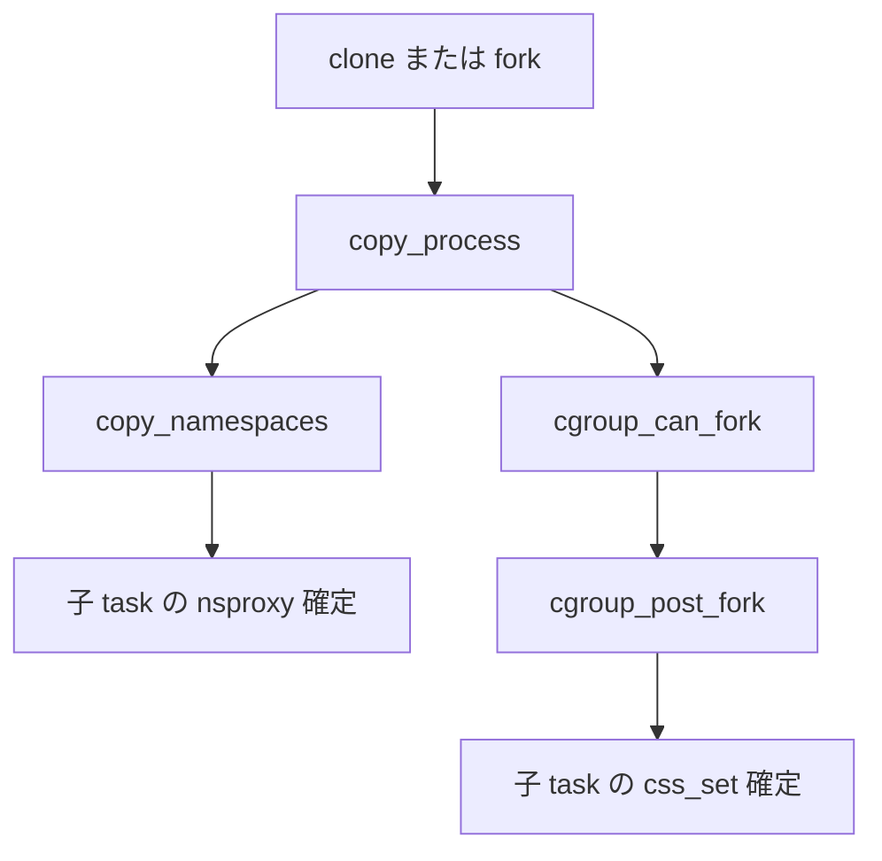

# 第1章 隔離と資源制御の全体像

> **本章で読むソース**
>
> - [`include/linux/nsproxy.h` L32-L42](https://github.com/gregkh/linux/blob/v6.18.38/include/linux/nsproxy.h#L32-L42)
> - [`include/linux/ns_common.h` L40-L54](https://github.com/gregkh/linux/blob/v6.18.38/include/linux/ns_common.h#L40-L54)
> - [`kernel/nsproxy.c` L32-L50](https://github.com/gregkh/linux/blob/v6.18.38/kernel/nsproxy.c#L32-L50)
> - [`include/linux/cgroup_subsys.h` L12-L30](https://github.com/gregkh/linux/blob/v6.18.38/include/linux/cgroup_subsys.h#L12-L30)
> - [`kernel/cgroup/cgroup.c` L6639-L6643](https://github.com/gregkh/linux/blob/v6.18.38/kernel/cgroup/cgroup.c#L6639-L6643)
> - [`kernel/nsproxy.c` L153-L161](https://github.com/gregkh/linux/blob/v6.18.38/kernel/nsproxy.c#L153-L161)
> - [`kernel/cgroup/cgroup.c` L194-L205](https://github.com/gregkh/linux/blob/v6.18.38/kernel/cgroup/cgroup.c#L194-L205)

## この章の狙い

コンテナ実行の土台となる二つの機構、**namespace** による見え方の隔離と **cgroup** による資源制限が、カーネル内部でどう分担されているかを地図として押さえる。
以降の章で個別の namespace とコントローラを読む前提として、`nsproxy` と `css_set` の位置づけを示す。

## 前提

- [全体像と横断基盤](../../foundation/README.md) のシステムコール入口と `task_struct` の概観
- [プロセスとスケジューラ](../../sched/README.md) の `fork` と `copy_process` の流れ

## namespace と cgroup の役割分担

ユーザー空間から見たコンテナは、独立したファイルシステム、プロセス ID、ネットワーク、ユーザー ID などを持つように見える。
カーネルはこれを **namespace** で実現する。
一方、CPU 時間、メモリ、ディスク I/O、プロセス数の上限は **cgroup** のコントローラが課金や enqueue の経路にフックして制限する。

隔離は「何が見えるか」を変え、制御は「どれだけ使えるか」を変える。
同じタスクは常に一組の namespace 集合と一つの cgroup 所属集合の両方を持つ。

## nsproxy が束ねる namespace 集合

各タスクは `task_struct` から `nsproxy` を辿り、マウント、UTS、IPC、PID、ネットワーク、time、cgroup の各 namespace ポインタを参照する。

[`include/linux/nsproxy.h` L32-L42](https://github.com/gregkh/linux/blob/v6.18.38/include/linux/nsproxy.h#L32-L42)

```c
struct nsproxy {
	refcount_t count;
	struct uts_namespace *uts_ns;
	struct ipc_namespace *ipc_ns;
	struct mnt_namespace *mnt_ns;
	struct pid_namespace *pid_ns_for_children;
	struct net 	     *net_ns;
	struct time_namespace *time_ns;
	struct time_namespace *time_ns_for_children;
	struct cgroup_namespace *cgroup_ns;
};
```

コメントが述べるとおり、`pid_ns_for_children` は子プロセスが入る PID namespace を指す。
実行中タスク自身の PID namespace は `task_active_pid_ns` で別途取得する。
time namespace も親子で異なるポインタ `time_ns` と `time_ns_for_children` を持つ。

`nsproxy` は複数タスクで共有され、いずれか一つの namespace だけでも新規作成や `unshare` が起きれば、参照カウント付きの新しい `nsproxy` に差し替わる。

## ns_common による統一インターフェース

各 namespace 型は `ns_common` を埋め込み、`proc_ns_operations` 経由で `/proc/<pid>/ns/` からファイル記述子として露出する。

[`include/linux/ns_common.h` L40-L54](https://github.com/gregkh/linux/blob/v6.18.38/include/linux/ns_common.h#L40-L54)

```c
struct ns_common {
	u32 ns_type;
	struct dentry *stashed;
	const struct proc_ns_operations *ops;
	unsigned int inum;
	refcount_t __ns_ref; /* do not use directly */
	union {
		struct {
			u64 ns_id;
			struct rb_node ns_tree_node;
			struct list_head ns_list_node;
		};
		struct rcu_head ns_rcu;
	};
};
```

`ns_type` は `CLONE_NEW*` フラグと対応し、`setns` が fd から namespace 種別を検証するときの鍵になる。
参照カウント `__ns_ref` は namespace 個体の寿命を管理し、`nsproxy` の `count` とは別物である。

## 初期 namespace と init_nsproxy

ブート完了時点のタスクは `init_nsproxy` に各初期 namespace を指させる。

[`kernel/nsproxy.c` L32-L50](https://github.com/gregkh/linux/blob/v6.18.38/kernel/nsproxy.c#L32-L50)

```c
struct nsproxy init_nsproxy = {
	.count			= REFCOUNT_INIT(1),
	.uts_ns			= &init_uts_ns,
#if defined(CONFIG_POSIX_MQUEUE) || defined(CONFIG_SYSVIPC)
	.ipc_ns			= &init_ipc_ns,
#endif
	.mnt_ns			= NULL,
	.pid_ns_for_children	= &init_pid_ns,
#ifdef CONFIG_NET
	.net_ns			= &init_net,
#endif
#ifdef CONFIG_CGROUPS
	.cgroup_ns		= &init_cgroup_ns,
#endif
#ifdef CONFIG_TIME_NS
	.time_ns		= &init_time_ns,
	.time_ns_for_children	= &init_time_ns,
#endif
};
```

`mnt_ns` だけ `NULL` で初期化されるのは、マウント namespace の初期化順序が他と異なるためである。
以降の章で mount namespace 作成時に実体が割り当てられる。

## cgroup v2 のコントローラ一覧

資源制御は cgroup サブシステムごとに `cgroup_subsys` として登録される。
default hierarchy で有効な主要コントローラは次のとおりである。

[`include/linux/cgroup_subsys.h` L12-L30](https://github.com/gregkh/linux/blob/v6.18.38/include/linux/cgroup_subsys.h#L12-L30)

```c
#if IS_ENABLED(CONFIG_CPUSETS)
SUBSYS(cpuset)
#endif

#if IS_ENABLED(CONFIG_CGROUP_SCHED)
SUBSYS(cpu)
#endif

#if IS_ENABLED(CONFIG_CGROUP_CPUACCT)
SUBSYS(cpuacct)
#endif

#if IS_ENABLED(CONFIG_BLK_CGROUP)
SUBSYS(io)
#endif

#if IS_ENABLED(CONFIG_MEMCG)
SUBSYS(memory)
#endif
```

本分冊の第3部では cpu、memory、io、pids、cpuset を扱う。
`cpuacct` は課金専用、`devices` や `freezer` は本章では触れず、必要なら注記に留める。

## タスクが持つ二つの集合

namespace 側は `task_struct->nsproxy`、cgroup 側は `task_struct->cgroups` が `css_set` を指す。
fork 直後は cgroup 所属が未確定のため、`cgroup_fork` が `init_css_set` を仮置きする。

[`kernel/cgroup/cgroup.c` L6639-L6643](https://github.com/gregkh/linux/blob/v6.18.38/kernel/cgroup/cgroup.c#L6639-L6643)

```c
void cgroup_fork(struct task_struct *child)
{
	RCU_INIT_POINTER(child->cgroups, &init_css_set);
	INIT_LIST_HEAD(&child->cg_list);
}
```

`cgroup_post_fork` が親の `css_set` または `clone3` で指定された cgroup へ子を結び付ける。
namespace の複製は `copy_namespaces` が担当し、cgroup の複製は `cgroup_can_fork` と `cgroup_post_fork` が担当する。

## 全体構造の処理フロー

新規プロセス生成時、カーネルはまず `copy_process` 内でメモリやファイル記述子を複製し、`copy_namespaces` で namespace を処理し、`cgroup_can_fork` で cgroup 所属を検証する。



既存プロセスが `unshare` や `setns` で namespace だけを切り替える経路は第3章で扱う。
cgroup 所属の変更は `cgroup.procs` への書き込みや `cgroup_attach_task` 経由であり、namespace 切り替えとは別 API である。

## default hierarchy の存在

cgroup v2 は常に `cgrp_dfl_root` を根とする default hierarchy を持つが、初回マウントまではユーザー空間から見えない。

[`kernel/cgroup/cgroup.c` L194-L205](https://github.com/gregkh/linux/blob/v6.18.38/kernel/cgroup/cgroup.c#L194-L205)

```c
struct cgroup_root cgrp_dfl_root = {
	.cgrp.self.rstat_cpu = &root_rstat_cpu,
	.cgrp.rstat_base_cpu = &root_rstat_base_cpu,
};
EXPORT_SYMBOL_GPL(cgrp_dfl_root);

/*
 * The default hierarchy always exists but is hidden until mounted for the
 * first time.  This is for backward compatibility.
 */
bool cgrp_dfl_visible;
```

v1 互換の個別 hierarchy は `cgroup-v1.c` が扱う。
本分冊は v2 コアを主題とし、v1 はレガシーとして深くは読まない。

## 高速化と最適化の工夫

namespace 複製の頻出経路は、フラグなし fork である。
`copy_namespaces` は `CLONE_NEW*` が一つも立っていなければ、新しい `nsproxy` を割り当てず親の `nsproxy` 参照カウントを増やすだけで返る。

[`kernel/nsproxy.c` L153-L161](https://github.com/gregkh/linux/blob/v6.18.38/kernel/nsproxy.c#L153-L161)

```c
	if (likely(!(flags & (CLONE_NEWNS | CLONE_NEWUTS | CLONE_NEWIPC |
			      CLONE_NEWPID | CLONE_NEWNET |
			      CLONE_NEWCGROUP | CLONE_NEWTIME)))) {
		if ((flags & CLONE_VM) ||
		    likely(old_ns->time_ns_for_children == old_ns->time_ns)) {
			get_nsproxy(old_ns);
			return 0;
		}
	} else if (!ns_capable(user_ns, CAP_SYS_ADMIN))
```

`likely` で分岐をヒントし、通常の fork が namespace 作成コストを払わないようにしている。
time namespace だけ親子ポインタが一致しない特殊ケースでは、フラグなしでも新 `nsproxy` が必要になる。

cgroup 側も `cgroup_subsys_enabled` が static key でサブシステム無効時のフックを省略するが、第11章で扱う。

## 分冊間の境界

| トピック | 本分冊 | 委譲先 |
|---|---|---|
| network namespace のソケットとルーティング | 概観のみ | network 分冊 |
| memcg の folio charge と reclaim | css と controller フック | [mm 31 章](../../mm/part05-advanced/31-memcg.md) |
| EEVDF enqueue と cgroup 階層スケジューリング | cpu コントローラの接続点 | [sched 14 章](../../sched/part02-eevdf/14-group-scheduling-cgroup.md) |
| mount とパス解決の一般論 | mount namespace 固有部分 | [VFS 分冊](../../vfs/README.md) |

## まとめ

コンテナの土台は `nsproxy` による見え方の隔離と `css_set` による資源の枠組みの二層で構成される。
`ns_common` が namespace 種別を統一し、cgroup v2 が default hierarchy 上でコントローラを束ねる。
次章から `nsproxy` の参照カウントと寿命管理を読む。

## 関連する章

- [第2章 nsproxy と namespace のライフサイクル](02-nsproxy-lifecycle.md)
- [第11章 cgroup v2 階層と kernfs](../part02-cgroup-core/11-cgroup-hierarchy-kernfs.md)
