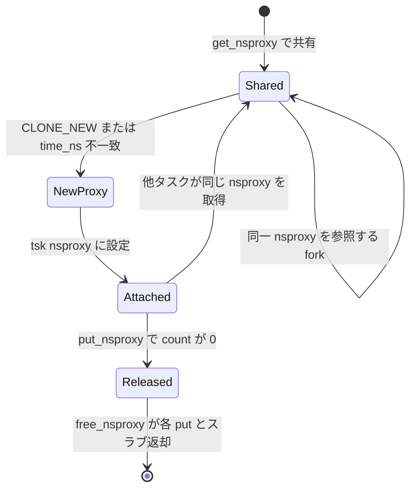

# 第2章 nsproxy と namespace のライフサイクル

> **本章で読むソース**
>
> - [`include/linux/nsproxy.h` L69-L93](https://github.com/gregkh/linux/blob/v6.18.38/include/linux/nsproxy.h#L69-L93)
> - [`include/linux/nsproxy.h` L104-L113](https://github.com/gregkh/linux/blob/v6.18.38/include/linux/nsproxy.h#L104-L113)
> - [`kernel/nsproxy.c` L52-L60](https://github.com/gregkh/linux/blob/v6.18.38/kernel/nsproxy.c#L52-L60)
> - [`kernel/nsproxy.c` L67-L89](https://github.com/gregkh/linux/blob/v6.18.38/kernel/nsproxy.c#L67-L89)
> - [`kernel/nsproxy.c` L147-L184](https://github.com/gregkh/linux/blob/v6.18.38/kernel/nsproxy.c#L147-L184)
> - [`kernel/nsproxy.c` L186-L197](https://github.com/gregkh/linux/blob/v6.18.38/kernel/nsproxy.c#L186-L197)
> - [`kernel/nsproxy.c` L229-L247](https://github.com/gregkh/linux/blob/v6.18.38/kernel/nsproxy.c#L229-L247)

## この章の狙い

`nsproxy` の参照カウント、共有規則、作成と破棄の経路を追い、namespace 個体の寿命と `nsproxy` オブジェクトの寿命の違いを整理する。

## 前提

- [第1章 隔離と資源制御の全体像](01-isolation-overview.md)

## アクセス規則と共有の単位

`nsproxy.h` のコメントは、誰が `task_struct->nsproxy` を書き換えてよいかを明示する。

[`include/linux/nsproxy.h` L69-L93](https://github.com/gregkh/linux/blob/v6.18.38/include/linux/nsproxy.h#L69-L93)

```c
/*
 * the namespaces access rules are:
 *
 *  1. only current task is allowed to change tsk->nsproxy pointer or
 *     any pointer on the nsproxy itself.  Current must hold the task_lock
 *     when changing tsk->nsproxy.
 *
 *  2. when accessing (i.e. reading) current task's namespaces - no
 *     precautions should be taken - just dereference the pointers
 *
 *  3. the access to other task namespaces is performed like this
 *     task_lock(task);
 *     nsproxy = task->nsproxy;
 *     if (nsproxy != NULL) {
 *             / *
 *               * work with the namespaces here
 *               * e.g. get the reference on one of them
 *               * /
 *     } / *
 *         * NULL task->nsproxy means that this task is
 *         * almost dead (zombie)
 *         * /
 *     task_unlock(task);
 *
 */
```

ルール2により、自タスクの namespace 参照はロック不要で hot path に載せられる。
他タスクを読むときだけ `task_lock` が必要であり、ゾンビ化の途中では `nsproxy` が `NULL` になり得る。

`nsproxy` は「すべての namespace を共有するタスク群」で一つを共有する。
一つでも namespace を新規作成すれば、新しい `nsproxy` にコピーされ、古い `nsproxy` は参照が尽きた時点で解放される。

## get と put による参照カウント

[`include/linux/nsproxy.h` L104-L113](https://github.com/gregkh/linux/blob/v6.18.38/include/linux/nsproxy.h#L104-L113)

```c
static inline void put_nsproxy(struct nsproxy *ns)
{
	if (refcount_dec_and_test(&ns->count))
		free_nsproxy(ns);
}

static inline void get_nsproxy(struct nsproxy *ns)
{
	refcount_inc(&ns->count);
}
```

`count` は `nsproxy` を指すタスク数ではなく、`nsproxy` 構造体への参照数である。
各 namespace 内の `ns_common.__ns_ref` は別カウントであり、最後の `put_*_ns` で namespace 個体が破棄される。

## create_nsproxy とスラブキャッシュ

新しい `nsproxy` は専用の kmem_cache から確保する。

[`kernel/nsproxy.c` L52-L60](https://github.com/gregkh/linux/blob/v6.18.38/kernel/nsproxy.c#L52-L60)

```c
static inline struct nsproxy *create_nsproxy(void)
{
	struct nsproxy *nsproxy;

	nsproxy = kmem_cache_alloc(nsproxy_cachep, GFP_KERNEL);
	if (nsproxy)
		refcount_set(&nsproxy->count, 1);
	return nsproxy;
}
```

`nsproxy_cache_init` がブート時に `KMEM_CACHE(nsproxy, SLAB_PANIC|SLAB_ACCOUNT)` を登録する。
サイズ固定の小オブジェクトをスラブに閉じ込めることで、fork と unshare のたびの汎用 `kmalloc` を避ける。

## create_new_namespaces の段階的構築

namespace 作成は `create_new_namespaces` が各 `copy_*` ヘルパを順に呼ぶ。
一つでも失敗すれば、それまでに作った namespace を `out_*` ラベルで解放する。

[`kernel/nsproxy.c` L67-L89](https://github.com/gregkh/linux/blob/v6.18.38/kernel/nsproxy.c#L67-L89)

```c
static struct nsproxy *create_new_namespaces(u64 flags,
	struct task_struct *tsk, struct user_namespace *user_ns,
	struct fs_struct *new_fs)
{
	struct nsproxy *new_nsp;
	int err;

	new_nsp = create_nsproxy();
	if (!new_nsp)
		return ERR_PTR(-ENOMEM);

	new_nsp->mnt_ns = copy_mnt_ns(flags, tsk->nsproxy->mnt_ns, user_ns, new_fs);
	if (IS_ERR(new_nsp->mnt_ns)) {
		err = PTR_ERR(new_nsp->mnt_ns);
		goto out_ns;
	}

	new_nsp->uts_ns = copy_utsname(flags, user_ns, tsk->nsproxy->uts_ns);
	if (IS_ERR(new_nsp->uts_ns)) {
		err = PTR_ERR(new_nsp->uts_ns);
		goto out_uts;
	}
```

順序は mount、UTS、IPC、PID、cgroup、net、time である。
user namespace は `copy_*` の引数として渡され、権限チェックの文脈を共有する。

## copy_namespaces とタスクへの接続

`copy_namespaces` は clone 経路から呼ばれ、新 `nsproxy` を子 `task_struct` に直接付ける。

[`kernel/nsproxy.c` L147-L184](https://github.com/gregkh/linux/blob/v6.18.38/kernel/nsproxy.c#L147-L184)

```c
int copy_namespaces(u64 flags, struct task_struct *tsk)
{
	struct nsproxy *old_ns = tsk->nsproxy;
	struct user_namespace *user_ns = task_cred_xxx(tsk, user_ns);
	struct nsproxy *new_ns;

	if (likely(!(flags & (CLONE_NEWNS | CLONE_NEWUTS | CLONE_NEWIPC |
			      CLONE_NEWPID | CLONE_NEWNET |
			      CLONE_NEWCGROUP | CLONE_NEWTIME)))) {
		if ((flags & CLONE_VM) ||
		    likely(old_ns->time_ns_for_children == old_ns->time_ns)) {
			get_nsproxy(old_ns);
			return 0;
		}
	} else if (!ns_capable(user_ns, CAP_SYS_ADMIN))
		return -EPERM;

	/*
	 * CLONE_NEWIPC must detach from the undolist: after switching
	 * to a new ipc namespace, the semaphore arrays from the old
	 * namespace are unreachable.  In clone parlance, CLONE_SYSVSEM
	 * means share undolist with parent, so we must forbid using
	 * it along with CLONE_NEWIPC.
	 */
	if ((flags & (CLONE_NEWIPC | CLONE_SYSVSEM)) ==
		(CLONE_NEWIPC | CLONE_SYSVSEM))
		return -EINVAL;

	new_ns = create_new_namespaces(flags, tsk, user_ns, tsk->fs);
	if (IS_ERR(new_ns))
		return  PTR_ERR(new_ns);

	if ((flags & CLONE_VM) == 0)
		timens_on_fork(new_ns, tsk);

	tsk->nsproxy = new_ns;
	return 0;
}
```

`CLONE_VM` が立っているスレッド生成では `timens_on_fork` を呼ばない。
time namespace のオフセット継承はプロセス境界でのみ必要だからである。

新規 namespace 作成には `CAP_SYS_ADMIN` が user namespace 内で必要になる。
user namespace 内に閉じた権限モデルは第6章で読む。

## free_nsproxy と namespace 個体の解放

[`kernel/nsproxy.c` L186-L197](https://github.com/gregkh/linux/blob/v6.18.38/kernel/nsproxy.c#L186-L197)

```c
void free_nsproxy(struct nsproxy *ns)
{
	put_mnt_ns(ns->mnt_ns);
	put_uts_ns(ns->uts_ns);
	put_ipc_ns(ns->ipc_ns);
	put_pid_ns(ns->pid_ns_for_children);
	put_time_ns(ns->time_ns);
	put_time_ns(ns->time_ns_for_children);
	put_cgroup_ns(ns->cgroup_ns);
	put_net(ns->net_ns);
	kmem_cache_free(nsproxy_cachep, ns);
}
```

各 `put_*` が `ns_common` の参照を減らし、最後の参照で namespace 固有のクリーンアップを走らせる。
`free_nsproxy` 自体は `nsproxy` スラブオブジェクトを返すだけである。

## switch と exit によるポインタ差し替え

実行中タスクが namespace 集合を切り替えるときは `switch_task_namespaces` を使う。
`task_lock` で `nsproxy` ポインタを原子的に差し替え、古い `nsproxy` に `put_nsproxy` する。

[`kernel/nsproxy.c` L229-L247](https://github.com/gregkh/linux/blob/v6.18.38/kernel/nsproxy.c#L229-L247)

```c
void switch_task_namespaces(struct task_struct *p, struct nsproxy *new)
{
	struct nsproxy *ns;

	might_sleep();

	task_lock(p);
	ns = p->nsproxy;
	p->nsproxy = new;
	task_unlock(p);

	if (ns)
		put_nsproxy(ns);
}

void exit_task_namespaces(struct task_struct *p)
{
	switch_task_namespaces(p, NULL);
}
```

プロセス終了時は `exit_task_namespaces` が `nsproxy` を `NULL` にし、ゾンビ段階で他者が namespace を辿れないようにする。
`unshare` と `setns` は第3章でこの関数を通じて新集合へ切り替える。

## ライフサイクルの処理フロー



namespace 個体は `nsproxy` より長く生きる場合がある。
例えば mount namespace は複数の `nsproxy` から参照され、最後の `put_mnt_ns` までマウントツリーが残る。

## exec と time namespace の再同期

`exec_task_namespaces` は time namespace の親子ポインタがずれたまま exec されたときに、新 `nsproxy` を組み立て直す。
`create_new_namespaces(0, ...)` で新規 namespace は作らず、time 同期だけを行う特殊経路である。

この経路は exec のたびに走るわけではなく、不一致検出時のみ動く。
詳細は第10章の time namespace で扱う。

## 高速化と最適化の工夫

`nsproxy` 専用スラブと `copy_namespaces` の fast path は、通常 fork が namespace 割り当てをスキップするための最適化である。
加えて、自タスクの namespace 参照にロックを要求しないルール2は、システムコール内部のほぼすべてのパスで `current->nsproxy->mnt_ns` などを直接辿れるようにしている。

他タスクの namespace を読む監査や `setns` の検証だけが `task_lock` コストを払う構造になっている。

> **7.x 系での変化**
> v7.1.3 では [`kernel/nsproxy.c` L64-L82 付近](https://github.com/gregkh/linux/blob/v7.1.3/kernel/nsproxy.c#L64-L82) に `deactivate_nsproxy` と `nsproxy_free` が分離され、参照カウントがゼロになった `nsproxy` の解放経路が整理されている。
> [`copy_namespaces` L175 付近](https://github.com/gregkh/linux/blob/v7.1.3/kernel/nsproxy.c#L175) の fast path 判定は `CLONE_NS_ALL` マクロに置き換わるが、本章で追う namespace 作成と `put_*` の分担は v6.18.38 と同型である。

## まとめ

`nsproxy` はタスク群で共有されるハンドルであり、namespace 個体は `ns_common` 参照で独立に寿命管理される。
作成は `create_new_namespaces`、共有は `get_nsproxy`、破棄は `put_nsproxy` と `free_nsproxy` が担う。
次章ではユーザー空間 API である `clone`、`unshare`、`setns` がこれらの関数をどう呼ぶかを読む。

## 関連する章

- [第3章 clone、unshare、setns の入口](03-clone-unshare-setns.md)
- [第4章 mount namespace と propagation](../part01-namespaces/04-mount-namespace.md)
