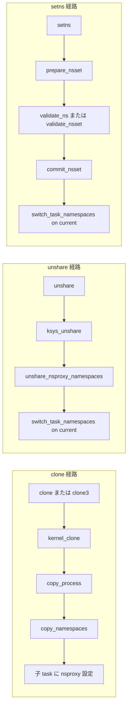

# 第3章 clone、unshare、setns の入口

> **本章で読むソース**
>
> - [`kernel/fork.c` L1929-L1947](https://github.com/gregkh/linux/blob/v6.18.38/kernel/fork.c#L1929-L1947)
> - [`kernel/fork.c` L2187-L2192](https://github.com/gregkh/linux/blob/v6.18.38/kernel/fork.c#L2187-L2192)
> - [`kernel/fork.c` L2741-L2751](https://github.com/gregkh/linux/blob/v6.18.38/kernel/fork.c#L2741-L2751)
> - [`kernel/fork.c` L3080-L3109](https://github.com/gregkh/linux/blob/v6.18.38/kernel/fork.c#L3080-L3109)
> - [`kernel/fork.c` L3130-L3156](https://github.com/gregkh/linux/blob/v6.18.38/kernel/fork.c#L3130-L3156)
> - [`kernel/nsproxy.c` L502-L534](https://github.com/gregkh/linux/blob/v6.18.38/kernel/nsproxy.c#L502-L534)
> - [`kernel/nsproxy.c` L536-L574](https://github.com/gregkh/linux/blob/v6.18.38/kernel/nsproxy.c#L536-L574)

## この章の狙い

ユーザー空間が namespace を操作するときの三つのシステムコール、`clone`、`unshare`、`setns` がカーネル内部でどの関数に接続されるかを追う。
新規タスク生成と既存タスクの切り替えでコード経路がどう分かれるかを押さえる。

## 前提

- [第2章 nsproxy と namespace のライフサイクル](02-nsproxy-lifecycle.md)
- [プロセスとスケジューラの fork 章](../../sched/part00-process/02-fork-copy-process.md)

## clone から copy_namespaces まで

`clone` と `clone3` はいずれも `kernel_clone` を経由して `copy_process` に入る。
`copy_process` の冒頭で namespace 関連フラグの組合せを検証する。

[`kernel/fork.c` L1929-L1947](https://github.com/gregkh/linux/blob/v6.18.38/kernel/fork.c#L1929-L1947)

```c
__latent_entropy struct task_struct *copy_process(
					struct pid *pid,
					int trace,
					int node,
					struct kernel_clone_args *args)
{
	int pidfd = -1, retval;
	struct task_struct *p;
	struct multiprocess_signals delayed;
	struct file *pidfile = NULL;
	const u64 clone_flags = args->flags;
	struct nsproxy *nsp = current->nsproxy;

	/*
	 * Don't allow sharing the root directory with processes in a different
	 * namespace
	 */
	if ((clone_flags & (CLONE_NEWNS|CLONE_FS)) == (CLONE_NEWNS|CLONE_FS))
		return ERR_PTR(-EINVAL);
```

`CLONE_NEWNS` と `CLONE_FS` の同時指定は拒否される。
マウント namespace とファイルシステム構造体の root や pwd は別物だが、一貫したビューを保つための制約である。

メモリやシグナル複製の後、`copy_namespaces` が呼ばれる。

[`kernel/fork.c` L2187-L2192](https://github.com/gregkh/linux/blob/v6.18.38/kernel/fork.c#L2187-L2192)

```c
	retval = copy_namespaces(clone_flags, p);
	if (retval)
		goto bad_fork_cleanup_mm;
	retval = copy_io(clone_flags, p);
	if (retval)
		goto bad_fork_cleanup_namespaces;
```

失敗時は `bad_fork_cleanup_namespaces` ラベルへ進み、子 `task_struct` 構築を巻き戻す。
namespace 作成はメモリ複製の後段に置かれ、address space が確定してから隔離を適用する順序になっている。

レガシー `clone` システムコールは引数を `kernel_clone_args` に詰め替えるだけである。

[`kernel/fork.c` L2741-L2751](https://github.com/gregkh/linux/blob/v6.18.38/kernel/fork.c#L2741-L2751)

```c
	struct kernel_clone_args args = {
		.flags		= (lower_32_bits(clone_flags) & ~CSIGNAL),
		.pidfd		= parent_tidptr,
		.child_tid	= child_tidptr,
		.parent_tid	= parent_tidptr,
		.exit_signal	= (lower_32_bits(clone_flags) & CSIGNAL),
		.stack		= newsp,
		.tls		= tls,
	};

	return kernel_clone(&args);
```

`clone3` は `clone_args` 構造体から cgroup 指定など拡張フィールドを読み取れる。
cgroup への所属変更は namespace とは別フィールドで渡され、第14章で読む。

## unshare による実行中タスクの分離

`unshare` は子プロセスを作らず、呼び出し元タスクの namespace 集合だけを新規作成する。
`ksys_unshare` がフラグの暗黙的な依存を足してから、各 `unshare_*` ヘルパを呼ぶ。

[`kernel/fork.c` L3080-L3109](https://github.com/gregkh/linux/blob/v6.18.38/kernel/fork.c#L3080-L3109)

```c
int ksys_unshare(unsigned long unshare_flags)
{
	struct fs_struct *fs, *new_fs = NULL;
	struct files_struct *new_fd = NULL;
	struct cred *new_cred = NULL;
	struct nsproxy *new_nsproxy = NULL;
	int do_sysvsem = 0;
	int err;

	/*
	 * If unsharing a user namespace must also unshare the thread group
	 * and unshare the filesystem root and working directories.
	 */
	if (unshare_flags & CLONE_NEWUSER)
		unshare_flags |= CLONE_THREAD | CLONE_FS;
	/*
	 * If unsharing vm, must also unshare signal handlers.
	 */
	if (unshare_flags & CLONE_VM)
		unshare_flags |= CLONE_SIGHAND;
	/*
	 * If unsharing a signal handlers, must also unshare the signal queues.
	 */
	if (unshare_flags & CLONE_SIGHAND)
		unshare_flags |= CLONE_THREAD;
	/*
	 * If unsharing namespace, must also unshare filesystem information.
	 */
	if (unshare_flags & CLONE_NEWNS)
		unshare_flags |= CLONE_FS;
```

`CLONE_NEWUSER` はスレッドグループとファイルシステム構造体の同時 unshare を強制する。
単独スレッドだけが新 user namespace に入ると、cred と thread group の整合が崩れるためである。

namespace 作成は `unshare_nsproxy_namespaces` に委譲され、成功後に `switch_task_namespaces` で差し替える。

[`kernel/fork.c` L3130-L3156](https://github.com/gregkh/linux/blob/v6.18.38/kernel/fork.c#L3130-L3156)

```c
	err = unshare_nsproxy_namespaces(unshare_flags, &new_nsproxy,
					 new_cred, new_fs);
	if (err)
		goto bad_unshare_cleanup_cred;
	if (new_cred) {
		err = set_cred_ucounts(new_cred);
		if (err)
			goto bad_unshare_cleanup_nsproxy;
	}

	if (new_fs || new_fd || do_sysvsem || new_cred || new_nsproxy) {
		if (do_sysvsem) {
			/*
			 * CLONE_SYSVSEM is equivalent to sys_exit().
			 */
			exit_sem(current);
		}
		if (unshare_flags & CLONE_NEWIPC) {
			/* Orphan segments in old ns (see sem above). */
			exit_shm(current);
			shm_init_task(current);
		}

		if (new_nsproxy) {
			switch_task_namespaces(current, new_nsproxy);
			new_nsproxy = NULL;
		}
```

IPC namespace の unshare では SysV セマフォと共有メモリを明示的に手放す。
古い namespace 内のオブジェクトに到達不能になるのを防ぐ正しさの処理である。

## setns の二段階コミット

`setns` は別プロセスや `/proc/<pid>/ns/*` から得た fd を使い、呼び出し元を対象 namespace に参加させる。
検証とコミットを分けることで、途中失敗時にタスクが中途半端な状態に留まらない。

`prepare_nsset` で空の `nsproxy` を用意し、`validate_ns` または `validate_nsset` が各 namespace の `install` フックで互換性を確認する。
成功後だけ `commit_nsset` が cred、fs、time、nsproxy を確定する。

[`kernel/nsproxy.c` L502-L534](https://github.com/gregkh/linux/blob/v6.18.38/kernel/nsproxy.c#L502-L534)

```c
static void commit_nsset(struct nsset *nsset)
{
	unsigned flags = nsset->flags;
	struct task_struct *me = current;

#ifdef CONFIG_USER_NS
	if (flags & CLONE_NEWUSER) {
		/* transfer ownership */
		commit_creds(nsset_cred(nsset));
		nsset->cred = NULL;
	}
#endif

	/* We only need to commit if we have used a temporary fs_struct. */
	if ((flags & CLONE_NEWNS) && (flags & ~CLONE_NEWNS)) {
		set_fs_root(me->fs, &nsset->fs->root);
		set_fs_pwd(me->fs, &nsset->fs->pwd);
	}

#ifdef CONFIG_IPC_NS
	if (flags & CLONE_NEWIPC)
		exit_sem(me);
#endif

#ifdef CONFIG_TIME_NS
	if (flags & CLONE_NEWTIME)
		timens_commit(me, nsset->nsproxy->time_ns);
#endif

	/* transfer ownership */
	switch_task_namespaces(me, nsset->nsproxy);
	nsset->nsproxy = NULL;
}
```

`commit_nsset` のコメントは「帰還点」と呼んでおり、ここより前はロールバック可能、ここ以降は副作用が確定する。

システムコール入口では fd の種別に応じて検証経路が分岐する。

[`kernel/nsproxy.c` L536-L574](https://github.com/gregkh/linux/blob/v6.18.38/kernel/nsproxy.c#L536-L574)

```c
SYSCALL_DEFINE2(setns, int, fd, int, flags)
{
	CLASS(fd, f)(fd);
	struct ns_common *ns = NULL;
	struct nsset nsset = {};
	int err = 0;

	if (fd_empty(f))
		return -EBADF;

	if (proc_ns_file(fd_file(f))) {
		ns = get_proc_ns(file_inode(fd_file(f)));
		if (flags && (ns->ns_type != flags))
			err = -EINVAL;
		flags = ns->ns_type;
	} else if (!IS_ERR(pidfd_pid(fd_file(f)))) {
		err = check_setns_flags(flags);
	} else {
		err = -EINVAL;
	}
	if (err)
		goto out;

	err = prepare_nsset(flags, &nsset);
	if (err)
		goto out;

	if (proc_ns_file(fd_file(f)))
		err = validate_ns(&nsset, ns);
	else
		err = validate_nsset(&nsset, pidfd_pid(fd_file(f)));
	if (!err) {
		commit_nsset(&nsset);
		perf_event_namespaces(current);
	}
	put_nsset(&nsset);
out:
	return err;
}
```

`/proc` の namespace inode か pidfd の二種類だけが受け付けられる。
コンテナランタイムは通常、子プロセスの `/proc/<pid>/ns/pid` などを fd として保持し、`setns` で自プロセスを参加させる。

## 三システムコールの処理フロー



clone は新 `task_struct` への適用、unshare と setns は `current` への適用という違いが本質である。

## 高速化と最適化の工夫

`setns` は `prepare_nsset` 内で mount namespace 単独のときだけ `fs_struct` の複製を省略する。
複数 namespace を同時に入るときだけ一時的な `fs_struct` を作り、commit 時に root と pwd を差し替える。

この分岐は、mount namespace だけを切り替えるコンテナツールが余分な `copy_fs_struct` を払わないための最適化である。
検証とコミットの分離は正しさのためだが、不要な fs 複製を避ける条件分岐と組み合わさって hot path を守っている。

## まとめ

`clone` 系は `copy_process` から `copy_namespaces` へ、unshare は `ksys_unshare` から `switch_task_namespaces` へ、setns は validate 後の `commit_nsset` へ接続される。
`clone` は `copy_namespaces` が新 `task_struct` の `nsproxy` を直接組み立てる。
`switch_task_namespaces` は unshare と setns だけが使い、既存タスクの `nsproxy` を差し替える。
第1部では各 `copy_*` ヘルパが担う namespace 固有の処理を読む。

## 関連する章

- [第5章 mount namespace と propagation](../part01-namespaces/05-mount-namespace.md)
- [第7章 user namespace と uid map](../part01-namespaces/07-user-namespace.md)
- [第14章 タスクの cgroup 所属と migration](../part02-cgroup-core/14-cgroup-attach-migration.md)
