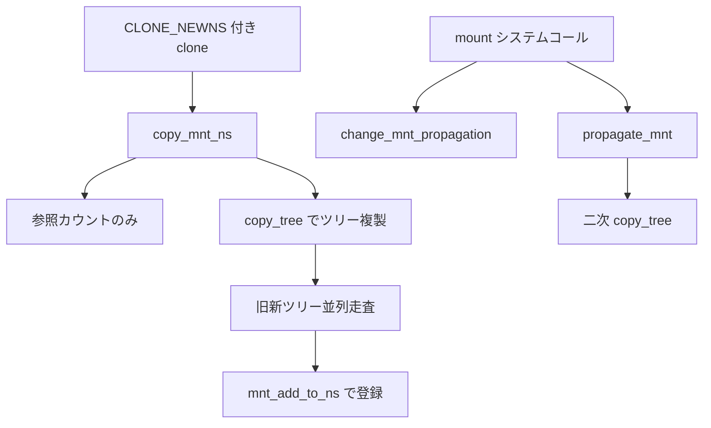

# 第4章 mount namespace と propagation

> **本章で読むソース**
>
> - [`fs/mount.h` L10-L30](https://github.com/gregkh/linux/blob/v6.18.38/fs/mount.h#L10-L30)
> - [`fs/mount.h` L67-L71](https://github.com/gregkh/linux/blob/v6.18.38/fs/mount.h#L67-L71)
> - [`fs/namespace.c` L4108-L4178](https://github.com/gregkh/linux/blob/v6.18.38/fs/namespace.c#L4108-L4178)
> - [`fs/pnode.c` L33-L48](https://github.com/gregkh/linux/blob/v6.18.38/fs/pnode.c#L33-L48)
> - [`fs/pnode.c` L93-L124](https://github.com/gregkh/linux/blob/v6.18.38/fs/pnode.c#L93-L124)
> - [`fs/pnode.c` L311-L366](https://github.com/gregkh/linux/blob/v6.18.38/fs/pnode.c#L311-L366)

## この章の狙い

**mount namespace** がタスクごとに独立したマウントツリーをどう保持し、`copy_mnt_ns` が clone 経路でそれを複製するかを読む。
あわせて **propagation** が `MS_SHARED` と `MS_SLAVE` によりマウントイベントをどう伝播させるかを `pnode.c` から追う。

## 前提

- [第3章 clone、unshare、setns の入口](../part00-foundation/03-clone-unshare-setns.md)
- [第2章 nsproxy と namespace のライフサイクル](../part00-foundation/02-nsproxy-lifecycle.md)

## mnt_namespace の構造

mount namespace は `mnt_namespace` として表され、ルート `mount` と名前空間内の全マウントを赤黒木で索引する。

[`fs/mount.h` L10-L30](https://github.com/gregkh/linux/blob/v6.18.38/fs/mount.h#L10-L30)

```c
struct mnt_namespace {
	struct ns_common	ns;
	struct mount *	root;
	struct {
		struct rb_root	mounts;		 /* Protected by namespace_sem */
		struct rb_node	*mnt_last_node;	 /* last (rightmost) mount in the rbtree */
		struct rb_node	*mnt_first_node; /* first (leftmost) mount in the rbtree */
	};
	struct user_namespace	*user_ns;
	struct ucounts		*ucounts;
	wait_queue_head_t	poll;
	u64			seq_origin; /* Sequence number of origin mount namespace */
	u64 event;
#ifdef CONFIG_FSNOTIFY
	__u32			n_fsnotify_mask;
	struct fsnotify_mark_connector __rcu *n_fsnotify_marks;
#endif
	unsigned int		nr_mounts; /* # of mounts in the namespace */
	unsigned int		pending_mounts;
	refcount_t		passive; /* number references not pinning @mounts */
} __randomize_layout;
```

`nsproxy` の `mnt_ns` はこの構造体を指す。
`user_ns` は mount namespace 作成時の権限文脈であり、user namespace との組合せは第6章で読む。

各 `mount` 構造体は propagation 用のリンクを持つ。
`mnt_share` は共有ピアグループ、`mnt_slave_list` と `mnt_master` はスレーブ関係を表す。

[`fs/mount.h` L67-L71](https://github.com/gregkh/linux/blob/v6.18.38/fs/mount.h#L67-L71)

```c
	struct list_head mnt_expire;	/* link in fs-specific expiry list */
	struct list_head mnt_share;	/* circular list of shared mounts */
	struct hlist_head mnt_slave_list;/* list of slave mounts */
	struct hlist_node mnt_slave;	/* slave list entry */
	struct mount *mnt_master;	/* slave is on master->mnt_slave_list */
```

## copy_mnt_ns による複製

`create_new_namespaces` は mount を最初に処理し、`copy_mnt_ns` を呼ぶ。
`CLONE_NEWNS` が立っていなければ参照カウントを増やして既存 namespace を返す fast path がある。

[`fs/namespace.c` L4108-L4178](https://github.com/gregkh/linux/blob/v6.18.38/fs/namespace.c#L4108-L4178)

```c
struct mnt_namespace *copy_mnt_ns(u64 flags, struct mnt_namespace *ns,
		struct user_namespace *user_ns, struct fs_struct *new_fs)
{
	struct mnt_namespace *new_ns;
	struct vfsmount *rootmnt __free(mntput) = NULL;
	struct vfsmount *pwdmnt __free(mntput) = NULL;
	struct mount *p, *q;
	struct mount *old;
	struct mount *new;
	int copy_flags;

	BUG_ON(!ns);

	if (likely(!(flags & CLONE_NEWNS))) {
		get_mnt_ns(ns);
		return ns;
	}

	old = ns->root;

	new_ns = alloc_mnt_ns(user_ns, false);
	if (IS_ERR(new_ns))
		return new_ns;

	guard(namespace_excl)();
	/* First pass: copy the tree topology */
	copy_flags = CL_COPY_UNBINDABLE | CL_EXPIRE;
	if (user_ns != ns->user_ns)
		copy_flags |= CL_SLAVE;
	new = copy_tree(old, old->mnt.mnt_root, copy_flags);
	if (IS_ERR(new)) {
		emptied_ns = new_ns;
		return ERR_CAST(new);
	}
	if (user_ns != ns->user_ns) {
		guard(mount_writer)();
		lock_mnt_tree(new);
	}
	new_ns->root = new;

	/*
	 * Second pass: switch the tsk->fs->* elements and mark new vfsmounts
	 * as belonging to new namespace.  We have already acquired a private
	 * fs_struct, so tsk->fs->lock is not needed.
	 */
	p = old;
	q = new;
	while (p) {
		mnt_add_to_ns(new_ns, q);
		new_ns->nr_mounts++;
		if (new_fs) {
			if (&p->mnt == new_fs->root.mnt) {
				new_fs->root.mnt = mntget(&q->mnt);
				rootmnt = &p->mnt;
			}
			if (&p->mnt == new_fs->pwd.mnt) {
				new_fs->pwd.mnt = mntget(&q->mnt);
				pwdmnt = &p->mnt;
			}
		}
		p = next_mnt(p, old);
		q = next_mnt(q, new);
		if (!q)
			break;
		// an mntns binding we'd skipped?
		while (p->mnt.mnt_root != q->mnt.mnt_root)
			p = next_mnt(skip_mnt_tree(p), old);
	}
	ns_tree_add_raw(new_ns);
	return new_ns;
}
```

複製は二段階である。
第一段階の `copy_tree` がツリー構造と propagation 属性を写し、第二段階の並列走査が各 `vfsmount` を新 namespace に登録し、`fs_struct` の root と pwd を対応する新マウントへ差し替える。

`user_ns != ns->user_ns` のとき `CL_SLAVE` を付与するのは、親から子への伝播は残しつつ、権限の低い子 mount namespace から親への逆伝播を防ぐためである。

> **7.x 系での変化**
> v7.1.3 では [`copy_mnt_ns` L4228-L4320 付近](https://github.com/gregkh/linux/blob/v7.1.3/fs/namespace.c#L4228-L4320) に `CLONE_EMPTY_MNTNS` 分岐が追加され、空の mount namespace を root マウントだけで初期化できる。
> フルコピー経路は v6.18.38 と同型の二段階走査のままである。

## propagation の種類

`mount` システムコールの `MS_SHARED` と `MS_SLAVE` は `change_mnt_propagation` でマウントの伝播モードを切り替える。

[`fs/pnode.c` L93-L124](https://github.com/gregkh/linux/blob/v6.18.38/fs/pnode.c#L93-L124)

```c
void change_mnt_propagation(struct mount *mnt, int type)
{
	struct mount *m = mnt->mnt_master;

	if (type == MS_SHARED) {
		set_mnt_shared(mnt);
		return;
	}
	if (IS_MNT_SHARED(mnt)) {
		if (list_empty(&mnt->mnt_share)) {
			mnt_release_group_id(mnt);
		} else {
			m = next_peer(mnt);
			list_del_init(&mnt->mnt_share);
			mnt->mnt_group_id = 0;
		}
		CLEAR_MNT_SHARED(mnt);
		transfer_propagation(mnt, m);
	}
	hlist_del_init(&mnt->mnt_slave);
	if (type == MS_SLAVE) {
		mnt->mnt_master = m;
		if (m)
			hlist_add_head(&mnt->mnt_slave, &m->mnt_slave_list);
	} else {
		mnt->mnt_master = NULL;
		if (type == MS_UNBINDABLE)
			mnt->mnt_t_flags |= T_UNBINDABLE;
		else
			mnt->mnt_t_flags &= ~T_UNBINDABLE;
	}
}
```

`MS_SHARED` はピアグループを形成し、同一グループへのマウントとアンマウントが互いに複製される。
`MS_SLAVE` はマスターの変更を受け取るが、スレーブ側の変更はマスターへ逆流しない。
`MS_PRIVATE` は伝播を遮断し、`MS_UNBINDABLE` はバインドマウントの複製を拒否する。

## propagate_mnt による二次マウント生成

共有関係にあるマウントへ新しいサブツリーを付けるとき、`propagate_mnt` がピアグループとスレーブ階層を走査し、二次コピーを生成する。

[`fs/pnode.c` L311-L366](https://github.com/gregkh/linux/blob/v6.18.38/fs/pnode.c#L311-L366)

```c
int propagate_mnt(struct mount *dest_mnt, struct mountpoint *dest_mp,
		  struct mount *source_mnt, struct hlist_head *tree_list)
{
	struct mount *m, *n, *copy, *this;
	int err = 0, type;

	if (dest_mnt->mnt_master)
		SET_MNT_MARK(dest_mnt->mnt_master);

	/* iterate over peer groups, depth first */
	for (m = dest_mnt; m && !err; m = next_group(m, dest_mnt)) {
		if (m == dest_mnt) { // have one for dest_mnt itself
			copy = source_mnt;
			type = CL_MAKE_SHARED;
			n = next_peer(m);
			if (n == m)
				continue;
		} else {
			type = CL_SLAVE;
			/* beginning of peer group among the slaves? */
			if (IS_MNT_SHARED(m))
				type |= CL_MAKE_SHARED;
			n = m;
		}
		do {
			if (!need_secondary(n, dest_mp))
				continue;
			if (type & CL_SLAVE) // first in this peer group
				copy = find_master(n, copy, source_mnt);
			this = copy_tree(copy, copy->mnt.mnt_root, type);
			if (IS_ERR(this)) {
				err = PTR_ERR(this);
				break;
			}
			scoped_guard(mount_locked_reader)
				mnt_set_mountpoint(n, dest_mp, this);
			if (n->mnt_master)
				SET_MNT_MARK(n->mnt_master);
			copy = this;
			hlist_add_head(&this->mnt_hash, tree_list);
			err = count_mounts(n->mnt_ns, this);
			if (err)
				break;
			type = CL_MAKE_SHARED;
		} while ((n = next_peer(n)) != m);
	}

	hlist_for_each_entry(n, tree_list, mnt_hash) {
		m = n->mnt_parent;
		if (m->mnt_master)
			CLEAR_MNT_MARK(m->mnt_master);
	}
	if (dest_mnt->mnt_master)
		CLEAR_MNT_MARK(dest_mnt->mnt_master);
	return err;
}
```

宛先マウントが共有ピアの一部なら、各ピアへ `copy_tree` で複製が届く。
スレーブ階層では `CL_SLAVE` 付きのコピーがマスターから派生し、共有スレーブには `CL_MAKE_SHARED` が加わる。

## 処理フロー



コンテナの rootfs は通常、新 mount namespace への `pivot_root` または `MS_BIND` と `MS_REC` の組合せで構築される。
その手順の一般論は VFS 分冊へ委譲し、本章は namespace 複製と propagation グラフに留める。

## 高速化と最適化の工夫

`copy_mnt_ns` 冒頭の `likely(!(flags & CLONE_NEWNS))` は、フラグなし fork が mount namespace 割り当てをスキップする fast path である。
第2章の `copy_namespaces` と同型の最適化で、通常プロセス生成のマウントツリー複製コストを排除する。

propagation 走査では `get_peer_under_root` が namespace 一致を先に確認し、到達不能なピアを早期に打ち切る。

[`fs/pnode.c` L33-L48](https://github.com/gregkh/linux/blob/v6.18.38/fs/pnode.c#L33-L48)

```c
static struct mount *get_peer_under_root(struct mount *mnt,
					 struct mnt_namespace *ns,
					 const struct path *root)
{
	struct mount *m = mnt;

	do {
		/* Check the namespace first for optimization */
		if (m->mnt_ns == ns && is_path_reachable(m, m->mnt.mnt_root, root))
			return m;

		m = next_peer(m);
	} while (m != mnt);

	return NULL;
}
```

ピアリストは異なる mount namespace にまたがり得るため、`mnt_ns` 比較を `is_path_reachable` より先に置くことで、無関係なピアへのパス到達判定を省略している。

## まとめ

mount namespace は `mnt_namespace` と `mount` の赤黒木でタスクごとのマウントビューを保持する。
`copy_mnt_ns` が clone 時にツリーを複製し、propagation は `mnt_share` と `mnt_slave` のグラフでマウントイベントを伝播させる。
次章では PID namespace の階層と番号変換を読む。

## 関連する章

- [第5章 PID namespace の階層と translation](05-pid-namespace.md)
- [第6章 user namespace と uid map](06-user-namespace.md)
- [VFS 分冊のマウント一般論](../../vfs/README.md)
