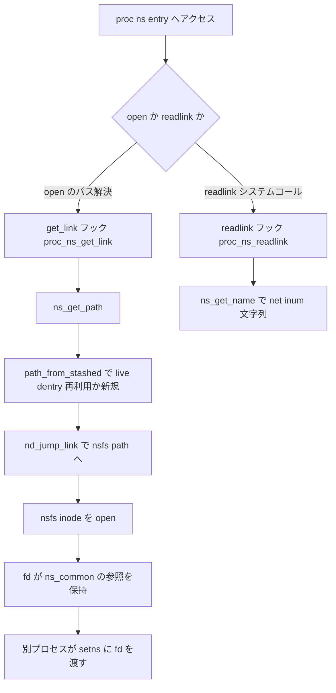

# 第4章 proc namespace と nsfs と namespace ioctl

> **本章で読むソース**
>
> - [`include/linux/ns_common.h` L40-L54](https://github.com/gregkh/linux/blob/v6.18.38/include/linux/ns_common.h#L40-L54)
> - [`include/linux/proc_ns.h` L17-L25](https://github.com/gregkh/linux/blob/v6.18.38/include/linux/proc_ns.h#L17-L25)
> - [`fs/proc/namespaces.c` L42-L69](https://github.com/gregkh/linux/blob/v6.18.38/fs/proc/namespaces.c#L42-L69)
> - [`fs/proc/namespaces.c` L71-L96](https://github.com/gregkh/linux/blob/v6.18.38/fs/proc/namespaces.c#L71-L96)
> - [`fs/nsfs.c` L38-L41](https://github.com/gregkh/linux/blob/v6.18.38/fs/nsfs.c#L38-L41)
> - [`fs/nsfs.c` L58-L63](https://github.com/gregkh/linux/blob/v6.18.38/fs/nsfs.c#L58-L63)
> - [`fs/nsfs.c` L89-L129](https://github.com/gregkh/linux/blob/v6.18.38/fs/nsfs.c#L89-L129)
> - [`fs/nsfs.c` L197-L206](https://github.com/gregkh/linux/blob/v6.18.38/fs/nsfs.c#L197-L206)
> - [`fs/nsfs.c` L208-L242](https://github.com/gregkh/linux/blob/v6.18.38/fs/nsfs.c#L208-L242)
> - [`fs/nsfs.c` L243-L299](https://github.com/gregkh/linux/blob/v6.18.38/fs/nsfs.c#L243-L299)
> - [`fs/nsfs.c` L302-L368](https://github.com/gregkh/linux/blob/v6.18.38/fs/nsfs.c#L302-L368)
> - [`fs/libfs.c` L2130-L2143](https://github.com/gregkh/linux/blob/v6.18.38/fs/libfs.c#L2130-L2143)
> - [`fs/libfs.c` L2187-L2206](https://github.com/gregkh/linux/blob/v6.18.38/fs/libfs.c#L2187-L2206)
> - [`fs/libfs.c` L2225-L2263](https://github.com/gregkh/linux/blob/v6.18.38/fs/libfs.c#L2225-L2263)
> - [`kernel/user_namespace.c` L1378-L1394](https://github.com/gregkh/linux/blob/v6.18.38/kernel/user_namespace.c#L1378-L1394)

## この章の狙い

`/proc/<pid>/ns/<type>` を open したときにカーネル内部で何が起きるかを読む。
nsfs 擬似ファイルシステムが namespace を1つの inode としてどう表現し、fd が寿命をどう保ち、namespace ioctl が親子関係や所有 user namespace をどう辿るかを追う。

## 前提

- [第2章 nsproxy と namespace のライフサイクル](../part00-foundation/02-nsproxy-lifecycle.md)
- [第3章 clone、unshare、setns の入口](../part00-foundation/03-clone-unshare-setns.md)

## ns_common と proc_ns_operations

各 namespace 個体は `ns_common` で共通化される。
`stashed` は nsfs 用の dentry キャッシュスロット、`ops` は proc と nsfs から呼ばれる操作テーブル、`inum` は proc 表示と nsfs inode 番号の両方に使われる。

[`include/linux/ns_common.h` L40-L54](https://github.com/gregkh/linux/blob/v6.18.38/include/linux/ns_common.h#L40-L54)

```c
struct ns_common {
	u32 ns_type;
	struct dentry *stashed;
	const struct proc_ns_operations *ops;
	unsigned int inum;
	refcount_t __ns_ref; /* do not use directly */
	union {
		struct {
			u64 ns_id;
			struct rb_node ns_tree_node;
			struct list_head ns_list_node;
		};
		struct rcu_head ns_rcu;
	};
};
```

v6.18.38 では存在参照 `__ns_ref` の一本のみである。
第2章で読んだ get/put は `ops->get` と `ops->put` 経由でこの参照カウントを動かす。

namespace 種別ごとの実体は `proc_ns_operations` にまとまる。
`get` はタスクから namespace を取り出し、`put` は参照を手放す。
`install` は setns 用、`owner` と `get_parent` は ioctl が親子関係を辿るときに使う。

[`include/linux/proc_ns.h` L17-L25](https://github.com/gregkh/linux/blob/v6.18.38/include/linux/proc_ns.h#L17-L25)

```c
struct proc_ns_operations {
	const char *name;
	const char *real_ns_name;
	struct ns_common *(*get)(struct task_struct *task);
	void (*put)(struct ns_common *ns);
	int (*install)(struct nsset *nsset, struct ns_common *ns);
	struct user_namespace *(*owner)(struct ns_common *ns);
	struct ns_common *(*get_parent)(struct ns_common *ns);
} __randomize_layout;
```

`/proc/<pid>/ns/` 配下のエントリ名は `ns_entries[]` が `CONFIG_*` に応じて列挙する。
net、uts、ipc、pid、user、mnt、cgroup、time などがコンパイル時に増減する。

## open 経路と readlink 経路

`/proc/<pid>/ns/<type>` は symlink だが、open と readlink は別フックに分岐する。

**open のパス解決**では `inode_operations.get_link` の `proc_ns_get_link` が呼ばれる。
`ptrace_may_access` で権限を確認したあと `ns_get_path` で nsfs 側の path を組み立て、`nd_jump_link` でジャンプする。
symlink 文字列を辿るのではなく path を差し替える点が本質である。

[`fs/proc/namespaces.c` L42-L69](https://github.com/gregkh/linux/blob/v6.18.38/fs/proc/namespaces.c#L42-L69)

```c
static const char *proc_ns_get_link(struct dentry *dentry,
				    struct inode *inode,
				    struct delayed_call *done)
{
	const struct proc_ns_operations *ns_ops = PROC_I(inode)->ns_ops;
	struct task_struct *task;
	struct path ns_path;
	int error = -EACCES;

	if (!dentry)
		return ERR_PTR(-ECHILD);

	task = get_proc_task(inode);
	if (!task)
		return ERR_PTR(-EACCES);

	if (!ptrace_may_access(task, PTRACE_MODE_READ_FSCREDS))
		goto out;

	error = ns_get_path(&ns_path, task, ns_ops);
	if (error)
		goto out;

	error = nd_jump_link(&ns_path);
out:
	put_task_struct(task);
	return ERR_PTR(error);
}
```

**readlink システムコール**は `inode_operations.readlink` の `proc_ns_get_link` とは別に `proc_ns_readlink` を通る。
`ns_get_name` で `net:[4026531840]` のような文字列を組み立て、`readlink_copy` でユーザー空間へ返す。

[`fs/proc/namespaces.c` L71-L96](https://github.com/gregkh/linux/blob/v6.18.38/fs/proc/namespaces.c#L71-L96)

```c
static int proc_ns_readlink(struct dentry *dentry, char __user *buffer, int buflen)
{
	struct inode *inode = d_inode(dentry);
	const struct proc_ns_operations *ns_ops = PROC_I(inode)->ns_ops;
	struct task_struct *task;
	char name[50];
	int res = -EACCES;

	task = get_proc_task(inode);
	if (!task)
		return res;

	if (ptrace_may_access(task, PTRACE_MODE_READ_FSCREDS)) {
		res = ns_get_name(name, sizeof(name), task, ns_ops);
		if (res >= 0)
			res = readlink_copy(buffer, buflen, name, strlen(name));
	}
	put_task_struct(task);
	return res;
}

static const struct inode_operations proc_ns_link_inode_operations = {
	.readlink	= proc_ns_readlink,
	.get_link	= proc_ns_get_link,
	.setattr	= proc_setattr,
};
```

## nsfs の最小実装

open のジャンプ先は **nsfs** 擬似ファイルシステム上の inode である。
`ns_file_operations` は `unlocked_ioctl` と `compat_ioctl` だけを持ち、read/write はない。
ファイルとしての中身はなく、ioctl 専用ハンドルとして機能する。

[`fs/nsfs.c` L38-L41](https://github.com/gregkh/linux/blob/v6.18.38/fs/nsfs.c#L38-L41)

```c
static const struct file_operations ns_file_operations = {
	.unlocked_ioctl = ns_ioctl,
	.compat_ioctl   = compat_ptr_ioctl,
};
```

`ns_get_path` はタスクから `ops->get` で `ns_common` を取り、`path_from_stashed` で nsfs path を返す。
`open_namespace` は path を `dentry_open` して fd を発行する。
コメントのとおり、成功失敗にかかわらず引数の `ns` 参照を無条件に消費する契約である。

[`fs/nsfs.c` L89-L129](https://github.com/gregkh/linux/blob/v6.18.38/fs/nsfs.c#L89-L129)

```c
int ns_get_path(struct path *path, struct task_struct *task,
		  const struct proc_ns_operations *ns_ops)
{
	struct ns_get_path_task_args args = {
		.ns_ops	= ns_ops,
		.task	= task,
	};

	return ns_get_path_cb(path, ns_get_path_task, &args);
}

/**
 * open_namespace - open a namespace
 * @ns: the namespace to open
 *
 * This will consume a reference to @ns indendent of success or failure.
 *
 * Return: A file descriptor on success or a negative error code on failure.
 */
int open_namespace(struct ns_common *ns)
{
	struct path path __free(path_put) = {};
	struct file *f;
	int err;

	/* call first to consume reference */
	err = path_from_stashed(&ns->stashed, nsfs_mnt, ns, &path);
	if (err < 0)
		return err;

	CLASS(get_unused_fd, fd)(O_CLOEXEC);
	if (fd < 0)
		return fd;

	f = dentry_open(&path, O_RDONLY, current_cred());
	if (IS_ERR(f))
		return PTR_ERR(f);

	fd_install(fd, f);
	return take_fd(fd);
}
```

`open_related_ns` は `get_ns` コールバックで関連 namespace を取得し `open_namespace` に渡す。
`ns_ioctl` 内では `NS_GET_USERNS` と `NS_GET_PARENT` の2 case だけがこの関数を使う。
ただし `open_related_ns` 自体は nsfs 専用ではなく、`net/socket.c` の `SIOCGSKNS` や `drivers/net/tun.c` の `SIOCGSKNS`／`TUNGETDEVNETNS` からも `get_net_ns` を渡して呼ばれる汎用ヘルパーである。
pidfs からは呼ばれず、pidfs の `PIDFD_GET_*_NAMESPACE` 系 ioctl は取得した `ns_common` を `open_namespace` に直接渡す。

## stashed dentry による live dentry の再利用

同じ namespace への open は `ns_common.stashed` スロット経由で live な dentry を再利用し得る。
`path_from_stashed` は nsfs と pidfs 専用のヘルパである。

[`fs/libfs.c` L2225-L2263](https://github.com/gregkh/linux/blob/v6.18.38/fs/libfs.c#L2225-L2263)

```c
int path_from_stashed(struct dentry **stashed, struct vfsmount *mnt, void *data,
		      struct path *path)
{
	struct dentry *dentry, *res;
	const struct stashed_operations *sops = mnt->mnt_sb->s_fs_info;

	/* See if dentry can be reused. */
	res = stashed_dentry_get(stashed);
	if (IS_ERR(res))
		return PTR_ERR(res);
	if (res) {
		sops->put_data(data);
		goto make_path;
	}

	/* Allocate a new dentry. */
	dentry = prepare_anon_dentry(stashed, mnt->mnt_sb, data);
	if (IS_ERR(dentry))
		return PTR_ERR(dentry);

	/* Added a new dentry. @data is now owned by the filesystem. */
	if (sops->stash_dentry)
		res = sops->stash_dentry(stashed, dentry);
	else
		res = stash_dentry(stashed, dentry);
	if (IS_ERR(res)) {
		dput(dentry);
		return PTR_ERR(res);
	}
	if (res != dentry)
		dput(dentry);

make_path:
	path->dentry = res;
	path->mnt = mntget(mnt);
	VFS_WARN_ON_ONCE(path->dentry->d_fsdata != stashed);
	VFS_WARN_ON_ONCE(d_inode(path->dentry)->i_private != data);
	return 0;
}
```

取り直しは RCU 下の `stashed_dentry_get` が `lockref_get_not_dead` で行う。
stash 公開は `stash_dentry` の `cmpxchg` で行い、複数 CPU が同時に初回作成しても1つの reusable dentry に収束する。

[`fs/libfs.c` L2130-L2143](https://github.com/gregkh/linux/blob/v6.18.38/fs/libfs.c#L2130-L2143)

```c
struct dentry *stashed_dentry_get(struct dentry **stashed)
{
	struct dentry *dentry;

	guard(rcu)();
	dentry = rcu_dereference(*stashed);
	if (!dentry)
		return NULL;
	if (IS_ERR(dentry))
		return dentry;
	if (!lockref_get_not_dead(&dentry->d_lockref))
		return NULL;
	return dentry;
}
```

[`fs/libfs.c` L2187-L2206](https://github.com/gregkh/linux/blob/v6.18.38/fs/libfs.c#L2187-L2206)

```c
struct dentry *stash_dentry(struct dentry **stashed, struct dentry *dentry)
{
	guard(rcu)();
	for (;;) {
		struct dentry *old;

		/* Assume any old dentry was cleared out. */
		old = cmpxchg(stashed, NULL, dentry);
		if (likely(!old))
			return dentry;

		/* Check if somebody else installed a reusable dentry. */
		if (lockref_get_not_dead(&old->d_lockref))
			return old;

		/* There's an old dead dentry there, try to take it over. */
		if (likely(try_cmpxchg(stashed, &old, dentry)))
			return dentry;
	}
}
```

「2回 open すれば常に同じ inode」とは書けない。
最終 `dput` 後に `ns_dentry_operations.d_prune` つまり `stashed_dentry_prune` が slot を `NULL` に戻し、inode も evict される。
以後の open は新しい dentry/inode を生成する。
`inum` は同じ値でも VFS inode オブジェクトは寿命をまたいで再生成され得る。
`nsfs_init_inode` は新規 inode 生成時だけ呼ばれ、cached dentry 再利用時は呼ばれない。

## fd が namespace の寿命を保つ仕組み

fd が生きている間、対応する nsfs dentry/inode が live に保たれる。
inode 破棄時 `nsfs_evict` が `ns->ops->put(ns)` を呼び、ここが namespace 解放の終端である。

[`fs/nsfs.c` L58-L63](https://github.com/gregkh/linux/blob/v6.18.38/fs/nsfs.c#L58-L63)

```c
static void nsfs_evict(struct inode *inode)
{
	struct ns_common *ns = inode->i_private;
	clear_inode(inode);
	ns->ops->put(ns);
}
```

第3章の `setns` が受け取る fd はここで作られる。
fd を握り続けるだけで対象 namespace を破棄させない、という運用上のイディオムに繋がる。
inode の `i_private` は `get_proc_ns` マクロで `ns_common*` として取り出せる。

## namespace ioctl

`ns_ioctl` は `nsfs_ioctl_valid` と `may_use_nsfs_ioctl` を通ったあと switch で本体を実行する。
`NS_GET_NSTYPE` は `ns->ns_type` をそのまま返す。
`NS_GET_PARENT` は `get_parent` 未実装なら `-EINVAL` である。
PID namespace と user namespace だけが `get_parent` を持ち、mount、UTS、IPC、net、cgroup、time は持たない。

[`fs/nsfs.c` L208-L242](https://github.com/gregkh/linux/blob/v6.18.38/fs/nsfs.c#L208-L242)

```c
static long ns_ioctl(struct file *filp, unsigned int ioctl,
			unsigned long arg)
{
	struct user_namespace *user_ns;
	struct pid_namespace *pid_ns;
	struct task_struct *tsk;
	struct ns_common *ns;
	struct mnt_namespace *mnt_ns;
	bool previous = false;
	uid_t __user *argp;
	uid_t uid;
	int ret;

	if (!nsfs_ioctl_valid(ioctl))
		return -ENOIOCTLCMD;
	if (!may_use_nsfs_ioctl(ioctl))
		return -EPERM;

	ns = get_proc_ns(file_inode(filp));
	switch (ioctl) {
	case NS_GET_USERNS:
		return open_related_ns(ns, ns_get_owner);
	case NS_GET_PARENT:
		if (!ns->ops->get_parent)
			return -EINVAL;
		return open_related_ns(ns, ns->ops->get_parent);
	case NS_GET_NSTYPE:
		return ns->ns_type;
	case NS_GET_OWNER_UID:
		if (ns->ns_type != CLONE_NEWUSER)
			return -EINVAL;
		user_ns = container_of(ns, struct user_namespace, ns);
		argp = (uid_t __user *) arg;
		uid = from_kuid_munged(current_user_ns(), user_ns->owner);
		return put_user(uid, argp);
```

`NS_GET_USERNS` の実体 `ns_get_owner` は `ops->owner` から始め、`current_user_ns()` に到達できるまで `parent` を遡る。
到達できなければ `-EPERM` である。

[`kernel/user_namespace.c` L1378-L1394](https://github.com/gregkh/linux/blob/v6.18.38/kernel/user_namespace.c#L1378-L1394)

```c
struct ns_common *ns_get_owner(struct ns_common *ns)
{
	struct user_namespace *my_user_ns = current_user_ns();
	struct user_namespace *owner, *p;

	/* See if the owner is in the current user namespace */
	owner = p = ns->ops->owner(ns);
	for (;;) {
		if (!p)
			return ERR_PTR(-EPERM);
		if (p == my_user_ns)
			break;
		p = p->parent;
	}

	return &get_user_ns(owner)->ns;
}
```

user namespace の `userns_operations` は `get_parent` に `ns_get_owner` 自身を積む。
つまり user namespace の `NS_GET_PARENT` は所有権チェインを返す。
`NS_GET_OWNER_UID` は user namespace 限定で `from_kuid_munged` により呼び出し元 user namespace 視点の uid を返す。
uid map と `from_kuid_munged` の詳細は第7章を参照する。

`ns_ioctl` の switch は `NS_GET_OWNER_UID` の先も続く。
`NS_GET_PID_FROM_PIDNS` などの4種は `ns->ns_type` が `CLONE_NEWPID` でなければ `-EINVAL` を返し、RCU 下で `find_task_by_vpid` または `find_task_by_pid_ns` によりタスクを解決してから pid/tgid のグローバル値と対象 pid namespace 内での値を変換する。
`NS_GET_MNTNS_ID` と `NS_GET_ID` は変換なしに対象 namespace の `ns_id` をそのままユーザー空間へ返す。

[`fs/nsfs.c` L243-L299](https://github.com/gregkh/linux/blob/v6.18.38/fs/nsfs.c#L243-L299)

```c
	case NS_GET_PID_FROM_PIDNS:
		fallthrough;
	case NS_GET_TGID_FROM_PIDNS:
		fallthrough;
	case NS_GET_PID_IN_PIDNS:
		fallthrough;
	case NS_GET_TGID_IN_PIDNS: {
		if (ns->ns_type != CLONE_NEWPID)
			return -EINVAL;

		ret = -ESRCH;
		pid_ns = container_of(ns, struct pid_namespace, ns);

		guard(rcu)();

		if (ioctl == NS_GET_PID_IN_PIDNS ||
		    ioctl == NS_GET_TGID_IN_PIDNS)
			tsk = find_task_by_vpid(arg);
		else
			tsk = find_task_by_pid_ns(arg, pid_ns);
		if (!tsk)
			return ret;

		switch (ioctl) {
		case NS_GET_PID_FROM_PIDNS:
			ret = task_pid_vnr(tsk);
			break;
		case NS_GET_TGID_FROM_PIDNS:
			ret = task_tgid_vnr(tsk);
			break;
		case NS_GET_PID_IN_PIDNS:
			ret = task_pid_nr_ns(tsk, pid_ns);
			break;
		case NS_GET_TGID_IN_PIDNS:
			ret = task_tgid_nr_ns(tsk, pid_ns);
			break;
		default:
			ret = 0;
			break;
		}

		if (!ret)
			ret = -ESRCH;
		return ret;
	}
	case NS_GET_MNTNS_ID:
		if (ns->ns_type != CLONE_NEWNS)
			return -EINVAL;
		fallthrough;
	case NS_GET_ID: {
		__u64 __user *idp;
		__u64 id;

		idp = (__u64 __user *)arg;
		id = ns->ns_id;
		return put_user(id, idp);
	}
```

最初の switch を抜けると「extensible ioctls」と呼ばれる2つ目の switch に移る。
`NS_MNT_GET_INFO` は対象が mount namespace であることを確認し、`copy_ns_info_to_user` で `mnt_ns_id` や `nr_mounts` などを呼び出し元にコピーする。
`NS_MNT_GET_NEXT` と `NS_MNT_GET_PREV` は `get_sequential_mnt_ns` でカーネル全体が持つ mount namespace のグローバルリストを次または前へ辿り、見つけた mount namespace を `path_from_stashed` と `dentry_open` でその場で新規 fd 化して返す。
`open_namespace` を経由しないのは、`uinfo` が渡されていれば同じ呼び出しで情報コピーも済ませるためである。

[`fs/nsfs.c` L302-L368](https://github.com/gregkh/linux/blob/v6.18.38/fs/nsfs.c#L302-L368)

```c
	/* extensible ioctls */
	switch (_IOC_NR(ioctl)) {
	case _IOC_NR(NS_MNT_GET_INFO): {
		struct mnt_ns_info kinfo = {};
		struct mnt_ns_info __user *uinfo = (struct mnt_ns_info __user *)arg;
		size_t usize = _IOC_SIZE(ioctl);

		if (ns->ns_type != CLONE_NEWNS)
			return -EINVAL;

		if (!uinfo)
			return -EINVAL;

		if (usize < MNT_NS_INFO_SIZE_VER0)
			return -EINVAL;

		return copy_ns_info_to_user(to_mnt_ns(ns), uinfo, usize, &kinfo);
	}
	case _IOC_NR(NS_MNT_GET_PREV):
		previous = true;
		fallthrough;
	case _IOC_NR(NS_MNT_GET_NEXT): {
		struct mnt_ns_info kinfo = {};
		struct mnt_ns_info __user *uinfo = (struct mnt_ns_info __user *)arg;
		struct path path __free(path_put) = {};
		struct file *f __free(fput) = NULL;
		size_t usize = _IOC_SIZE(ioctl);

		if (ns->ns_type != CLONE_NEWNS)
			return -EINVAL;

		if (usize < MNT_NS_INFO_SIZE_VER0)
			return -EINVAL;

		mnt_ns = get_sequential_mnt_ns(to_mnt_ns(ns), previous);
		if (IS_ERR(mnt_ns))
			return PTR_ERR(mnt_ns);

		ns = to_ns_common(mnt_ns);
		/* Transfer ownership of @mnt_ns reference to @path. */
		ret = path_from_stashed(&ns->stashed, nsfs_mnt, ns, &path);
		if (ret)
			return ret;

		CLASS(get_unused_fd, fd)(O_CLOEXEC);
		if (fd < 0)
			return fd;

		f = dentry_open(&path, O_RDONLY, current_cred());
		if (IS_ERR(f))
			return PTR_ERR(f);

		if (uinfo) {
			/*
			 * If @uinfo is passed return all information about the
			 * mount namespace as well.
			 */
			ret = copy_ns_info_to_user(to_mnt_ns(ns), uinfo, usize, &kinfo);
			if (ret)
				return ret;
		}

		/* Transfer reference of @f to caller's fdtable. */
		fd_install(fd, no_free_ptr(f));
		/* File descriptor is live so hand it off to the caller. */
		return take_fd(fd);
	}
```

`NS_MNT_GET_NEXT` と `NS_MNT_GET_PREV` は自分が open した fd の namespace に限らず、他プロセスが所有する mount namespace までグローバルリスト上で横断的に列挙できる。
このため `may_use_nsfs_ioctl` はこの2つの ioctl だけに `may_see_all_namespaces` を要求する。
`NS_MNT_GET_INFO` を含むそれ以外の ioctl は対象 fd 自身が指す namespace しか扱わないため、この追加チェックを通らない。

[`fs/nsfs.c` L197-L206](https://github.com/gregkh/linux/blob/v6.18.38/fs/nsfs.c#L197-L206)

```c
static bool may_use_nsfs_ioctl(unsigned int cmd)
{
	switch (_IOC_NR(cmd)) {
	case _IOC_NR(NS_MNT_GET_NEXT):
		fallthrough;
	case _IOC_NR(NS_MNT_GET_PREV):
		return may_see_all_namespaces();
	}
	return true;
}
```

## 処理フロー



open は get_link 経由で nsfs に着地し、readlink は文字列表示だけを返す。
fd 保持中は nsfs inode が live のまま `ops->put` を遅延する。

## 高速化と最適化の工夫

**stashed dentry による live dentry の再利用**が頻出経路の最適化である。

`path_from_stashed` は `ns_common.stashed` を1ポインタスロットとして使い、live な cached dentry があれば新規 dentry/inode 割り当てを避ける。
`stashed_dentry_get` は RCU 下の `lockref_get_not_dead` で取り直す。
`lockref` は通常 `cmpxchg` fast path だが、失敗や非対応 arch では `spin_lock` fallback を取る。
stash 公開の `cmpxchg` により同時初回作成も1つの reusable dentry に収束する。

保証は「live な cached dentry がある間は再利用」「同時初回作成も1つに収束」までである。
最終 `dput` 後は prune で slot が空になり、以後は新規生成となる。
pidfs も同じ `path_from_stashed` 機構を `pid->stashed` に使う。

> **7.x 系での変化**
> v7.1.3 では namespace 参照が存在 `__ns_ref` と使用中 `__ns_ref_active` の2段に分離された。
> [`struct ns_common`](https://github.com/gregkh/linux/blob/v7.1.3/include/linux/ns/ns_common_types.h) は `include/linux/ns/ns_common_types.h` へ移り、匿名 union で `struct ns_tree` が埋め込まれる。
> [`__ns_ref_active`](https://github.com/gregkh/linux/blob/v7.1.3/include/linux/ns/nstree_types.h#L46-L48) は `struct ns_tree` のフィールドで、`ns->__ns_ref_active` としてアクセスする。
> active 参照の get/put は [`include/linux/ns_common.h`](https://github.com/gregkh/linux/blob/v7.1.3/include/linux/ns_common.h) に置かれる。
> active 参照は open のたびではなく live な nsfs inode ごとに1つ取り、[`nsfs_init_inode` L421-L439](https://github.com/gregkh/linux/blob/v7.1.3/fs/nsfs.c#L421-L439) で `__ns_ref_active_get`、[`nsfs_evict`](https://github.com/gregkh/linux/blob/v7.1.3/fs/nsfs.c#L58-L64) で `__ns_ref_active_put` する。
> cached dentry 再利用時は `nsfs_init_inode` は呼ばれない。
> `nsfs_ops` に `drop_inode = inode_just_drop` が追加され、nsfs inode を最終参照でそのまま drop する。
> fd 発行は `FD_ADD` マクロに置き換わるが、本章の経路構造は同型である。

## まとめ

`/proc/<pid>/ns/<type>` の open は `proc_ns_get_link` から `nd_jump_link` で nsfs に着地する。
readlink は別フックで `net:[inum]` 文字列を返すだけである。
nsfs fd は ioctl 専用ハンドルであり、inode evict まで namespace の `ops->put` を遅延する。
stashed dentry は live な間だけ割り当てを省略し、寿命後は同じ `inum` でも新しい inode が作られ得る。

## 関連する章

- [第2章 nsproxy と namespace のライフサイクル](../part00-foundation/02-nsproxy-lifecycle.md)
- [第3章 clone、unshare、setns の入口](../part00-foundation/03-clone-unshare-setns.md)
- [第5章 mount namespace と propagation](05-mount-namespace.md)
- [第7章 user namespace と uid map](07-user-namespace.md)
