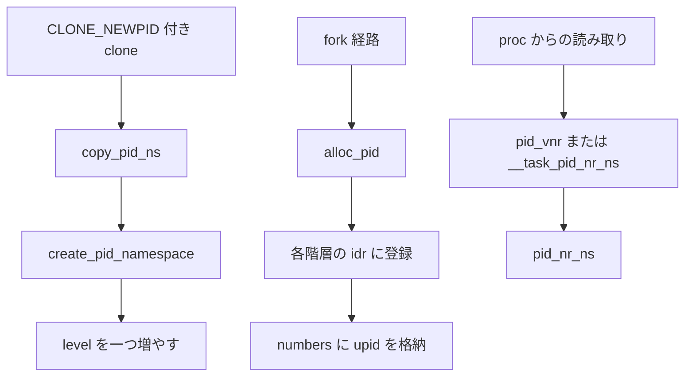

# 第5章 PID namespace の階層と translation

> **本章で読むソース**
>
> - [`include/linux/pid_namespace.h` L26-L50](https://github.com/gregkh/linux/blob/v6.18.38/include/linux/pid_namespace.h#L26-L50)
> - [`include/linux/pid.h` L52-L74](https://github.com/gregkh/linux/blob/v6.18.38/include/linux/pid.h#L52-L74)
> - [`kernel/pid_namespace.c` L76-L127](https://github.com/gregkh/linux/blob/v6.18.38/kernel/pid_namespace.c#L76-L127)
> - [`kernel/pid_namespace.c` L175-L183](https://github.com/gregkh/linux/blob/v6.18.38/kernel/pid_namespace.c#L175-L183)
> - [`kernel/pid.c` L163-L252](https://github.com/gregkh/linux/blob/v6.18.38/kernel/pid.c#L163-L252)
> - [`kernel/pid.c` L490-L524](https://github.com/gregkh/linux/blob/v6.18.38/kernel/pid.c#L490-L524)

## この章の狙い

**PID namespace** の階層構造と、一つの `struct pid` が各階層で異なる番号を持つ仕組みを読む。
`alloc_pid` が ID を割り当て、`pid_nr_ns` 系の関数が namespace ごとの表示番号へ変換する経路を押さえる。

## 前提

- [第3章 clone、unshare、setns の入口](../part00-foundation/03-clone-unshare-setns.md)
- [第1章 隔離と資源制御の全体像](../part00-foundation/01-isolation-overview.md)

## pid_namespace の階層

各 PID namespace は `parent` ポインタで親を指し、`level` がネストの深さを表す。
`MAX_PID_NS_LEVEL` は 32 で、これが `struct pid` の可変長 `numbers` 配列の上限を決める。

[`include/linux/pid_namespace.h` L26-L50](https://github.com/gregkh/linux/blob/v6.18.38/include/linux/pid_namespace.h#L26-L50)

```c
struct pid_namespace {
	struct idr idr;
	struct rcu_head rcu;
	unsigned int pid_allocated;
	struct task_struct *child_reaper;
	struct kmem_cache *pid_cachep;
	unsigned int level;
	int pid_max;
	struct pid_namespace *parent;
#ifdef CONFIG_BSD_PROCESS_ACCT
	struct fs_pin *bacct;
#endif
	struct user_namespace *user_ns;
	struct ucounts *ucounts;
	int reboot;	/* group exit code if this pidns was rebooted */
	struct ns_common ns;
	struct work_struct	work;
#ifdef CONFIG_SYSCTL
	struct ctl_table_set	set;
	struct ctl_table_header *sysctls;
#if defined(CONFIG_MEMFD_CREATE)
	int memfd_noexec_scope;
#endif
#endif
} __randomize_layout;
```

`idr` はその namespace 内の PID 番号から `struct pid` への索引である。
`child_reaper` は namespace 内の孤児プロセスを引き取るタスクであり、通常は PID 1 の init プロセスが担う。

`nsproxy` の `pid_ns_for_children` は子プロセスが入る PID namespace を指す。
実行中タスク自身の PID namespace は `task_active_pid_ns` で `task_pid` から辿る。

## struct pid と upid 配列

カーネル内部では `struct pid` がプロセス集合の識別子であり、各階層の番号は `upid` として保持される。

[`include/linux/pid.h` L52-L74](https://github.com/gregkh/linux/blob/v6.18.38/include/linux/pid.h#L52-L74)

```c
struct upid {
	int nr;
	struct pid_namespace *ns;
};

struct pid {
	refcount_t count;
	unsigned int level;
	spinlock_t lock;
	struct {
		u64 ino;
		struct rb_node pidfs_node;
		struct dentry *stashed;
		struct pidfs_attr *attr;
	};
	/* lists of tasks that use this pid */
	struct hlist_head tasks[PIDTYPE_MAX];
	struct hlist_head inodes;
	/* wait queue for pidfd notifications */
	wait_queue_head_t wait_pidfd;
	struct rcu_head rcu;
	struct upid numbers[];
};
```

`numbers[i]` の `i` は namespace の `level` に対応する。
最もネストした namespace が `numbers[pid->level]`、初期 namespace が `numbers[0]` である。

## create_pid_namespace と copy_pid_ns

新規 PID namespace は `create_pid_namespace` が親から `level` を一つ増やして構築する。
親の `user_ns` が子の user namespace に含まれていること、深さが上限以下であることが検証される。

[`kernel/pid_namespace.c` L76-L127](https://github.com/gregkh/linux/blob/v6.18.38/kernel/pid_namespace.c#L76-L127)

```c
static struct pid_namespace *create_pid_namespace(struct user_namespace *user_ns,
	struct pid_namespace *parent_pid_ns)
{
	struct pid_namespace *ns;
	unsigned int level = parent_pid_ns->level + 1;
	struct ucounts *ucounts;
	int err;

	err = -EINVAL;
	if (!in_userns(parent_pid_ns->user_ns, user_ns))
		goto out;

	err = -ENOSPC;
	if (level > MAX_PID_NS_LEVEL)
		goto out;
	ucounts = inc_pid_namespaces(user_ns);
	if (!ucounts)
		goto out;

	err = -ENOMEM;
	ns = kmem_cache_zalloc(pid_ns_cachep, GFP_KERNEL);
	if (ns == NULL)
		goto out_dec;

	idr_init(&ns->idr);

	ns->pid_cachep = create_pid_cachep(level);
	if (ns->pid_cachep == NULL)
		goto out_free_idr;

	err = ns_common_init(ns);
	if (err)
		goto out_free_idr;

	ns->pid_max = PID_MAX_LIMIT;
	err = register_pidns_sysctls(ns);
	if (err)
		goto out_free_inum;

	ns->level = level;
	ns->parent = get_pid_ns(parent_pid_ns);
	ns->user_ns = get_user_ns(user_ns);
	ns->ucounts = ucounts;
	ns->pid_allocated = PIDNS_ADDING;
	INIT_WORK(&ns->work, destroy_pid_namespace_work);

#if defined(CONFIG_SYSCTL) && defined(CONFIG_MEMFD_CREATE)
	ns->memfd_noexec_scope = pidns_memfd_noexec_scope(parent_pid_ns);
#endif

	ns_tree_add(ns);
	return ns;
```

`copy_pid_ns` は clone 経路の入口である。
`CLONE_NEWPID` がなければ親 namespace を共有し、立っていれば呼び出し元が `old_ns` の最内 PID namespace にいることを要求する。

[`kernel/pid_namespace.c` L175-L183](https://github.com/gregkh/linux/blob/v6.18.38/kernel/pid_namespace.c#L175-L183)

```c
struct pid_namespace *copy_pid_ns(u64 flags,
	struct user_namespace *user_ns, struct pid_namespace *old_ns)
{
	if (!(flags & CLONE_NEWPID))
		return get_pid_ns(old_ns);
	if (task_active_pid_ns(current) != old_ns)
		return ERR_PTR(-EINVAL);
	return create_pid_namespace(user_ns, old_ns);
}
```

`CLONE_NEWPID` はスレッド単位ではなくプロセス境界で効く。
スレッド生成では PID namespace を新設できず、新 namespace への最初のプロセスは fork した子が担う。

PID namespace への `setns` は呼び出し元の active PID namespace を変えず、`pid_ns_for_children` だけを差し替える。
以降 fork した子は `pid_ns_for_children` で指定した namespace に入る。
ただしその namespace に既に init (`child_reaper`) がいる場合、子は PID を割り当てられるだけで PID 1 にはならない。
PID 1 になるのは `CLONE_NEWPID` 等で新設した空の PID namespace に最初の子が生成される場合に限る。

[`kernel/pid_namespace.c` L401-L424](https://github.com/gregkh/linux/blob/v6.18.38/kernel/pid_namespace.c#L401-L424)

```c
static int pidns_install(struct nsset *nsset, struct ns_common *ns)
{
	struct nsproxy *nsproxy = nsset->nsproxy;
	struct pid_namespace *active = task_active_pid_ns(current);
	struct pid_namespace *new = to_pid_ns(ns);

	if (!ns_capable(new->user_ns, CAP_SYS_ADMIN) ||
	    !ns_capable(nsset->cred->user_ns, CAP_SYS_ADMIN))
		return -EPERM;

	/*
	 * Only allow entering the current active pid namespace
	 * or a child of the current active pid namespace.
	 *
	 * This is required for fork to return a usable pid value and
	 * this maintains the property that processes and their
	 * children can not escape their current pid namespace.
	 */
	if (!pidns_is_ancestor(new, active))
		return -EINVAL;

	put_pid_ns(nsproxy->pid_ns_for_children);
	nsproxy->pid_ns_for_children = get_pid_ns(new);
	return 0;
```

## alloc_pid による多階層 ID 割り当て

`fork` 経路の `alloc_pid` は、最内 namespace から親方向へ `idr` に番号を登録し、各階層の `upid` を埋める。

[`kernel/pid.c` L163-L252](https://github.com/gregkh/linux/blob/v6.18.38/kernel/pid.c#L163-L252)

```c
struct pid *alloc_pid(struct pid_namespace *ns, pid_t *set_tid,
		      size_t set_tid_size)
{
	struct pid *pid;
	enum pid_type type;
	int i, nr;
	struct pid_namespace *tmp;
	struct upid *upid;
	int retval = -ENOMEM;

	/*
	 * set_tid_size contains the size of the set_tid array. Starting at
	 * the most nested currently active PID namespace it tells alloc_pid()
	 * which PID to set for a process in that most nested PID namespace
	 * up to set_tid_size PID namespaces. It does not have to set the PID
	 * for a process in all nested PID namespaces but set_tid_size must
	 * never be greater than the current ns->level + 1.
	 */
	if (set_tid_size > ns->level + 1)
		return ERR_PTR(-EINVAL);

	pid = kmem_cache_alloc(ns->pid_cachep, GFP_KERNEL);
	if (!pid)
		return ERR_PTR(retval);

	tmp = ns;
	pid->level = ns->level;

	for (i = ns->level; i >= 0; i--) {
		int tid = 0;
		int pid_max = READ_ONCE(tmp->pid_max);

		if (set_tid_size) {
			tid = set_tid[ns->level - i];

			retval = -EINVAL;
			if (tid < 1 || tid >= pid_max)
				goto out_free;
			/*
			 * Also fail if a PID != 1 is requested and
			 * no PID 1 exists.
			 */
			if (tid != 1 && !tmp->child_reaper)
				goto out_free;
			retval = -EPERM;
			if (!checkpoint_restore_ns_capable(tmp->user_ns))
				goto out_free;
			set_tid_size--;
		}

		idr_preload(GFP_KERNEL);
		spin_lock(&pidmap_lock);

		if (tid) {
			nr = idr_alloc(&tmp->idr, NULL, tid,
				       tid + 1, GFP_ATOMIC);
			/*
			 * If ENOSPC is returned it means that the PID is
			 * alreay in use. Return EEXIST in that case.
			 */
			if (nr == -ENOSPC)
				nr = -EEXIST;
		} else {
			int pid_min = 1;
			/*
			 * init really needs pid 1, but after reaching the
			 * maximum wrap back to RESERVED_PIDS
			 */
			if (idr_get_cursor(&tmp->idr) > RESERVED_PIDS)
				pid_min = RESERVED_PIDS;

			/*
			 * Store a null pointer so find_pid_ns does not find
			 * a partially initialized PID (see below).
			 */
			nr = idr_alloc_cyclic(&tmp->idr, NULL, pid_min,
					      pid_max, GFP_ATOMIC);
		}
		spin_unlock(&pidmap_lock);
		idr_preload_end();

		if (nr < 0) {
			retval = (nr == -ENOSPC) ? -EAGAIN : nr;
			goto out_free;
		}

		pid->numbers[i].nr = nr;
		pid->numbers[i].ns = tmp;
		tmp = tmp->parent;
	}
```

ループは `i = ns->level` から 0 へ降り、`tmp = tmp->parent` で親 namespace へ進む。
`idr_alloc_cyclic` は通常の PID 割り当て、`set_tid` 指定時は checkpoint restore 向けの固定番号割り当てである。

割り当て前に `idr` へ `NULL` を入れるのは、初期化途中の `struct pid` が `find_pid_ns` に見つからないようにするためである。

## translation 関数

ユーザー空間が見る PID は、観測者の PID namespace に依存する。
`pid_nr_ns` は `struct pid` と対象 namespace からその階層の番号を返す。

[`kernel/pid.c` L490-L524](https://github.com/gregkh/linux/blob/v6.18.38/kernel/pid.c#L490-L524)

```c
pid_t pid_nr_ns(struct pid *pid, struct pid_namespace *ns)
{
	struct upid *upid;
	pid_t nr = 0;

	if (pid && ns && ns->level <= pid->level) {
		upid = &pid->numbers[ns->level];
		if (upid->ns == ns)
			nr = upid->nr;
	}
	return nr;
}
EXPORT_SYMBOL_GPL(pid_nr_ns);

pid_t pid_vnr(struct pid *pid)
{
	return pid_nr_ns(pid, task_active_pid_ns(current));
}
EXPORT_SYMBOL_GPL(pid_vnr);

pid_t __task_pid_nr_ns(struct task_struct *task, enum pid_type type,
			struct pid_namespace *ns)
{
	pid_t nr = 0;

	rcu_read_lock();
	if (!ns)
		ns = task_active_pid_ns(current);
	if (ns)
		nr = pid_nr_ns(rcu_dereference(*task_pid_ptr(task, type)), ns);
	rcu_read_unlock();

	return nr;
}
EXPORT_SYMBOL(__task_pid_nr_ns);
```

`upid->ns == ns` の照合は、同じ `level` でも異なる namespace インスタンスを区別するために必要である。
`/proc` の PID 表示や `kill` のターゲット解決は、この translation を経由する。

## 処理フロー



## 高速化と最適化の工夫

`create_pid_cachep` は階層ごとにサイズの異なる `struct pid` 用スラブを遅延作成する。
`struct_size_t(struct pid, numbers, level + 1)` で必要な `upid` 数に合わせたオブジェクトサイズを確保し、浅い namespace ではメモリを節約する。

`alloc_pid` の `idr_preload` と `idr_alloc_cyclic` の組合せは、PID 割り当て時の `idr` ロック保持時間を短縮する。
`READ_ONCE(tmp->pid_max)` は sysctl による `pid_max` 変更と並行して読むためのものである。

`copy_pid_ns` の fast path は `CLONE_NEWPID` なしで `get_pid_ns` だけを呼ぶ経路であり、通常 fork が PID namespace 作成コストを払わない。

## まとめ

PID namespace は `parent` と `level` で階層化され、各階層が独立した `idr` を持つ。
`struct pid` の `numbers` 配列が階層ごとの番号を保持し、`pid_nr_ns` が観測 namespace への translation を担う。
次章では user namespace と uid map が権限モデルにどう作用するかを読む。

## 関連する章

- [第6章 user namespace と uid map](06-user-namespace.md)
- [第4章 mount namespace と propagation](04-mount-namespace.md)
