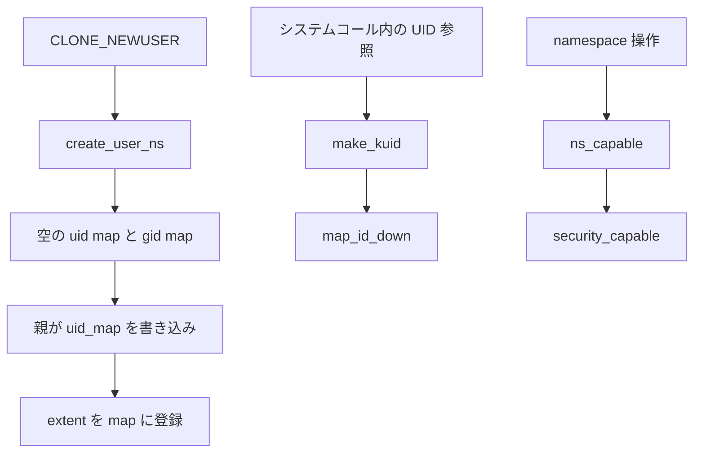

# 第6章 user namespace と uid map

> **本章で読むソース**
>
> - [`include/linux/user_namespace.h` L25-L36](https://github.com/gregkh/linux/blob/v6.18.38/include/linux/user_namespace.h#L25-L36)
> - [`include/linux/user_namespace.h` L76-L117](https://github.com/gregkh/linux/blob/v6.18.38/include/linux/user_namespace.h#L76-L117)
> - [`kernel/user_namespace.c` L83-L163](https://github.com/gregkh/linux/blob/v6.18.38/kernel/user_namespace.c#L83-L163)
> - [`kernel/user_namespace.c` L318-L341](https://github.com/gregkh/linux/blob/v6.18.38/kernel/user_namespace.c#L318-L341)
> - [`kernel/user_namespace.c` L422-L426](https://github.com/gregkh/linux/blob/v6.18.38/kernel/user_namespace.c#L422-L426)
> - [`kernel/user_namespace.c` L933-L988](https://github.com/gregkh/linux/blob/v6.18.38/kernel/user_namespace.c#L933-L988)
> - [`kernel/user_namespace.c` L1173-L1213](https://github.com/gregkh/linux/blob/v6.18.38/kernel/user_namespace.c#L1173-L1213)
> - [`kernel/user_namespace.c` L1265-L1307](https://github.com/gregkh/linux/blob/v6.18.38/kernel/user_namespace.c#L1265-L1307)
> - [`kernel/capability.c` L331-L364](https://github.com/gregkh/linux/blob/v6.18.38/kernel/capability.c#L331-L364)

## この章の狙い

**user namespace** が UID と GID の見え方と capability 検査の文脈をどう分離するかを読む。
`uid map` と `gid map` の書き込み経路、`make_kuid` によるカーネル内部 ID への変換、`ns_capable` による権限判定を押さえる。

## 前提

- [第3章 clone、unshare、setns の入口](../part00-foundation/03-clone-unshare-setns.md)
- [第2章 nsproxy と namespace のライフサイクル](../part00-foundation/02-nsproxy-lifecycle.md)

## uid_gid_map と user_namespace

ID マッピングは `uid_gid_map` に格納される。
コメントが示すとおり、多くのアーキテクチャで 1 キャッシュラインに収まるサイズに設計されている。

[`include/linux/user_namespace.h` L25-L36](https://github.com/gregkh/linux/blob/v6.18.38/include/linux/user_namespace.h#L25-L36)

```c
struct uid_gid_map { /* 64 bytes -- 1 cache line */
	union {
		struct {
			struct uid_gid_extent extent[UID_GID_MAP_MAX_BASE_EXTENTS];
			u32 nr_extents;
		};
		struct {
			struct uid_gid_extent *forward;
			struct uid_gid_extent *reverse;
		};
	};
};
```

extent 数が `UID_GID_MAP_MAX_BASE_EXTENTS` 以下なら静的配列、それを超えるとヒープ上の forward と reverse 配列に切り替わる。

user namespace 本体は三つの map と親へのポインタを持つ。

[`include/linux/user_namespace.h` L76-L117](https://github.com/gregkh/linux/blob/v6.18.38/include/linux/user_namespace.h#L76-L117)

```c
struct user_namespace {
	struct uid_gid_map	uid_map;
	struct uid_gid_map	gid_map;
	struct uid_gid_map	projid_map;
	struct user_namespace	*parent;
	int			level;
	kuid_t			owner;
	kgid_t			group;
	struct ns_common	ns;
	unsigned long		flags;
	/* parent_could_setfcap: true if the creator if this ns had CAP_SETFCAP
	 * in its effective capability set at the child ns creation time. */
	bool			parent_could_setfcap;

#ifdef CONFIG_KEYS
	/* List of joinable keyrings in this namespace.  Modification access of
	 * these pointers is controlled by keyring_sem.  Once
	 * user_keyring_register is set, it won't be changed, so it can be
	 * accessed directly with READ_ONCE().
	 */
	struct list_head	keyring_name_list;
	struct key		*user_keyring_register;
	struct rw_semaphore	keyring_sem;
#endif

	/* Register of per-UID persistent keyrings for this namespace */
#ifdef CONFIG_PERSISTENT_KEYRINGS
	struct key		*persistent_keyring_register;
#endif
	struct work_struct	work;
#ifdef CONFIG_SYSCTL
	struct ctl_table_set	set;
	struct ctl_table_header *sysctls;
#endif
	struct ucounts		*ucounts;
	long ucount_max[UCOUNT_COUNTS];
	long rlimit_max[UCOUNT_RLIMIT_COUNTS];

#if IS_ENABLED(CONFIG_BINFMT_MISC)
	struct binfmt_misc *binfmt_misc;
#endif
} __randomize_layout;
```

`owner` と `group` は namespace 作成者の ID であり、親 namespace 上での実 ID である。
他の namespace 作成と同様、`CAP_SYS_ADMIN` 検査はこの user namespace 文脈で行われる。

## create_user_ns による新規 namespace

`unshare` や `clone` の `CLONE_NEWUSER` は `create_user_ns` を経由する。
作成者が親 namespace でマッピングを持つこと、chroot 状態でないことが検証される。

[`kernel/user_namespace.c` L83-L163](https://github.com/gregkh/linux/blob/v6.18.38/kernel/user_namespace.c#L83-L163)

```c
int create_user_ns(struct cred *new)
{
	struct user_namespace *ns, *parent_ns = new->user_ns;
	kuid_t owner = new->euid;
	kgid_t group = new->egid;
	struct ucounts *ucounts;
	int ret, i;

	ret = -ENOSPC;
	if (parent_ns->level > 32)
		goto fail;

	ucounts = inc_user_namespaces(parent_ns, owner);
	if (!ucounts)
		goto fail;

	/*
	 * Verify that we can not violate the policy of which files
	 * may be accessed that is specified by the root directory,
	 * by verifying that the root directory is at the root of the
	 * mount namespace which allows all files to be accessed.
	 */
	ret = -EPERM;
	if (current_chrooted())
		goto fail_dec;

	/* The creator needs a mapping in the parent user namespace
	 * or else we won't be able to reasonably tell userspace who
	 * created a user_namespace.
	 */
	ret = -EPERM;
	if (!kuid_has_mapping(parent_ns, owner) ||
	    !kgid_has_mapping(parent_ns, group))
		goto fail_dec;

	ret = security_create_user_ns(new);
	if (ret < 0)
		goto fail_dec;

	ret = -ENOMEM;
	ns = kmem_cache_zalloc(user_ns_cachep, GFP_KERNEL);
	if (!ns)
		goto fail_dec;

	ns->parent_could_setfcap = cap_raised(new->cap_effective, CAP_SETFCAP);

	ret = ns_common_init(ns);
	if (ret)
		goto fail_free;

	/* Leave the new->user_ns reference with the new user namespace. */
	ns->parent = parent_ns;
	ns->level = parent_ns->level + 1;
	ns->owner = owner;
	ns->group = group;
	INIT_WORK(&ns->work, free_user_ns);
	for (i = 0; i < UCOUNT_COUNTS; i++) {
		ns->ucount_max[i] = INT_MAX;
	}
	set_userns_rlimit_max(ns, UCOUNT_RLIMIT_NPROC, enforced_nproc_rlimit());
	set_userns_rlimit_max(ns, UCOUNT_RLIMIT_MSGQUEUE, rlimit(RLIMIT_MSGQUEUE));
	set_userns_rlimit_max(ns, UCOUNT_RLIMIT_SIGPENDING, rlimit(RLIMIT_SIGPENDING));
	set_userns_rlimit_max(ns, UCOUNT_RLIMIT_MEMLOCK, rlimit(RLIMIT_MEMLOCK));
	ns->ucounts = ucounts;

	/* Inherit USERNS_SETGROUPS_ALLOWED from our parent */
	mutex_lock(&userns_state_mutex);
	ns->flags = parent_ns->flags;
	mutex_unlock(&userns_state_mutex);

#ifdef CONFIG_KEYS
	INIT_LIST_HEAD(&ns->keyring_name_list);
	init_rwsem(&ns->keyring_sem);
#endif
	ret = -ENOMEM;
	if (!setup_userns_sysctls(ns))
		goto fail_keyring;

	set_cred_user_ns(new, ns);
	ns_tree_add(ns);
	return 0;
```

作成直後は map が空であり、親プロセスが `/proc/<pid>/uid_map` と `gid_map` に extent を書き込むまで、子 namespace 内の UID は親へ変換できない。

第3章で述べたとおり、`CLONE_NEWUSER` の unshare はスレッドグループと `fs_struct` の同時 unshare を強制する。

## ID 変換の経路

ユーザー空間の UID は namespace ごとに異なる整数として扱われ、カーネル内部では `kuid_t` に正規化される。
`map_id_down` が extent 配列を引き、namespace 内 ID から親方向の ID へ写す。

[`kernel/user_namespace.c` L318-L341](https://github.com/gregkh/linux/blob/v6.18.38/kernel/user_namespace.c#L318-L341)

```c
static u32 map_id_range_down(struct uid_gid_map *map, u32 id, u32 count)
{
	struct uid_gid_extent *extent;
	unsigned extents = map->nr_extents;
	smp_rmb();

	if (extents <= UID_GID_MAP_MAX_BASE_EXTENTS)
		extent = map_id_range_down_base(extents, map, id, count);
	else
		extent = map_id_range_down_max(extents, map, id, count);

	/* Map the id or note failure */
	if (extent)
		id = (id - extent->first) + extent->lower_first;
	else
		id = (u32) -1;

	return id;
}

u32 map_id_down(struct uid_gid_map *map, u32 id)
{
	return map_id_range_down(map, id, 1);
}
```

`make_kuid` はこの変換を `kuid_t` ラッパーとして公開する。

[`kernel/user_namespace.c` L422-L426](https://github.com/gregkh/linux/blob/v6.18.38/kernel/user_namespace.c#L422-L426)

```c
kuid_t make_kuid(struct user_namespace *ns, uid_t uid)
{
	/* Map the uid to a global kernel uid */
	return KUIDT_INIT(map_id_down(&ns->uid_map, uid));
}
```

マッピングが存在しない ID は `INVALID_UID` となり、ファイルの所有者チェックや capability 判定で拒否される。
逆方向の `from_kuid` は `map_id_up` で観測者 namespace への表示 ID を得る。

## uid map の書き込み

`/proc/<pid>/uid_map` への書き込みは `map_write` が処理する。
各行は `inside_uid outside_uid length` 形式の extent であり、書き込みは一度きりである。

[`kernel/user_namespace.c` L933-L988](https://github.com/gregkh/linux/blob/v6.18.38/kernel/user_namespace.c#L933-L988)

```c
static ssize_t map_write(struct file *file, const char __user *buf,
			 size_t count, loff_t *ppos,
			 int cap_setid,
			 struct uid_gid_map *map,
			 struct uid_gid_map *parent_map)
{
	struct seq_file *seq = file->private_data;
	struct user_namespace *map_ns = seq->private;
	struct uid_gid_map new_map;
	unsigned idx;
	struct uid_gid_extent extent;
	char *kbuf, *pos, *next_line;
	ssize_t ret;

	/* Only allow < page size writes at the beginning of the file */
	if ((*ppos != 0) || (count >= PAGE_SIZE))
		return -EINVAL;

	/* Slurp in the user data */
	kbuf = memdup_user_nul(buf, count);
	if (IS_ERR(kbuf))
		return PTR_ERR(kbuf);

	/*
	 * The userns_state_mutex serializes all writes to any given map.
	 *
	 * Any map is only ever written once.
	 *
	 * An id map fits within 1 cache line on most architectures.
	 *
	 * On read nothing needs to be done unless you are on an
	 * architecture with a crazy cache coherency model like alpha.
	 *
	 * There is a one time data dependency between reading the
	 * count of the extents and the values of the extents.  The
	 * desired behavior is to see the values of the extents that
	 * were written before the count of the extents.
	 *
	 * To achieve this smp_wmb() is used on guarantee the write
	 * order and smp_rmb() is guaranteed that we don't have crazy
	 * architectures returning stale data.
	 */
	mutex_lock(&userns_state_mutex);

	memset(&new_map, 0, sizeof(struct uid_gid_map));

	ret = -EPERM;
	/* Only allow one successful write to the map */
	if (map->nr_extents != 0)
		goto out;

	/*
	 * Adjusting namespace settings requires capabilities on the target.
	 */
	if (cap_valid(cap_setid) && !file_ns_capable(file, map_ns, CAP_SYS_ADMIN))
		goto out;
```

extent のパース後、`new_idmap_permitted` が書き込み権限を判定する。
親 user namespace への `CAP_SETUID` または `CAP_SETGID`、単一 ID の非特権 self mapping、`cap_setid` 不要の無特権 mapping を順に検査する。
UID 0 を親から写す mapping には `verify_root_map` が追加条件として `CAP_SETFCAP` を要求する。

[`kernel/user_namespace.c` L1173-L1213](https://github.com/gregkh/linux/blob/v6.18.38/kernel/user_namespace.c#L1173-L1213)

```c
static bool new_idmap_permitted(const struct file *file,
				struct user_namespace *ns, int cap_setid,
				struct uid_gid_map *new_map)
{
	const struct cred *cred = file->f_cred;

	if (cap_setid == CAP_SETUID && !verify_root_map(file, ns, new_map))
		return false;

	/* Don't allow mappings that would allow anything that wouldn't
	 * be allowed without the establishment of unprivileged mappings.
	 */
	if ((new_map->nr_extents == 1) && (new_map->extent[0].count == 1) &&
	    uid_eq(ns->owner, cred->euid)) {
		u32 id = new_map->extent[0].lower_first;
		if (cap_setid == CAP_SETUID) {
			kuid_t uid = make_kuid(ns->parent, id);
			if (uid_eq(uid, cred->euid))
				return true;
		} else if (cap_setid == CAP_SETGID) {
			kgid_t gid = make_kgid(ns->parent, id);
			if (!(ns->flags & USERNS_SETGROUPS_ALLOWED) &&
			    gid_eq(gid, cred->egid))
				return true;
		}
	}

	/* Allow anyone to set a mapping that doesn't require privilege */
	if (!cap_valid(cap_setid))
		return true;

	/* Allow the specified ids if we have the appropriate capability
	 * (CAP_SETUID or CAP_SETGID) over the parent user namespace.
	 * And the opener of the id file also has the appropriate capability.
	 */
	if (ns_capable(ns->parent, cap_setid) &&
	    file_ns_capable(file, ns->parent, cap_setid))
		return true;

	return false;
}
```

`map_write` 入口では `CAP_SYS_ADMIN` を要求するが、これは map ファイルを開いた時点の cred に対する検査である。
実際に許可される extent は `new_idmap_permitted` が親方向の capability と mapping 内容で絞り込む。

## gid map と setgroups

gid map とは別に `/proc/<pid>/setgroups` が supplementary group の可否を制御する。
新規 user namespace は `USERNS_SETGROUPS_ALLOWED` が立っており、初期値は `allow` として読める。

gid map を一度書き込むと `deny` への切り替えはできなくなる。
逆に `deny` を書いたあと `allow` へ戻すことはできない。
非特権プロセスが `setgroups(2)` を使うには `userns_may_setgroups` が gid map の存在と `USERNS_SETGROUPS_ALLOWED` の両方を要求する。

[`kernel/user_namespace.c` L1265-L1307](https://github.com/gregkh/linux/blob/v6.18.38/kernel/user_namespace.c#L1265-L1307)

```c
	ret = -EPERM;
	mutex_lock(&userns_state_mutex);
	if (setgroups_allowed) {
		/* Enabling setgroups after setgroups has been disabled
		 * is not allowed.
		 */
		if (!(ns->flags & USERNS_SETGROUPS_ALLOWED))
			goto out_unlock;
	} else {
		/* Permanently disabling setgroups after setgroups has
		 * been enabled by writing the gid_map is not allowed.
		 */
		if (ns->gid_map.nr_extents != 0)
			goto out_unlock;
		ns->flags &= ~USERNS_SETGROUPS_ALLOWED;
	}
	mutex_unlock(&userns_state_mutex);

	/* Report a successful write */
	*ppos = count;
	ret = count;
out:
	return ret;
out_unlock:
	mutex_unlock(&userns_state_mutex);
	goto out;
}

bool userns_may_setgroups(const struct user_namespace *ns)
{
	bool allowed;

	mutex_lock(&userns_state_mutex);
	/* It is not safe to use setgroups until a gid mapping in
	 * the user namespace has been established.
	 */
	allowed = ns->gid_map.nr_extents != 0;
	/* Is setgroups allowed? */
	allowed = allowed && (ns->flags & USERNS_SETGROUPS_ALLOWED);
	mutex_unlock(&userns_state_mutex);

	return allowed;
}
```

## ns_capable による権限検査

namespace をまたぐ操作では、従来の `capable` ではなく対象 user namespace を明示した `ns_capable` が使われる。

[`kernel/capability.c` L331-L364](https://github.com/gregkh/linux/blob/v6.18.38/kernel/capability.c#L331-L364)

```c
static bool ns_capable_common(struct user_namespace *ns,
			      int cap,
			      unsigned int opts)
{
	int capable;

	if (unlikely(!cap_valid(cap))) {
		pr_crit("capable() called with invalid cap=%u\n", cap);
		BUG();
	}

	capable = security_capable(current_cred(), ns, cap, opts);
	if (capable == 0) {
		current->flags |= PF_SUPERPRIV;
		return true;
	}
	return false;
}

/**
 * ns_capable - Determine if the current task has a superior capability in effect
 * @ns:  The usernamespace we want the capability in
 * @cap: The capability to be tested for
 *
 * Return true if the current task has the given superior capability currently
 * available for use, false if not.
 *
 * This sets PF_SUPERPRIV on the task if the capability is available on the
 * assumption that it's about to be used.
 */
bool ns_capable(struct user_namespace *ns, int cap)
{
	return ns_capable_common(ns, cap, CAP_OPT_NONE);
}
```

`security_capable` は cred の capability セットを、指定 namespace から親方向へ辿って評価する。
子 namespace 内で root 相当の UID を持てば `CAP_SYS_ADMIN` を得られ、他 namespace の `copy_*` に必要な権限を満たせる。

## 処理フロー



## 高速化と最適化の工夫

`uid_gid_map` の 64 バイト設計は、典型的な extent 数が少ないときに map 全体を 1 キャッシュラインで読めるようにするためである。
`map_id_down` 冒頭の `smp_rmb` は、`nr_extents` の更新と extent 配列の書き込み順序を読み手に保証する。

extent 数が `UID_GID_MAP_MAX_BASE_EXTENTS` を超えた場合だけ、ソート済みヒープ配列と二分探索に切り替わる。
コンテナで一般的な単一 extent マッピングは静的配列の線形走査で処理され、map 読み取りのコストを抑える。

`map_write` のコメントが述べるとおり、map は一度だけ書き込まれ、以降の読み取りはロックフリーで行える。
書き込み側の `smp_wmb` と読み取り側の `smp_rmb` が、この片方向の公開を成立させる。

## まとめ

user namespace は `uid map` と `gid map` で ID の見え方を分離し、`ns_capable` が操作対象 namespace 文脈での権限を判定する。
`make_kuid` がユーザー空間 ID をカーネル内部表現へ写し、他の namespace 作成時の権限検査の土台になる。
次章では UTS namespace がホスト名とドメイン名をどう隔離するかを読む。

## 関連する章

- [第7章 UTS namespace](07-uts-namespace.md)
- [第4章 mount namespace と propagation](04-mount-namespace.md)
- [第5章 PID namespace の階層と translation](05-pid-namespace.md)
