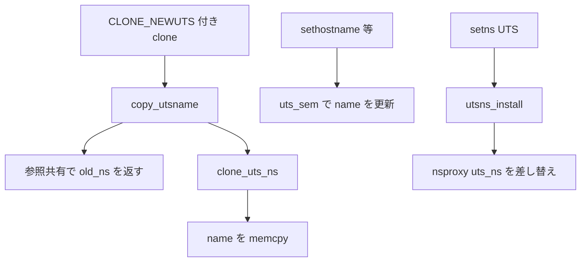

# 第7章 UTS namespace

> **本章で読むソース**
>
> - [`include/linux/uts_namespace.h` L11-L16](https://github.com/gregkh/linux/blob/v6.18.38/include/linux/uts_namespace.h#L11-L16)
> - [`include/uapi/linux/utsname.h` L25-L32](https://github.com/gregkh/linux/blob/v6.18.38/include/uapi/linux/utsname.h#L25-L32)
> - [`kernel/utsname.c` L36-L63](https://github.com/gregkh/linux/blob/v6.18.38/kernel/utsname.c#L36-L63)
> - [`kernel/utsname.c` L79-L94](https://github.com/gregkh/linux/blob/v6.18.38/kernel/utsname.c#L79-L94)
> - [`kernel/utsname.c` L127-L140](https://github.com/gregkh/linux/blob/v6.18.38/kernel/utsname.c#L127-L140)
> - [`kernel/utsname.c` L155-L163](https://github.com/gregkh/linux/blob/v6.18.38/kernel/utsname.c#L155-L163)

## この章の狙い

**UTS namespace** がホスト名とカーネル名情報をタスクごとにどう隔離するかを読む。
`struct new_utsname` の複製経路、`sethostname` などの変更が他 namespace に波及しない理由を `copy_utsname` から追う。

## 前提

- [第3章 clone、unshare、setns の入口](../part00-foundation/03-clone-unshare-setns.md)
- [第6章 user namespace と uid map](06-user-namespace.md)

## uts_namespace と new_utsname

UTS namespace は `uts_namespace` として表され、中核は `new_utsname` 構造体である。

[`include/linux/uts_namespace.h` L11-L16](https://github.com/gregkh/linux/blob/v6.18.38/include/linux/uts_namespace.h#L11-L16)

```c
struct uts_namespace {
	struct new_utsname name;
	struct user_namespace *user_ns;
	struct ucounts *ucounts;
	struct ns_common ns;
} __randomize_layout;
```

`new_utsname` はユーザー空間の `uname` システムコールが返す五つの文字列フィールドを保持する。

[`include/uapi/linux/utsname.h` L25-L32](https://github.com/gregkh/linux/blob/v6.18.38/include/uapi/linux/utsname.h#L25-L32)

```c
struct new_utsname {
	char sysname[__NEW_UTS_LEN + 1];
	char nodename[__NEW_UTS_LEN + 1];
	char release[__NEW_UTS_LEN + 1];
	char version[__NEW_UTS_LEN + 1];
	char machine[__NEW_UTS_LEN + 1];
	char domainname[__NEW_UTS_LEN + 1];
};
```

`nodename` がコンテナのホスト名として使われ、`domainname` は NIS ドメイン名の慣習的フィールドである。
`sysname` や `release` は通常初期 namespace の値を共有コピーするが、namespace ごとに独立した文字列領域を持つ。

## clone_uts_ns による複製

新規 UTS namespace は `clone_uts_ns` が親の `name` を `memcpy` で写す。
`uts_sem` の読み取りロック下でコピーするため、ホスト名変更と競合しない。

[`kernel/utsname.c` L36-L63](https://github.com/gregkh/linux/blob/v6.18.38/kernel/utsname.c#L36-L63)

```c
static struct uts_namespace *clone_uts_ns(struct user_namespace *user_ns,
					  struct uts_namespace *old_ns)
{
	struct uts_namespace *ns;
	struct ucounts *ucounts;
	int err;

	err = -ENOSPC;
	ucounts = inc_uts_namespaces(user_ns);
	if (!ucounts)
		goto fail;

	err = -ENOMEM;
	ns = kmem_cache_zalloc(uts_ns_cache, GFP_KERNEL);
	if (!ns)
		goto fail_dec;

	err = ns_common_init(ns);
	if (err)
		goto fail_free;

	ns->ucounts = ucounts;
	down_read(&uts_sem);
	memcpy(&ns->name, &old_ns->name, sizeof(ns->name));
	ns->user_ns = get_user_ns(user_ns);
	up_read(&uts_sem);
	ns_tree_add(ns);
	return ns;
```

## copy_utsname の fast path

`create_new_namespaces` は `copy_utsname` を呼ぶ。
`CLONE_NEWUTS` がなければ参照カウントを増やした親 namespace をそのまま返す。

[`kernel/utsname.c` L79-L94](https://github.com/gregkh/linux/blob/v6.18.38/kernel/utsname.c#L79-L94)

```c
struct uts_namespace *copy_utsname(u64 flags,
	struct user_namespace *user_ns, struct uts_namespace *old_ns)
{
	struct uts_namespace *new_ns;

	BUG_ON(!old_ns);
	get_uts_ns(old_ns);

	if (!(flags & CLONE_NEWUTS))
		return old_ns;

	new_ns = clone_uts_ns(user_ns, old_ns);

	put_uts_ns(old_ns);
	return new_ns;
}
```

`get_uts_ns` と `put_uts_ns` の挟み込みは、clone 失敗時に参照が漏れないための慣習である。
新 namespace 作成時だけ `clone_uts_ns` が実体を割り当てる。

## setns による参加

`setns` は `utsns_install` で `nsproxy->uts_ns` を差し替える。
新旧双方の user namespace で `CAP_SYS_ADMIN` が必要である。

[`kernel/utsname.c` L127-L140](https://github.com/gregkh/linux/blob/v6.18.38/kernel/utsname.c#L127-L140)

```c
static int utsns_install(struct nsset *nsset, struct ns_common *new)
{
	struct nsproxy *nsproxy = nsset->nsproxy;
	struct uts_namespace *ns = to_uts_ns(new);

	if (!ns_capable(ns->user_ns, CAP_SYS_ADMIN) ||
	    !ns_capable(nsset->cred->user_ns, CAP_SYS_ADMIN))
		return -EPERM;

	get_uts_ns(ns);
	put_uts_ns(nsproxy->uts_ns);
	nsproxy->uts_ns = ns;
	return 0;
}
```

## sethostname と setdomainname

ホスト名とドメイン名の変更は、対象 UTS namespace の user namespace に対する `CAP_SYS_ADMIN`、長さ検査、`uts_sem` の write lock を経て `uts_ns->name` を更新する。

[`kernel/sys.c` L1419-L1443](https://github.com/gregkh/linux/blob/v6.18.38/kernel/sys.c#L1419-L1443)

```c
SYSCALL_DEFINE2(sethostname, char __user *, name, int, len)
{
	int errno;
	char tmp[__NEW_UTS_LEN];

	if (!ns_capable(current->nsproxy->uts_ns->user_ns, CAP_SYS_ADMIN))
		return -EPERM;

	if (len < 0 || len > __NEW_UTS_LEN)
		return -EINVAL;
	errno = -EFAULT;
	if (!copy_from_user(tmp, name, len)) {
		struct new_utsname *u;

		add_device_randomness(tmp, len);
		down_write(&uts_sem);
		u = utsname();
		memcpy(u->nodename, tmp, len);
		memset(u->nodename + len, 0, sizeof(u->nodename) - len);
		errno = 0;
		uts_proc_notify(UTS_PROC_HOSTNAME);
		up_write(&uts_sem);
	}
	return errno;
}
```

[`kernel/sys.c` L1473-L1497](https://github.com/gregkh/linux/blob/v6.18.38/kernel/sys.c#L1473-L1497)

```c
SYSCALL_DEFINE2(setdomainname, char __user *, name, int, len)
{
	int errno;
	char tmp[__NEW_UTS_LEN];

	if (!ns_capable(current->nsproxy->uts_ns->user_ns, CAP_SYS_ADMIN))
		return -EPERM;
	if (len < 0 || len > __NEW_UTS_LEN)
		return -EINVAL;

	errno = -EFAULT;
	if (!copy_from_user(tmp, name, len)) {
		struct new_utsname *u;

		add_device_randomness(tmp, len);
		down_write(&uts_sem);
		u = utsname();
		memcpy(u->domainname, tmp, len);
		memset(u->domainname + len, 0, sizeof(u->domainname) - len);
		errno = 0;
		uts_proc_notify(UTS_PROC_DOMAINNAME);
		up_write(&uts_sem);
	}
	return errno;
}
```

## 処理フロー



ホスト名変更は `uts_sem` で保護された `init_uts_ns` または自 namespace の `name` に書き込まれる。
UTS namespace 内の変更は他 namespace の `name` には届かない。

## 高速化と最適化の工夫

`uts_ns_init` は `kmem_cache_create_usercopy` で `name` フィールドだけをユーザーコピー対象に指定する。
`sethostname` や `uname` がユーザー空間と共有する文字列領域をスラブに閉じ込め、KASAN のユーザーコピー検査コストを namespace 全体に広げない。

[`kernel/utsname.c` L155-L163](https://github.com/gregkh/linux/blob/v6.18.38/kernel/utsname.c#L155-L163)

```c
void __init uts_ns_init(void)
{
	uts_ns_cache = kmem_cache_create_usercopy(
			"uts_namespace", sizeof(struct uts_namespace), 0,
			SLAB_PANIC|SLAB_ACCOUNT,
			offsetof(struct uts_namespace, name),
			sizeof_field(struct uts_namespace, name),
			NULL);
	ns_tree_add(&init_uts_ns);
```

`copy_utsname` の fast path はフラグなし fork が UTS namespace 割り当てをスキップするための最適化である。
`clone_uts_ns` の `uts_sem` 読み取りロックは、ホスト名更新の書き込みロックと競合せず並行して複製できる。

## まとめ

UTS namespace は `new_utsname` の独立コピーでホスト名とカーネル名文字列を隔離する。
`copy_utsname` が clone 経路の入口であり、`utsns_install` が `setns` 経路を担う。
次章では IPC namespace が SysV IPC と POSIX メッセージキューをどう分離するかを読む。

## 関連する章

- [第8章 IPC namespace](08-ipc-namespace.md)
- [第2章 nsproxy と namespace のライフサイクル](../part00-foundation/02-nsproxy-lifecycle.md)
