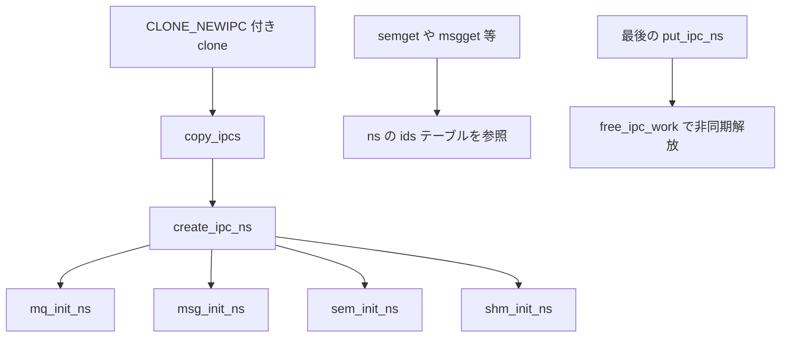

# 第8章 IPC namespace

> **本章で読むソース**
>
> - [`include/linux/ipc_namespace.h` L31-L81](https://github.com/gregkh/linux/blob/v6.18.38/include/linux/ipc_namespace.h#L31-L81)
> - [`ipc/namespace.c` L39-L91](https://github.com/gregkh/linux/blob/v6.18.38/ipc/namespace.c#L39-L91)
> - [`ipc/namespace.c` L109-L115](https://github.com/gregkh/linux/blob/v6.18.38/ipc/namespace.c#L109-L115)
> - [`ipc/sem.c` L249-L257](https://github.com/gregkh/linux/blob/v6.18.38/ipc/sem.c#L249-L257)
> - [`ipc/msg.c` L1306-L1321](https://github.com/gregkh/linux/blob/v6.18.38/ipc/msg.c#L1306-L1321)
> - [`ipc/shm.c` L110-L118](https://github.com/gregkh/linux/blob/v6.18.38/ipc/shm.c#L110-L118)

## この章の狙い

**IPC namespace** が SysV セマフォ、メッセージキュー、共有メモリ、POSIX メッセージキューをどう一つの `ipc_namespace` に束ねるかを読む。
`create_ipc_ns` の初期化順序と、各 IPC 種別の `*_init_ns` が ID テーブルをどう分離するかを押さえる。

## 前提

- [第3章 clone、unshare、setns の入口](../part00-foundation/03-clone-unshare-setns.md)
- [第7章 UTS namespace](07-uts-namespace.md)

## ipc_namespace の構造

IPC namespace は三種類の `ipc_ids` テーブルと POSIX メッセージキュー用の mount を保持する。

[`include/linux/ipc_namespace.h` L31-L81](https://github.com/gregkh/linux/blob/v6.18.38/include/linux/ipc_namespace.h#L31-L81)

```c
struct ipc_namespace {
	struct ipc_ids	ids[3];

	int		sem_ctls[4];
	int		used_sems;

	unsigned int	msg_ctlmax;
	unsigned int	msg_ctlmnb;
	unsigned int	msg_ctlmni;
	struct percpu_counter percpu_msg_bytes;
	struct percpu_counter percpu_msg_hdrs;

	size_t		shm_ctlmax;
	size_t		shm_ctlall;
	unsigned long	shm_tot;
	int		shm_ctlmni;
	/*
	 * Defines whether IPC_RMID is forced for _all_ shm segments regardless
	 * of shmctl()
	 */
	int		shm_rmid_forced;

	struct notifier_block ipcns_nb;

	/* The kern_mount of the mqueuefs sb.  We take a ref on it */
	struct vfsmount	*mq_mnt;

	/* # queues in this ns, protected by mq_lock */
	unsigned int    mq_queues_count;

	/* next fields are set through sysctl */
	unsigned int    mq_queues_max;   /* initialized to DFLT_QUEUESMAX */
	unsigned int    mq_msg_max;      /* initialized to DFLT_MSGMAX */
	unsigned int    mq_msgsize_max;  /* initialized to DFLT_MSGSIZEMAX */
	unsigned int    mq_msg_default;
	unsigned int    mq_msgsize_default;

	struct ctl_table_set	mq_set;
	struct ctl_table_header	*mq_sysctls;

	struct ctl_table_set	ipc_set;
	struct ctl_table_header	*ipc_sysctls;

	/* user_ns which owns the ipc ns */
	struct user_namespace *user_ns;
	struct ucounts *ucounts;

	struct llist_node mnt_llist;

	struct ns_common ns;
} __randomize_layout;
```

`ids[0]`、`ids[1]`、`ids[2]` はそれぞれセマフォ、メッセージ、共有メモリの ID 空間である。
`mq_mnt` は POSIX メッセージキュー用の `mqueue` ファイルシステムの mount であり、namespace ごとに独立する。

## create_ipc_ns による構築

新規 IPC namespace は `create_ipc_ns` がゼロ初期化し、各サブシステムの `*_init_ns` を順に呼ぶ。

[`ipc/namespace.c` L39-L91](https://github.com/gregkh/linux/blob/v6.18.38/ipc/namespace.c#L39-L91)

```c
static struct ipc_namespace *create_ipc_ns(struct user_namespace *user_ns,
					   struct ipc_namespace *old_ns)
{
	struct ipc_namespace *ns;
	struct ucounts *ucounts;
	int err;

	err = -ENOSPC;
 again:
	ucounts = inc_ipc_namespaces(user_ns);
	if (!ucounts) {
		/*
		 * IPC namespaces are freed asynchronously, by free_ipc_work.
		 * If frees were pending, flush_work will wait, and
		 * return true. Fail the allocation if no frees are pending.
		 */
		if (flush_work(&free_ipc_work))
			goto again;
		goto fail;
	}

	err = -ENOMEM;
	ns = kzalloc(sizeof(struct ipc_namespace), GFP_KERNEL_ACCOUNT);
	if (ns == NULL)
		goto fail_dec;

	err = ns_common_init(ns);
	if (err)
		goto fail_free;

	ns->user_ns = get_user_ns(user_ns);
	ns->ucounts = ucounts;

	err = mq_init_ns(ns);
	if (err)
		goto fail_put;

	err = -ENOMEM;
	if (!setup_mq_sysctls(ns))
		goto fail_put;

	if (!setup_ipc_sysctls(ns))
		goto fail_mq;

	err = msg_init_ns(ns);
	if (err)
		goto fail_ipc;

	sem_init_ns(ns);
	shm_init_ns(ns);
	ns_tree_add(ns);

	return ns;
```

失敗時は `fail_ipc` 以降のラベルで部分構築を巻き戻す。
POSIX メッセージキュー、SysV メッセージ、セマフォ、共有メモリの順で依存関係を解決している。

## copy_ipcs の入口

[`ipc/namespace.c` L109-L115](https://github.com/gregkh/linux/blob/v6.18.38/ipc/namespace.c#L109-L115)

```c
struct ipc_namespace *copy_ipcs(u64 flags,
	struct user_namespace *user_ns, struct ipc_namespace *ns)
{
	if (!(flags & CLONE_NEWIPC))
		return get_ipc_ns(ns);
	return create_ipc_ns(user_ns, ns);
}
```

`CLONE_NEWIPC` がなければ親 namespace を共有する。
第3章で述べたとおり、IPC namespace の unshare では SysV セマフォと共有メモリを明示的に手放す。

## 各 IPC 種別の namespace 初期化

セマフォ namespace は sysctl 既定値と ID テーブルを初期化する。

[`ipc/sem.c` L249-L257](https://github.com/gregkh/linux/blob/v6.18.38/ipc/sem.c#L249-L257)

```c
void sem_init_ns(struct ipc_namespace *ns)
{
	ns->sc_semmsl = SEMMSL;
	ns->sc_semmns = SEMMNS;
	ns->sc_semopm = SEMOPM;
	ns->sc_semmni = SEMMNI;
	ns->used_sems = 0;
	ipc_init_ids(&ns->ids[IPC_SEM_IDS]);
}
```

メッセージキュー namespace は per-CPU カウンタと ID テーブルを初期化する。

[`ipc/msg.c` L1306-L1321](https://github.com/gregkh/linux/blob/v6.18.38/ipc/msg.c#L1306-L1321)

```c
int msg_init_ns(struct ipc_namespace *ns)
{
	int ret;

	ns->msg_ctlmax = MSGMAX;
	ns->msg_ctlmnb = MSGMNB;
	ns->msg_ctlmni = MSGMNI;

	ret = percpu_counter_init(&ns->percpu_msg_bytes, 0, GFP_KERNEL);
	if (ret)
		goto fail_msg_bytes;
	ret = percpu_counter_init(&ns->percpu_msg_hdrs, 0, GFP_KERNEL);
	if (ret)
		goto fail_msg_hdrs;
	ipc_init_ids(&ns->ids[IPC_MSG_IDS]);
	return 0;
```

共有メモリ namespace は上限値と ID テーブルを初期化する。

[`ipc/shm.c` L110-L118](https://github.com/gregkh/linux/blob/v6.18.38/ipc/shm.c#L110-L118)

```c
void shm_init_ns(struct ipc_namespace *ns)
{
	ns->shm_ctlmax = SHMMAX;
	ns->shm_ctlall = SHMALL;
	ns->shm_ctlmni = SHMMNI;
	ns->shm_rmid_forced = 0;
	ns->shm_tot = 0;
	ipc_init_ids(&shm_ids(ns));
}
```

各 `ipc_init_ids` は `idr` ベースの ID 空間を namespace ローカルに割り当てる。
同じ IPC キーでも異なる namespace では別オブジェクトとして共存できる。

## 処理フロー



## 高速化と最適化の工夫

`create_ipc_ns` の `again` ラベルと `flush_work(&free_ipc_work)` は、非同期解放と割り当ての競合を緩和する。
IPC namespace の破棄は `put_ipc_ns` から workqueue へ委譲され、`synchronize_rcu` を呼び出し元の hot path から外す。

メッセージキューの `percpu_msg_bytes` と `percpu_msg_hdrs` は、namespace 全体のメッセージ量集計を per-CPU で行い、カウンタ更新のキャッシュライン競合を抑える。
本章では namespace 境界の初期化に留め、個別 IPC 操作の詳細は深入りしない。

## まとめ

IPC namespace は `ipc_ids` 三種と `mq_mnt` を一つの `ipc_namespace` に束ね、SysV IPC と POSIX メッセージキューを隔離する。
`create_ipc_ns` が各 `*_init_ns` を呼び、ID 空間を namespace ごとに独立させる。
次章では network namespace の概観を読み、詳細は network 分冊へ委譲する。

## 関連する章

- [第9章 network namespace の概観](09-net-namespace-overview.md)
- [第3章 clone、unshare、setns の入口](../part00-foundation/03-clone-unshare-setns.md)
